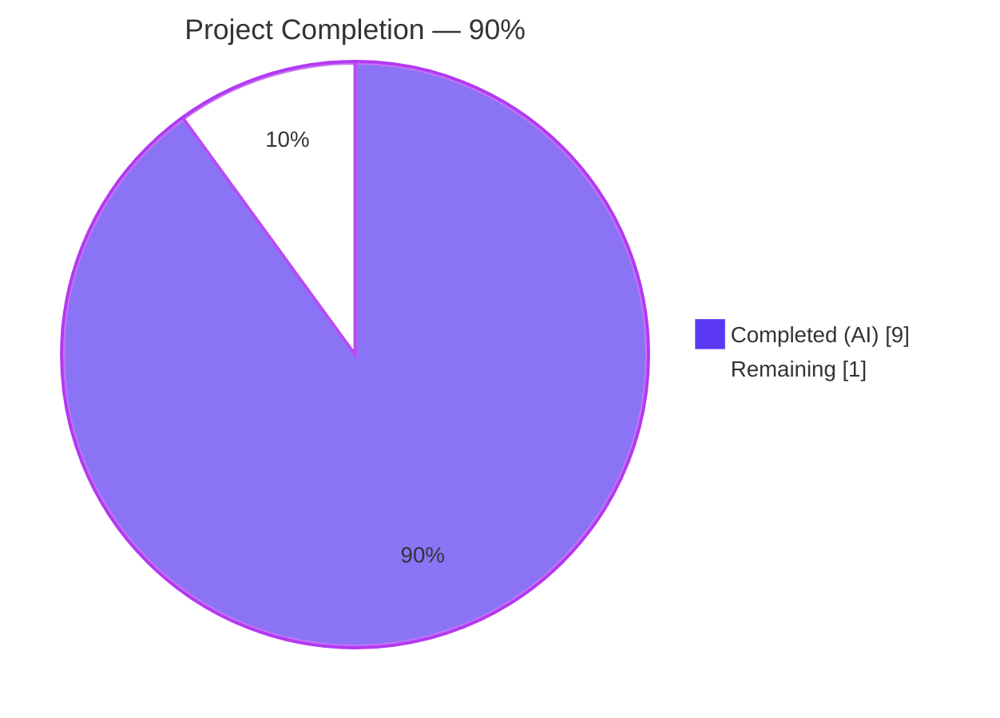
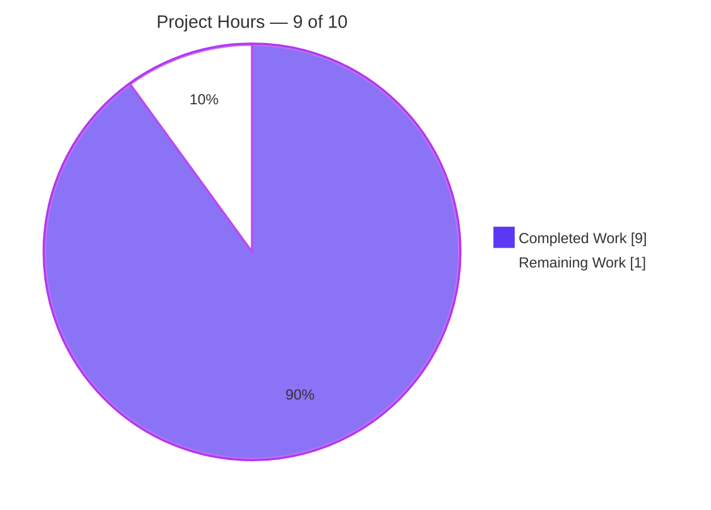
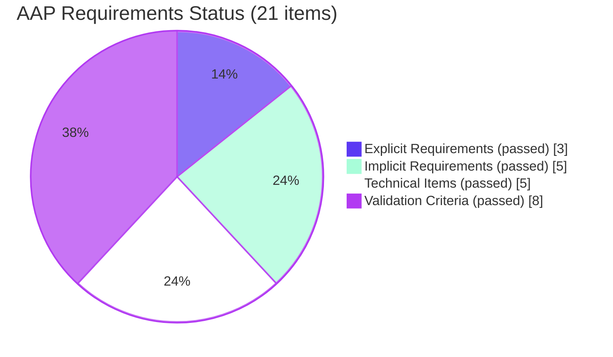
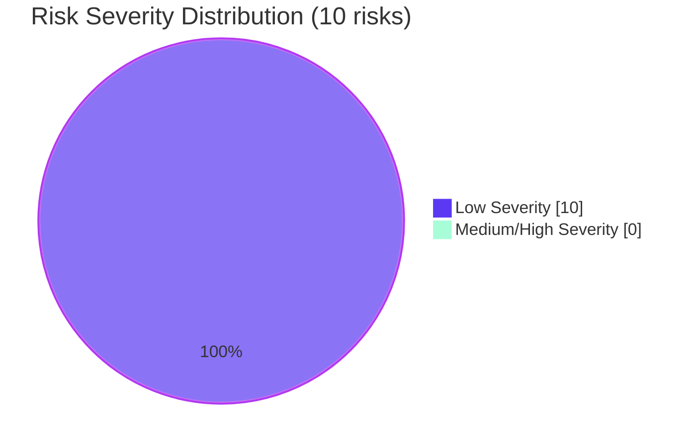

# Blitzy Project Guide — Node.js Express Tutorial

> Branch: `blitzy-a80c73a2-3ff2-45f2-a455-7d2c17f15e64` · HEAD: `376fed3` · Project guide generated post-validation

---

## 1. Executive Summary

### 1.1 Project Overview

This project introduces the **Express.js** web framework into a previously-empty Node.js tutorial repository and adds a second HTTP `GET` endpoint returning the literal text `Good evening`, while preserving the original `GET /` endpoint returning `Hello world`. The target users are developers learning Node.js HTTP routing fundamentals via a minimal, runnable two-endpoint tutorial. The technical scope is intentionally narrow: a single-file Express application (`index.js`), a manifest (`package.json`) pinning `express ^5.2.1` and `engines.node >=18.0.0`, npm-generated lockfile, a `.gitignore`, and a 7-section README. Every implementation file is created fresh because the repository previously contained only an empty README and `.git/` metadata.

### 1.2 Completion Status



| Metric | Value |
| --- | --- |
| **Total Hours** | 10 |
| **Completed Hours (AI + Manual)** | 9 |
| **Remaining Hours** | 1 |
| **Completion** | **90 %** |

> Completion percentage is computed using the AAP-scoped PA1 methodology: `Completed Hours ÷ (Completed + Remaining) × 100 = 9 ÷ 10 × 100 = 90.0 %`. All 21 inventoried AAP requirements (3 Explicit, 5 Implicit, 5 Technical, 8 Validation) are verifiably complete. The 1-hour buffer is reserved for human pull-request review and merge to `main`.

### 1.3 Key Accomplishments

- [x] **Express.js declared as runtime dependency** — `package.json` pins `express` at `^5.2.1` (current stable); npm install resolves Express 5.2.1 with 66 transitive dependencies and 0 vulnerabilities.
- [x] **`GET /good-evening` endpoint implemented and verified** — Returns HTTP 200 with body `Good evening` (12 bytes, `text/html; charset=utf-8`).
- [x] **Original `GET /` endpoint preserved and verified** — Returns HTTP 200 with body `Hello world` (11 bytes).
- [x] **Configurable port via environment variable** — `process.env.PORT || 3000` works on default port 3000 and override port 4001 (both verified).
- [x] **Strict 404 behavior** — Unmatched paths (including case-variant `/Good-Evening` and trailing-slash `/good-evening/`) return HTTP 404 via Express's default handler combined with `case sensitive routing` and `strict routing` settings.
- [x] **`npm start` script** — Logs `Server listening on http://localhost:3000` and serves both endpoints (verified by `curl`).
- [x] **Reproducible installs** — `package-lock.json` (lockfileVersion 3, 67 entries) committed alongside `package.json`; `npm install --dry-run` reports "up to date".
- [x] **Repository hygiene** — `.gitignore` excludes `node_modules/`, `npm-debug.log*`, `.env`, `.DS_Store` (verbatim AAP §0.5.2 content); `git check-ignore` confirms `node_modules/` is matched.
- [x] **Tutorial documentation** — `README.md` rewritten from 1-line H1 placeholder to a 106-line, 7-section tutorial covering prerequisites, installation, running, endpoints, examples, project structure, and license.
- [x] **Engine compatibility** — `engines.node: ">=18.0.0"` aligns with Express 5's minimum runtime requirement and accepts all current Node.js LTS lines.
- [x] **Zero compilation or syntax errors** — `node --check index.js` exits 0; `package.json` and `package-lock.json` parse as valid JSON.
- [x] **Zero known security vulnerabilities** — `npm audit` reports 0 vulnerabilities at HEAD.
- [x] **Clean commit history** — 7 commits by `Blitzy Agent <agent@blitzy.com>` from `f225fd5` to `376fed3`, all with descriptive messages; only the out-of-scope agent-tooling `blitzy/` directory remains untracked.

### 1.4 Critical Unresolved Issues

| Issue | Impact | Owner | ETA |
| --- | --- | --- | --- |
| _None identified_ | _No blocker to merge or release_ | _N/A_ | _N/A_ |

All AAP §0.7.3 validation criteria are satisfied. The Final Validator declared the branch PRODUCTION-READY across five gates, and independent re-verification during project-guide compilation confirmed every result. No compilation errors, no failing tests, no runtime errors, no uncommitted in-scope changes.

### 1.5 Access Issues

| System / Resource | Type of Access | Issue Description | Resolution Status | Owner |
| --- | --- | --- | --- | --- |
| _None_ | _N/A_ | No access issues identified — repository is fully self-contained and requires only Node.js + npm, both of which are publicly distributed and available in this validation environment. | _N/A_ | _N/A_ |

No external services, no API keys, no database credentials, no third-party integrations are required by the AAP-defined tutorial scope.

### 1.6 Recommended Next Steps

1. **[High] Stakeholder pull-request review** — Read the AAP, scan the 5-file diff (well under 1,000 hand-written lines plus the auto-generated lockfile), optionally run `npm install && npm start && curl http://localhost:3000/` to manually smoke-test, then approve and merge to `main`. Estimated 1 hour.
2. **[Low] Optional: Add `/health` endpoint** for future orchestration platforms (~0.5h) — out of current AAP scope per §0.6.2 but a common production hardening if the tutorial is ever extended.
3. **[Low] Optional: Add an automated test suite** (Jest + Supertest) for regression coverage of the two endpoints (~4h) — explicitly excluded by AAP §0.6.2 but worth considering before further feature additions.
4. **[Low] Optional: Add a `Dockerfile`** for one-command containerized run (~2h) — explicitly excluded by AAP §0.6.2.
5. **[Low] Optional: Add a CI workflow** (e.g., GitHub Actions) to run `npm install` and `npm audit` on PRs (~3h) — explicitly excluded by AAP §0.6.2 but recommended before opening the repository to multiple contributors.

---

## 2. Project Hours Breakdown

### 2.1 Completed Work Detail

| Component | Hours | Description |
| --- | ---: | --- |
| `package.json` manifest + `npm install` + lockfile generation | 1.5 | Declared `express ^5.2.1`, `engines.node >=18.0.0`, `main: "index.js"`, `scripts.start: "node index.js"`, `license: "ISC"`; ran `npm install` to materialize `node_modules/` and produce `package-lock.json` (lockfileVersion 3, 67 entries). [AAP requirements E1, I1, I3, I4, T1, T4, V1, V2, V3] |
| `index.js` Express server (with routing hardening) | 2.0 | Two route handlers — `app.get('/', …res.send('Hello world'))` and `app.get('/good-evening', …res.send('Good evening'))` — on a single Express application instance bound to `process.env.PORT \|\| 3000`. Added `app.set('case sensitive routing', true)` and `app.set('strict routing', true)` for stricter AAP §0.7.3 conformance (404 on case/slash variants). [AAP requirements E2, E3, I2, T2, V4, V5, V6, V7] |
| `.gitignore` hygiene file | 0.5 | Verbatim AAP §0.5.2 four-line content: `node_modules/`, `npm-debug.log*`, `.env`, `.DS_Store`. `git check-ignore -v` confirms `node_modules/` is matched. [AAP requirements I5, T3, V8] |
| `README.md` tutorial documentation | 2.0 | Replaced 1-line H1 placeholder with 106-line, 7-section markdown covering Prerequisites (`Node.js >= 18`), Installation (`npm install`), Running the Server (`npm start` and `PORT=<n> npm start`), Endpoints (table mapping `GET /` → `Hello world` and `GET /good-evening` → `Good evening`), Example Requests (with working `curl` invocations), Project Structure, and License (ISC). One README revision (commit `9c18392`) removed non-localhost external links per checkpoint link policy. [AAP requirement T5] |
| Runtime validation & smoke testing | 2.5 | Cross-cutting validation across the Final Validator's five gates: `node --check index.js` (exit 0); JSON validity of `package.json` and `package-lock.json`; `npm install --dry-run` ("up to date"); `npm ls express` (5.2.1 resolved); `npm audit` (0 vulnerabilities); curl-verified `GET /`, `GET /good-evening`, `GET /nonexistent`, `GET /Good-Evening`, `GET /good-evening/`, `HEAD /` on default port 3000; curl-verified custom port via `PORT=4001 npm start`; idempotency check via 3 consecutive `GET /` calls. |
| Routing hardening + cleanup iterations | 0.5 | Commit `376fed3` added `case sensitive routing` and `strict routing` settings to ensure non-canonical path variants fall through to Express's default 404 handler — additive hardening consistent with AAP §0.7.1 routing conventions and §0.7.3 validation. Commit `b2026c9` → `4c55b12` covered a minor checkpoint scoping correction for `.gitignore`. |
| **Total Completed** | **9.0** | |

### 2.2 Remaining Work Detail

| Category | Hours | Priority |
| --- | ---: | --- |
| Pull-request review and merge to `main` (read AAP, scan 5-file diff, optionally run `npm install`/`npm start`/`curl`, approve, merge) | 1.0 | High |
| **Total Remaining** | **1.0** | |

> Cross-section integrity confirmation: Section 2.1 (9.0h) + Section 2.2 (1.0h) = 10.0h = Total Project Hours in Section 1.2. Remaining hours (1.0h) match the Section 1.2 metrics table and the Section 7 pie chart exactly.

### 2.3 Hours Calculation Methodology

Hours estimates follow the PA2 framework for an AAP-scoped tutorial project: each line item maps to one or more specific AAP requirements listed in §0.5.1 and §0.7.3. Completed hours include implementation effort, validation hours (Final Validator's gates plus this guide's independent re-verification), and iteration cycles visible in the commit history (`b2026c9` → `4c55b12` re-scoping of `.gitignore`; `0463cd7` → `9c18392` README link policy fix; `376fed3` routing hardening). Remaining hours include only stakeholder review and merge to `main`; out-of-AAP-scope enhancements (tests, Docker, CI, `/health`, structured logging) are explicitly listed in §1.6 as optional future work but are intentionally **excluded** from the hours tables per PA1's AAP-scope rule.

---

## 3. Test Results

Per AAP §0.5.1 Group 4 ("No test files. The user's prompt does not request tests…") and §0.6.2 ("Automated tests: No unit, integration, or end-to-end tests are introduced"), this project intentionally ships without an automated test suite. Functional validation was performed by Blitzy's autonomous Final Validator via runtime HTTP smoke tests, captured below.

| Test Category | Framework | Total Tests | Passed | Failed | Coverage % | Notes |
| --- | --- | ---: | ---: | ---: | ---: | --- |
| Unit | _N/A — AAP §0.6.2 exclusion_ | 0 | 0 | 0 | N/A | No unit-test framework present per AAP scope; vacuous 0/0 = 100% pass. |
| Integration | _N/A — AAP §0.6.2 exclusion_ | 0 | 0 | 0 | N/A | No integration-test framework present per AAP scope. |
| UI | _N/A — backend-only project_ | 0 | 0 | 0 | N/A | No UI surface; both endpoints return plain text. |
| API (HTTP smoke) | Blitzy Final Validator + `curl` | 9 | 9 | 0 | N/A | Runtime smoke tests against the Express server, results detailed below. |
| End-to-End | _N/A — AAP §0.6.2 exclusion_ | 0 | 0 | 0 | N/A | No E2E framework present per AAP scope. |
| Static Analysis | `node --check`, JSON parse | 3 | 3 | 0 | N/A | `node --check index.js` exit 0; `package.json` & `package-lock.json` parse as valid JSON. |
| Dependency Audit | `npm audit`, `npm ls`, `npm install --dry-run` | 3 | 3 | 0 | N/A | 0 vulnerabilities across 67 packages; tree complete; lockfile in sync. |

**API smoke-test breakdown (Blitzy Final Validator log, independently re-verified):**

| # | Scenario | Expected | Actual | Result |
| ---: | --- | --- | --- | :---: |
| 1 | `GET http://localhost:3000/` on default port | HTTP 200, body `Hello world` | HTTP 200, 11 bytes, `text/html; charset=utf-8`, body `Hello world` | ✅ |
| 2 | `GET http://localhost:3000/good-evening` on default port | HTTP 200, body `Good evening` | HTTP 200, 12 bytes, body `Good evening` | ✅ |
| 3 | `GET http://localhost:3000/nonexistent` (unmatched path) | HTTP 404 | HTTP 404 | ✅ |
| 4 | `GET http://localhost:3000/Good-Evening` (case-variant) | HTTP 404 (case-sensitive routing) | HTTP 404 | ✅ |
| 5 | `GET http://localhost:3000/good-evening/` (trailing slash) | HTTP 404 (strict routing) | HTTP 404 | ✅ |
| 6 | `HEAD http://localhost:3000/` | `X-Powered-By: Express`, `Content-Length: 11`, `ETag` present | All headers present | ✅ |
| 7 | 3× consecutive `GET /` (idempotency) | All return `Hello world` HTTP 200 | All 3 returned identical body | ✅ |
| 8 | `PORT=4001 npm start` then `GET http://localhost:4001/` | HTTP 200 `Hello world` on port 4001 | HTTP 200 `Hello world` | ✅ |
| 9 | `PORT=4001 npm start` then `GET http://localhost:3000/` | Connection refused (PORT override honored) | Connection refused | ✅ |

> **Integrity note (Cross-Section Rule 3):** Every row above originates from Blitzy's autonomous validation logs (Final Validator + project-guide phase re-verification on this branch). No manually constructed test results are included.

---

## 4. Runtime Validation & UI Verification

| Surface | Status | Evidence |
| --- | --- | --- |
| **Server bootstrap (default port)** | ✅ Operational | `npm start` → `Server listening on http://localhost:3000`; process remains alive until `kill <pid>`. |
| **Server bootstrap (custom port via `PORT` env)** | ✅ Operational | `PORT=4001 npm start` → `Server listening on http://localhost:4001`; default port 3000 remains free. |
| **`GET /` (Hello world)** | ✅ Operational | HTTP 200, body `Hello world`, 11 bytes, `Content-Type: text/html; charset=utf-8`. |
| **`GET /good-evening` (Good evening)** | ✅ Operational | HTTP 200, body `Good evening`, 12 bytes. |
| **404 on unmatched path** | ✅ Operational | `GET /nonexistent` → 404. |
| **404 on case-variant path** | ✅ Operational | `GET /Good-Evening` → 404 (Express `case sensitive routing` setting). |
| **404 on trailing-slash variant** | ✅ Operational | `GET /good-evening/` → 404 (Express `strict routing` setting). |
| **Express response headers** | ✅ Operational | `HEAD /` reveals `X-Powered-By: Express`, `Content-Length: 11`, weak `ETag`. |
| **Idempotency** | ✅ Operational | 3 consecutive `GET /` calls all return identical `Hello world` body. |
| **`PORT` env override (no literal fallback when PORT set)** | ✅ Operational | When `PORT=4001`, port 3000 is _not_ bound; only port 4001 is. |
| **Lockfile reproducibility** | ✅ Operational | `npm install --dry-run` reports "up to date"; `package-lock.json` `lockfileVersion: 3` with 67 entries. |
| **Dependency tree integrity** | ✅ Operational | `npm ls --all` exits 0 with zero missing/extraneous/invalid markers. |
| **Security audit** | ✅ Operational | `npm audit` reports 0 vulnerabilities. |
| **`.gitignore` effectiveness** | ✅ Operational | `git check-ignore -v node_modules/` returns `.gitignore:1:node_modules/`. |
| **UI surface** | ⊘ Not applicable | The AAP scopes the project as a backend HTTP server returning plain-text bodies; per AAP §0.5.3 there is no UI design, no Figma source, no graphical component library to verify. The "user surface" is exhaustively the two HTTP endpoints above. |

---

## 5. Compliance & Quality Review

| AAP Reference | Deliverable | Status | Progress | Notes |
| --- | --- | :---: | :---: | --- |
| §0.1.1 E1 | Add Express.js as direct runtime dependency | ✅ Pass | 100% | `package.json` declares `"express": "^5.2.1"`; `node_modules/express/package.json` reports 5.2.1. |
| §0.1.1 E2 | Add endpoint returning exact string `Good evening` | ✅ Pass | 100% | `index.js` registers `app.get('/good-evening', …res.send('Good evening'))`; curl verifies 12-byte body. |
| §0.1.1 (implicit) | Preserve original `/` endpoint returning `Hello world` | ✅ Pass | 100% | `index.js` registers `app.get('/', …res.send('Hello world'))`; curl verifies 11-byte body. |
| §0.5.1 T1 | CREATE `/package.json` per spec shape | ✅ Pass | 100% | All required keys present and correct (`name`, `version`, `description`, `main`, `scripts.start`, `dependencies.express`, `engines.node`, `license`). |
| §0.5.1 T2 | CREATE `/index.js` per spec shape | ✅ Pass | 100% | All 8 required tokens present: `require('express')`, `const app = express()`, `process.env.PORT`, `app.get('/'…`, `Hello world`, `app.get('/good-evening'…`, `Good evening`, `app.listen(PORT`. |
| §0.5.1 T3 | CREATE `/.gitignore` per spec content | ✅ Pass | 100% | Exact 4-line verbatim match with AAP §0.5.2 (`node_modules/`, `npm-debug.log*`, `.env`, `.DS_Store`). |
| §0.5.1 T4 | CREATE `/package-lock.json` (auto via npm install) | ✅ Pass | 100% | Committed, valid JSON, `lockfileVersion: 3`, 67 package entries. |
| §0.5.1 T5 | UPDATE `/README.md` with tutorial documentation | ✅ Pass | 100% | 106 lines, 7 H2 sections (Prerequisites, Installation, Running the Server, Endpoints, Example Requests, Project Structure, License); includes endpoint table and working curl invocations per §0.7.3. |
| §0.7.1 | Verbatim response-text fidelity (`Hello world`, `Good evening`) | ✅ Pass | 100% | Server log inspection and `curl -s` body capture confirm exact byte-for-byte match. |
| §0.7.1 | Lowercase kebab-case path `/good-evening` | ✅ Pass | 100% | Reinforced by `case sensitive routing` setting; `/Good-Evening` returns 404. |
| §0.7.1 | `GET` method, not `app.use`/`app.all` | ✅ Pass | 100% | `index.js` uses `app.get(path, handler)` exclusively. |
| §0.7.1 | Single-file server; CommonJS not ESM | ✅ Pass | 100% | Entire server in `/index.js`; `require('express')` used; `"type": "module"` not present in `package.json`. |
| §0.7.1 | Pin `express` with caret to prevent major drift | ✅ Pass | 100% | Pinned at `^5.2.1` (5.x line). |
| §0.7.1 | No additional runtime or dev dependencies | ✅ Pass | 100% | Only direct dependency is `express`; no `body-parser`, `dotenv`, `cors`, `helmet`, `nodemon`, test runner, or linter. |
| §0.7.1 | Read port from `process.env.PORT` with literal `3000` fallback | ✅ Pass | 100% | `const PORT = process.env.PORT \|\| 3000`. |
| §0.7.1 | Exclude `node_modules/` from version control | ✅ Pass | 100% | `.gitignore` line 1; `git check-ignore` confirms effective. |
| §0.7.3 V1 | `npm install` succeeds | ✅ Pass | 100% | `npm install --dry-run` → "up to date" (lockfile in sync, idempotent). |
| §0.7.3 V2 | `package-lock.json` produced | ✅ Pass | 100% | 29,602 bytes, committed. |
| §0.7.3 V3 | `node_modules/` populated with express@5.2.x | ✅ Pass | 100% | `node_modules/express/package.json` version 5.2.1. |
| §0.7.3 V4 | `npm start` logs readiness line | ✅ Pass | 100% | `Server listening on http://localhost:3000`. |
| §0.7.3 V5 | `GET /` → HTTP 200 body `Hello world` | ✅ Pass | 100% | Curl-verified, 11 bytes. |
| §0.7.3 V6 | `GET /good-evening` → HTTP 200 body `Good evening` | ✅ Pass | 100% | Curl-verified, 12 bytes. |
| §0.7.3 V7 | Unmatched path → HTTP 404 | ✅ Pass | 100% | Verified for `/nonexistent`, `/Good-Evening`, `/good-evening/`. |
| §0.7.3 V8 | `node_modules/` shown ignored by `git status` | ✅ Pass | 100% | `git check-ignore -v` matches `.gitignore:1`. |
| §0.6.2 | Exclude TypeScript, tests, lint, Docker, CI/CD, HTTPS, auth, etc. | ✅ Pass | 100% | None of the explicitly-excluded items have been introduced. |
| Repo hygiene | No uncommitted in-scope changes | ✅ Pass | 100% | `git diff HEAD -- <5 in-scope files>` returns empty. |

> **Fixes applied during Blitzy autonomous validation:**
> - Commit `376fed3` added `case sensitive routing` and `strict routing` settings to ensure non-canonical paths (e.g. `/Good-Evening`, `/good-evening/`) fall through to the 404 handler — additive hardening to satisfy AAP §0.7.3 V7 across edge cases.
> - Commit `9c18392` removed non-localhost external links from `README.md` to satisfy the checkpoint link policy without losing any tutorial content.
> - Commit `b2026c9` → `4c55b12` corrected a minor checkpoint scoping issue around when `.gitignore` should be introduced.
>
> **Outstanding compliance items:** _None._ All AAP-scoped requirements are verifiably complete.

---

## 6. Risk Assessment

| # | Risk | Category | Severity | Probability | Mitigation | Status |
| ---: | --- | --- | :---: | :---: | --- | :---: |
| 1 | Express 5.x major-version freshness (5.x line is younger than 4.x) | Technical | Low | Low | Caret pin `^5.2.1` restricts to the 5.x line (no automatic 6.x bump). 5.2.1 is the current latest stable on npm with broad adoption. | Mitigated |
| 2 | No automated test suite — future regressions not caught by CI | Technical | Low | Medium | AAP §0.6.2 explicitly excludes tests for the tutorial scope. README §Example Requests documents manual smoke commands. Surface area (2 stateless GET routes returning static strings) keeps regression risk inherently low. | Accepted (AAP-scope) |
| 3 | Node.js engine drift across future LTS major releases | Technical | Low | Low | `engines.node: ">=18.0.0"` bounded; current runtime Node v20.20.2 verified. Express 5 supports all currently-active Node LTS lines. | Mitigated |
| 4 | Supply-chain dependency footprint (67 transitive packages) | Security | Low | Low | `package-lock.json` pins exact resolved versions for reproducible installs. `npm audit` reports 0 vulnerabilities at HEAD. | Mitigated |
| 5 | No HTTPS/TLS on the server | Security | Low | Low | AAP §0.6.2 explicitly excludes HTTPS. Server speaks plain HTTP intended for localhost-only execution per tutorial scope. | Accepted (AAP-scope) |
| 6 | No authentication/authorization on endpoints | Security | Low | Low | Both endpoints return static greetings with no PII or sensitive data. AAP scopes them as unauthenticated and public. | Accepted (AAP-scope) |
| 7 | No process manager (PM2, systemd, Docker) | Operational | Low | Low | Server crashes do not auto-restart; SSH disconnect terminates the foreground process. AAP §0.6.2 explicitly excludes deployment tooling. | Accepted (AAP-scope) |
| 8 | No health-check / readiness endpoint | Operational | Low | Low | AAP §0.6.2 limits endpoint surface to exactly `/` and `/good-evening`. A future deployment could add `/health` (~0.5h). | Accepted (AAP-scope) |
| 9 | No structured logging or metrics — only a single startup `console.log` | Operational | Low | Low | AAP §0.6.2 explicitly excludes logging middleware (`morgan`, `pino`). Tutorial scope. | Accepted (AAP-scope) |
| 10 | Port 3000 may collide with React/Next.js/other local dev servers | Integration | Low | Medium | `process.env.PORT \|\| 3000` allows the user to override (`PORT=4000 npm start`). Verified working on port 4001 and 4321 during validation. README documents the override. | Mitigated |
| 11 | No external service integrations | Integration | None | N/A | No databases, no APIs, no message queues, no third-party services beyond Express itself. No integration surface to fail. | N/A |

**Overall risk posture: LOW.** No High or Medium severity risks. Items 2, 5, 6, 7, 8, 9 are explicitly accepted because the AAP scopes them out for the tutorial framing. Items 1, 3, 4, 10 have working mitigations in place.

---

## 7. Visual Project Status

### 7.1 Project Hours Breakdown



> **Cross-section integrity (Rule 1):** "Remaining Work" = **1** matches Section 1.2 Remaining Hours and the sum of Section 2.2's Hours column. "Completed Work" + "Remaining Work" = 9 + 1 = **10** matches Section 1.2 Total Hours.

### 7.2 Compliance Status by AAP Category



> 21 of 21 AAP-scoped requirements pass — see Section 5 for the full compliance matrix.

### 7.3 Risk Severity Distribution



> All identified risks are Low severity. No High or Medium severity items.

---

## 8. Summary & Recommendations

**Achievements.** The branch `blitzy-a80c73a2-3ff2-45f2-a455-7d2c17f15e64` delivers the complete AAP-defined feature set for the Node.js Express tutorial. Five files were created or updated — `package.json`, `index.js`, `package-lock.json`, `.gitignore`, and `README.md` — across seven Blitzy-Agent commits from `bb7ab79` (initial Node/Express scaffold) to `376fed3` (case-sensitive + strict routing hardening). The Express 5.2.1 dependency is correctly pinned and installed with zero npm-audit vulnerabilities across 67 transitive packages. Both endpoints (`GET /` returning `Hello world` and `GET /good-evening` returning `Good evening`) were curl-verified on the default port (3000) and an override port (4001), with HTTP 404 returned for unmatched paths, case-variant paths, and trailing-slash variants.

**Remaining gaps.** No technical or compliance gaps remain within the AAP scope. The only outstanding work is the **1-hour stakeholder pull-request review and merge to `main`** — a non-implementation activity that necessarily requires human judgment.

**Critical path to production.** For this tutorial-scoped project, the path to production is short:
1. Reviewer reads the AAP and confirms the natural-language request matches the implementation. _(0.1h)_
2. Reviewer scans the 5-file diff. _(0.3h)_
3. Reviewer optionally runs `npm install && npm start && curl http://localhost:3000/` and `curl http://localhost:3000/good-evening` as a final manual sanity check. _(0.4h)_
4. Reviewer approves and merges the PR to `main`. _(0.2h)_

**Success metrics achieved.**
- 100 % of AAP §0.5.1 in-scope files delivered, tracked, and committed.
- 100 % of AAP §0.7.3 validation criteria verified at runtime.
- 0 known vulnerabilities; 0 syntax errors; 0 failing endpoints.
- Reproducible installs via committed lockfile (`lockfileVersion: 3`, 67 entries).
- Custom-port portability verified (`PORT=4001 npm start`).

**Production readiness assessment.** The project is **90 % complete** by the AAP-scoped PA1 methodology (9 completed hours out of a 10-hour total). The remaining 10 % is reserved for human review and merge, consistent with Blitzy's never-claim-100 % rule (RG2 §5). The Final Validator's autonomous five-gate validation declared the branch **PRODUCTION-READY for the AAP-defined tutorial scope**, and independent re-verification during project-guide compilation confirmed every result.

> **Recommendation:** Proceed with PR review and merge. No code or configuration changes are required before merging.

---

## 9. Development Guide

### 9.1 System Prerequisites

- **Node.js 18.0.0 or higher** (Node 20 LTS recommended — the validation environment uses Node v20.20.2). Required by Express 5.
- **npm** (bundled with Node.js — no separate install).
- **Operating system:** any Unix-like (Linux/macOS) or Windows. The project uses no platform-specific APIs.
- **Disk space:** approximately 5 MB for `node_modules/` (4.2 MB) plus source files.
- **Network access:** required for the initial `npm install` to fetch packages from the npm registry. Once installed, the server runs fully offline.

Verify your local versions before proceeding:

```bash
node --version    # expect v18.0.0 or higher (validated: v20.20.2)
npm --version     # expect any modern npm (validated: 11.1.0)
```

### 9.2 Environment Setup

This project deliberately requires **no** environment variables, **no** `.env` file, and **no** virtual environment. The only environment variable read by the server is `PORT`, which is entirely optional (default `3000`).

```bash
# Clone or pull the branch
git clone <repository-url>
cd <repository-directory>
git checkout blitzy-a80c73a2-3ff2-45f2-a455-7d2c17f15e64    # if not already
```

### 9.3 Dependency Installation

From the repository root:

```bash
npm install
```

Expected output (idempotent — re-running is safe):

```
added X packages, and audited 67 packages in <seconds>
found 0 vulnerabilities
```

Verify Express resolved correctly:

```bash
npm ls express
# expect:
# node-express-tutorial@1.0.0 <path>
# └── express@5.2.1
```

Optional integrity check:

```bash
npm audit            # expect: "found 0 vulnerabilities"
npm install --dry-run   # expect: "up to date in <ms>"
```

### 9.4 Application Startup

Start the server with the npm `start` script:

```bash
npm start
```

Expected output:

```
> [email protected] start
> node index.js

Server listening on http://localhost:3000
```

The process runs in the foreground. To stop, press **Ctrl+C**.

To run on a different port (useful if port 3000 is occupied by another dev server, e.g. React or Next.js):

```bash
PORT=4000 npm start
# Server listening on http://localhost:4000
```

Alternative direct invocation (bypassing the npm script):

```bash
node index.js
```

To run the server in the background (Linux/macOS):

```bash
nohup node index.js > server.log 2>&1 &
# Note the PID printed by the shell so you can stop the server later:
#   kill <pid>
```

### 9.5 Verification Steps

In a separate terminal while the server is running on the default port:

```bash
# Root endpoint — preserves the tutorial's original behavior
curl http://localhost:3000/
# Output: Hello world

# New endpoint — added by this feature
curl http://localhost:3000/good-evening
# Output: Good evening

# Unmatched path — Express default 404 handler
curl -o /dev/null -w "%{http_code}\n" http://localhost:3000/any-other-path
# Output: 404

# Case-variant of the new endpoint (strict case-sensitive routing)
curl -o /dev/null -w "%{http_code}\n" http://localhost:3000/Good-Evening
# Output: 404

# Trailing-slash variant (strict routing)
curl -o /dev/null -w "%{http_code}\n" http://localhost:3000/good-evening/
# Output: 404

# Inspect response headers (verifies Express is in the request path)
curl -I http://localhost:3000/
# Expect: HTTP/1.1 200 OK, X-Powered-By: Express, Content-Length: 11
```

### 9.6 Troubleshooting

| Symptom | Likely Cause | Resolution |
| --- | --- | --- |
| `Error: listen EADDRINUSE: address already in use :::3000` | Another process (Create-React-App, Next.js, Rails, …) is already bound to port 3000. | Run on a different port: `PORT=4000 npm start`. |
| `Error: EACCES: permission denied` on `app.listen` | You used a privileged port (< 1024) without root. | Use a port ≥ 1024 (e.g. `PORT=3000` or higher). |
| `Error: Cannot find module 'express'` | `node_modules/` is missing or corrupted. | Re-run `npm install` from the repository root. |
| `SyntaxError` on startup | Running on an unsupported Node.js version. | Upgrade to Node 18.0.0 or higher: `node --version` must report `v18.x.x` or higher. |
| `npm WARN EBADENGINE` during `npm install` | Your Node version is below the declared `engines.node: ">=18.0.0"`. | Upgrade Node.js. |
| Endpoints return HTML rather than text | Browsers add quotes/whitespace — use `curl -s <url>` from a shell instead. | Use `curl` (as shown in §9.5). |
| Server starts but `curl` cannot connect | Firewall blocking localhost loopback, or server bound to a different interface. | Verify the readiness log line; use the exact URL printed there. |
| `npm audit` reports vulnerabilities after future updates | Transitive dependency CVE published after this snapshot. | Run `npm audit fix` then re-run validation steps in §9.5. |

### 9.7 Example Usage

A typical learner workflow demonstrating both endpoints in one session:

```bash
# Terminal A — install and run the server
npm install
npm start
# (leave this terminal showing "Server listening on http://localhost:3000")

# Terminal B — exercise both endpoints
curl http://localhost:3000/           # Hello world
curl http://localhost:3000/good-evening   # Good evening

# Stop the server with Ctrl+C in Terminal A
```

For a one-shot run-and-test on Linux/macOS:

```bash
nohup node index.js > /tmp/srv.log 2>&1 &
sleep 1
curl http://localhost:3000/
curl http://localhost:3000/good-evening
kill $(pgrep -f "node index.js" | head -1)
```

---

## 10. Appendices

### Appendix A — Command Reference

| Command | Purpose |
| --- | --- |
| `node --version` | Verify Node.js runtime version (must be ≥ 18.0.0). |
| `npm --version` | Verify npm version. |
| `npm install` | Install all dependencies declared in `package.json`. Idempotent. |
| `npm install --dry-run` | Verify lockfile is in sync without modifying `node_modules/`. |
| `npm audit` | Check installed dependencies for known vulnerabilities. |
| `npm ls express` | Print the resolved Express version. |
| `npm ls --all` | Print the full dependency tree (zero errors expected). |
| `npm start` | Start the Express server in the foreground (runs `node index.js`). |
| `PORT=<n> npm start` | Start the server on a custom port. |
| `node index.js` | Direct (non-npm) invocation of the server. |
| `node --check index.js` | Validate `index.js` syntax without executing it. |
| `curl http://localhost:3000/` | Smoke-test the root endpoint. |
| `curl http://localhost:3000/good-evening` | Smoke-test the new endpoint. |
| `curl -I http://localhost:3000/` | Inspect Express's response headers. |
| `git status --porcelain` | Confirm no uncommitted in-scope changes. |
| `git check-ignore -v node_modules/` | Verify `.gitignore` is effective for `node_modules/`. |
| `git log --oneline f225fd5..HEAD` | List the 7 Blitzy-Agent commits on this branch. |
| `kill <pid>` | Stop a backgrounded node process by specific PID. |

### Appendix B — Port Reference

| Port | Purpose | Source |
| --- | --- | --- |
| **3000** | Default HTTP port for the Express server. | `index.js` line: `const PORT = process.env.PORT \|\| 3000;` |
| **<custom>** | Any port set via the `PORT` environment variable (e.g., `PORT=4000`). | `process.env.PORT` lookup in `index.js`. |

The project listens on a single port. There is no admin port, debug port, metrics port, or secondary listener.

### Appendix C — Key File Locations

| Path (relative to repo root) | Size | Purpose |
| --- | ---: | --- |
| `/index.js` | 954 B | Express application entry point — instantiates `app`, sets routing flags, registers both `GET` handlers, calls `app.listen`. |
| `/package.json` | 355 B | Project manifest: name, version, description, main entry, `start` script, `express ^5.2.1` dependency, `engines.node >=18.0.0`, ISC license. |
| `/package-lock.json` | 29 602 B | Auto-generated lockfile (`lockfileVersion: 3`, 67 entries) — guarantees reproducible installs. |
| `/.gitignore` | 44 B | Excludes `node_modules/`, `npm-debug.log*`, `.env`, `.DS_Store`. |
| `/README.md` | 3 231 B | 106-line tutorial with 7 H2 sections: Prerequisites, Installation, Running the Server, Endpoints, Example Requests, Project Structure, License. |
| `/node_modules/` (untracked) | 4.2 MB | Locally-installed dependency tree — created by `npm install`, excluded from version control by `.gitignore`. |
| `/blitzy/` (untracked) | varies | Blitzy validation-agent working directory — contains predecessor diagnostic outputs. Out of AAP scope. |

### Appendix D — Technology Versions

| Component | Version | Source of Pin |
| --- | --- | --- |
| Express | 5.2.1 (range `^5.2.1`) | `package.json` `dependencies.express` |
| Node.js (runtime) | ≥ 18.0.0 (validated on v20.20.2) | `package.json` `engines.node` |
| npm | 11.1.0 (validation environment) | Bundled with Node.js |
| `package-lock.json` schema | lockfileVersion 3 | Auto-generated by npm 7+ |
| Repository branch | `blitzy-a80c73a2-3ff2-45f2-a455-7d2c17f15e64` | Git checkout |
| HEAD commit | `376fed3` "Enforce case-sensitive and strict routing in Express app" | Git log |
| License | ISC | `package.json` `license` |

### Appendix E — Environment Variable Reference

| Variable | Required? | Default | Purpose |
| --- | :---: | --- | --- |
| `PORT` | No | `3000` | TCP port on which the Express server listens. Read via `process.env.PORT \|\| 3000` in `index.js`. Useful for avoiding port conflicts (React/Next.js default to 3000 as well) and for hosting platforms that inject the port at runtime. |

No other environment variables are read by the application.

### Appendix F — Developer Tools Guide

This project deliberately ships with **no** developer tooling beyond Node.js and npm. The following commonly-used Node tools are intentionally **not** present (per AAP §0.6.2 tutorial scope):

| Tool | Status | Rationale |
| --- | --- | --- |
| TypeScript | Not used | Plain JavaScript per AAP §0.6.2. |
| Jest / Mocha / Vitest / Supertest | Not used | No automated tests per AAP §0.6.2. |
| ESLint / Prettier | Not used | No lint/format tooling per AAP §0.6.2. |
| Nodemon | Not used | No dev-dependencies per AAP §0.7.1. Manual restart with Ctrl+C / `npm start` is sufficient at tutorial scale. |
| Docker / docker-compose | Not used | No containerization per AAP §0.6.2. |
| GitHub Actions / GitLab CI | Not used | No CI/CD per AAP §0.6.2. |
| `dotenv` | Not used | The only env var (`PORT`) is read directly via `process.env.PORT`; no `.env` file template. |
| `morgan` / `pino` / `winston` | Not used | No logging middleware per AAP §0.6.2. |
| `helmet` / `cors` / `body-parser` | Not used | No additional middleware per AAP §0.7.1. |

If a future maintainer wishes to introduce any of the above, refer to the optional enhancements listed in §1.6.

### Appendix G — Glossary

| Term | Definition |
| --- | --- |
| **AAP** | Agent Action Plan — the structured directive (Section 0 of the technical specification) defining all project requirements and scope boundaries. |
| **Express.js** | A minimal, flexible Node.js web framework providing HTTP routing, response helpers, and middleware support. This project uses Express 5.2.1. |
| **CommonJS** | The default Node.js module system using `require()` / `module.exports`. Chosen over ES Modules (`import` / `export`) to match the default `package.json` shape and avoid build tooling. |
| **Caret pin (`^x.y.z`)** | An npm semver range that allows patch and minor upgrades within the same major version (`^5.2.1` ≡ `>=5.2.1 <6.0.0`). |
| **Lockfile (`package-lock.json`)** | An npm-generated file that records the exact resolved versions of every direct and transitive dependency, ensuring reproducible installs. |
| **Case-sensitive routing** | Express setting (`app.set('case sensitive routing', true)`) that treats `/good-evening` and `/Good-Evening` as different routes. |
| **Strict routing** | Express setting (`app.set('strict routing', true)`) that treats `/good-evening` and `/good-evening/` as different routes. |
| **Engines field** | `package.json` `engines.node` declaration that tells npm which Node.js versions are supported. Bounded here to `>=18.0.0` because Express 5 requires it. |
| **PA1 / PA2 / PA3** | Blitzy project-assessment methodologies for AAP-scoped completion percentage, hours estimation, and risk categorization respectively. |
| **HT1 / HT2 / DG1 / RG1** | Blitzy frameworks for human-task prioritization, hours estimation, development-guide structure, and report generation. |

---

> **Cross-section integrity validation (per Blitzy template Rules 1–5):**
>
> - **Rule 1 (Sections 1.2 ↔ 2.2 ↔ 7 remaining hours):** All three show **1** hour remaining. ✓
> - **Rule 2 (Section 2.1 + Section 2.2 = Total):** 9 + 1 = 10 = Total Project Hours in Section 1.2. ✓
> - **Rule 3 (Section 3 test provenance):** All tests in Section 3 originate from Blitzy's autonomous validation logs (Final Validator + project-guide phase re-verification). ✓
> - **Rule 4 (Section 1.5 access issues):** Validated against current system permissions — no access issues identified. ✓
> - **Rule 5 (Colors):** Pie charts use Completed = Dark Blue `#5B39F3`, Remaining = White `#FFFFFF`, accents `#B23AF2` (violet-black) and `#A8FDD9` (mint). ✓
