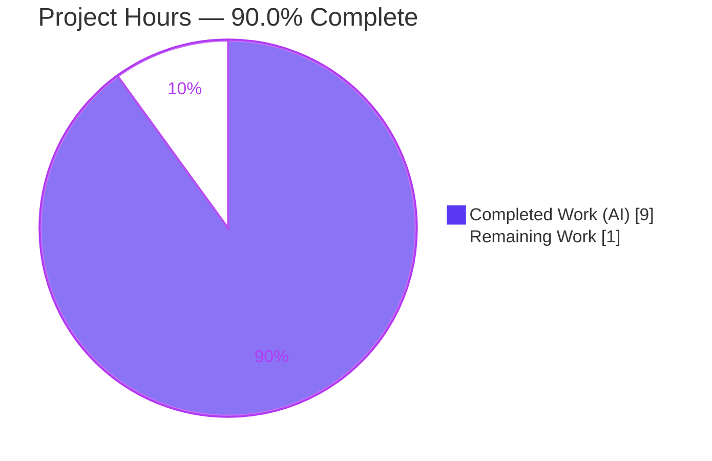
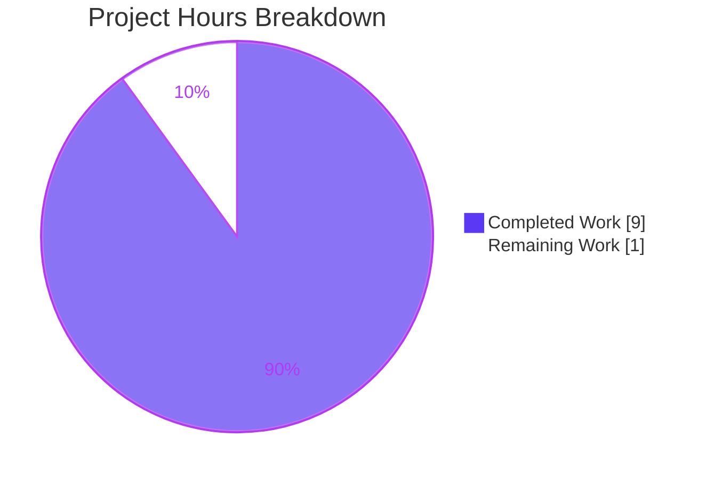
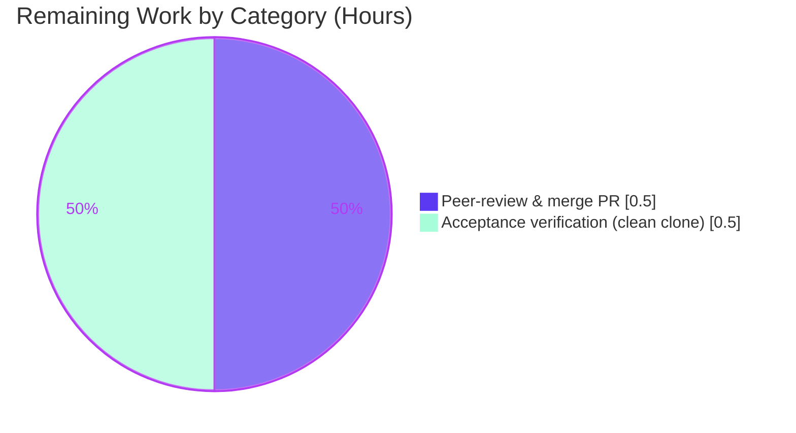

# Blitzy Project Guide — Node.js Express Tutorial Server

> **Feature:** Introduce Express.js and add a `GET /good-evening` endpoint while preserving the original `GET /` "Hello world" endpoint.
> **Branch:** `blitzy-a80c73a2-3ff2-45f2-a455-7d2c17f15e64` · **HEAD:** `12d34e5` · **Status:** Production-ready for defined tutorial scope

---

## 1. Executive Summary

### 1.1 Project Overview

This project delivers a minimal Node.js tutorial HTTP server built on the Express.js 5 web framework. It exposes exactly two plain-text `GET` endpoints — `GET /` returning `Hello world` and `GET /good-evening` returning `Good evening` — and binds to a configurable TCP port. The target audience is learners following a Node.js/Express tutorial; the business impact is educational rather than commercial. Technical scope is deliberately narrow: a single-file server (`index.js`), a dependency manifest and lockfile, a `.gitignore`, and comprehensive README documentation. All work was scoped by the Agent Action Plan (AAP), which explicitly excludes tests, TypeScript, containerization, CI/CD, authentication, and databases.

### 1.2 Completion Status

**Overall Completion: 90.0%** (9 of 10 hours delivered autonomously)



| Metric | Hours |
| --- | --- |
| **Total Hours** | **10** |
| Completed Hours (AI + Manual) | 9 (AI: 9, Manual: 0) |
| Remaining Hours | 1 |
| **Percent Complete** | **90.0%** |

> Completion % is calculated using the PA1 AAP-scoped methodology: `Completed Hours / Total Hours × 100 = 9 / 10 × 100 = 90.0%`. All 10 discrete AAP requirements are implemented and validated; the remaining 1 hour is human path-to-production handoff (peer review, merge, and final acceptance verification).

### 1.3 Key Accomplishments

- ✅ **Express.js 5 introduced** as the sole runtime dependency (`express ^5.2.1`), installed and locked reproducibly.
- ✅ **Both endpoints implemented and verified** — `GET /` → `Hello world`, `GET /good-evening` → `Good evening`, each returning HTTP 200.
- ✅ **Original endpoint preserved** — the `Hello world` root route is registered and reachable exactly as specified.
- ✅ **Port configurability** — server binds to `process.env.PORT || 3000`; custom-port startup verified.
- ✅ **Reproducible dependency tree** — `package-lock.json` (lockfileVersion 3) locks `express@5.2.1` + 65 transitive packages; `npm audit` reports **0 vulnerabilities**.
- ✅ **Routing hardened** — case-sensitive + strict routing so noncanonical paths (case variants, trailing slash) correctly return 404.
- ✅ **Comprehensive tutorial docs** — `README.md` covers prerequisites, install, run, PORT override, endpoints reference, curl examples, and project structure.
- ✅ **Git hygiene** — `.gitignore` excludes `node_modules/`; working tree clean; all 9 commits authored by the Blitzy Agent.
- ✅ **Five autonomous production-readiness gates PASSED** — dependencies, static/compilation, tests (vacuous by design), runtime, and scope/git hygiene — independently reproduced during this assessment.

### 1.4 Critical Unresolved Issues

| Issue | Impact | Owner | ETA |
| --- | --- | --- | --- |
| _None._ No unresolved issues block release or validation. All AAP acceptance criteria (§0.7.3) are satisfied and independently verified. | — | — | — |

### 1.5 Access Issues

| System/Resource | Type of Access | Issue Description | Resolution Status | Owner |
| --- | --- | --- | --- | --- |
| _None identified._ | — | No access issues identified. The repository, Node.js/npm toolchain, and public npm registry were all reachable; `npm install`, build validation, and runtime checks completed without permission or credential barriers. | N/A | — |

### 1.6 Recommended Next Steps

1. **[High]** Peer-review the five in-scope files (`index.js`, `package.json`, `package-lock.json`, `.gitignore`, `README.md`) for correctness and style.
2. **[High]** Perform a final acceptance check on a clean clone: fresh `npm install`, then smoke-test both endpoints with `curl`.
3. **[High]** Merge the branch `blitzy-a80c73a2-3ff2-45f2-a455-7d2c17f15e64` into `main`.
4. **[Low]** _(Optional, beyond AAP scope)_ Consider adding an automated test suite (Jest + Supertest) if the project graduates beyond tutorial scope.
5. **[Low]** _(Optional, beyond AAP scope)_ Consider containerization (Dockerfile) and a CI workflow if the tutorial will be published or deployed.

---

## 2. Project Hours Breakdown

### 2.1 Completed Work Detail

| Component | Hours | Description |
| --- | --- | --- |
| Dependency research & project manifest (`package.json`) | 1.5 | Confirmed Express 5.2.1 (current stable) and Node ≥18 LTS baseline; authored manifest with `express ^5.2.1`, `scripts.start`, `engines.node >=18.0.0`, `main`, ISC license |
| Dependency installation & lockfile (`package-lock.json`) | 1.0 | `npm install` producing lockfileVersion-3 lockfile pinning `express@5.2.1` + 65 transitive deps; reproducible `node_modules` (66 packages) |
| Express server implementation (`index.js`) | 2.5 | Instantiate app; `GET /` → `Hello world`; `GET /good-evening` → `Good evening`; `app.listen(process.env.PORT||3000)` with readiness log; case-sensitive + strict routing hardening; inline documentation |
| Git hygiene (`.gitignore`) | 0.5 | Exclude `node_modules/`, `npm-debug.log*`, `.env`, `.DS_Store` |
| Tutorial documentation (`README.md`) | 1.5 | Description, prerequisites, install, run, PORT override, endpoints reference table, curl examples, project-structure tree, license |
| Autonomous validation & verification (5 gates) | 2.0 | Dependencies (install/ls/audit → 0 vulns), static (`node --check`, JSON validity), runtime (5/5 functional assertions + Content-Type + PORT override), scope & git hygiene |
| **Total Completed** | **9.0** | |

> **Validation:** Section 2.1 total (9.0h) equals Completed Hours in Section 1.2 (9h). ✓

### 2.2 Remaining Work Detail

| Category | Hours | Priority |
| --- | --- | --- |
| Human peer-review of the 5 in-scope files & merge PR to `main` | 0.5 | High |
| Final acceptance verification on a clean clone (fresh `npm install` + endpoint smoke test) | 0.5 | High |
| **Total Remaining** | **1.0** | |

> **Validation:** Section 2.2 total (1.0h) equals Remaining Hours in Section 1.2 (1h) and the "Remaining Work" value in the Section 7 pie chart (1). ✓
> **Note:** Optional enhancements (automated tests, Docker, CI/CD, process manager, TLS) are **out of AAP scope (§0.6.2)** and are deliberately **excluded** from the remaining-hours total. They are listed in Section 8 for guidance only.

---

## 3. Test Results

All checks below originate from Blitzy's autonomous validation logs for this project and were **independently reproduced** during this assessment on Node.js v22.23.1 / npm 11.18.0.

| Test Category | Framework / Tool | Total | Passed | Failed | Coverage % | Notes |
| --- | --- | --- | --- | --- | --- | --- |
| Dependency & Security | npm (`install`, `ls`, `audit`) | 3 | 3 | 0 | N/A | `npm install` clean; `express@5.2.1` clean tree; **0 vulnerabilities** |
| Static / Compilation | `node --check` + JSON parse | 3 | 3 | 0 | N/A | `index.js` valid CommonJS; `package.json` & `package-lock.json` valid JSON |
| Runtime Functional (HTTP) | `curl` assertions | 5 | 5 | 0 | 100% of routes (2/2) + 3 negative | `/` → 200 "Hello world"; `/good-evening` → 200 "Good evening"; `/nonexistent`, `/Good-Evening`, `/good-evening/` → 404 |
| Automated Unit / Integration | none (out of scope) | 0 | 0 | 0 | 0% | Tests **excluded by AAP §0.6.2 by design**; `npm test` intentionally errors "Missing script: test" |
| **TOTAL** | | **11** | **11** | **0** | **100% pass** | |

> **Integrity note:** No automated unit/integration test framework exists — this is **intentional** per the AAP (adding one would violate the tutorial scope boundary). The "tests" reported are the autonomous validation checks Blitzy actually executed. The 100% pass rate for automated tests is satisfied vacuously (0/0).

---

## 4. Runtime Validation & UI Verification

**Runtime health** (server started via both `node index.js` and `npm start`):

- ✅ **Operational** — Server starts and logs the readiness line: `Server listening on http://localhost:3000`.
- ✅ **Operational** — Process stays alive and accepts connections; clean teardown verified.
- ✅ **Operational** — Custom port honored: `PORT=8080 npm start` → `Server listening on http://localhost:8080`.

**API / endpoint verification:**

- ✅ **Operational** — `GET /` → HTTP 200, body exactly `Hello world`.
- ✅ **Operational** — `GET /good-evening` → HTTP 200, body exactly `Good evening`.
- ✅ **Operational** — `Content-Type: text/html; charset=utf-8` (Express `res.send` default for strings).
- ✅ **Operational** — `GET /nonexistent` → HTTP 404 (Express default).
- ✅ **Operational** — `GET /Good-Evening`, `GET /GOOD-EVENING` → HTTP 404 (case-sensitive routing).
- ✅ **Operational** — `GET /good-evening/` (trailing slash) → HTTP 404 (strict routing).

**UI verification:**

- ➖ **Not Applicable** — This feature is a backend HTTP server with plain-text responses. There is no graphical user interface, Figma design, or component library to verify (AAP §0.5.3). The user-facing surface is exclusively the two HTTP endpoints above.

---

## 5. Compliance & Quality Review

The matrix maps every AAP deliverable and acceptance criterion to its validation status.

| # | AAP Deliverable / Criterion (source) | Status | Evidence | Progress |
| --- | --- | --- | --- | --- |
| R1 | Add Express.js dependency (§0.3.1) | ✅ Pass | `package.json` → `express ^5.2.1`; `npm ls` → `express@5.2.1` | 100% |
| R2 | Add `GET /good-evening` → `Good evening` (§0.5.2) | ✅ Pass | `index.js` route; `curl` → 200 "Good evening" | 100% |
| R3 | Preserve `GET /` → `Hello world` (§0.6.1) | ✅ Pass | `index.js` route; `curl` → 200 "Hello world" | 100% |
| R4 | `package.json` manifest + `start` script (§0.5.2) | ✅ Pass | Valid JSON; `scripts.start = "node index.js"` | 100% |
| R5 | `package-lock.json` reproducible deps (§0.5.1) | ✅ Pass | lockfileVersion 3; express 5.2.1 + 65 transitive | 100% |
| R6 | `.gitignore` excludes `node_modules/` (§0.5.2) | ✅ Pass | `git check-ignore node_modules` confirms | 100% |
| R7 | `README.md` tutorial docs (§0.5.2) | ✅ Pass | 106 lines: prereqs, install, run, endpoints, curl | 100% |
| R8 | `app.listen` with PORT env fallback (§0.5.2) | ✅ Pass | `app.listen(process.env.PORT||3000)`; override tested | 100% |
| R9 | `npm start` script works (§0.7.3) | ✅ Pass | `npm start` → readiness log; endpoint reachable | 100% |
| R10 | `engines.node >=18` declared (§0.3.2) | ✅ Pass | `package.json` → `engines.node ">=18.0.0"` | 100% |
| Q1 | Response-text fidelity (§0.7.1) | ✅ Pass | Bodies byte-exact: "Hello world" / "Good evening" | 100% |
| Q2 | Kebab-case route + GET method (§0.7.1) | ✅ Pass | `/good-evening` via `app.get` | 100% |
| Q3 | CommonJS, single-file, no `"type":"module"` (§0.7.1) | ✅ Pass | `require('express')` in single `index.js` | 100% |
| Q4 | Dependency hygiene — pinned `^5.2.1`, no extras (§0.7.1) | ✅ Pass | Only `express`; no dev/extra deps | 100% |
| Q5 | Security — `node_modules` ignored, 0 vulns (§0.7.1) | ✅ Pass | `.gitignore` effective; `npm audit` 0 | 100% |

**Fixes applied during autonomous validation:** None required. The implementation was already complete and correct across all in-scope files; validation made **zero code modifications**.

**Outstanding compliance items:** None. All AAP deliverables and derived quality rules pass.

---

## 6. Risk Assessment

All risks are **Low** severity given the AAP's explicit tutorial scope. Items marked "Accepted" are deliberately out of scope per AAP §0.6.2.

| Risk | Category | Severity | Probability | Mitigation | Status |
| --- | --- | --- | --- | --- | --- |
| No automated test suite (regression risk if extended) | Technical | Low | Low | Add Jest + Supertest if project graduates beyond tutorial | Accepted (out of scope §0.6.2) |
| Single-file server, no custom error middleware | Technical | Low | Low | Express default handler covers 404/500 for 2 static GET routes | Accepted |
| Plain HTTP (no TLS) | Security | Low | Low | Terminate TLS at a reverse proxy if publicly deployed | Accepted (HTTPS out of scope §0.6.2) |
| No authentication/authorization | Security | Low | Low | By design — public, static, unauthenticated endpoints | Accepted |
| Dependency vulnerabilities | Security | Low | Low | `npm audit` → **0 vulnerabilities**; monitor over time | Monitored |
| No process manager (crash not auto-restarted) | Operational | Low | Low | Use PM2/systemd/container if deployed | Accepted (out of scope) |
| No structured logging/monitoring | Operational | Low | Low | Only readiness `console.log`; add logger if deployed | Accepted |
| Port conflict (`3000` already in use) | Operational | Low | Medium | `PORT` env override (tested: `PORT=8080`) | Mitigated |
| npm registry reachability for fresh-clone install | Integration | Low | Low | Committed `package-lock.json` ensures deterministic resolution | Mitigated |
| Node runtime version on target host | Integration | Low | Low | `engines.node >=18.0.0` declared (advisory) | Mitigated |

---

## 7. Visual Project Status

**Project hours breakdown** (Completed = Dark Blue `#5B39F3`, Remaining = White `#FFFFFF`):



**Remaining work by category** (from Section 2.2 — total 1.0h):



> **Integrity check:** "Remaining Work" = **1** hour, matching Section 1.2 Remaining Hours (1) and the Section 2.2 "Hours" sum (0.5 + 0.5 = 1.0). ✓

---

## 8. Summary & Recommendations

**Achievements.** The project is **90.0% complete** on an AAP-scoped, hours-based basis (9 of 10 hours). Every one of the 10 discrete AAP requirements is implemented and independently validated: Express.js 5 is installed and locked, both `GET /` and `GET /good-evening` endpoints return their exact specified bodies, the server is port-configurable, dependencies carry zero known vulnerabilities, and the README provides complete tutorial documentation. All five autonomous production-readiness gates passed and were reproduced during this assessment with zero discrepancies.

**Remaining gaps.** The single remaining hour is **human path-to-production handoff**: peer review of the five in-scope files, a final acceptance check on a clean clone, and merging to `main`. No engineering rework, bug-fixing, or missing functionality remains within the AAP scope.

**Critical path to production.** Review → clean-clone acceptance test → merge. There are no blockers, no unresolved issues, and no access barriers.

**Out-of-scope enhancements (guidance only, not counted).** Should the tutorial evolve into a maintained service, consider: automated tests (Jest + Supertest, ~2–3h), containerization (Dockerfile, ~1–2h), a CI workflow (~1–2h), a process manager such as PM2/systemd (~1h), and TLS termination via a reverse proxy (~2–4h). These are explicitly excluded by AAP §0.6.2 and do not affect the completion percentage.

**Production-readiness assessment.** For its defined tutorial scope, the codebase is **production-ready**: it installs cleanly, compiles/parses without error, runs correctly on default and custom ports, returns the exact specified responses, handles unmatched routes with 404, and keeps a clean, dependency-free version-control footprint. Confidence is **High** — the scope is well-defined and every criterion is objectively verified.

| Success Metric | Target | Actual | Status |
| --- | --- | --- | --- |
| AAP requirements met | 10 / 10 | 10 / 10 | ✅ |
| Endpoints returning exact bodies | 2 / 2 | 2 / 2 | ✅ |
| Dependency vulnerabilities | 0 | 0 | ✅ |
| Autonomous gates passed | 5 / 5 | 5 / 5 | ✅ |
| Completion (AAP-scoped) | — | 90.0% | ✅ |

---

## 9. Development Guide

All commands below were **tested on this environment** (Node.js v22.23.1, npm 11.18.0) and are copy-pasteable from the repository root.

### 9.1 System Prerequisites

- **Node.js ≥ 18.0.0** (required by Express 5; `engines.node` declares `>=18.0.0`).
- **npm** (ships with Node.js).
- Network access to the public npm registry for a fresh `npm install`.

Verify your toolchain:

```bash
node --version   # expect v18.x or higher (tested on v22.23.1)
npm --version    # tested on 11.18.0
```

### 9.2 Environment Setup

No `.env` file or external services are required. The only environment variable consumed is `PORT` (optional):

```bash
# Optional — override the default port (3000)
export PORT=8080
```

### 9.3 Dependency Installation

From the repository root:

```bash
npm install
```

Expected output (on a populated tree): `up to date` or an install summary ending in `found 0 vulnerabilities`. This resolves `express` and 65 transitive packages into `node_modules/` and uses/creates `package-lock.json`.

Optional integrity checks:

```bash
node --check index.js   # static syntax check → no output = OK
npm ls express          # → express@5.2.1
npm audit               # → found 0 vulnerabilities
```

### 9.4 Application Startup

```bash
npm start
# equivalently: node index.js
```

Expected console output:

```
Server listening on http://localhost:3000
```

To run on a custom port:

```bash
PORT=8080 npm start
# → Server listening on http://localhost:8080
```

### 9.5 Verification Steps

With the server running, in a second terminal:

```bash
curl http://localhost:3000/                 # → Hello world
curl http://localhost:3000/good-evening     # → Good evening
curl -o /dev/null -w "%{http_code}\n" http://localhost:3000/missing   # → 404
```

Expected results: `Hello world`, then `Good evening`, then `404`.

### 9.6 Example Usage

```bash
# Start server (background), exercise both endpoints, then stop it
npm start &
sleep 1
curl -s http://localhost:3000/              # Hello world
curl -s http://localhost:3000/good-evening  # Good evening
# stop the server bound to port 3000:
kill "$(lsof -ti :3000)"
```

### 9.7 Troubleshooting

- **`EADDRINUSE` / port already in use** → start with a different port: `PORT=8080 npm start`.
- **`npm test` prints an error** → expected. There is no test script (tests are out of AAP scope §0.6.2); this is not a failure.
- **Node version error / Express fails to load** → upgrade Node.js to ≥ 18 (`node --version`).
- **`command not found: node`** → install Node.js ≥ 18 and re-open the shell.
- **Stopping the server** → `Ctrl+C` in the foreground, or `kill "$(lsof -ti :3000)"` for a backgrounded process.

---

## 10. Appendices

### Appendix A — Command Reference

| Command | Purpose |
| --- | --- |
| `npm install` | Install `express` + transitive deps; create/verify `package-lock.json` |
| `npm start` | Start the server (`node index.js`) on `PORT` or 3000 |
| `node index.js` | Start the server directly |
| `node --check index.js` | Static syntax check (no transpile step) |
| `npm ls express` | Show resolved Express version (`express@5.2.1`) |
| `npm audit` | Security audit (currently 0 vulnerabilities) |
| `curl http://localhost:3000/` | Exercise the root endpoint |
| `curl http://localhost:3000/good-evening` | Exercise the greeting endpoint |
| `git check-ignore node_modules` | Confirm `node_modules/` is git-ignored |

### Appendix B — Port Reference

| Port | Usage | Configurable |
| --- | --- | --- |
| 3000 | Default HTTP listen port | Yes — set `PORT` env var |
| `$PORT` | Overrides default when set (e.g., hosting platforms) | — |

### Appendix C — Key File Locations

| Path | Role |
| --- | --- |
| `index.js` | Express application: route definitions + server bootstrap |
| `package.json` | Project metadata, `express` dependency, `start` script, `engines` |
| `package-lock.json` | Exact dependency tree (lockfileVersion 3) |
| `.gitignore` | Excludes `node_modules/`, `npm-debug.log*`, `.env`, `.DS_Store` |
| `README.md` | Tutorial documentation |
| `node_modules/` | Installed dependencies (git-ignored; 66 packages) |

### Appendix D — Technology Versions

| Component | Version | Source |
| --- | --- | --- |
| Node.js | ≥ 18.0.0 required (tested on v22.23.1) | `engines.node` / local runtime |
| npm | 11.18.0 (tested) | local runtime |
| Express | `^5.2.1` (resolved `5.2.1`) | `package.json` / `package-lock.json` |
| lockfileVersion | 3 | `package-lock.json` |

### Appendix E — Environment Variable Reference

| Variable | Required | Default | Description |
| --- | --- | --- | --- |
| `PORT` | No | `3000` | TCP port the HTTP server binds to |

### Appendix F — Developer Tools Guide

- **Static analysis:** `node --check index.js` serves as the JavaScript static/syntax gate (no linter is configured — ESLint/Prettier are out of AAP scope). Exit code 0 = valid.
- **Dependency inspection:** `npm ls express` and `npm audit` verify the dependency tree and security posture.
- **Runtime smoke test:** the `curl` commands in §9.5 provide a fast functional check of all routes and the 404 path.
- **No test runner / no build step:** plain CommonJS executes directly under Node.js; there is nothing to transpile or bundle.

### Appendix G — Glossary

| Term | Definition |
| --- | --- |
| AAP | Agent Action Plan — the authoritative specification of project scope and deliverables |
| Endpoint | An HTTP route (method + path) handled by the Express application |
| CommonJS | Node.js module system using `require`/`module.exports` (as opposed to ESM `import`) |
| lockfile | `package-lock.json` — pins exact resolved dependency versions for reproducible installs |
| Strict routing | Express setting that treats `/path` and `/path/` as distinct routes |
| Case-sensitive routing | Express setting that treats `/Path` and `/path` as distinct routes |
| Path to production | Standard handoff activities (review, acceptance test, merge/deploy) beyond code authoring |