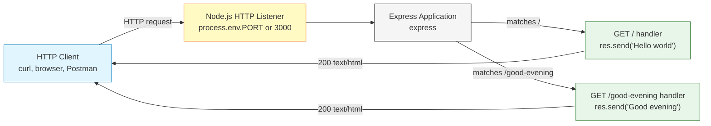

# Technical Specification

# 0. Agent Action Plan

## 0.1 Intent Clarification

This sub-section restates the user's natural-language request with the technical precision required by downstream code-generation agents. It surfaces explicit and implicit requirements, captures constraints, preserves user examples verbatim, and translates each requirement into a concrete technical action.

### 0.1.1 Core Feature Objective

Based on the prompt, the Blitzy platform understands that the new feature requirement is to:

- Introduce the Express.js web framework as a runtime dependency of an existing Node.js tutorial project.
- Add a second HTTP route handler whose response body is the exact string `Good evening`, while preserving the original endpoint that returns the string `Hello world`.

Enhanced restatement of each explicit requirement:

- **Explicit Requirement 1 — Add Express.js to the project.** Express.js must be declared as a direct dependency in `package.json`, installed locally into `node_modules/`, and imported by the server entry module. The user describes the existing project as `a tutorial of node js server hosting one endpoint`, which means Express must take over (or define for the first time) the project's HTTP routing layer rather than coexist with a parallel raw `http` server.
- **Explicit Requirement 2 — Add an endpoint that returns "Good evening".** A new HTTP route handler must be registered on the Express application that responds with the literal text `Good evening`. The user did not specify the route path or HTTP method; the Blitzy platform interprets this as a `GET` route at `/good-evening` (kebab-case, consistent with REST/Express conventions for human-friendly endpoint paths).

Implicit requirements detected from the prompt and from the current repository state:

- A `package.json` manifest must exist at the repository root because no Node.js project can install dependencies, run scripts, or be reproduced without one. The current repository does not contain a `package.json` [README.md:L1; §1.2.2 Core Technical Approach].
- A server entry-point JavaScript file (canonically `index.js`) must exist to instantiate the Express application, register routes, and bind to a TCP port. The current repository does not contain any source code [§3.2.1 Current State].
- The original `Hello world` endpoint must be preserved. Because no such endpoint actually exists in the repository today, "preserved" in practice means "implemented as part of this change so that the project matches the tutorial framing the user described." The Blitzy platform will register the `Hello world` handler as `GET /`.
- An `npm start` script must be provided so a learner following the tutorial can invoke `npm start` after `npm install` without memorising the entry-point filename.
- The Node.js runtime engine compatible with Express 5 must be declared via `engines.node` in `package.json`. <cite index="1-8">Node.js 18 or higher is required</cite> to use the current Express release.
- A `.gitignore` file should exclude `node_modules/` so the dependency tree is not committed.

Feature dependencies and prerequisites:

- Node.js runtime ≥ 18.0.0 must be available locally (and on any deployment target) for Express 5.x to load.
- The npm package registry must be reachable to install `express` and its transitive dependencies.

### 0.1.2 Special Instructions and Constraints

The user did not supply rules, attachments, or architectural directives; the only constraints arise from the prompt text itself.

- **Constraint — Preserve original behavior.** The phrase `add expressjs into the project and add another endpoint` (emphasis on *another*) directs the Blitzy platform to keep the original `Hello world` endpoint operational; the change must be additive, not destructive.
- **Constraint — Exact response text.** Both response bodies must match the user's quoted strings verbatim: `Hello world` and `Good evening`. No punctuation, casing, or formatting variations are permitted.
- **Constraint — Tutorial scope.** The user explicitly frames the project as `a tutorial of node js server`. This is taken as a signal to keep the implementation minimal — a single-file Express server with two routes — and to avoid over-engineering (no router modularisation, no middleware beyond Express defaults, no test scaffolding unless requested).
- **Architectural convention — Use Express as the routing layer.** The instruction `add expressjs into the project` is interpreted as a request to use Express as the canonical HTTP entry point; any raw `http.createServer` calls (none exist today) would be superseded.
- **Backward compatibility.** Existing consumers (if any) hitting the root path `/` continue to receive `Hello world`. Because no consumer code or contract exists in the repository today, "backward compatibility" reduces to "match the response text the user named."

User-provided examples (preserved verbatim):

- User Example: `this is a tutorial of node js server hosting one endpoint that returns the response "Hello world"`
- User Example: `add expressjs into the project`
- User Example: `add another endpoint that return the reponse of "Good evening"` (note the user's spelling of "reponse" is preserved verbatim here for fidelity; response bodies in code will use correct English spelling for the body strings themselves, which the user already wrote correctly as `Good evening` and `Hello world`).

Web search requirements identified for implementation:

- Verify the current stable Express.js major/minor/patch version on the npm registry so the dependency declaration is concrete rather than a placeholder.
- Verify the current Node.js LTS release line so the `engines.node` value is realistic for any reader of the tutorial.

### 0.1.3 Technical Interpretation

These feature requirements translate to the following technical implementation strategy:

- To introduce Express.js as a project dependency, the Blitzy platform will create `/package.json` declaring `express` under `dependencies` at a concrete version (`^5.2.1` per the current npm registry — see Section 0.3), specifying `engines.node` as `>=18.0.0` (the Express 5 minimum requirement, per the official npm listing), and registering an `npm start` script that runs `node index.js`.
- To preserve the original `Hello world` endpoint, the Blitzy platform will create `/index.js`, instantiate an Express application with `const app = express()`, and register `app.get('/', (req, res) => res.send('Hello world'))`.
- To add the `Good evening` endpoint, the Blitzy platform will register `app.get('/good-evening', (req, res) => res.send('Good evening'))` on the same Express application instance.
- To bind the server to a TCP port, the Blitzy platform will call `app.listen(process.env.PORT || 3000, …)` so the tutorial works out of the box on port 3000 while remaining portable to hosting platforms that inject a `PORT` environment variable.
- To keep the repository clean, the Blitzy platform will create `/.gitignore` excluding `node_modules/`.
- To document the feature for tutorial consumers, the Blitzy platform will update `/README.md` (currently a single H1 heading [README.md:L1]) with installation, run, and endpoint reference content.
- To make the dependency tree reproducible, `npm install` will generate `/package-lock.json`, which will be committed.

## 0.2 Repository Scope Discovery

This sub-section catalogs the existing repository state, identifies all files that must be created or modified to satisfy the feature, and enumerates the research conducted to anchor concrete dependency versions.

### 0.2.1 Comprehensive File Analysis

The repository was inspected via the directory traversal tool and via direct shell listing. The findings are exhaustive — the tree contains exactly one tracked file beyond the `.git/` metadata:

| Path | Type | Current State | Action | Rationale |
|---|---|---|---|---|
| `README.md` | Markdown documentation | UNCHANGED on disk; contains a single H1 heading `# -With-default-AAP-and-project-guide-` [README.md:L1] | UPDATE | Add tutorial documentation: prerequisites, install, run, endpoint reference |
| `.git/` | Git metadata directory | Present; out of scope for source changes | NO CHANGE | Version-control plumbing only |

No other files exist. The repository contains:

- No `package.json` (verified by `get_source_folder_contents("")` and shell listing) — confirmed independently by the existing technical specification [§1.2.2 Core Technical Approach].
- No source files in any language (`.js`, `.ts`, `.py`, etc.) [§3.2.1 Current State].
- No framework or library declarations [§3.3.1 Current State].
- No subdirectories of any kind.
- No `.blitzyignore` file (a repository-wide find for `.blitzyignore` returned no matches), so no path-pattern exclusions apply.

**Integration point discovery (in the existing codebase):**

| Integration Concern | Status in Repository | Implication for This Feature |
|---|---|---|
| Existing API endpoints | None exist | Both `GET /` and `GET /good-evening` are introduced fresh in `/index.js` |
| Database models / migrations | None exist | No database integration needed |
| Service classes | None exist | No service layer needed for a two-endpoint tutorial |
| Controllers / handlers | None exist | Route handlers are inline arrow functions in `/index.js` |
| Middleware / interceptors | None exist | Only Express built-in middleware (none explicitly registered) |
| Dependency injection container | None exists | Not applicable |
| Configuration loader | None exists | Port read directly from `process.env.PORT` with literal fallback `3000` |
| CI/CD pipelines | None exist | No CI changes required |

Because the existing codebase has zero integration surface, every behavioral element of this feature is introduced as part of new files rather than spliced into existing ones.

### 0.2.2 Web Search Research Conducted

The following research queries were executed to ground concrete dependency versions and runtime requirements in current registry data rather than placeholder values:

- **Query — "Express.js latest stable version npm 2026":** Confirmed Express.js current stable release line. The npm package listing for `express` reports <cite index="1-2">Latest version: 5.2.1, last published: 6 months ago</cite> as of the time of research. The same listing states <cite index="1-8">Node.js 18 or higher is required</cite>.
- **Query — "Node.js current LTS version 2026":** Confirmed the active LTS landscape. <cite index="20-16">Node.js 22.x · End of Active LTS: October 21, 2025 · End of Maintenance LTS: April 30, 2027</cite>, and <cite index="13-1,13-2">Version 26.0.0 (Current)</cite> is the latest "Current" release. For a tutorial, declaring `engines.node` as `>=18.0.0` is sufficient — it matches Express 5's stated minimum while allowing any current LTS to be used.
- **Best practices for implementing a minimal Express tutorial endpoint:** The official Express website confirms <cite index="8-4">Express is a minimal and flexible Node.js web application framework that provides a robust set of features for web and mobile applications</cite>, and <cite index="8-1">[email protected]: Now the Default on npm with LTS Timeline · Express 5.1.0 is now the default on npm</cite>. Tutorial-style single-file servers are idiomatic.
- **Library recommendation for HTTP routing in Node.js:** Express remains the canonical choice for tutorial-scale Node.js HTTP servers — <cite index="1-4">There are 104084 other projects in the npm registry using express</cite> — and no alternative routing library is warranted by the user's request.
- **Common patterns for two-route Express servers:** The minimum viable pattern is `require('express') → const app = express() → app.get(path, handler) → app.listen(port)`. No middleware, body parsing, or template engine is required for two GET endpoints returning plain text.
- **Security considerations:** For a tutorial server with two unauthenticated `GET` endpoints returning static text, there are no user inputs to sanitize, no secrets to manage, and no authentication surface to defend. The only security hygiene applied is excluding `node_modules/` from version control via `.gitignore`.

### 0.2.3 New File Requirements

Because the repository contains no source code today, every implementation file is new. The complete inventory:

**New source files to create:**

- `/index.js` — Express server entry point. Instantiates the Express application, registers `GET /` returning `Hello world` and `GET /good-evening` returning `Good evening`, and binds to a TCP port resolved from `process.env.PORT` with fallback `3000`. This is the only `.js` source file required for a two-endpoint tutorial server.

**New manifest and lockfile:**

- `/package.json` — Project manifest declaring metadata (`name`, `version`, `description`, `main: "index.js"`), the start script (`"start": "node index.js"`), the `express` dependency at `^5.2.1`, and `engines.node` at `>=18.0.0`.
- `/package-lock.json` — Generated automatically by `npm install`. Locks the exact resolved version of `express` and every transitive dependency for reproducible builds. Committed to version control as is standard for application repositories.

**New hygiene file:**

- `/.gitignore` — Excludes `node_modules/`, npm debug logs, and conventional editor / OS artefacts (`.DS_Store`, etc.).

**New test files:**

- None. The user's prompt does not request automated tests, and adding a test framework would inflate the tutorial beyond its stated scope.

**New configuration files:**

- None. The server reads only `process.env.PORT` with a literal default; there is no need for a `.env` template or YAML configuration for a two-endpoint tutorial.

**Files that must be updated (not new, but in scope):**

- `/README.md` — Currently contains only a single H1 heading [README.md:L1]; will be rewritten/extended to document the tutorial's purpose, install command, run command, and endpoint reference.

## 0.3 Dependency Inventory

This sub-section enumerates all dependency changes triggered by the feature. Because the repository has no pre-existing dependency manifest [§3.3.1 Current State], every entry below is an addition.

### 0.3.1 Public Package Additions

| Package Registry | Name | Version | Purpose | Change Type |
|---|---|---|---|---|
| npm (public) | `express` | `^5.2.1` | HTTP web framework providing routing (`app.get`), response helpers (`res.send`), and the server `listen()` lifecycle | ADD |

The exact version `5.2.1` was selected because it is the current latest stable release on the npm registry — <cite index="1-2">Latest version: 5.2.1, last published: 6 months ago</cite>. The caret prefix `^5.2.1` permits non-breaking patch and minor upgrades within the 5.x line while preventing an accidental jump to a future Express 6.x major release.

No private or scoped (`@scope/name`) packages are introduced. No optional, peer, or development dependencies are required because the user did not request testing, linting, or build tooling.

### 0.3.2 Runtime Engine Declaration

| Engine | Version Range | Source of Requirement |
|---|---|---|
| Node.js | `>=18.0.0` | Express 5 minimum — per the npm listing for `express`: <cite index="1-8">Node.js 18 or higher is required</cite>; aligns with the recommended LTS guidance that <cite index="12-3">When starting a new project, choose the current Active LTS</cite> |

The `engines.node` field is set to `>=18.0.0` rather than pinning a single major version so that the tutorial works on Node.js 18, 20, 22, 24, and 26 alike, with the Node.js project's own LTS schedule governing which version is currently recommended for production.

### 0.3.3 Dependency Updates

There are no dependency updates because there are no pre-existing dependencies to update — the repository has no `package.json` today. There are likewise no dependency removals.

### 0.3.4 Import Updates

There are no import updates because there is no existing source code containing import statements [§3.2.1 Current State]. The only new import introduced anywhere in the codebase is, in `/index.js`:

```javascript
const express = require('express');
```

CommonJS (`require`) is chosen over ES Module `import` syntax to match the default behavior of a fresh `package.json` (which omits `"type": "module"`) and to keep the tutorial entry-point free of build tooling.

### 0.3.5 External Reference Updates

| Reference Class | File(s) | Update Required? |
|---|---|---|
| Configuration files (`**/*.config.*`, `**/*.json`) | none exist | No |
| Documentation (`**/*.md`) | `README.md` | Yes — see Section 0.5.1 |
| Build files (`setup.py`, `pyproject.toml`, `package.json`) | `package.json` | Yes — created from scratch |
| CI/CD (`.github/workflows/*.yml`, `.gitlab-ci.yml`) | none exist | No |
| Lockfiles | `package-lock.json` | Yes — generated by `npm install` |

## 0.4 Integration Analysis

This sub-section enumerates every touchpoint between the new feature and the existing codebase. The repository's empty state [§5.2.2 Core Components Table; §5.2.4 External Integration Points Table] means there are no pre-existing modules to modify, register against, or wire into a container; every integration point listed below is therefore *internal to the new files*, with one minor exception (the existing README).

### 0.4.1 Existing Code Touchpoints

**Direct modifications required to pre-existing files:**

| File | Touchpoint | Required Change |
|---|---|---|
| `/README.md` | Documentation surface | Replace single-heading content [README.md:L1] with installation, run, and endpoint reference sections |

That is the complete list. No other pre-existing file is modified because no other file exists.

**Touchpoints introduced *within* the new entry-point file** (logical, not against any pre-existing artifact):

| Location in `/index.js` | Integration Point | Purpose |
|---|---|---|
| Top of file | `const express = require('express')` | Loads the Express factory function from the newly added dependency |
| Following the require | `const app = express()` | Instantiates the Express application singleton that holds the router and middleware stack |
| Route registration block | `app.get('/', handler)` | Preserves the original `Hello world` endpoint described by the user |
| Route registration block | `app.get('/good-evening', handler)` | Registers the new endpoint required by the feature, returning `Good evening` |
| Bottom of file | `app.listen(PORT, callback)` | Binds the HTTP server to a TCP port and logs a readiness message |

### 0.4.2 Dependency Injections

There is no dependency-injection container in the repository, and the tutorial scope does not require one. The Express `app` instance functions as the implicit container for routes and middleware; route handlers receive `req` and `res` directly from Express's router.

### 0.4.3 Database / Schema Updates

None. The feature exposes two stateless endpoints that return literal strings. There is no persistence layer, no migration directory, no schema file, and no ORM. None will be introduced.

### 0.4.4 Service / Module Registration

None. The two routes are registered inline on the single Express application instance in `/index.js`. There is no service registry, module loader, or plugin registration step.

### 0.4.5 Integration Diagram

The integration topology after the change is illustrated below. Every component shown is created by this feature; no pre-existing component is wired into.



## 0.5 Technical Implementation

This sub-section specifies the file-by-file execution plan with explicit modes (CREATE, UPDATE, REFERENCE), the concrete implementation approach for each file, and the (non-existent) UI design. Every file listed in this section must be created or modified to satisfy the feature.

### 0.5.1 File-by-File Execution Plan

**Group 1 — Core Feature Files (introduce Express and both endpoints):**

| Mode | Path | Implementation Summary |
|---|---|---|
| CREATE | `/package.json` | Declare `name`, `version`, `description`, `main: "index.js"`, `scripts.start: "node index.js"`, `dependencies.express: "^5.2.1"`, `engines.node: ">=18.0.0"` |
| CREATE | `/index.js` | Express server entry point: require `express`, instantiate `app`, register `GET /` returning `Hello world`, register `GET /good-evening` returning `Good evening`, call `app.listen(process.env.PORT || 3000, callback)` |

**Group 2 — Supporting Infrastructure:**

| Mode | Path | Implementation Summary |
|---|---|---|
| CREATE | `/.gitignore` | Exclude `node_modules/`, npm debug logs, optional OS/editor artefacts |
| CREATE (auto) | `/package-lock.json` | Produced by `npm install`; commit alongside `package.json` to lock the exact transitive dependency graph |

**Group 3 — Documentation:**

| Mode | Path | Implementation Summary |
|---|---|---|
| UPDATE | `/README.md` | Replace the single H1 heading [README.md:L1] with project description, prerequisites (`Node.js >= 18`), installation (`npm install`), run command (`npm start`), endpoint reference table, and example `curl` invocations |

**Group 4 — Tests:**

| Mode | Path | Implementation Summary |
|---|---|---|
| — | none | No test files. The user's prompt does not request tests, and the tutorial scope rules them out. |

### 0.5.2 Implementation Approach per File

**`/package.json` (CREATE).** This file establishes the dependency contract and the npm script surface. Its concrete shape:

```json
{
  "name": "node-express-tutorial",
  "version": "1.0.0",
  "description": "Node.js tutorial server with Express.js exposing 'Hello world' and 'Good evening' endpoints",
  "main": "index.js",
  "scripts": { "start": "node index.js" },
  "dependencies": { "express": "^5.2.1" },
  "engines": { "node": ">=18.0.0" },
  "license": "ISC"
}
```

Key choices:

- `main` is `index.js` so `require('./')` and tooling default-discovery both work.
- `scripts.start` is `node index.js` so the conventional `npm start` invocation works without arguments.
- `express` is pinned with a caret range so patch and minor upgrades within the 5.x line are permitted; majors are not.
- `engines.node` is set to `>=18.0.0` because Express 5 requires it per the npm listing.

**`/index.js` (CREATE).** This file implements the entire server. The complete shape (intentionally minimal for a tutorial):

```javascript
const express = require('express');
const app = express();
const PORT = process.env.PORT || 3000;

app.get('/', (req, res) => res.send('Hello world'));
app.get('/good-evening', (req, res) => res.send('Good evening'));

app.listen(PORT, () => console.log(`Server listening on http://localhost:${PORT}`));
```

Key choices:

- Two GET route handlers, each returning a literal string via `res.send` so the response body matches the user's quoted text verbatim and Express handles `Content-Type` and `Content-Length` automatically.
- `process.env.PORT || 3000` makes the file portable to hosting platforms that inject `PORT` while keeping the local-tutorial experience friction-free on port 3000.
- The `app.listen` callback logs a human-readable URL so a learner running `npm start` immediately sees where to point a browser or `curl`.
- No body-parsing middleware (`express.json()`, `express.urlencoded()`) is registered because both endpoints are GET handlers returning static text.

**`/.gitignore` (CREATE).** Excludes generated and machine-local files. Minimum content:

```
node_modules/
npm-debug.log*
.env
.DS_Store
```

**`/package-lock.json` (CREATE, auto-generated).** Produced by `npm install`; never hand-edited. Must be committed so reinstalls resolve identical dependency versions.

**`/README.md` (UPDATE).** The existing content is a single H1 heading [README.md:L1] and provides no usage information. The updated file must include at minimum:

- A short project description naming the technologies (Node.js, Express).
- A "Prerequisites" section stating `Node.js >= 18`.
- An "Install" section with `npm install`.
- A "Run" section with `npm start` and the expected listening URL.
- An "Endpoints" reference table listing `GET /` → `Hello world` and `GET /good-evening` → `Good evening`, with example `curl` invocations:

```
curl http://localhost:3000/
curl http://localhost:3000/good-evening
```

Implementation approach across files (sequential narrative):

- **Establish the project foundation** by creating `/package.json` and running `npm install express` to materialize `/node_modules/` and `/package-lock.json`.
- **Implement the server** by creating `/index.js` exactly as shown above.
- **Add hygiene** by creating `/.gitignore` so the dependency tree is not committed.
- **Document** by overwriting `/README.md` with the tutorial-oriented content described above.
- **Validate manually** by running `npm start` and confirming `curl http://localhost:3000/` returns `Hello world` and `curl http://localhost:3000/good-evening` returns `Good evening`.

No file in this plan references a user-provided Figma URL because no Figma URLs were supplied (see Section 0.8).

### 0.5.3 User Interface Design

Not applicable. This feature is a backend HTTP server that returns plain-text response bodies. There is no graphical user interface, no Figma design, no design system, and no component library to align against. The "user-facing surface" of the feature is exclusively two HTTP endpoints, fully specified above by route, method, and response body.

## 0.6 Scope Boundaries

This sub-section draws the exhaustive boundary between what this feature delivers and what it deliberately omits. Anything not enumerated under "Exhaustively In Scope" is out of scope.

### 0.6.1 Exhaustively In Scope

**All feature source files (wildcard pattern: `/*.js`):**

- `/index.js` — sole JavaScript source; Express application instantiation, both route handlers, and `app.listen` are all defined here.

**All manifest and lockfile artefacts:**

- `/package.json` — created with project metadata, the `express` dependency, the `start` script, and the `engines.node` declaration.
- `/package-lock.json` — generated by `npm install`; committed to the repository for reproducibility.

**Integration points (lines or blocks within scope):**

- `/index.js` — `require('express')` import line (single Express import).
- `/index.js` — `app.get('/')` route registration line (preserves `Hello world`).
- `/index.js` — `app.get('/good-evening')` route registration line (new endpoint returning `Good evening`).
- `/index.js` — `app.listen(PORT, …)` listener call.

**Configuration files:**

- None at the application level (no `.env`, no YAML, no JSON config). The only configuration value consumed is `process.env.PORT`, read inline.
- `/.gitignore` — created to exclude `node_modules/` and ephemeral artefacts.

**Documentation:**

- `/README.md` — updated with project overview, install/run instructions, endpoint reference, and example `curl` invocations. The existing content is the single H1 heading at [README.md:L1].

**Database changes:**

- None. No migration directory, no schema file, no models. The endpoints are stateless.

**Endpoint behaviors (logical scope):**

| Method | Path | Response Body | HTTP Status |
|---|---|---|---|
| `GET` | `/` | `Hello world` | `200 OK` |
| `GET` | `/good-evening` | `Good evening` | `200 OK` |

**Dependencies installed (logical scope):**

- `express ^5.2.1` (direct).
- All transitive dependencies of `express` (resolved automatically by npm and captured in `package-lock.json`).

### 0.6.2 Explicitly Out of Scope

The following are intentionally excluded to keep the implementation aligned with the user's tutorial framing and to avoid feature creep beyond the explicit prompt:

- **TypeScript migration.** The project remains plain JavaScript; no `tsconfig.json`, no `.ts` files, no type-checking step.
- **Automated tests.** No unit, integration, or end-to-end tests are introduced. The user did not request testing, and adding a test framework (Jest, Mocha, Supertest, etc.) would inflate the tutorial scope.
- **Lint / format tooling.** No ESLint, Prettier, or EditorConfig configuration is introduced.
- **Containerization and orchestration.** No `Dockerfile`, no `docker-compose.yml`, no Kubernetes manifests. Section 8 of this specification documents that containerization and orchestration are not applicable to this repository.
- **CI/CD pipelines.** No `.github/workflows/*.yml`, no `.gitlab-ci.yml`. Section 8 confirms no CI/CD applicability.
- **Environment file templates.** No `.env`, no `.env.example`. The only environment variable consumed is `PORT`, which has a literal default.
- **HTTPS / TLS setup.** The tutorial server speaks plain HTTP. No certificate management, no `https.createServer`, no reverse proxy configuration.
- **Authentication / authorization.** No login flow, no JWT issuance, no session middleware, no role-based access control. Both endpoints are unauthenticated and public.
- **Logging middleware.** Express's default request logging is not augmented with `morgan` or any structured logger; the only log output is the readiness message from the `app.listen` callback.
- **Body-parsing middleware.** `express.json()` and `express.urlencoded()` are not registered because both routes are `GET` handlers returning static text.
- **Custom error-handling middleware.** Express's default error handler is sufficient for two stateless GET routes.
- **Database integration.** No PostgreSQL, MySQL, MongoDB, SQLite, Redis, or other persistence engine. No ORM, no query builder, no migrations.
- **View engines / templating.** No EJS, Pug, Handlebars, or React-on-the-server. Responses are sent via `res.send` with plain text bodies.
- **Additional endpoints beyond `/good-evening`.** Exactly one new endpoint is added; no `/good-morning`, `/good-afternoon`, or wildcard greeting endpoint is introduced.
- **Refactoring of imaginary pre-existing `http` module code.** No such code exists in the repository [§3.2.1, §3.3.1]; there is nothing to refactor or migrate from.
- **Deployment configurations.** No `Procfile`, `vercel.json`, `app.yaml`, or platform-specific deployment manifest. The tutorial is local-only.
- **Performance optimizations beyond Express defaults.** No clustering, no PM2 configuration, no compression middleware.
- **Internationalization or localization.** Response strings are English literals exactly as the user wrote them.
- **API contract artefacts.** No OpenAPI/Swagger spec, no Postman collection, no GraphQL schema.

### 0.6.3 Scope Completeness Verification

| Requirement Source | Requirement | Coverage |
|---|---|---|
| Explicit (prompt) | Add Express.js to the project | `/package.json` declares `express ^5.2.1`; `/index.js` requires it |
| Explicit (prompt) | Add endpoint returning `Good evening` | `/index.js` registers `GET /good-evening` |
| Explicit (prompt, implicit) | Preserve `Hello world` endpoint | `/index.js` registers `GET /` returning `Hello world` |
| Implicit | Project must be installable | `/package.json` enables `npm install` |
| Implicit | Project must be runnable with a known command | `scripts.start` enables `npm start` |
| Implicit | Server must bind to a port | `app.listen(process.env.PORT || 3000, …)` |
| Implicit | Runtime engine constraint must be declared | `engines.node: ">=18.0.0"` |
| Implicit | Dependency tree must not be committed | `/.gitignore` excludes `node_modules/` |
| Implicit | A learner must understand how to run the tutorial | `/README.md` updated with prerequisites, install, run, endpoint reference |

Every requirement is mapped to a deliverable; no requirement is left unaddressed.

## 0.7 Rules for Feature Addition

This sub-section captures feature-specific rules and conventions distilled from the prompt and from accepted Node.js / Express community practice. The user did not supply an explicit rules list (`review_rules` returned `[]`); the rules below are therefore derived from the prompt's framing and from the requirement to keep the implementation idiomatic.

### 0.7.1 Feature-Specific Rules and Conventions

**Response-text fidelity.**

- Both response bodies must match the user's quoted strings *verbatim*: `Hello world` (with lowercase "world") and `Good evening` (with lowercase "evening", no trailing punctuation). No localization, no decoration, no leading/trailing whitespace.

**Route conventions.**

- Endpoint paths use lowercase kebab-case for multi-word names: `/good-evening`, never `/goodEvening`, `/Good-Evening`, or `/good_evening`. The root endpoint remains `/`.
- HTTP method is `GET` for both endpoints (idempotent, safe, idiomatic for endpoints that return static text).
- Both routes are registered with `app.get(path, handler)` — not with `app.use`, `app.all`, or `app.route().get`.

**File and module organization.**

- The entire server lives in a single `index.js` for tutorial readability. Do not split routes into a `routes/` subdirectory, do not introduce an `app.js` / `server.js` split, and do not introduce a router instance — none of these add tutorial clarity at two routes.
- Use CommonJS (`require`/`module.exports`) rather than ESM (`import`/`export`). Do not set `"type": "module"` in `package.json`.

**Dependency hygiene.**

- Pin `express` to `^5.2.1` so patch and minor updates are allowed within the 5.x line but major-version drift is prevented. Do not use `latest`, `*`, or unbounded ranges.
- Do not introduce additional runtime dependencies (no `body-parser`, no `dotenv`, no `cors`, no `helmet`, no `morgan`). The tutorial scope does not need them.
- Do not introduce dev-dependencies (no `nodemon`, no test runner, no linter).

**Environment and configuration.**

- Read the port from `process.env.PORT` with a literal `3000` fallback. Do not load a `.env` file. Do not hard-code the port without the env fallback (the env fallback enables seamless deployment to platforms that inject `PORT`).

**Backward compatibility.**

- The original `Hello world` endpoint must remain reachable at the path `/` after the change. Any reader of the tutorial who previously could `curl /` and receive `Hello world` must continue to be able to do so.

**Performance and scalability.**

- No performance optimizations are required for a tutorial server returning two static strings. Do not introduce clustering, worker threads, caching layers, or load-balancing configuration.

**Security.**

- Exclude `node_modules/` from version control via `/.gitignore`.
- Do not commit `package-lock.json` security-audit overrides; the unmodified file produced by `npm install` is the source of truth.
- No secrets are introduced; no secret-management tooling is required.

**Documentation.**

- `/README.md` must, at minimum, list the two endpoints and show working `curl` examples that match the response strings byte-for-byte.

### 0.7.2 Integration Requirements with Existing Features

There are no pre-existing features to integrate with [§2.2.1 Catalog Status]. This feature defines the project's first runtime behavior.

### 0.7.3 Validation Criteria

The feature is considered correctly implemented when *all* of the following hold:

- `npm install` completes successfully against the new `/package.json` and produces a `/package-lock.json` and a populated `/node_modules/` directory containing `express@5.2.x`.
- `npm start` starts a Node.js process that logs a readiness line referencing the port and does not exit.
- `curl http://localhost:3000/` returns HTTP `200` with body `Hello world`.
- `curl http://localhost:3000/good-evening` returns HTTP `200` with body `Good evening`.
- A `curl` to any other path returns HTTP `404` (Express's default for unmatched routes).
- `git status` shows `/node_modules/` as ignored (i.e., `.gitignore` is effective).

## 0.8 Attachments

No attachments were provided for this project. The `review_attachments` tool returned `No attachments found for this project.`, confirming that:

- No PDF files were attached.
- No image files were attached.
- No Figma frames or design URLs were attached.
- No code samples, schema files, or reference documents were attached.

Consequently:

- The Design System Alignment Protocol does not apply (no design library is named in the prompt or attachments, and no Figma source exists to map to design tokens).
- The Figma Design Analysis phase does not apply.
- The "Design System Compliance" sub-section is intentionally omitted from this Agent Action Plan because there is no design system to align against and no design artifact to translate from.

If a future revision of this feature adds visual assets, mockups, or design-system requirements, this Agent Action Plan should be regenerated against the then-current inputs.

