# Technical Specification

# 1. Introduction

## 1.1 Executive Summary

### 1.1.1 Project Overview

This Technical Specification documents the repository identified by the sole declared title `-With-default-AAP-and-project-guide-`, as it appears in the repository's only file (`README.md`). At the point in time captured by this document, the repository is in a **pre-implementation, placeholder state**: it contains exactly one file consisting of a single Markdown H1 heading, with no source code, no configuration, no dependency manifests, no infrastructure-as-code, and no narrative documentation beyond the title itself.

This Introduction therefore describes what the repository *currently is*. Every claim below is grounded strictly in the artifacts that exist in the repository at the time of writing. Where the repository is silent on a topic — business goals, stakeholders, integrations, success metrics — this document is also silent, rather than introducing unsupported assumptions.

### 1.1.2 Repository State Snapshot

The complete inventory of the repository is summarized below.

| Attribute | Value |
|---|---|
| Total files | 1 |
| Total subdirectories | 0 |
| Sole file present | `README.md` |
| README content | One Markdown H1 heading: `# -With-default-AAP-and-project-guide-` |
| Source code, build, or config artifacts | None |

### 1.1.3 Core Business Problem

The repository does not articulate a business problem, product requirement, or user need. The `README.md` file contains no problem statement, no narrative, no user stories, no acceptance criteria, and no goal description. Consequently, **no business problem can be authoritatively documented from repository evidence** in this revision of the specification.

### 1.1.4 Key Stakeholders and Users

No stakeholder roles, user personas, target audiences, or sponsoring organizations are identified anywhere in the repository. Identifying these would require information sources external to this codebase and is therefore not undertaken in this document.

### 1.1.5 Expected Business Impact and Value Proposition

No business impact statement, value proposition, return-on-investment thesis, market opportunity sizing, or expected outcome description is declared in the repository. This subsection records the absence of such declarations; it does not fabricate them.

## 1.2 System Overview

### 1.2.1 Project Context

#### Business Context and Market Positioning

The repository provides no business context, market positioning statement, target market description, or competitive landscape analysis. The only piece of metadata hinting at intent is the title heading in the `README.md` file, and that title contains undefined terminology (see immediately below).

#### Terminology Ambiguity in the README Heading

The title heading `-With-default-AAP-and-project-guide-` contains two notable terms, neither of which is defined within the repository.

| Term | Plausible Interpretations | Confirmed Meaning in Repository |
|---|---|---|
| `AAP` | Ansible Automation Platform, Application Approval Process, or other industry terms | None — undefined in repository |
| `project guide` | A template, scaffold, or instructional document | None — not elaborated in repository |

Because the repository contains no source code, dependency declarations, infrastructure manifests, or narrative content, the technology stack or product domain implied by "AAP" **cannot be confirmed from repository evidence**. This Technical Specification therefore treats both terms as informational labels of indeterminate meaning until clarifying content is added.

#### Current System Limitations

There is no existing system, prior implementation, legacy artifact, or migration source described in the repository. No limitations of a predecessor system can therefore be cataloged.

#### Integration with Existing Enterprise Landscape

No integrations, external system touchpoints, APIs, data sources, identity providers, message brokers, or enterprise service references are present in the repository.

### 1.2.2 High-Level Description

#### Repository Structure Visualization

The diagram below depicts the entirety of the repository's structure as of this document revision.

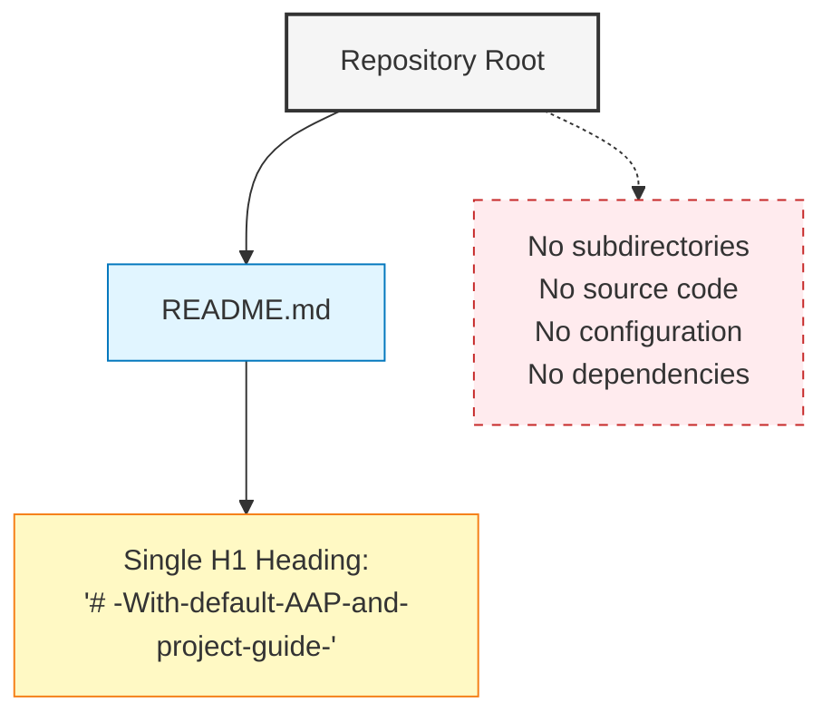
```mermaid
graph TD
    Root["Repository Root"]
    Readme["README.md"]
    Content["Single H1 Heading:<br/>'# -With-default-AAP-and-project-guide-'"]
    Note["No subdirectories<br/>No source code<br/>No configuration<br/>No dependencies"]

    Root --> Readme
    Readme --> Content
    Root -.-> Note

    style Root fill:#f5f5f5,stroke:#333,stroke-width:2px
    style Readme fill:#e1f5ff,stroke:#0277bd,stroke-width:1px
    style Content fill:#fff9c4,stroke:#f57f17,stroke-width:1px
    style Note fill:#ffebee,stroke:#c62828,stroke-width:1px,stroke-dasharray: 5 5
```

#### Primary System Capabilities

The repository implements no system capabilities. No features, workflows, services, jobs, user interfaces, APIs, or behavioral functions exist. The only observable "capability" is that a Markdown renderer presenting `README.md` will display the project title heading.

#### Major System Components

The repository's complete component inventory is shown below.

| Component | Type | Purpose |
|---|---|---|
| `README.md` | Markdown documentation file | Declares a single project title heading |

There are no additional modules, services, libraries, runtime processes, or deployable units.

#### Core Technical Approach

No technical approach, architectural pattern, programming language, framework, runtime environment, deployment model, or platform choice is declared in the repository. There is no build descriptor, no `package.json`, `pom.xml`, `requirements.txt`, `go.mod`, `Cargo.toml`, `Gemfile`, `Dockerfile`, Ansible playbook, Terraform module, or equivalent artifact from which a technical approach could be inferred.

### 1.2.3 Success Criteria

#### Measurable Objectives

No measurable objectives are documented in the repository.

#### Critical Success Factors

No critical success factors are documented in the repository.

#### Key Performance Indicators

No KPIs, service-level objectives, service-level indicators, or quality metrics are documented in the repository.

Because none of the above are present, this Technical Specification cannot bind the project to any quantitative or qualitative success benchmarks in its current revision.

## 1.3 Scope

### 1.3.1 In-Scope Elements

The in-scope content of this Technical Specification — strictly grounded in present-day repository contents — is intentionally minimal because the repository itself is minimal.

#### Core Features and Functionalities

| In-Scope Element | Description |
|---|---|
| Project title declaration | A single Markdown H1 heading in `README.md` declaring `-With-default-AAP-and-project-guide-` |
| Documentation skeleton | The README serves as a placeholder that establishes the repository's existence and initial title |

No additional features, primary user workflows, essential integrations, or technical requirements are present in the repository to bring into scope.

#### Implementation Boundaries

| Boundary Dimension | Current Coverage |
|---|---|
| System boundary | Limited to a single Markdown documentation artifact (`README.md`) |
| User groups covered | None defined |
| Geographic / market coverage | None defined |
| Data domains included | None — the repository contains no data, schemas, or models |

### 1.3.2 Out-of-Scope Elements

Because the repository is in a placeholder state, the out-of-scope list is necessarily extensive. The items below are out-of-scope not because they have been deliberately excluded by design, but because they are not present in the repository and therefore cannot be specified in this revision.

#### Excluded Features and Capabilities

| Category | Out-of-Scope Items |
|---|---|
| Application logic | All source code, business logic, algorithms, and runtime behavior |
| Configuration | All configuration files, environment definitions, secrets, and feature flags |
| Infrastructure | All infrastructure-as-code, deployment manifests, container images, and orchestration definitions |
| Data | All database schemas, data models, migrations, and persistence concerns |
| Quality assurance | All automated tests, test fixtures, coverage tooling, and quality gates |
| Operations | All CI/CD pipelines, observability hooks, alerting, and operational runbooks |
| Dependencies | All package declarations, dependency manifests, and third-party integrations |
| Security | All authentication, authorization, secret management, and compliance artifacts |

#### Future Phase Considerations

Any future development that gives substance to the project title — including but not limited to a concrete implementation of whatever "default AAP" and "project guide" are intended to denote — is out-of-scope for the current revision of this Technical Specification. As repository contents evolve, this document should be regenerated against the then-current state to reflect newly added artifacts.

#### Integration Points Not Covered

No external integrations of any kind are in-scope, because no integration code, client library, API contract, webhook definition, or interface specification exists in the repository.

#### Unsupported Use Cases

All operational use cases are unsupported. The repository's only consumable artifact is the `README.md` file, which can be rendered or read but cannot be executed, deployed, or invoked. No behavioral use cases — interactive, batch, scheduled, or event-driven — are implemented.

## 1.4 Document Caveats and Interpretive Guidance

### 1.4.1 Source of Truth

Every statement in this Introduction is grounded in the repository's actual contents as enumerated in the References subsection below. Where the repository is silent on a topic, this document is also silent. No external assumptions about technology choices, business intent, organizational sponsorship, or product strategy have been introduced.

### 1.4.2 Ambiguity Acknowledgement

The undefined acronym `AAP` in the README heading carries multiple plausible meanings in software practice (e.g., Ansible Automation Platform, Application Approval Process, and others). Until the repository is augmented with clarifying content, the meaning intended by the project author cannot be determined from the codebase alone, and this Technical Specification deliberately refrains from selecting one interpretation.

### 1.4.3 Living Document Expectation

This Technical Specification reflects the repository at a single point in time. As implementation artifacts are added — source code, configuration, dependency manifests, infrastructure-as-code, additional documentation, tests, and CI/CD definitions — subsequent revisions of this Introduction (and of the broader specification) will replace the placeholder narrative with substantive specifications drawn from those artifacts.

#### References

#### Files Examined

- `README.md` — The repository's sole file. Contains a single Markdown H1 heading (`# -With-default-AAP-and-project-guide-`) and no other content. Used in this section to establish the project title, identify undefined terminology ("AAP", "project guide"), and confirm the absence of further documentation, code, or configuration.

#### Folders Explored

- `/` (repository root, depth 0) — Confirmed to contain exactly one file (`README.md`) and zero subdirectories. Used in this section to establish the comprehensive absence of source code, configuration, dependency manifests, infrastructure-as-code, tests, and CI/CD definitions.

#### Search Operations Performed (Without Supplemental Results)

- Semantic file search for "project configuration source code files" — 0 results
- Semantic folder search for "source code application implementation" — 0 results
- Semantic file search for "AAP Ansible Automation Platform configuration" — 0 results
- Semantic file search for "README documentation guide" — 0 results
- Filesystem search for `.blitzyignore` files — 0 results
- Filesystem search for hidden files in the repository root — 0 results

# 2. Product Requirements

## 2.1 PREAMBLE: APPLICABILITY OF THIS SECTION

### 2.1.1 Repository State Reaffirmation

This Product Requirements section is bounded by the same evidentiary discipline that governs the preceding Introduction. As established in Section 1.1.2 (Repository State Snapshot), the repository's complete inventory comprises exactly one file (`README.md`, 38 bytes) whose contents are a single Markdown H1 heading (`# -With-default-AAP-and-project-guide-`) and zero subdirectories. As established in Section 1.2.2 (Primary System Capabilities), the repository implements no system capabilities; no features, workflows, services, jobs, user interfaces, APIs, or behavioral functions exist. As established in Section 1.3.1 (In-Scope Elements), the entirety of in-scope content is limited to a "Project title declaration" and a "Documentation skeleton."

Consequently, the requirement-bearing artifact classes that would normally feed a Product Requirements section — source code, build manifests, configuration files, infrastructure-as-code, API contracts, data schemas, test specifications, CI/CD pipelines, written requirements documents, and issue templates — are **all absent** from the repository. This absence is not interpreted by this document as a deliberate design exclusion; it is the literal state of the artifact at the time of writing, consistent with Section 1.3.2's clarification that excluded items are out-of-scope "not because they have been deliberately excluded by design, but because they are not present in the repository."

### 2.1.2 Governing Constraints from the Section Prompt

Two directives in the section prompt are dispositive when applied to a repository with zero features:

| Directive | Application to This Repository |
|---|---|
| "Only include sections and items that are actually relevant to this system, based on your analysis of its requirements." | Subsections corresponding to nonexistent features are documented as empty rather than populated with hypothetical content. |
| "Don't add any features of your own, or any items that aren't clearly applicable." | No feature identifiers (`F-XXX`), requirement identifiers (`F-XXX-RQ-YYY`), priorities, complexities, or statuses are assigned to capabilities that do not exist. |
| "Only document feature relationships that are clearly evident in the requirements or source code. Don't imagine any feature relationships of your own." | The Feature Relationships subsection is documented as empty because zero features cannot exhibit relationships. |

These prompt-level directives, combined with the Source-of-Truth principle established in Section 1.4.1 ("Where the repository is silent on a topic, this document is also silent"), forbid the fabrication of placeholder features or speculative requirements.

### 2.1.3 Applicability Determination Per Subsection

The table below records, for each subsection requested by the Section 2 prompt, whether it can be populated from repository evidence in the current revision.

| Requested Subsection | Populated? | Reason |
|---|---|---|
| Feature Catalog (Metadata, Description, Dependencies) | No | Zero discrete, testable features exist in the repository. |
| Functional Requirements Table (Requirement Details, Technical Specifications, Validation Rules) | No | No code, contracts, or written requirements exist from which to derive testable acceptance criteria. |
| Feature Relationships (Dependency map, Integration points, Shared components, Common services) | No | Relationships require at least two features; the feature count is zero. |
| Implementation Considerations (Constraints, Performance, Scalability, Security, Maintenance) | No | No implementation exists from which constraints or non-functional characteristics can be derived. |
| Traceability Matrix | No | Traceability requires both requirements and implementations; both are absent. |
| Process Flowchart References | No | No process flows are defined because no workflows or features are implemented. |

The remainder of this section preserves the prompt's requested structure as scaffolding, explicitly records the empty state of each scaffolded element, and establishes the identifier conventions and versioning posture under which future revisions will populate the structure as artifacts are added to the repository.

---

## 2.2 FEATURE CATALOG

### 2.2.1 Catalog Status

The Feature Catalog is **empty** in this revision of the Technical Specification. No feature record is enumerated below because no features have been implemented, declared, or documented in the repository. This finding is consistent with Section 1.2.2 (Primary System Capabilities), which records that "the repository implements no system capabilities."

### 2.2.2 Treatment of the Sole Repository Artifact

The `README.md` file is the only artifact in the repository. It contains a single Markdown H1 heading and no other content. The author of this section has considered whether the heading itself merits assignment of a feature identifier and has concluded it does not, on the following grounds:

| Consideration | Determination |
|---|---|
| Does the heading constitute a software feature? | No. It is a documentation marker, not a capability that can be exercised by a user, an API client, or an automated process. |
| Does the heading expose inputs, outputs, or behaviors? | No. It is a static string rendered by a Markdown renderer. |
| Can acceptance criteria be defined for it? | Only trivially (file exists, heading parses as H1). Such criteria do not constitute a product requirement in any conventional sense. |
| Would assigning it an `F-XXX` identifier comply with the prompt's "Don't add any features of your own" directive? | No. Treating a placeholder heading as a feature would inflate the catalog with content that is not "clearly applicable." |

The heading is therefore documented in Section 1.1.2 and Section 1.2.2 as a documentation marker and is not promoted to feature status in this catalog.

### 2.2.3 Reserved Identifier Convention for Future Revisions

To preserve forward compatibility with future revisions of this document — and to honor the Living Document expectation declared in Section 1.4.3 — the following identifier conventions are reserved:

| Convention | Format | Reserved Initial Value |
|---|---|---|
| Feature identifier | `F-XXX`, zero-padded three-digit integer | `F-001` (currently unassigned) |
| Requirement identifier | `F-XXX-RQ-YYY`, child of feature identifier | `F-001-RQ-001` (currently unassigned) |
| Feature category vocabulary | To be defined when first feature is added | Not yet established |
| Priority vocabulary | Critical / High / Medium / Low | Not yet applied |
| Status vocabulary | Proposed / Approved / In Development / Completed | Not yet applied |

No identifiers in these ranges are issued in this revision because no features qualify for issuance.

---

## 2.3 FUNCTIONAL REQUIREMENTS TABLE

### 2.3.1 Requirements Table Status

The Functional Requirements Table is **empty** in this revision. The repository contains no written requirements, no source code from which requirements can be inferred, no API contracts, no test fixtures expressing acceptance criteria, and no configuration files exposing parameterized behaviors. Consequently, no row of a requirements table can be populated from repository evidence.

### 2.3.2 Requirement Specification Convention for Future Revisions

When functional requirements are added to the repository in subsequent revisions, they will be recorded in tables conforming to the prompt's requested schema. The schemas reserved for that purpose are documented below as empty templates so that future regenerations of this section have a stable target.

#### Requirement Details Template

| Field | Reserved Format |
|---|---|
| Requirement ID | `F-XXX-RQ-YYY` |
| Description | Free-text statement of required behavior |
| Acceptance Criteria | Testable conditions, typically in Given/When/Then form |
| Priority | Must-Have / Should-Have / Could-Have |

#### Technical Specifications Template

| Field | Reserved Format |
|---|---|
| Input Parameters | Type and shape of accepted inputs |
| Output / Response | Type and shape of produced outputs |
| Performance Criteria | Latency, throughput, or resource targets |
| Data Requirements | Persistence, schema, and retention rules |

#### Validation Rules Template

| Field | Reserved Format |
|---|---|
| Business Rules | Domain constraints governing acceptable behavior |
| Data Validation | Type, range, format, and referential checks |
| Security Requirements | Authentication, authorization, encryption, audit obligations |
| Compliance Requirements | Statutory, regulatory, or contractual obligations |

### 2.3.3 Complexity Vocabulary

The complexity vocabulary reserved for future use is `High / Medium / Low`, applied to individual `F-XXX-RQ-YYY` rows. No complexity assessments are issued in this revision.

### 2.3.4 Acceptance Criteria Status

No acceptance criteria are defined in this revision. The repository contains no executable specifications (BDD/Cucumber files, test cases, schema validators) and no narrative acceptance criteria in any document. Consequently, no requirements in this revision are testable, because no requirements exist to test.

---

## 2.4 FEATURE RELATIONSHIPS

### 2.4.1 Dependency Map Status

The feature-to-feature dependency map is **empty**. Feature relationships are, by definition, edges between feature nodes; with zero feature nodes, the edge set is also zero. The prompt's directive — "Only document feature relationships that are clearly evident in the requirements or source code. Don't imagine any feature relationships of your own" — forbids fabricating such relationships.

The diagram below depicts the relationship graph in its current (empty) state, for completeness and to provide a stable visual reference that subsequent revisions will replace.

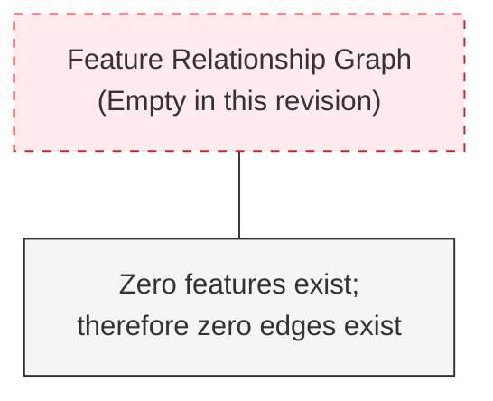
```mermaid
graph TD
    Note["Feature Relationship Graph<br/>(Empty in this revision)"]
    Reason["Zero features exist;<br/>therefore zero edges exist"]

    Note --- Reason

    style Note fill:#ffebee,stroke:#c62828,stroke-width:1px,stroke-dasharray: 5 5
    style Reason fill:#f5f5f5,stroke:#333,stroke-width:1px
```

### 2.4.2 Integration Points Status

No integration points exist. As recorded in Section 1.2.1 (Integration with Existing Enterprise Landscape), "no integrations, external system touchpoints, APIs, data sources, identity providers, message brokers, or enterprise service references are present in the repository." Section 1.3.2 (Integration Points Not Covered) further confirms this: "no integration code, client library, API contract, webhook definition, or interface specification exists in the repository."

### 2.4.3 Shared Components and Common Services Status

No shared components and no common services are present in the repository. The component inventory recorded in Section 1.2.2 (Major System Components) contains exactly one row — `README.md`, a Markdown documentation file — and that artifact is not a shared component or a common service in any architectural sense. It is a passive documentation file.

---

## 2.5 IMPLEMENTATION CONSIDERATIONS

### 2.5.1 Technical Constraints

No technical constraints can be derived from repository evidence because no implementation exists. As recorded in Section 1.2.2 (Core Technical Approach), "no technical approach, architectural pattern, programming language, framework, runtime environment, deployment model, or platform choice is declared in the repository." A constraint requires an implementation that is constrained; with no implementation, the constraint set is empty.

### 2.5.2 Performance Requirements

No performance requirements are documented. As recorded in Section 1.2.3 (Key Performance Indicators), "no KPIs, service-level objectives, service-level indicators, or quality metrics are documented in the repository." The single Markdown rendering "capability" implied by the README file has no declared performance target.

### 2.5.3 Scalability Considerations

No scalability considerations apply. There is no workload, no concurrent user model, no transaction volume, no data growth projection, and no horizontal or vertical scaling axis defined by any artifact in the repository.

### 2.5.4 Security Implications

No security implications can be enumerated from repository evidence. As recorded in Section 1.3.2 (Excluded Features and Capabilities), "all authentication, authorization, secret management, and compliance artifacts" are out-of-scope due to absence. The repository contains no attack surface beyond the static text of a single Markdown file, and that text exposes no secrets, credentials, tokens, or sensitive metadata.

### 2.5.5 Maintenance Requirements

No maintenance requirements are defined. There is no software to maintain, no dependencies to patch, no infrastructure to operate, no telemetry to monitor, and no runbook to execute. The sole maintenance event that could meaningfully apply to the current artifact is an edit to `README.md`, performed manually through ordinary version-control workflows.

---

## 2.6 TRACEABILITY MATRIX

### 2.6.1 Matrix Status

The Traceability Matrix is **empty** in this revision. A traceability matrix maps requirements to design elements, code modules, and test cases. With zero requirements, zero design elements, zero code modules, and zero test cases, the matrix has no rows and no columns to populate.

### 2.6.2 Reserved Matrix Schema

When the repository is augmented with requirements and implementations in future revisions, the traceability matrix will be expressed in a four-column form consistent with this document's table-width constraint. The reserved column set is recorded below.

| Column | Reserved Content |
|---|---|
| Requirement ID | `F-XXX-RQ-YYY` referencing a row in the Functional Requirements Table |
| Implementing Artifact | Path to source code, configuration, or infrastructure module that implements the requirement |
| Verifying Artifact | Path to test case, contract, or validator that exercises the requirement |
| Verification Status | Verified / Partially Verified / Not Verified |

### 2.6.3 Process Flowchart References

No process flowcharts are referenced by this section because no features or workflows are implemented. Section 1.2.2 (Repository Structure Visualization) contains the sole diagram applicable to the repository's current state: a structural view of the repository's single-file inventory. That diagram is not a process flowchart; it is a static structural depiction.

---

## 2.7 TERMINOLOGY-DEPENDENT INTERPRETATIONS

### 2.7.1 Ambiguity of "AAP"

As recorded in Section 1.2.1 and Section 1.4.2, the acronym `AAP` appearing in the README heading is undefined within the repository and carries multiple plausible meanings in software practice (e.g., Ansible Automation Platform, Application Approval Process, and other industry terms). Section 1.4.2 states explicitly that "this Technical Specification deliberately refrains from selecting one interpretation."

This section honors that posture. No feature catalog, no functional requirement, and no implementation consideration is documented under any one interpretation of `AAP`, because doing so would smuggle an unsupported assumption into the requirements baseline. The table below records the conditional consequence: which interpretation, if adopted by repository authors in a future revision, would change the shape of the Product Requirements section.

| Interpretation of `AAP` (Hypothetical) | Anticipated Effect on Future Section 2 |
|---|---|
| Ansible Automation Platform | Section 2 would likely enumerate features such as inventory management, playbook execution, credential vaulting, job templates, and surveys. |
| Application Approval Process | Section 2 would likely enumerate features such as request submission, approval routing, reviewer assignments, and audit trails. |
| Other industry meaning | Section 2 would enumerate features specific to that domain. |

None of the above interpretations is selected by this revision. The table is illustrative only and does not constitute a feature catalog.

### 2.7.2 Ambiguity of "project guide"

The phrase `project guide` is similarly undefined within the repository. Section 1.2.1 records its plausible meanings as "a template, scaffold, or instructional document." Each meaning would yield a materially different feature catalog (for example, a scaffold-style project guide would emphasize generator features and template parameters, while an instructional-document project guide would emphasize content sections and navigation features). No selection is made in this revision.

### 2.7.3 Combined Impact

The combination of two undefined terms in the project title means that even the *category* of product — automation platform, approval workflow, scaffold repository, or instructional asset — cannot be confirmed from repository evidence. Any requirement enumerated under one combined interpretation would be unfounded under another. This section therefore enumerates none.

---

## 2.8 ASSUMPTIONS, CONSTRAINTS, AND VERSIONING

### 2.8.1 Assumptions

This revision of Section 2 records the following assumptions explicitly, so that subsequent reviewers can validate or replace them:

| Assumption | Basis |
|---|---|
| The repository state observed at the time of writing reflects the project author's intentional commit, not an accidental partial push. | Standard assumption applied to any inspected repository; not independently verifiable from repository contents. |
| The README heading is the project's actual intended title and not a placeholder slug. | The heading is the only declarative content in the repository; treating it as the title is the minimally speculative interpretation. |
| Future revisions of the repository will resolve the ambiguity of `AAP` and `project guide` through added artifacts. | Section 1.4.3 (Living Document Expectation) anticipates this resolution path. |

### 2.8.2 Constraints

This revision of Section 2 is constrained as follows:

| Constraint | Source |
|---|---|
| No features may be invented. | Section 2 prompt: "Don't add any features of your own, or any items that aren't clearly applicable." |
| No feature relationships may be imagined. | Section 2 prompt: "Don't imagine any feature relationships of your own." |
| No external assumptions about technology choice may be introduced. | Section 1.4.1 (Source of Truth). |
| The document must be silent where the repository is silent. | Section 1.4.1 (Source of Truth). |

### 2.8.3 Document Versioning Posture

Per Section 1.4.3, this Technical Specification is a Living Document. The Product Requirements section in particular is expected to evolve substantially when any of the following events occur in the repository:

| Trigger Event | Expected Revision Effect |
|---|---|
| Addition of source code files | Section 2.2 (Feature Catalog) will enumerate features inferable from the implemented capability surface. |
| Addition of a written requirements document (`REQUIREMENTS.md`, `PRD.md`, user-story files, or equivalent) | Section 2.2 and 2.3 will transcribe and structure the declared requirements. |
| Addition of API contracts (OpenAPI, GraphQL schema, Protobuf) | Section 2.3 (Functional Requirements Table) will derive input/output specifications from the contract. |
| Addition of test fixtures or BDD feature files | Section 2.3.4 (Acceptance Criteria) will be populated from executable specifications. |
| Addition of configuration files exposing feature flags or runtime parameters | Section 2.3 (Validation Rules) will record parameter constraints. |
| Resolution of `AAP` and `project guide` terminology | Section 2.7 will be replaced with substantive feature documentation under the chosen interpretation. |

Until at least one of these events occurs, regenerations of this section will continue to reflect the placeholder state documented here.

---

## 2.9 REFERENCES

### 2.9.1 Files Examined

- `README.md` — The repository's sole file (38 bytes). Examined in full to confirm that no features, requirements, acceptance criteria, dependencies, performance targets, or validation rules are written in the only place they could plausibly be expressed. The file contains a single Markdown H1 heading and nothing else.

### 2.9.2 Folders Explored

- `/` (repository root, depth 0) — Confirmed to contain exactly one first-order child (`README.md`) and zero subdirectories. The depth of 0 is the maximum meaningful depth because no subdirectories exist. Used in this section to confirm the comprehensive absence of source code, configuration, dependency manifests, infrastructure-as-code, tests, CI/CD definitions, API contracts, data schemas, and architectural documentation.

### 2.9.3 Cross-Referenced Technical Specification Sections

- **Section 1.1 (Executive Summary)** — Provided the authoritative repository inventory (Section 1.1.2), the declared absence of a business problem (Section 1.1.3), the declared absence of stakeholders (Section 1.1.4), and the declared absence of a business impact statement (Section 1.1.5). These findings constrain Section 2's Feature Catalog and Description subsections.
- **Section 1.2 (System Overview)** — Provided the terminology ambiguity analysis for `AAP` and `project guide` (Section 1.2.1), the explicit declaration that the repository implements no system capabilities (Section 1.2.2), and the absence of success criteria, critical success factors, and KPIs (Section 1.2.3). These findings constrain Section 2's Functional Requirements Table and Implementation Considerations subsections.
- **Section 1.3 (Scope)** — Provided the in-scope inventory (Section 1.3.1), which is limited to "project title declaration" and "documentation skeleton," and the extensive out-of-scope inventory (Section 1.3.2), which catalogs the requirement-bearing artifact classes absent from the repository. These findings constrain Section 2's Feature Catalog and Dependencies subsections.
- **Section 1.4 (Document Caveats and Interpretive Guidance)** — Provided the Source-of-Truth principle (Section 1.4.1), the Ambiguity Acknowledgement for `AAP` (Section 1.4.2), and the Living Document Expectation (Section 1.4.3). These principles govern Section 2's overall posture of silence-where-the-repository-is-silent and its versioning expectations.

### 2.9.4 Search Operations Performed

- Semantic file search for "product requirements features specifications user stories" — 0 results.
- Semantic file search for "configuration files dependencies manifests source code" — 0 results.
- Semantic folder search for "source code application implementation modules" — 0 results.
- Semantic file search for "AAP Ansible Automation Platform project guide" — Returned only the already-known `README.md`; no additional artifacts.
- Semantic file search for "acceptance criteria business rules functional requirements" — 0 results.
- Filesystem search for `.blitzyignore` files — 0 results.
- Filesystem search for hidden files at the project root — 0 results (only `.git/` version-control metadata present).

### 2.9.5 Web Searches Performed

- None. The Product Requirements section is grounded exclusively in repository contents and in cross-referenced earlier sections of this Technical Specification, in conformance with Section 1.4.1 (Source of Truth). No external research was conducted, and no external interpretation of `AAP` or `project guide` has been introduced.

# 3. Technology Stack

## 3.1 PREAMBLE: APPLICABILITY OF THIS SECTION

### 3.1.1 Repository State Reaffirmation

This Technology Stack section is bounded by the same evidentiary discipline established in Sections 1.4.1 (Source of Truth) and 2.1.1 (Repository State Reaffirmation). The repository's complete inventory comprises exactly one file (`README.md`, 38 bytes) whose contents are a single Markdown H1 heading (`# -With-default-AAP-and-project-guide-`) and zero subdirectories.

Section 1.2.2 (Core Technical Approach) recorded the dispositive observation for this section:

> "No technical approach, architectural pattern, programming language, framework, runtime environment, deployment model, or platform choice is declared in the repository. There is no build descriptor, no `package.json`, `pom.xml`, `requirements.txt`, `go.mod`, `Cargo.toml`, `Gemfile`, `Dockerfile`, Ansible playbook, Terraform module, or equivalent artifact from which a technical approach could be inferred."

A Technology Stack section ordinarily reflects technology decisions that are evidenced by manifest files, configuration artifacts, source files in specific languages, deployment descriptors, and infrastructure-as-code modules. **All such artifact classes are absent from the repository.** Consequently, every subsection requested by the section prompt resolves to an empty present-state inventory and a reserved schema for future revisions.

### 3.1.2 Governing Constraints From Prior Sections

The following constraints, inherited from earlier sections of this Technical Specification, are dispositive for the population of this section:

| Constraint | Source | Application to This Section |
|---|---|---|
| "Every statement in this Introduction is grounded in the repository's actual contents… Where the repository is silent on a topic, this document is also silent." | Section 1.4.1 (Source of Truth) | No technology choice may be asserted as adopted in the absence of a repository artifact that evidences it. |
| "No external assumptions about technology choice may be introduced." | Section 2.8.2 (Constraints) | The prompt-supplied default stack must not be presented as a fact about this repository. |
| "The document must be silent where the repository is silent." | Section 2.8.2 (Constraints) | Programming languages, frameworks, libraries, services, databases, and tooling must be enumerated as empty. |
| "This Technical Specification deliberately refrains from selecting one interpretation [of `AAP`]." | Section 1.4.2 (Ambiguity Acknowledgement) | Because the product category cannot be confirmed, no domain-specific stack may be inferred. |

### 3.1.3 Governing Directives From the Section Prompt

Two directives in the section prompt are equally dispositive when applied to a repository with zero technology declarations:

| Directive | Application to This Repository |
|---|---|
| "Only include sections and items that are actually relevant to this system, based on your analysis of its requirements." | Subsections corresponding to nonexistent technology categories are documented as empty rather than populated with hypothetical content. |
| "Don't add any items that aren't clearly applicable." | No language, framework, library, service, database, or tool is enumerated unless evidenced by a repository artifact. None is so evidenced. |
| "Include version numbers for all components." | No version numbers are asserted, because no components exist whose versions could be observed. |

### 3.1.4 Disposition of the Prompt-Supplied "Default Technology Stack"

The section prompt supplies a "Default Technology Stack" enumeration covering core infrastructure (AWS, Docker, Terraform, GitHub Actions), backend (Python, Flask, Auth0, MongoDB, Langchain), frontend (React with TypeScript, TailwindCSS, React-Native with TypeScript), and native applications (Swift, Kotlin, Objective-C, ElectronJS). These items are documented in Section 3.10 (Reserved Default Stack Reference) **as a reference only**.

Per the directives in Section 3.1.3 and the constraints in Section 3.1.2, **none of these items is asserted as adopted** by this repository in the present revision. The default stack is reproduced in this document solely to:

1. Acknowledge the prompt input transparently;
2. Provide a reference table that future revisions may adopt, modify, or replace once implementation artifacts are added; and
3. Make explicit that any present-state claim of adoption would violate the Source-of-Truth principle.

### 3.1.5 Applicability Determination Per Subsection

The table below records, for each subsection requested by the Section 3 prompt, whether it can be populated from repository evidence in the current revision.

| Requested Subsection | Populated? | Reason |
|---|---|---|
| Programming Languages (by platform / component, selection criteria, constraints) | No | No source code file of any language exists in the repository. |
| Frameworks & Libraries (core frameworks, supporting libraries, compatibility, justification) | No | No dependency manifest, build descriptor, or framework configuration exists. |
| Open Source Dependencies (third-party libraries, package registries, versions) | No | No package manifest of any registry format exists. |
| Third-Party Services (external APIs, authentication, monitoring, cloud) | No | No integration, SDK reference, credential, or endpoint configuration exists. |
| Databases & Storage (primary/secondary databases, persistence, caching, storage services) | No | No schema, migration, connection string, or storage configuration exists. |
| Development & Deployment (development tools, build system, containerization, CI/CD) | No | No build configuration, container definition, or pipeline file exists. |

The remainder of this section preserves the prompt's requested structure as scaffolding, explicitly records the empty state of each scaffolded element, and establishes the schema under which future revisions will populate the structure as artifacts are added to the repository.

---

## 3.2 PROGRAMMING LANGUAGES

### 3.2.1 Current State

The programming-language inventory for this repository is **empty**. The repository contains no `.py`, `.js`, `.ts`, `.jsx`, `.tsx`, `.java`, `.kt`, `.swift`, `.m`, `.go`, `.rs`, `.rb`, `.cs`, `.cpp`, `.c`, `.h`, `.php`, `.scala`, `.dart`, `.lua`, `.r`, `.sql`, `.sh`, `.ps1`, or any other source file extension. The sole file present (`README.md`) is a Markdown documentation artifact and not an implementation language source.

### 3.2.2 Selection Criteria

No selection criteria are recorded in this revision. The act of selecting a language requires either (a) an explicit decision document in the repository or (b) source files whose presence implies a language choice. The repository contains neither.

When implementation artifacts are added, this subsection is expected to document, for each language adopted:

- The platform or component to which the language applies (e.g., backend service, web frontend, mobile client, CLI tool);
- The criteria that motivated its selection (e.g., team familiarity, ecosystem maturity, performance characteristics, target runtime compatibility); and
- Any constraints or dependencies (e.g., minimum runtime version, interpreter, toolchain, or platform binding).

### 3.2.3 Reserved Schema for Future Revisions

The schema below is reserved for use when at least one source file is added to the repository. It is empty in this revision.

| Platform / Component | Language | Version | Selection Rationale | Constraints / Dependencies |
|---|---|---|---|---|
| *(none)* | *(none)* | *(none)* | *(none)* | *(none)* |

### 3.2.4 Cross-Reference to Default Stack Reference

The prompt-supplied default stack identifies Python (backend), TypeScript (web and mobile), Swift (iOS), Kotlin (Android), and Objective-C (macOS) as language candidates. These are catalogued without adoption in Section 3.10.1. The condition under which any of these would become an evidenced choice — namely, the addition of source files in that language — has not been met.

---

## 3.3 FRAMEWORKS & LIBRARIES

### 3.3.1 Current State

The framework-and-library inventory for this repository is **empty**. No core framework is declared, configured, or referenced. No supporting library is imported. No compatibility matrix can be derived because the matrix would require at least one framework version to anchor it.

### 3.3.2 Evidence of Absence

Section 1.3.2 (Excluded Features and Capabilities) records the absence in the form of an out-of-scope inventory:

| Category from Section 1.3.2 | Implication for Frameworks & Libraries |
|---|---|
| "Application logic… All source code, business logic, algorithms, and runtime behavior" | No application framework is hosting any code, because there is no code. |
| "Dependencies… All package declarations, dependency manifests, and third-party integrations" | No dependency manifest enumerates any framework or library. |
| "Configuration… All configuration files, environment definitions, secrets, and feature flags" | No framework configuration file (e.g., `settings.py`, `next.config.js`, `vite.config.ts`, `tsconfig.json`) is present. |

### 3.3.3 Reserved Schema for Future Revisions

The schema below is reserved for use when a framework or library is introduced via a build descriptor or import statement. It is empty in this revision.

| Tier | Name | Version | Role / Purpose | Compatibility Requirements | Justification |
|---|---|---|---|---|---|
| Core framework | *(none)* | *(none)* | *(none)* | *(none)* | *(none)* |
| Supporting library | *(none)* | *(none)* | *(none)* | *(none)* | *(none)* |

### 3.3.4 Cross-Reference to Default Stack Reference

The prompt-supplied default stack identifies Flask (backend web framework), Langchain (AI framework), React (web frontend), TailwindCSS (CSS framework), React-Native (mobile/cross-platform), and ElectronJS (desktop) as framework candidates. These are catalogued without adoption in Section 3.10.2. No present-state version number is asserted because no framework is observed in the repository.

---

## 3.4 OPEN SOURCE DEPENDENCIES

### 3.4.1 Current State

The open-source dependency inventory for this repository is **empty**. The repository contains no package manifest of any registry format:

| Ecosystem | Expected Manifest File(s) | Present in Repository? |
|---|---|---|
| Node.js / npm / Yarn / pnpm | `package.json`, `package-lock.json`, `yarn.lock`, `pnpm-lock.yaml` | No |
| Python | `requirements.txt`, `pyproject.toml`, `setup.py`, `setup.cfg`, `Pipfile`, `poetry.lock` | No |
| Java / JVM | `pom.xml`, `build.gradle`, `build.gradle.kts`, `settings.gradle` | No |
| Go | `go.mod`, `go.sum` | No |
| Rust | `Cargo.toml`, `Cargo.lock` | No |
| Ruby | `Gemfile`, `Gemfile.lock`, `.gemspec` | No |
| PHP | `composer.json`, `composer.lock` | No |
| .NET | `*.csproj`, `packages.config`, `NuGet.config` | No |
| Swift | `Package.swift`, `Podfile`, `Podfile.lock`, `Cartfile` | No |
| Android | `build.gradle` (app/module), `gradle.properties` | No |
| Dart / Flutter | `pubspec.yaml`, `pubspec.lock` | No |

### 3.4.2 Registry Posture

Because no manifest exists, no package registry is referenced. The repository neither pins to public registries (such as npmjs.com, PyPI, Maven Central, crates.io, RubyGems, NuGet, or pub.dev) nor declares any private or mirrored registry endpoint.

### 3.4.3 Reserved Schema for Future Revisions

The schema below is reserved for use when at least one dependency manifest is added. It is empty in this revision.

| Package Name | Registry | Version Spec | License | Direct or Transitive | Purpose |
|---|---|---|---|---|---|
| *(none)* | *(none)* | *(none)* | *(none)* | *(none)* | *(none)* |

### 3.4.4 Security Posture of the Dependency Surface

Section 2.5.4 (Security Implications) recorded that "the repository contains no attack surface beyond the static text of a single Markdown file." This finding applies directly to the open-source supply-chain dimension: with zero dependencies, the repository has zero exposure to transitive vulnerabilities, dependency confusion attacks, typosquatting, or registry compromise events in this revision.

---

## 3.5 THIRD-PARTY SERVICES

### 3.5.1 Current State

The third-party service inventory for this repository is **empty**. As recorded in Section 1.2.1 (Integration with Existing Enterprise Landscape):

> "No integrations, external system touchpoints, APIs, data sources, identity providers, message brokers, or enterprise service references are present in the repository."

Section 2.4.2 (Integration Points Status) and Section 1.3.2 (Integration Points Not Covered) reaffirm this absence.

### 3.5.2 Categories Surveyed and Confirmed Absent

| Service Category | Examples | Present in Repository? |
|---|---|---|
| External APIs / SaaS integrations | REST, GraphQL, gRPC client configurations; SDK imports | No |
| Authentication / identity providers | Auth0, Okta, Azure AD, AWS Cognito, Keycloak, Firebase Auth, OAuth/OIDC clients | No |
| Monitoring / observability | Datadog, New Relic, Sentry, Prometheus, Grafana, OpenTelemetry exporters | No |
| Logging / log aggregation | Splunk, Elastic Stack, CloudWatch, Loggly, Papertrail | No |
| Cloud platform integrations | AWS SDKs, Azure SDKs, Google Cloud SDKs, IaC modules, service bindings | No |
| Payment / commerce | Stripe, PayPal, Braintree, Adyen | No |
| Communications | Twilio, SendGrid, Mailgun, Slack/Microsoft Teams webhooks | No |
| AI / ML services | OpenAI, Anthropic, Bedrock, Vertex AI, Hugging Face | No |
| Feature flag / experimentation | LaunchDarkly, Optimizely, Split, Unleash | No |

### 3.5.3 Reserved Schema for Future Revisions

The schema below is reserved for use when at least one third-party service is integrated. It is empty in this revision.

| Service Category | Provider | Integration Surface | Authentication Mode | Data Sent / Received | Justification |
|---|---|---|---|---|---|
| *(none)* | *(none)* | *(none)* | *(none)* | *(none)* | *(none)* |

### 3.5.4 Cross-Reference to Default Stack Reference

The prompt-supplied default stack identifies AWS (cloud platform) and Auth0 (authentication) as third-party service candidates. These are catalogued without adoption in Section 3.10.3. No endpoint, credential, SDK import, or IaC reference to either provider has been observed.

---

## 3.6 DATABASES & STORAGE

### 3.6.1 Current State

The database-and-storage inventory for this repository is **empty**. As recorded in Section 1.3.1 (Implementation Boundaries), "No — the repository contains no data, schemas, or models." Section 1.3.2 (Excluded Features and Capabilities) further records that "all database schemas, data models, migrations, and persistence concerns" are out-of-scope due to absence.

### 3.6.2 Storage Categories Surveyed and Confirmed Absent

| Storage Category | Examples | Present in Repository? |
|---|---|---|
| Primary OLTP database | PostgreSQL, MySQL, SQL Server, Oracle, MongoDB, DynamoDB | No |
| Secondary / analytical database | Snowflake, BigQuery, Redshift, ClickHouse | No |
| Cache | Redis, Memcached, in-process LRU | No |
| Search index | Elasticsearch, OpenSearch, Algolia, Meilisearch | No |
| Message queue / broker | Kafka, RabbitMQ, SQS, SNS, EventBridge, Pub/Sub | No |
| Object / blob storage | S3, Azure Blob, GCS, MinIO | No |
| File / network storage | EFS, FSx, NFS, SMB shares | No |
| Vector / AI store | Pinecone, Weaviate, Milvus, pgvector, Chroma | No |

### 3.6.3 Data Persistence Strategy

No data persistence strategy is recorded. A persistence strategy requires (a) data to persist and (b) a storage medium in which to persist it. Neither is present.

### 3.6.4 Caching Strategy

No caching strategy is recorded. Caching presupposes a request/response path or a computed-value pipeline whose latency or throughput characteristics motivate a cache. As recorded in Section 2.5.2 (Performance Requirements), "no performance requirements are documented," and as recorded in Section 2.5.3 (Scalability Considerations), "there is no workload, no concurrent user model, no transaction volume, [and] no data growth projection."

### 3.6.5 Reserved Schema for Future Revisions

The schema below is reserved for use when at least one storage component is introduced via a configuration file, migration, or runtime binding. It is empty in this revision.

| Storage Role | Technology | Version | Schema / Model Reference | Backup & Retention | Justification |
|---|---|---|---|---|---|
| *(none)* | *(none)* | *(none)* | *(none)* | *(none)* | *(none)* |

### 3.6.6 Cross-Reference to Default Stack Reference

The prompt-supplied default stack identifies MongoDB as the database candidate. It is catalogued without adoption in Section 3.10.4. No MongoDB driver, connection string, schema file, or migration is present in the repository.

---

## 3.7 DEVELOPMENT & DEPLOYMENT

### 3.7.1 Current State

The development-and-deployment inventory for this repository is **empty**. No development tool configuration, build descriptor, containerization manifest, or CI/CD pipeline definition exists.

### 3.7.2 Development Tooling

No development tooling is configured in the repository. The following common artifact classes are confirmed absent:

| Tooling Category | Expected Artifacts | Present? |
|---|---|---|
| Editor / IDE configuration | `.editorconfig`, `.vscode/`, `.idea/` | No |
| Linting / formatting | `.eslintrc*`, `.prettierrc*`, `pyproject.toml [tool.black]`, `ruff.toml`, `.rubocop.yml`, `.golangci.yml` | No |
| Type checking | `tsconfig.json`, `mypy.ini`, `pyrightconfig.json` | No |
| Pre-commit / Git hooks | `.pre-commit-config.yaml`, `.husky/`, `lefthook.yml` | No |
| Local environment | `.env*`, `.nvmrc`, `.python-version`, `.tool-versions`, `.devcontainer/` | No |
| Documentation generation | `mkdocs.yml`, `sphinx/`, `docusaurus.config.js`, `typedoc.json` | No |

### 3.7.3 Build System

No build system is configured. There is no Makefile, no `build.sh`, no Gradle wrapper, no `npm` script set, no `tox.ini`, no Bazel `BUILD` file, and no equivalent build orchestrator. As recorded in Section 1.2.2 (Core Technical Approach), the repository contains no build descriptor.

### 3.7.4 Containerization

No containerization is configured. No `Dockerfile`, `Containerfile`, `docker-compose.yml`, `compose.yaml`, `.dockerignore`, Helm chart, Kustomize overlay, or Kubernetes manifest is present.

### 3.7.5 CI/CD

No continuous integration or continuous deployment pipeline is configured. The following pipeline-host configurations are confirmed absent:

| CI/CD Host | Expected Configuration Path | Present? |
|---|---|---|
| GitHub Actions | `.github/workflows/*.yml` | No |
| GitLab CI | `.gitlab-ci.yml` | No |
| CircleCI | `.circleci/config.yml` | No |
| Jenkins | `Jenkinsfile` | No |
| Azure DevOps Pipelines | `azure-pipelines.yml` | No |
| Bitbucket Pipelines | `bitbucket-pipelines.yml` | No |
| Travis CI | `.travis.yml` | No |
| Drone CI | `.drone.yml` | No |

### 3.7.6 Infrastructure as Code

No infrastructure-as-code is present. No Terraform module (`*.tf`, `*.tfvars`), Pulumi program, AWS CloudFormation template, AWS CDK app, Azure Bicep / ARM template, Google Cloud Deployment Manager configuration, Ansible playbook, Chef cookbook, Puppet manifest, or SaltStack state is declared.

### 3.7.7 Reserved Schema for Future Revisions

The schema below is reserved for use when development and deployment tooling is added. It is empty in this revision.

| Capability | Tool / Platform | Version | Configuration File | Triggering Events | Justification |
|---|---|---|---|---|---|
| Development environment | *(none)* | *(none)* | *(none)* | *(none)* | *(none)* |
| Build system | *(none)* | *(none)* | *(none)* | *(none)* | *(none)* |
| Containerization | *(none)* | *(none)* | *(none)* | *(none)* | *(none)* |
| CI pipeline | *(none)* | *(none)* | *(none)* | *(none)* | *(none)* |
| CD pipeline | *(none)* | *(none)* | *(none)* | *(none)* | *(none)* |
| Infrastructure as code | *(none)* | *(none)* | *(none)* | *(none)* | *(none)* |

### 3.7.8 Cross-Reference to Default Stack Reference

The prompt-supplied default stack identifies Docker (containerization), Terraform (IaC), and GitHub Actions (CI/CD) as candidates. These are catalogued without adoption in Section 3.10.5. None has been observed in the repository.

---

## 3.8 TECHNOLOGY STACK VISUALIZATION

### 3.8.1 Present-State Diagram

The diagram below depicts the entirety of the technology stack as of this document revision. It mirrors the empty-state visualization convention introduced in Section 2.4.1 (Dependency Map Status).

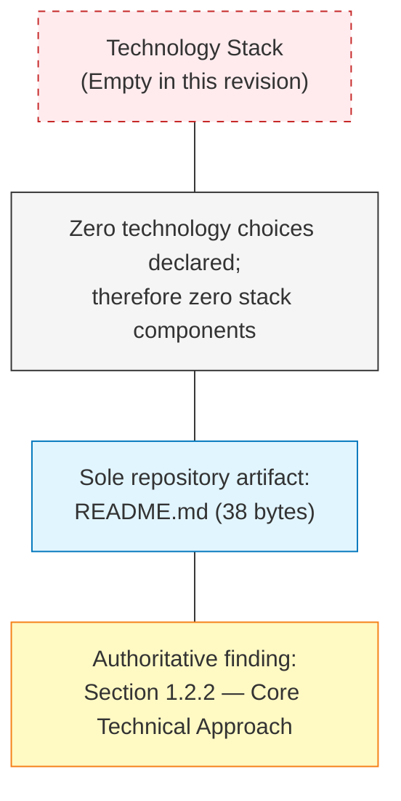
```mermaid
graph TD
    Note["Technology Stack<br/>(Empty in this revision)"]
    Reason["Zero technology choices declared;<br/>therefore zero stack components"]
    Evidence["Sole repository artifact:<br/>README.md (38 bytes)"]
    Source["Authoritative finding:<br/>Section 1.2.2 — Core Technical Approach"]

    Note --- Reason
    Reason --- Evidence
    Evidence --- Source

    style Note fill:#ffebee,stroke:#c62828,stroke-width:1px,stroke-dasharray: 5 5
    style Reason fill:#f5f5f5,stroke:#333,stroke-width:1px
    style Evidence fill:#e1f5ff,stroke:#0277bd,stroke-width:1px
    style Source fill:#fff9c4,stroke:#f57f17,stroke-width:1px
```

### 3.8.2 Reserved Layered View for Future Revisions

The diagram below is reserved as the canonical layered view for future revisions. The placeholder nodes will be replaced by concrete technology selections when implementation artifacts are added. No node in this diagram is asserted as adopted in the present revision.

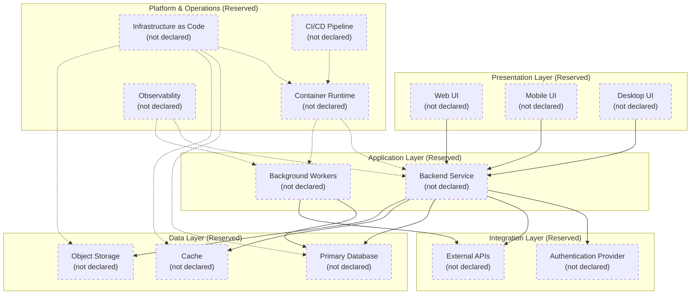
```mermaid
graph TD
    subgraph Presentation["Presentation Layer (Reserved)"]
        WebUI["Web UI<br/>(not declared)"]
        MobileUI["Mobile UI<br/>(not declared)"]
        DesktopUI["Desktop UI<br/>(not declared)"]
    end

    subgraph Application["Application Layer (Reserved)"]
        Backend["Backend Service<br/>(not declared)"]
        Workers["Background Workers<br/>(not declared)"]
    end

    subgraph Integration["Integration Layer (Reserved)"]
        Auth["Authentication Provider<br/>(not declared)"]
        ExternalAPIs["External APIs<br/>(not declared)"]
    end

    subgraph Data["Data Layer (Reserved)"]
        PrimaryDB["Primary Database<br/>(not declared)"]
        Cache["Cache<br/>(not declared)"]
        ObjectStore["Object Storage<br/>(not declared)"]
    end

    subgraph Platform["Platform & Operations (Reserved)"]
        Container["Container Runtime<br/>(not declared)"]
        IaC["Infrastructure as Code<br/>(not declared)"]
        CICD["CI/CD Pipeline<br/>(not declared)"]
        Observability["Observability<br/>(not declared)"]
    end

    WebUI --> Backend
    MobileUI --> Backend
    DesktopUI --> Backend
    Backend --> Auth
    Backend --> ExternalAPIs
    Backend --> PrimaryDB
    Backend --> Cache
    Backend --> ObjectStore
    Workers --> PrimaryDB
    Workers --> ExternalAPIs
    Container -.-> Backend
    Container -.-> Workers
    IaC -.-> Container
    IaC -.-> PrimaryDB
    IaC -.-> Cache
    IaC -.-> ObjectStore
    CICD -.-> Container
    Observability -.-> Backend
    Observability -.-> Workers

    style WebUI stroke-dasharray: 5 5
    style MobileUI stroke-dasharray: 5 5
    style DesktopUI stroke-dasharray: 5 5
    style Backend stroke-dasharray: 5 5
    style Workers stroke-dasharray: 5 5
    style Auth stroke-dasharray: 5 5
    style ExternalAPIs stroke-dasharray: 5 5
    style PrimaryDB stroke-dasharray: 5 5
    style Cache stroke-dasharray: 5 5
    style ObjectStore stroke-dasharray: 5 5
    style Container stroke-dasharray: 5 5
    style IaC stroke-dasharray: 5 5
    style CICD stroke-dasharray: 5 5
    style Observability stroke-dasharray: 5 5
```

Dashed node borders denote reserved placeholders. Edges depict the canonical interaction shape that a populated stack would express, not edges among existing components.

---

## 3.9 CONDITIONAL MAPPING TO TERMINOLOGY INTERPRETATIONS

### 3.9.1 Rationale for Conditional Mapping

As recorded in Section 2.7.1 (Ambiguity of "AAP") and Section 1.4.2 (Ambiguity Acknowledgement), the acronym `AAP` in the README heading is undefined within the repository and carries multiple plausible meanings. Section 2.7.3 (Combined Impact) further observed that "even the *category* of product — automation platform, approval workflow, scaffold repository, or instructional asset — cannot be confirmed from repository evidence."

Because product category drives plausible technology selection, this Technical Specification cannot recommend a stack without first selecting an interpretation. The table below is illustrative only and **does not constitute a technology selection**.

### 3.9.2 Illustrative Mapping Table

| Hypothetical Interpretation of `AAP` | Plausible Implementation Pattern | Technology Stack Plausibility |
|---|---|---|
| Ansible Automation Platform | Configuration management and orchestration over SSH/WinRM; inventory, playbooks, roles, collections, surveys, and job templates. | Python-based runtime; YAML-driven playbook authoring; no relational database required by the consumer; integration via SSH/WinRM and module SDKs. The prompt's default Python/Flask backend would partially align; MongoDB would *not* be a natural fit; Docker and Terraform may be relevant for control-node packaging. |
| Application Approval Process | Web-based request-submission and routing system; reviewer queues; audit trail; notification delivery. | Web frontend + REST/GraphQL backend + transactional database + auth provider + email/SMS integration. The prompt's React/TypeScript + Flask + Auth0 + MongoDB combination would partially align if document-store semantics are desired; PostgreSQL-style relational storage might be preferred for audit fidelity. |
| Other industry meaning | Domain-specific; could imply embedded firmware, scientific computing, advertising platforms, etc. | Stack selection would diverge materially from the prompt's defaults. |

No interpretation above is adopted. The table exists to make explicit that the prompt's "Default Technology Stack" is not uniformly appropriate across the candidate interpretations of `AAP`.

---

## 3.10 RESERVED DEFAULT STACK REFERENCE (NOT ADOPTED)

This subsection reproduces the prompt-supplied "Default Technology Stack" verbatim as a **reference enumeration only**. As established in Section 3.1.4, no item below is asserted as adopted in the present revision. Version numbers are intentionally omitted because no observation of any of these components exists in the repository; asserting a version would constitute fabrication.

### 3.10.1 Reserved Backend & Languages

| Layer | Prompt-Supplied Default | Adopted in This Revision? | Required Evidence for Future Adoption |
|---|---|---|---|
| Primary backend language | Python | No | Addition of one or more `.py` source files and/or a Python dependency manifest. |
| Backend framework | Flask | No | A Flask import statement in a Python source file and/or Flask declared in a manifest. |
| AI framework | Langchain | No | A Langchain import and/or Langchain declared in a manifest. |

### 3.10.2 Reserved Frontend

| Layer | Prompt-Supplied Default | Adopted in This Revision? | Required Evidence for Future Adoption |
|---|---|---|---|
| Web language | TypeScript | No | Addition of `.ts`/`.tsx` files and/or a `tsconfig.json`. |
| Web framework | React | No | A React import in source and/or React declared in a manifest. |
| CSS framework | TailwindCSS | No | Tailwind directives in CSS and/or a Tailwind configuration file. |
| Mobile / cross-platform | React-Native with TypeScript | No | A React-Native project structure and manifest. |

### 3.10.3 Reserved Authentication & Cloud

| Layer | Prompt-Supplied Default | Adopted in This Revision? | Required Evidence for Future Adoption |
|---|---|---|---|
| Cloud platform | AWS | No | AWS SDK imports, IaC modules targeting AWS, or AWS resource references. |
| Authentication provider | Auth0 | No | Auth0 SDK imports, tenant configuration, or rules/actions. |

### 3.10.4 Reserved Database

| Layer | Prompt-Supplied Default | Adopted in This Revision? | Required Evidence for Future Adoption |
|---|---|---|---|
| Primary database | MongoDB | No | A MongoDB driver import, connection-string reference, or schema/migration file. |

### 3.10.5 Reserved Infrastructure & Operations

| Layer | Prompt-Supplied Default | Adopted in This Revision? | Required Evidence for Future Adoption |
|---|---|---|---|
| Containerization | Docker | No | A `Dockerfile` or `docker-compose.yml`. |
| Infrastructure as code | Terraform | No | One or more `*.tf` files. |
| CI/CD | GitHub Actions | No | One or more workflow YAML files under `.github/workflows/`. |

### 3.10.6 Reserved Native / Desktop Applications

| Layer | Prompt-Supplied Default | Adopted in This Revision? | Required Evidence for Future Adoption |
|---|---|---|---|
| iOS | Swift | No | `.swift` source files and/or an Xcode project. |
| Android | Kotlin | No | `.kt` source files and/or an Android Gradle project. |
| macOS | Objective-C | No | `.m` source files and/or an Xcode project. |
| Desktop | ElectronJS | No | Electron declared in a `package.json` and/or Electron main-process source. |

---

## 3.11 SECURITY, INTEGRATION, AND COMPATIBILITY CONSIDERATIONS

### 3.11.1 Security Implications of Technology Choices

As recorded in Section 2.5.4 (Security Implications), "no security implications can be enumerated from repository evidence." Because no technology has been selected, no technology-specific threat model, hardening guideline, supply-chain attestation, or compliance binding can be authored in this revision.

Section 3.4.4 (Security Posture of the Dependency Surface) records the corollary observation that the dependency-supply-chain surface is empty.

### 3.11.2 Integration Requirements Between Components

As recorded in Section 1.2.1, "no integrations, external system touchpoints, APIs, data sources, identity providers, message brokers, or enterprise service references are present in the repository." Section 2.4.2 (Integration Points Status) and Section 2.4.3 (Shared Components and Common Services Status) confirm that no component-to-component contract exists to be specified. With zero components and zero integrations, there are no integration requirements to document in this revision.

### 3.11.3 Compatibility Requirements

Compatibility requirements (runtime version pinning, OS targets, browser support matrices, hardware constraints) presuppose a runtime or platform binding. No such binding is declared in the repository. The compatibility-requirements set is therefore empty.

---

## 3.12 DOCUMENT VERSIONING POSTURE FOR THIS SECTION

### 3.12.1 Living Document Inheritance

Per Section 1.4.3 (Living Document Expectation) and Section 2.8.3 (Document Versioning Posture), this Technical Specification is a Living Document. The Technology Stack section is expected to evolve substantially when implementation artifacts are added.

### 3.12.2 Trigger Events for Section 3 Population

The table below enumerates the repository events that should cause this section to be regenerated with substantive content.

| Trigger Event | Expected Revision Effect on Section 3 |
|---|---|
| Addition of one or more source code files in any language | Section 3.2 (Programming Languages) is populated with the observed languages and inferred platform/component bindings. |
| Addition of a dependency manifest (`package.json`, `requirements.txt`, `pyproject.toml`, `pom.xml`, `go.mod`, `Cargo.toml`, `Gemfile`, etc.) | Section 3.3 (Frameworks & Libraries) and Section 3.4 (Open Source Dependencies) are populated with the declared frameworks, libraries, registries, and version specs. |
| Addition of SDK imports, IaC references, or service-binding configuration to a third-party provider | Section 3.5 (Third-Party Services) is populated with the observed services and their integration surfaces. |
| Addition of database schemas, migrations, or persistence-layer configuration | Section 3.6 (Databases & Storage) is populated with the observed storage tier(s). |
| Addition of `Dockerfile`, `docker-compose.yml`, Helm charts, or Kubernetes manifests | Section 3.7.4 (Containerization) is populated. |
| Addition of CI/CD pipeline files | Section 3.7.5 (CI/CD) is populated. |
| Addition of Terraform / CloudFormation / Pulumi / CDK / Ansible artifacts | Section 3.7.6 (Infrastructure as Code) is populated. |
| Resolution of `AAP` and `project guide` terminology in repository content | Section 3.9 (Conditional Mapping) is replaced by a definitive interpretation-bound stack. |

Until at least one of these events occurs, regenerations of this section will continue to reflect the placeholder state documented here.

---

## 3.13 REFERENCES

### 3.13.1 Files Examined

- `README.md` — The repository's sole file (38 bytes). Contains a single Markdown H1 heading (`# -With-default-AAP-and-project-guide-`) and no other content. Used in this section to confirm the absence of any technology declaration (language, framework, library, service, database, tool, or platform).

### 3.13.2 Folders Explored

- `/` (repository root, depth 0) — Confirmed to contain exactly one file (`README.md`) and zero subdirectories. Used in this section to confirm the absence of source code directories, configuration directories (e.g., `.github/`, `.circleci/`, `infrastructure/`, `terraform/`), and dependency/lock files at every conventional location.

### 3.13.3 Technical Specification Sections Cross-Referenced

- **Section 1.2.1 (Project Context)** — Source for the finding that no integrations, identity providers, or enterprise service references are present.
- **Section 1.2.2 (High-Level Description / Core Technical Approach)** — Primary source for the absence of programming language, framework, runtime, deployment model, and build-descriptor declarations.
- **Section 1.3.1 (In-Scope Elements)** — Source confirming the absence of data domains.
- **Section 1.3.2 (Out-of-Scope Elements)** — Source for the inventory of absent dependency manifests, infrastructure-as-code, CI/CD pipelines, authentication artifacts, and security configurations.
- **Section 1.4.1 (Source of Truth)** — Governs the prohibition on introducing technology assumptions absent from the repository.
- **Section 1.4.2 (Ambiguity Acknowledgement)** — Source for the conditional posture in Section 3.9 (Conditional Mapping to Terminology Interpretations).
- **Section 1.4.3 (Living Document Expectation)** — Source for the versioning posture in Section 3.12.
- **Section 2.1 (Preamble: Applicability of This Section)** — Pattern for the preamble structure used in Section 3.1.
- **Section 2.4.1 (Dependency Map Status)** — Pattern for the empty-state Mermaid visualization used in Section 3.8.1.
- **Section 2.4.2 (Integration Points Status)** — Source for the absence of integration points reaffirmed in Section 3.11.2.
- **Section 2.5.2 (Performance Requirements)** — Source for the absence of caching motivation referenced in Section 3.6.4.
- **Section 2.5.3 (Scalability Considerations)** — Source for the absence of workload model referenced in Section 3.6.4.
- **Section 2.5.4 (Security Implications)** — Source for the security posture referenced in Section 3.4.4 and Section 3.11.1.
- **Section 2.7.1 (Ambiguity of "AAP")** — Pattern for the conditional interpretation table replicated in Section 3.9.
- **Section 2.7.3 (Combined Impact)** — Source for the observation that product category cannot be confirmed.
- **Section 2.8.2 (Constraints)** — Source for the explicit constraint that no external assumptions about technology choice may be introduced.
- **Section 2.8.3 (Document Versioning Posture)** — Pattern for the trigger-event table replicated in Section 3.12.2.

### 3.13.4 Search Operations Performed (Without Supplemental Results)

- Semantic file search for "package.json requirements.txt build manifest dependency file" — 0 results
- Semantic file search for "Dockerfile docker-compose infrastructure terraform yaml configuration" — 0 results
- Semantic file search for "source code application implementation modules" — 0 results
- Semantic folder search for "source code application backend frontend" — 0 results
- Semantic file search for "CI/CD GitHub Actions workflow ci configuration" — 0 results
- Semantic file search for "Python Flask Django Express Node.js JavaScript TypeScript" — 0 results
- Semantic file search for "database MongoDB PostgreSQL Redis storage" — 0 results
- Semantic file search for "AAP Ansible Automation Platform configuration" — 0 results
- Semantic folder search for "tests CI pipeline deployment infrastructure" — 0 results
- Semantic file search for "authentication authorization security secrets" — 0 results
- Semantic file search for "React Vue Angular frontend web UI" — 0 results
- Semantic file search for "mobile iOS Android Swift Kotlin native applications" — 0 results
- Filesystem search for `.blitzyignore` files — 0 results

### 3.13.5 Prompt Inputs Incorporated as Reference Material (Not as Adopted Stack)

- Section prompt's "Default Technology Stack" enumeration — reproduced in Section 3.10 as a reserved reference, with explicit non-adoption markers, per the constraint regime established in Section 3.1.2 and Section 3.1.3.

# 4. Process Flowchart

## 4.1 PREAMBLE: APPLICABILITY OF THIS SECTION

### 4.1.1 Repository State Reaffirmation

This Process Flowchart section is bounded by the same evidentiary discipline established in Sections 1.4.1 (Source of Truth), 2.1.1 (Repository State Reaffirmation), and 3.1.1 (Repository State Reaffirmation). The repository's complete inventory comprises exactly one file (`README.md`, 38 bytes) whose contents are a single Markdown H1 heading (`# -With-default-AAP-and-project-guide-`) and zero subdirectories.

Section 1.2.2 (Primary System Capabilities) recorded the dispositive observation for this section:

> "The repository implements no system capabilities. No features, workflows, services, jobs, user interfaces, APIs, or behavioral functions exist."

Section 2.6.3 (Process Flowchart References) further made the disposition for this section explicit:

> "No process flowcharts are referenced by this section because no features or workflows are implemented. Section 1.2.2 (Repository Structure Visualization) contains the sole diagram applicable to the repository's current state: a structural view of the repository's single-file inventory. That diagram is not a process flowchart; it is a static structural depiction."

A Process Flowchart section ordinarily charts the behavioral flow of a system — its user journeys, system-to-system interactions, decision branches, state transitions, error recovery paths, and integration sequences. **Every input class that would normally produce such charts is absent from the repository:** there is no source code from which control flow could be extracted, no API contract from which an interaction sequence could be derived, no state-machine library or workflow-engine configuration from which state transitions could be inferred, no message-broker or scheduler configuration from which event or batch flows could be sketched, and no validator, middleware, or business-rule artifact from which validation checkpoints could be enumerated. Consequently, every subsection requested by the section prompt resolves to an empty present-state inventory accompanied by a reserved scaffold for future revisions.

### 4.1.2 Governing Constraints From Prior Sections

The following constraints, inherited from earlier sections of this Technical Specification, are dispositive for the population of this section.

| Constraint | Source | Application to This Section |
|---|---|---|
| "Every statement … is grounded in the repository's actual contents… Where the repository is silent on a topic, this document is also silent." | Section 1.4.1 (Source of Truth) | No workflow, decision point, state, transition, or error path may be asserted in the absence of a repository artifact that evidences it. |
| "No external assumptions about technology choice, business intent, organizational sponsorship, or product strategy have been introduced." | Section 1.4.1 (Source of Truth) | No domain-specific process (approval routing, playbook execution, request submission, etc.) may be inferred from the undefined acronym `AAP`. |
| "This Technical Specification deliberately refrains from selecting one interpretation [of `AAP`]." | Section 1.4.2 (Ambiguity Acknowledgement) | Because the product category cannot be confirmed, no domain-specific workflow may be charted. |
| "Don't add any features of your own, or any items that aren't clearly applicable." | Section 2.1.2 (Governing Constraints) | No feature-derived flow may be invented, because the feature catalog (Section 2.2) is empty. |
| "Don't imagine any feature relationships of your own." | Section 2.1.2 (Governing Constraints) | No inter-component interaction may be drawn, because Section 2.4.1 confirms zero feature edges. |
| "No integrations, external system touchpoints, APIs, data sources, identity providers, message brokers, or enterprise service references are present in the repository." | Section 2.4.2 (Integration Points Status) | No integration sequence diagram, event flow, or batch pipeline may be charted. |
| "No performance requirements are documented." | Section 2.5.2 (Performance Requirements) | No SLA or timing constraint may be asserted on any reserved diagram node or edge. |
| "There is no workload, no concurrent user model, no transaction volume, no data growth projection." | Section 2.5.3 (Scalability Considerations) | No throughput or concurrency annotation may be asserted on reserved scaffolds. |
| "All authentication, authorization, secret management, and compliance artifacts" are absent. | Section 2.5.4 (Security Implications), Section 1.3.2 (Excluded Features and Capabilities) | No authorization checkpoint or regulatory compliance check may be charted. |
| "All database schemas, data models, migrations, and persistence concerns" are absent. | Section 1.3.2 (Excluded Features and Capabilities), Section 3.6.1 (Current State) | No persistence node or transaction boundary may be charted. |
| "No caching strategy is recorded." | Section 3.6.4 (Caching Strategy) | No cache layer may be charted in any process flow. |
| "No continuous integration or continuous deployment pipeline is configured." | Section 3.7.5 (CI/CD) | No pipeline workflow may be charted. |

### 4.1.3 Governing Directives From the Section Prompt

The Section 4 prompt requests flowcharts, sequence diagrams, and state diagrams covering end-to-end user journeys, system interactions, decision points, error handling paths, data flows between systems, API interactions, event processing flows, batch processing sequences, business rules at each step, data validation requirements, authorization checkpoints, regulatory compliance checks, state transitions, data persistence points, caching requirements, transaction boundaries, retry mechanisms, fallback processes, error notification flows, and recovery procedures. Each requested artifact is interpreted below in light of the constraint regime in Section 4.1.2.

| Directive | Application to This Repository |
|---|---|
| "Include clear labels and descriptions." | Honored on present-state empty-state diagrams; honored on reserved scaffolds with explicit "(not declared)" annotations on every node. |
| "Add swim lanes for different actors/systems." | Honored on a reserved scaffold using Mermaid subgraphs; no actor or system has been declared in the repository, so all lanes are reserved. |
| "Document all decision points." | Honored by recording that zero decision points exist; reserved scaffolds use Mermaid diamond shapes to depict where decision points would appear. |
| "Include timing constraints where applicable." | No timing constraints are documented in the repository; per Section 2.5.2, none may be invented. Reserved scaffolds carry placeholder annotations only. |
| "Reference related technical requirements." | The Functional Requirements Table (Section 2.3) is empty; no requirement IDs are available to reference. |

### 4.1.4 Applicability Determination Per Subsection

The table below records, for each subsection requested by the Section 4 prompt, whether it can be populated from repository evidence in the current revision.

| Requested Subsection | Populated? | Reason |
|---|---|---|
| System Workflows → Core Business Processes (user journeys, system interactions, decision points, error handling paths) | No | Zero features and zero behavioral functions exist per Section 1.2.2 and Section 2.2. |
| System Workflows → Integration Workflows (data flow, API interactions, event processing, batch processing) | No | Zero integrations, APIs, or schedulers exist per Section 2.4.2 and Section 3.5.1. |
| Flowchart Requirements (start/end, process steps, decision diamonds, system boundaries, user touchpoints, error states, timing/SLA) | No | No process exists to chart; no SLAs are documented per Section 2.5.2. |
| Validation Rules (business rules, data validation, authorization checkpoints, regulatory compliance) | No | No business rules, no data, no auth artifacts, no compliance artifacts per Sections 2.5.4 and 3.5.1. |
| Technical Implementation → State Management (transitions, persistence points, caching, transaction boundaries) | No | No persistence per Section 3.6.1; no caching per Section 3.6.4. |
| Technical Implementation → Error Handling (retry, fallback, notification, recovery) | No | No code exists to handle errors. |
| Required Diagrams (high-level workflow, detailed process flows, error handling flowcharts, integration sequence diagrams, state transition diagrams) | Empty-state + Reserved Scaffolds only | Following the convention established in Sections 2.4.1 and 3.8 for empty-state and reserved diagrams. |

The remainder of this section preserves the prompt's requested structure as scaffolding, explicitly records the empty state of each scaffolded element, and establishes the schema and trigger events under which future revisions will populate the structure as artifacts are added to the repository.

---

## 4.2 SYSTEM WORKFLOWS

### 4.2.1 Core Business Processes

#### 4.2.1.1 End-to-End User Journeys

No end-to-end user journey is implemented or documented in the repository. As recorded in Section 1.2.2 (Primary System Capabilities), no user interfaces, APIs, or behavioral functions exist; and as recorded in Section 1.3.1 (Implementation Boundaries), the table row for "User groups covered" is "None defined." A user journey requires (a) at least one identifiable user or actor, (b) at least one entry point into the system, (c) at least one transformation or interaction step, and (d) at least one outcome that delivers user value. None of these four prerequisites is satisfied by repository evidence.

#### 4.2.1.2 System Interactions

No system-to-system interactions are present. As recorded in Section 2.4.3 (Shared Components and Common Services Status), the component inventory contains exactly one row (`README.md`), and that artifact "is not a shared component or a common service in any architectural sense. It is a passive documentation file." A passive documentation file cannot interact with another system because it neither emits nor consumes signals at runtime.

#### 4.2.1.3 Decision Points

No decision points exist. A decision point is a runtime predicate that selects one of multiple control-flow branches. With zero runtime code, zero configuration that gates behavior, and zero declarative workflow definitions, there is no predicate to evaluate and no branch to select. The Section 2.1.2 directive "Don't add any features of your own, or any items that aren't clearly applicable" forbids fabricating decision diamonds for nonexistent logic.

#### 4.2.1.4 Error Handling Paths

No error handling paths exist. Error handling presupposes the existence of operations whose failure modes can be classified, intercepted, and recovered from. The repository contains no operation that can fail, succeed, or be retried — because it contains no operation at all. The static text of `README.md` neither raises nor catches errors; it is rendered or read as inert content.

### 4.2.2 Integration Workflows

#### 4.2.2.1 Data Flow Between Systems

No data flow between systems is present. Per Section 2.4.2 (Integration Points Status), no external system touchpoints exist; per Section 3.5.1 (Third-Party Services Current State), the third-party service inventory is empty; and per Section 3.6.3 (Data Persistence Strategy), "no data persistence strategy is recorded." Data flow requires both a producer and a consumer; the repository contains neither.

#### 4.2.2.2 API Interactions

No API interactions are implemented. The categories of API artifacts confirmed absent in Section 1.3.2 (Excluded Features and Capabilities) and Section 3.5.2 (Categories Surveyed and Confirmed Absent) include REST/GraphQL/gRPC client configurations and SDK imports. With no client, no server, no contract (OpenAPI, GraphQL schema, Protobuf), and no endpoint configuration, no request/response sequence can be charted.

#### 4.2.2.3 Event Processing Flows

No event processing flows exist. Per Section 3.6.2 (Storage Categories Surveyed and Confirmed Absent), no message queue or broker (Kafka, RabbitMQ, SQS, SNS, EventBridge, Pub/Sub) is present. Event processing requires (a) a publisher capable of emitting events, (b) a transport capable of routing them, and (c) a subscriber capable of consuming them; none of these exists in the repository.

#### 4.2.2.4 Batch Processing Sequences

No batch processing sequences exist. The repository contains no scheduler configuration (cron, Airflow DAGs, Step Functions, Azure Data Factory, AWS Glue), no batch job definition (Kubernetes Jobs, ECS Tasks, Spark jobs), and no orchestration descriptor that could trigger or sequence batch execution. The CI/CD section (Section 3.7.5) further confirms that no `.github/workflows/`, `.gitlab-ci.yml`, `Jenkinsfile`, or equivalent pipeline definition exists; these absences foreclose pipeline-driven batch sequences as well.

---

## 4.3 FLOWCHART REQUIREMENTS

### 4.3.1 Required Components

The section prompt enumerates required flowchart components: start and end points, process steps, decision diamonds, system boundaries, user touchpoints, error states and recovery paths, and timing/SLA considerations. The current-state population of each requirement is recorded below.

| Required Component | Present in Repository? | Source |
|---|---|---|
| Start and end points | No | No workflow exists; no entry or exit anchor can be identified. |
| Process steps | No | No code, no configuration, and no declarative workflow defines any step. |
| Decision diamonds | No | See Section 4.2.1.3. |
| System boundaries | No | Per Section 1.3.1, the system boundary is "limited to a single Markdown documentation artifact (`README.md`)." There is only one artifact and no inter-system boundary. |
| User touchpoints | No | Per Section 1.3.1, user groups covered is "None defined." |
| Error states | No | See Section 4.2.1.4. |
| Recovery paths | No | Recovery paths presuppose error states; the latter are absent. |
| Timing constraints / SLA | No | Per Section 2.5.2, "no performance requirements are documented." |

### 4.3.2 Validation Rules

Validation rules — business rules at each step, data validation requirements, authorization checkpoints, and regulatory compliance checks — are individually addressed below.

#### 4.3.2.1 Business Rules at Each Step

No business rules are declared in the repository. As recorded in Section 1.1.3 (Core Business Problem), "the repository does not articulate a business problem, product requirement, or user need," and as recorded in Section 2.3 (Functional Requirements Table), the requirements table is empty. With no requirements and no implementation, no business rule can be associated with any step.

#### 4.3.2.2 Data Validation Requirements

No data validation requirements are declared. Per Section 1.3.1 (Implementation Boundaries), data domains included is "None — the repository contains no data, schemas, or models." A validation rule requires a data shape to validate against and a validator (schema definition, validator library, contract) to perform the validation. Both are absent.

#### 4.3.2.3 Authorization Checkpoints

No authorization checkpoints exist. Per Section 2.5.4 (Security Implications) and Section 1.3.2 (Excluded Features and Capabilities), "all authentication, authorization, secret management, and compliance artifacts" are absent. Per Section 3.5.2 (Categories Surveyed and Confirmed Absent), no identity provider integration (Auth0, Okta, Azure AD, AWS Cognito, Keycloak, Firebase Auth, or OAuth/OIDC client) is configured.

#### 4.3.2.4 Regulatory Compliance Checks

No regulatory compliance checks are declared. The repository contains no policy file, no compliance-control mapping, no audit trail emission, and no regulated-data classification. As recorded in Section 1.1.4 (Key Stakeholders and Users), no sponsoring organization or regulatory authority is identified anywhere in the repository, and the Source-of-Truth principle in Section 1.4.1 forbids assuming one.

### 4.3.3 Timing and SLA Considerations

No timing or SLA considerations are documented. Per Section 2.5.2 (Performance Requirements), "no performance requirements are documented … the single Markdown rendering 'capability' implied by the README file has no declared performance target." Per Section 1.2.3 (Key Performance Indicators), "no KPIs, service-level objectives, service-level indicators, or quality metrics are documented in the repository." Any timing annotation introduced on a reserved scaffold in Section 4.5 is illustrative only and explicitly marked as not declared.

---

## 4.4 TECHNICAL IMPLEMENTATION

### 4.4.1 State Management

#### 4.4.1.1 State Transitions

No state transitions exist. A state transition is a labeled edge between two states of a stateful object, triggered by an event. With zero stateful objects (no domain model, no entity definition, no machine library configuration) and zero events (no event source, no event handler), there is no transition to chart.

#### 4.4.1.2 Data Persistence Points

No data persistence points exist. Section 3.6.1 (Current State) confirms the database-and-storage inventory is empty; Section 3.6.3 (Data Persistence Strategy) confirms that "no data persistence strategy is recorded." There is therefore no place in any flow where data is durably written.

#### 4.4.1.3 Caching Requirements

No caching requirements are declared. Section 3.6.4 (Caching Strategy) records explicitly that "no caching strategy is recorded" because "caching presupposes a request/response path or a computed-value pipeline whose latency or throughput characteristics motivate a cache," and Section 2.5.2 confirms no such characteristics are documented.

#### 4.4.1.4 Transaction Boundaries

No transaction boundaries exist. A transaction boundary delineates a unit of work whose effects must be atomic, consistent, isolated, and durable; this requires a transactional resource (relational database, transactional message broker, transactional cache, or distributed transaction coordinator). Per Section 3.6.2, no such resource is present.

### 4.4.2 Error Handling

#### 4.4.2.1 Retry Mechanisms

No retry mechanisms are implemented. The repository contains no retry library configuration (e.g., `tenacity`, `retry`, Polly, resilience4j), no exponential-backoff helper, and no idempotency-key tracking. Retry semantics presuppose an operation that can be retried; per Section 4.2.1.4, no such operation exists.

#### 4.4.2.2 Fallback Processes

No fallback processes are implemented. Fallback semantics presuppose a primary path that can degrade and a secondary path that can substitute for it. Neither path exists in the repository.

#### 4.4.2.3 Error Notification Flows

No error notification flows are implemented. Per Section 3.5.2 (Categories Surveyed and Confirmed Absent), no monitoring/observability integration (Datadog, New Relic, Sentry, Prometheus, Grafana, OpenTelemetry exporters), no logging integration (Splunk, Elastic Stack, CloudWatch, Loggly, Papertrail), and no communications integration (Twilio, SendGrid, Mailgun, Slack/Microsoft Teams webhooks) is configured. There is therefore no channel by which an error could be reported and no consumer who could receive a report.

#### 4.4.2.4 Recovery Procedures

No recovery procedures are documented. As recorded in Section 2.5.5 (Maintenance Requirements), "there is no software to maintain, no dependencies to patch, no infrastructure to operate, no telemetry to monitor, and no runbook to execute." Recovery procedures cannot be defined for a system that does not exist.

---

## 4.5 REQUIRED DIAGRAMS

The diagrams below honor the prompt's "REQUIRED DIAGRAMS" directive by providing one empty-state diagram (4.5.1) that depicts the present truth of the repository, followed by reserved canonical-shape scaffolds (4.5.2 through 4.5.6) that show the visual form future revisions will replace with substantive content. All reserved scaffolds use the dashed-border convention introduced in Section 3.8.2 to mark every node as "not declared." No node, edge, label, or annotation in any reserved scaffold is asserted as adopted; the scaffolds exist exclusively to make the canonical structure of each diagram type visible.

### 4.5.1 High-Level System Workflow (Empty-State)

The diagram below depicts the entirety of the system workflow as of this document revision. It mirrors the empty-state visualization convention introduced in Section 2.4.1 (Dependency Map Status) and replicated in Section 3.8.1 (Present-State Diagram).

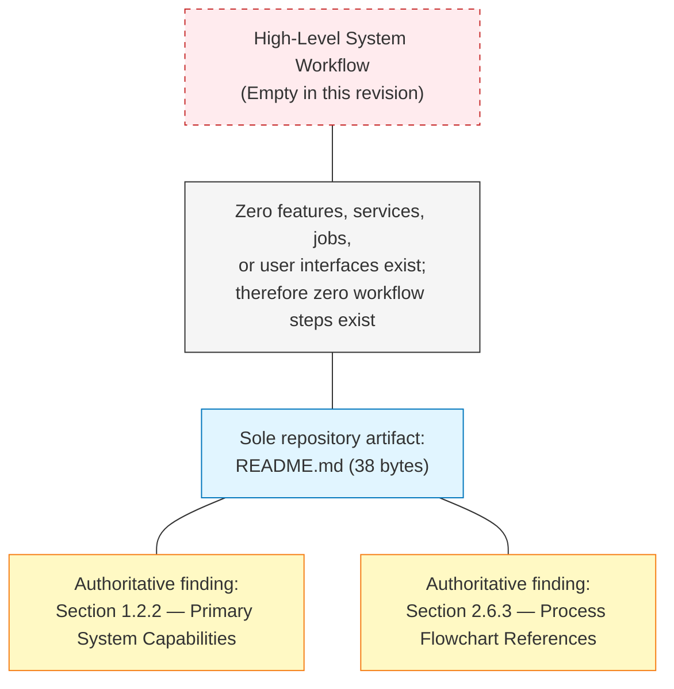
```mermaid
graph TD
    Note["High-Level System Workflow<br/>(Empty in this revision)"]
    Reason["Zero features, services, jobs,<br/>or user interfaces exist;<br/>therefore zero workflow steps exist"]
    Evidence["Sole repository artifact:<br/>README.md (38 bytes)"]
    Source1["Authoritative finding:<br/>Section 1.2.2 — Primary System Capabilities"]
    Source2["Authoritative finding:<br/>Section 2.6.3 — Process Flowchart References"]

    Note --- Reason
    Reason --- Evidence
    Evidence --- Source1
    Evidence --- Source2

    style Note fill:#ffebee,stroke:#c62828,stroke-width:1px,stroke-dasharray: 5 5
    style Reason fill:#f5f5f5,stroke:#333,stroke-width:1px
    style Evidence fill:#e1f5ff,stroke:#0277bd,stroke-width:1px
    style Source1 fill:#fff9c4,stroke:#f57f17,stroke-width:1px
    style Source2 fill:#fff9c4,stroke:#f57f17,stroke-width:1px
```

### 4.5.2 Reserved Detailed Process Flow Scaffold

The diagram below is reserved as the canonical shape of a detailed core-feature process flow. The placeholder nodes will be replaced by concrete feature steps when implementation artifacts are added. No node, edge, label, or branch is asserted as adopted in the present revision. The shape illustrates the standard flowchart components requested by the section prompt: start anchor, input validation, sequential process step, decision diamond, branch outcomes, persistence point, error path, and end anchor.

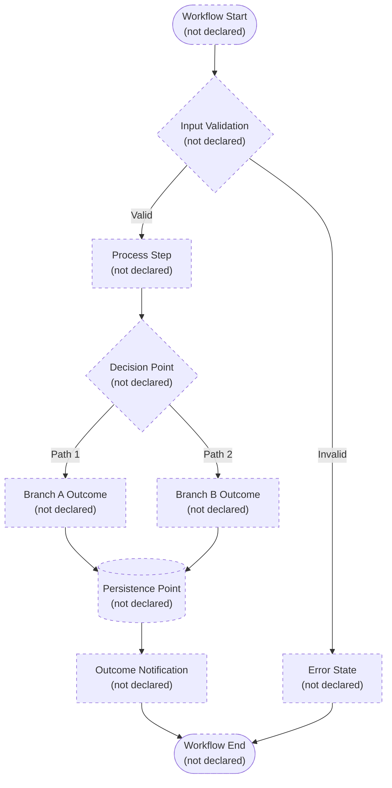
```mermaid
flowchart TD
    StartNode(["Workflow Start<br/>(not declared)"])
    ValidateInput{"Input Validation<br/>(not declared)"}
    ProcessStep["Process Step<br/>(not declared)"]
    DecisionNode{"Decision Point<br/>(not declared)"}
    BranchA["Branch A Outcome<br/>(not declared)"]
    BranchB["Branch B Outcome<br/>(not declared)"]
    ErrorState["Error State<br/>(not declared)"]
    PersistData[("Persistence Point<br/>(not declared)")]
    NotifyOutcome["Outcome Notification<br/>(not declared)"]
    EndNode(["Workflow End<br/>(not declared)"])

    StartNode --> ValidateInput
    ValidateInput -->|Valid| ProcessStep
    ValidateInput -->|Invalid| ErrorState
    ProcessStep --> DecisionNode
    DecisionNode -->|Path 1| BranchA
    DecisionNode -->|Path 2| BranchB
    BranchA --> PersistData
    BranchB --> PersistData
    PersistData --> NotifyOutcome
    NotifyOutcome --> EndNode
    ErrorState --> EndNode

    style StartNode stroke-dasharray: 5 5
    style ValidateInput stroke-dasharray: 5 5
    style ProcessStep stroke-dasharray: 5 5
    style DecisionNode stroke-dasharray: 5 5
    style BranchA stroke-dasharray: 5 5
    style BranchB stroke-dasharray: 5 5
    style ErrorState stroke-dasharray: 5 5
    style PersistData stroke-dasharray: 5 5
    style NotifyOutcome stroke-dasharray: 5 5
    style EndNode stroke-dasharray: 5 5
```

Dashed node borders denote reserved placeholders. The diamond shapes denote where decision points would appear; the cylinder shape denotes where persistence would occur. No node corresponds to an actually existing step.

### 4.5.3 Reserved Error Handling Flowchart Scaffold

The diagram below is reserved as the canonical shape of an error handling flow. It illustrates the components requested by the section prompt's "Error Handling" subsection: operation attempt, outcome classifier, retry-with-backoff loop, fallback path, error notification, and dead-letter sink. No retry policy, no fallback strategy, no notification channel, and no dead-letter sink is asserted as adopted.

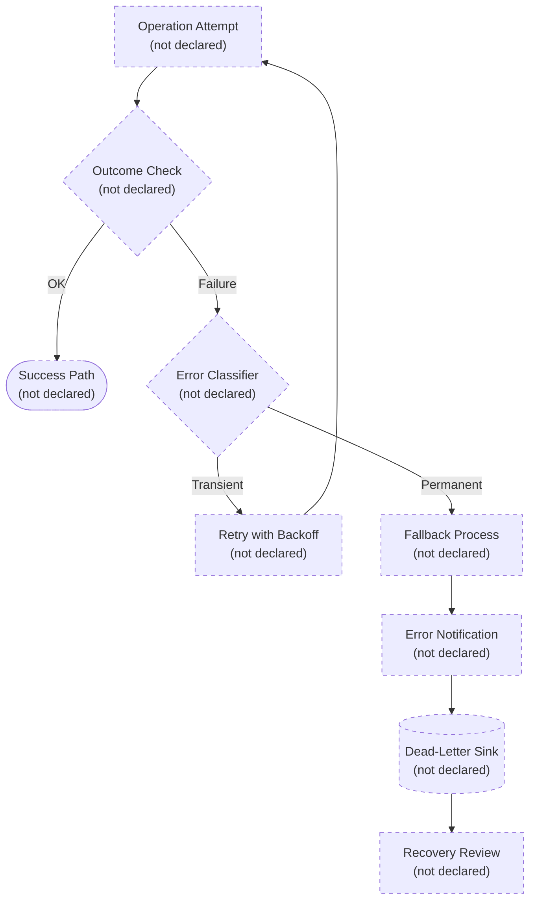
```mermaid
flowchart TD
    OperationAttempt["Operation Attempt<br/>(not declared)"]
    OutcomeCheck{"Outcome Check<br/>(not declared)"}
    SuccessPath(["Success Path<br/>(not declared)"])
    ErrorClassifier{"Error Classifier<br/>(not declared)"}
    TransientRetry["Retry with Backoff<br/>(not declared)"]
    PermanentFallback["Fallback Process<br/>(not declared)"]
    ErrorNotify["Error Notification<br/>(not declared)"]
    DeadLetter[("Dead-Letter Sink<br/>(not declared)")]
    RecoveryReview["Recovery Review<br/>(not declared)"]

    OperationAttempt --> OutcomeCheck
    OutcomeCheck -->|OK| SuccessPath
    OutcomeCheck -->|Failure| ErrorClassifier
    ErrorClassifier -->|Transient| TransientRetry
    ErrorClassifier -->|Permanent| PermanentFallback
    TransientRetry --> OperationAttempt
    PermanentFallback --> ErrorNotify
    ErrorNotify --> DeadLetter
    DeadLetter --> RecoveryReview

    style OperationAttempt stroke-dasharray: 5 5
    style OutcomeCheck stroke-dasharray: 5 5
    style SuccessPath stroke-dasharray: 5 5
    style ErrorClassifier stroke-dasharray: 5 5
    style TransientRetry stroke-dasharray: 5 5
    style PermanentFallback stroke-dasharray: 5 5
    style ErrorNotify stroke-dasharray: 5 5
    style DeadLetter stroke-dasharray: 5 5
    style RecoveryReview stroke-dasharray: 5 5
```

### 4.5.4 Reserved Integration Sequence Diagram Scaffold

The diagram below is reserved as the canonical shape of an integration sequence. It illustrates the components requested by the section prompt's "Integration Workflows" subsection: user agent, frontend, backend service, authentication provider, data store, and external API, exchanging request/response and authorization messages in a typical interaction. No participant is asserted as adopted; each is annotated "(not declared)" in conformance with Section 2.4.2 (Integration Points Status), which records that "no integrations, external system touchpoints, APIs, data sources, identity providers, message brokers, or enterprise service references are present in the repository."

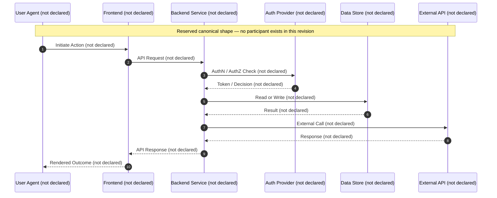
```mermaid
sequenceDiagram
    autonumber
    participant User as User Agent (not declared)
    participant Frontend as Frontend (not declared)
    participant Backend as Backend Service (not declared)
    participant Auth as Auth Provider (not declared)
    participant Store as Data Store (not declared)
    participant External as External API (not declared)

    Note over User,External: Reserved canonical shape — no participant exists in this revision
    User->>Frontend: Initiate Action (not declared)
    Frontend->>Backend: API Request (not declared)
    Backend->>Auth: AuthN / AuthZ Check (not declared)
    Auth-->>Backend: Token / Decision (not declared)
    Backend->>Store: Read or Write (not declared)
    Store-->>Backend: Result (not declared)
    Backend->>External: External Call (not declared)
    External-->>Backend: Response (not declared)
    Backend-->>Frontend: API Response (not declared)
    Frontend-->>User: Rendered Outcome (not declared)
```

### 4.5.5 Reserved State Transition Diagram Scaffold

The diagram below is reserved as the canonical shape of a state transition diagram. It illustrates the components requested by the section prompt's "State Management" subsection: initial state, in-progress state, terminal states (completed and failed), and the events that drive transitions between them. No state, event, transition, or guard condition is asserted as adopted.

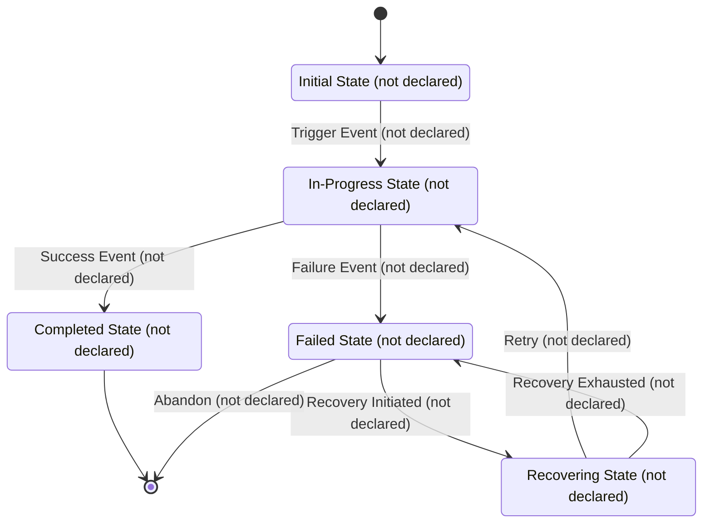
```mermaid
stateDiagram-v2
    [*] --> Initial
    Initial: Initial State (not declared)
    InProgress: In-Progress State (not declared)
    Completed: Completed State (not declared)
    Failed: Failed State (not declared)
    Recovering: Recovering State (not declared)

    Initial --> InProgress: Trigger Event (not declared)
    InProgress --> Completed: Success Event (not declared)
    InProgress --> Failed: Failure Event (not declared)
    Failed --> Recovering: Recovery Initiated (not declared)
    Recovering --> InProgress: Retry (not declared)
    Recovering --> Failed: Recovery Exhausted (not declared)
    Completed --> [*]
    Failed --> [*]: Abandon (not declared)
```

### 4.5.6 Reserved Swim-Lane Workflow Scaffold

The diagram below is reserved as the canonical shape of a swim-lane workflow chart, satisfying the section-prompt directive to "add swim lanes for different actors/systems." Each lane is a Mermaid subgraph annotated "(Reserved)" because no actor or system has been declared in the repository. The horizontal handoffs between lanes illustrate the typical request/response progression across a layered architecture.

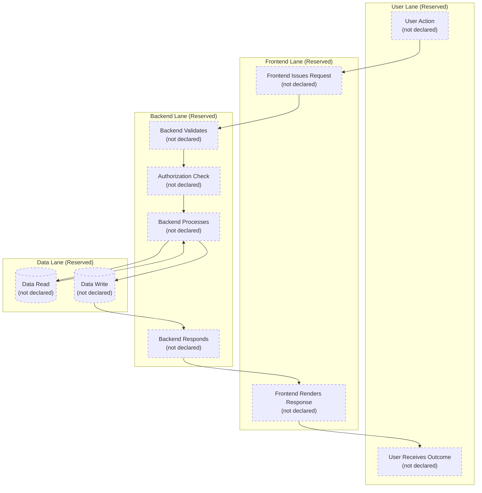
```mermaid
flowchart TD
    subgraph UserLane["User Lane (Reserved)"]
        UserAction["User Action<br/>(not declared)"]
        UserReceive["User Receives Outcome<br/>(not declared)"]
    end

    subgraph FrontendLane["Frontend Lane (Reserved)"]
        FrontendIssue["Frontend Issues Request<br/>(not declared)"]
        FrontendRender["Frontend Renders Response<br/>(not declared)"]
    end

    subgraph BackendLane["Backend Lane (Reserved)"]
        BackendValidate["Backend Validates<br/>(not declared)"]
        BackendAuthz["Authorization Check<br/>(not declared)"]
        BackendProcess["Backend Processes<br/>(not declared)"]
        BackendRespond["Backend Responds<br/>(not declared)"]
    end

    subgraph DataLane["Data Lane (Reserved)"]
        DataRead[("Data Read<br/>(not declared)")]
        DataWrite[("Data Write<br/>(not declared)")]
    end

    UserAction --> FrontendIssue
    FrontendIssue --> BackendValidate
    BackendValidate --> BackendAuthz
    BackendAuthz --> BackendProcess
    BackendProcess --> DataRead
    DataRead --> BackendProcess
    BackendProcess --> DataWrite
    DataWrite --> BackendRespond
    BackendRespond --> FrontendRender
    FrontendRender --> UserReceive

    style UserAction stroke-dasharray: 5 5
    style UserReceive stroke-dasharray: 5 5
    style FrontendIssue stroke-dasharray: 5 5
    style FrontendRender stroke-dasharray: 5 5
    style BackendValidate stroke-dasharray: 5 5
    style BackendAuthz stroke-dasharray: 5 5
    style BackendProcess stroke-dasharray: 5 5
    style BackendRespond stroke-dasharray: 5 5
    style DataRead stroke-dasharray: 5 5
    style DataWrite stroke-dasharray: 5 5
```

Dashed node borders denote reserved placeholders. Lanes are labeled "(Reserved)" to confirm that no actor or system has been declared in the repository.

---

## 4.6 CONDITIONAL MAPPING TO TERMINOLOGY INTERPRETATIONS

### 4.6.1 Rationale for Conditional Mapping

As recorded in Section 2.7.1 (Ambiguity of "AAP") and Section 1.4.2 (Ambiguity Acknowledgement), the acronym `AAP` in the README heading is undefined within the repository and carries multiple plausible meanings. Section 2.7.3 (Combined Impact) further observed that "even the *category* of product — automation platform, approval workflow, scaffold repository, or instructional asset — cannot be confirmed from repository evidence." Section 3.9 (Conditional Mapping to Terminology Interpretations) established the convention of illustrating, but not adopting, the workflow archetypes that each plausible interpretation would imply.

Because product category drives the shape of every meaningful process flow, this section cannot chart a workflow without first selecting an interpretation. The table below is **illustrative only** and **does not constitute the adoption of any process flow**.

### 4.6.2 Illustrative Mapping Table

| Hypothetical Interpretation of `AAP` | Plausible Process Flow Archetypes | Plausible Diagram Types |
|---|---|---|
| Ansible Automation Platform | Inventory synchronization; credential vault retrieval; playbook execution against managed nodes; job-template run lifecycle; survey input collection; workflow-template orchestration. | Sequence diagrams for control-node↔managed-node interactions; state diagrams for job lifecycle (pending → running → successful / failed / canceled); flowcharts for approval-gated workflow templates. |
| Application Approval Process | Request submission; routing to reviewer queue; approval / rejection / requested-changes decision; reviewer-assignment escalation; audit-trail emission; notification fan-out to requester and stakeholders. | Swim-lane diagrams across Requester, Reviewer, and System lanes; state diagrams for request lifecycle (draft → submitted → under-review → approved / rejected / withdrawn); flowcharts for SLA-driven escalation. |
| Project scaffold / template guide | Repository cloning; parameter prompt; file generation from templates; post-generation hook execution; initial commit creation. | Linear flowcharts for one-shot generation; sequence diagrams for CLI↔file-system↔Git interactions. |
| Instructional document / project guide | Reader navigation through document sections; table-of-contents traversal; cross-reference resolution. | Navigation graphs rather than process flows; no behavioral runtime flow is implied. |
| Other industry meaning | Domain-specific; could imply embedded firmware, scientific computing, advertising platforms, or other unrelated process categories. | Diagram set would diverge materially from the archetypes listed above. |

No interpretation above is adopted. The table exists to make explicit that the prompt's "Required Diagrams" list cannot be populated with substantive workflows in this revision because the workflow set is interpretation-dependent and no interpretation has been resolved by the repository.

---

## 4.7 RESERVED SCHEMAS FOR FUTURE REVISIONS

The tables below mirror the reserved-schema convention introduced in Sections 3.2.3, 3.3.3, 3.4.3, 3.5.3, 3.6.5, and 3.7.7. Each is empty in this revision and will be populated when corresponding artifacts appear in the repository.

### 4.7.1 Reserved Schema for Core Business Processes

| Process ID | Process Name | Entry Point | Exit Point(s) | Actors | Triggering Event | Steps | Decision Points | Error Paths | Implementing Artifact |
|---|---|---|---|---|---|---|---|---|---|
| *(none)* | *(none)* | *(none)* | *(none)* | *(none)* | *(none)* | *(none)* | *(none)* | *(none)* | *(none)* |

### 4.7.2 Reserved Schema for Integration Workflows

| Integration ID | Source System | Target System | Protocol | Direction | Trigger Mode | Payload Schema | Authentication | Idempotency Key | Implementing Artifact |
|---|---|---|---|---|---|---|---|---|---|
| *(none)* | *(none)* | *(none)* | *(none)* | *(none)* | *(none)* | *(none)* | *(none)* | *(none)* | *(none)* |

### 4.7.3 Reserved Schema for Validation Rules

| Rule ID | Process Step Reference | Rule Type | Predicate | On Failure Action | Compliance Reference | Implementing Artifact |
|---|---|---|---|---|---|---|
| *(none)* | *(none)* | *(none)* | *(none)* | *(none)* | *(none)* | *(none)* |

### 4.7.4 Reserved Schema for State Management

| State Machine ID | Owning Entity | States | Initial State | Terminal States | Transition Events | Persistence Medium | Transaction Boundary | Implementing Artifact |
|---|---|---|---|---|---|---|---|---|
| *(none)* | *(none)* | *(none)* | *(none)* | *(none)* | *(none)* | *(none)* | *(none)* | *(none)* |

### 4.7.5 Reserved Schema for Error Handling

| Error Class | Detection Point | Classification | Retry Policy | Fallback Procedure | Notification Channel | Recovery Procedure | SLA / Timing | Implementing Artifact |
|---|---|---|---|---|---|---|---|---|
| *(none)* | *(none)* | *(none)* | *(none)* | *(none)* | *(none)* | *(none)* | *(none)* | *(none)* |

### 4.7.6 Reserved Schema for Timing and SLA Considerations

| Workflow Reference | Step Reference | Latency Target | Throughput Target | Concurrency Limit | Timeout | Compensating Action on Breach | Authoritative Source |
|---|---|---|---|---|---|---|---|
| *(none)* | *(none)* | *(none)* | *(none)* | *(none)* | *(none)* | *(none)* | *(none)* |

---

## 4.8 DOCUMENT VERSIONING POSTURE FOR THIS SECTION

### 4.8.1 Living Document Inheritance

Per Section 1.4.3 (Living Document Expectation), Section 2.8.3 (Document Versioning Posture), and Section 3.12.1 (Living Document Inheritance), this Technical Specification is a Living Document. The Process Flowchart section is expected to evolve substantially when artifacts that define behavioral flows are added to the repository. Until such artifacts appear, regenerations of this section will continue to reflect the placeholder state documented here.

### 4.8.2 Trigger Events for Section 4 Population

The table below enumerates the repository events that should cause this section to be regenerated with substantive content. It is analogous to Section 2.8.3 and Section 3.12.2 but expressed in terms of workflow-relevant artifacts.

| Trigger Event | Expected Revision Effect on Section 4 |
|---|---|
| Addition of source code files implementing user-facing behavior (handlers, controllers, services, jobs, UI components) | Section 4.2.1 (Core Business Processes) is populated with end-to-end user-journey flowcharts derived from the implemented capability surface; Section 4.5.2 (Reserved Detailed Process Flow Scaffold) is replaced with feature-specific flowcharts. |
| Addition of API contracts (OpenAPI, GraphQL schema, Protobuf, AsyncAPI) | Section 4.2.2.2 (API Interactions) is populated; Section 4.5.4 (Reserved Integration Sequence Diagram Scaffold) is replaced with contract-derived sequence diagrams. |
| Addition of message-broker or event-streaming configuration (Kafka, RabbitMQ, SQS, SNS, EventBridge, Pub/Sub) | Section 4.2.2.3 (Event Processing Flows) is populated with event source / transport / consumer flows. |
| Addition of background-job or scheduler configuration (cron descriptors, Airflow DAGs, Step Functions, ECS Scheduled Tasks, Kubernetes CronJobs) | Section 4.2.2.4 (Batch Processing Sequences) is populated with batch-job sequence diagrams. |
| Addition of authentication or authorization code or configuration | Section 4.3.2.3 (Authorization Checkpoints) is populated; authorization nodes appear on swim-lane and sequence diagrams. |
| Addition of validation libraries or schema definitions (JSON Schema, Joi, Pydantic, Zod, Yup, Cerberus, class-validator) | Section 4.3.2.2 (Data Validation Requirements) is populated with rule inventories tied to specific flow steps. |
| Addition of state-machine libraries or workflow-engine configuration (XState, Temporal, Cadence, Camunda, Step Functions, AWS State Machines, Airflow) | Section 4.4.1.1 (State Transitions) and Section 4.5.5 (Reserved State Transition Diagram Scaffold) are replaced with declared state machines. |
| Addition of database schemas, migrations, or persistence-layer configuration | Section 4.4.1.2 (Data Persistence Points) and Section 4.4.1.4 (Transaction Boundaries) are populated. |
| Addition of caching-layer configuration | Section 4.4.1.3 (Caching Requirements) is populated. |
| Addition of error-handling middleware, retry libraries, circuit breakers, or resilience configuration | Section 4.4.2 (Error Handling) and Section 4.5.3 (Reserved Error Handling Flowchart Scaffold) are replaced with declared error pipelines. |
| Addition of observability, monitoring, or alerting configuration | Section 4.4.2.3 (Error Notification Flows) is populated with channel and consumer details. |
| Addition of CI/CD pipeline files (`.github/workflows/`, `.gitlab-ci.yml`, `Jenkinsfile`, etc.) | A new subsection on CI/CD process flow is added, charting build / test / deploy stages and approval gates. |
| Addition of compliance policy artifacts (security baselines, regulated-data classifications, audit-control mappings) | Section 4.3.2.4 (Regulatory Compliance Checks) is populated with policy-gated decision diamonds in the relevant flows. |
| Addition of performance budgets, SLOs, SLAs, or quality-of-service annotations | Section 4.3.3 (Timing and SLA Considerations) and Section 4.7.6 (Reserved Schema for Timing and SLA Considerations) are populated. |
| Resolution of `AAP` and `project guide` terminology through repository content | Section 4.6 (Conditional Mapping to Terminology Interpretations) is replaced by definitive, interpretation-bound workflow documentation. |

Until at least one of these events occurs, regenerations of this section will continue to reflect the placeholder state documented here.

---

## 4.9 REFERENCES

### 4.9.1 Files Examined

- `README.md` — The repository's sole file (38 bytes). Examined in full to confirm that no workflow definition, no flowchart description, no state-machine declaration, no integration contract, and no error-handling artifact is written in the only place they could plausibly be expressed. The file contains a single Markdown H1 heading (`# -With-default-AAP-and-project-guide-`) and nothing else.

### 4.9.2 Folders Explored

- `/` (repository root, depth 0) — Confirmed to contain exactly one first-order child (`README.md`) and zero subdirectories. The depth of 0 is the maximum meaningful depth because no subdirectories exist. Used in this section to confirm the comprehensive absence of source code, API contracts, message-broker configuration, scheduler descriptors, state-machine libraries, validation libraries, persistence configuration, caching configuration, CI/CD pipeline definitions, infrastructure-as-code, and compliance policy artifacts.

### 4.9.3 Technical Specification Sections Cross-Referenced

- **Section 1.1 (Executive Summary)** — Provided the authoritative repository inventory (Section 1.1.2), confirming one file, zero subdirectories, and zero source / build / config artifacts.
- **Section 1.2 (System Overview)** — Section 1.2.1 (Project Context, Terminology Ambiguity, Integration with Existing Enterprise Landscape) established that no integration touchpoints exist and that `AAP` is undefined; Section 1.2.2 (Primary System Capabilities) provided the dispositive statement that no features, workflows, services, jobs, user interfaces, APIs, or behavioral functions exist; Section 1.2.3 (Key Performance Indicators) confirmed no KPIs or SLOs are documented.
- **Section 1.3 (Scope)** — Section 1.3.1 (In-Scope Elements) recorded that user groups covered is "None defined" and data domains included is "None"; Section 1.3.2 (Excluded Features and Capabilities) catalogued the comprehensive absence of application logic, configuration, infrastructure, data, quality assurance, operations, dependencies, and security artifacts.
- **Section 1.4 (Document Caveats and Interpretive Guidance)** — Section 1.4.1 (Source of Truth) governed the prohibition on inventing workflows, decision points, error handlers, or SLAs; Section 1.4.2 (Ambiguity Acknowledgement) governed the conditional-mapping posture in Section 4.6; Section 1.4.3 (Living Document Expectation) governed the versioning posture in Section 4.8.
- **Section 2.1 (Preamble: Applicability of This Section)** — Provided the preamble template structure replicated in Section 4.1.
- **Section 2.2 (Feature Catalog)** — Confirmed that the feature catalog is empty, foreclosing the derivation of workflows from features.
- **Section 2.3 (Functional Requirements Table)** — Confirmed that the requirements table is empty, foreclosing the cross-reference of process steps to requirement IDs.
- **Section 2.4 (Feature Relationships)** — Section 2.4.1 (Dependency Map Status) provided the empty-state Mermaid pattern replicated in Section 4.5.1; Section 2.4.2 (Integration Points Status) provided the dispositive quotation foreclosing integration sequence diagrams; Section 2.4.3 (Shared Components and Common Services Status) confirmed that the sole repository artifact is not a shared component.
- **Section 2.5 (Implementation Considerations)** — Section 2.5.2 (Performance Requirements) and Section 2.5.3 (Scalability Considerations) governed the prohibition on inventing timing, throughput, or concurrency annotations; Section 2.5.4 (Security Implications) governed the absence of authorization checkpoints; Section 2.5.5 (Maintenance Requirements) confirmed the absence of recovery procedures.
- **Section 2.6 (Traceability Matrix)** — Section 2.6.3 (Process Flowchart References) provided the most directly applicable disposition for this section: "No process flowcharts are referenced by this section because no features or workflows are implemented."
- **Section 2.7 (Terminology-Dependent Interpretations)** — Section 2.7.1 (Ambiguity of "AAP"), Section 2.7.2 (Ambiguity of "project guide"), and Section 2.7.3 (Combined Impact) governed the conditional-mapping posture in Section 4.6.
- **Section 2.8 (Assumptions, Constraints, and Versioning)** — Section 2.8.2 (Constraints) governed the prohibition on inventing features, relationships, or technology assumptions; Section 2.8.3 (Document Versioning Posture) provided the trigger-event table pattern replicated in Section 4.8.2.
- **Section 3.1 (Preamble: Applicability of This Section)** — Provided the layered preamble structure (state reaffirmation, constraints from prior sections, directives from prompt, applicability per subsection) replicated in Section 4.1.
- **Section 3.5 (Third-Party Services)** — Section 3.5.1 (Current State) and Section 3.5.2 (Categories Surveyed and Confirmed Absent) confirmed the absence of integrations, identity providers, monitoring services, logging services, communications providers, and feature-flag services — foreclosing integration sequence diagrams, error notification flows, and authorization checkpoints.
- **Section 3.6 (Databases & Storage)** — Section 3.6.1 (Current State), Section 3.6.3 (Data Persistence Strategy), and Section 3.6.4 (Caching Strategy) foreclosed persistence points, transaction boundaries, and caching requirements; Section 3.6.2 (Storage Categories Surveyed and Confirmed Absent) confirmed the absence of message queues / brokers, foreclosing event processing flows.
- **Section 3.7 (Development & Deployment)** — Section 3.7.5 (CI/CD) confirmed the absence of pipeline definitions, foreclosing pipeline-driven batch processing sequences; Section 3.7.7 (Reserved Schema for Future Revisions) modeled the reserved-schema convention replicated in Section 4.7.
- **Section 3.8 (Technology Stack Visualization)** — Section 3.8.1 (Present-State Diagram) provided the empty-state Mermaid convention replicated in Section 4.5.1; Section 3.8.2 (Reserved Layered View for Future Revisions) provided the reserved scaffolding convention (subgraphs, dashed borders, "(not declared)" annotations) replicated in Sections 4.5.2, 4.5.3, 4.5.4, 4.5.5, and 4.5.6.
- **Section 3.9 (Conditional Mapping to Terminology Interpretations)** — Provided the illustrative-mapping table pattern replicated in Section 4.6.
- **Section 3.12 (Document Versioning Posture for This Section)** — Section 3.12.2 (Trigger Events) provided the trigger-event pattern replicated in Section 4.8.2.

### 4.9.4 Search Operations Performed (Without Supplemental Results)

- Semantic file search for "workflow process flow business logic" — 0 results.
- Semantic file search for "application source code implementation" — 0 results.
- Semantic file search for "configuration deployment infrastructure" — 0 results.
- Semantic file search for "process flowchart workflow diagram" — 0 results.
- Semantic file search for "state machine state transitions error handling" — 0 results.
- Semantic folder search for "source code modules implementation" — 0 results.
- Filesystem search for `.blitzyignore` files — 0 results.
- Filesystem search for hidden files at the project root — 0 results (only the `.git/` version-control metadata directory is present).

### 4.9.5 Web Searches Performed

- None. The Process Flowchart section is grounded exclusively in repository contents and in cross-referenced earlier sections of this Technical Specification, in conformance with Section 1.4.1 (Source of Truth). No external research was conducted, and no external interpretation of `AAP`, `project guide`, or any plausible workflow archetype has been introduced as adopted.

# 5. System Architecture

## 5.1 PREAMBLE: APPLICABILITY OF THIS SECTION

### 5.1.1 Repository State Reaffirmation

This System Architecture section is bounded by the same evidentiary discipline established in Sections 1.4.1 (Source of Truth), 2.1.1 (Repository State Reaffirmation), 3.1.1 (Repository State Reaffirmation), and 4.1.1 (Repository State Reaffirmation). The repository's complete inventory comprises exactly one file (`README.md`, 38 bytes) whose contents are a single Markdown H1 heading (`# -With-default-AAP-and-project-guide-`) and zero subdirectories.

Section 1.2.2 (Major System Components) recorded the dispositive observation for this section:

> "The repository's complete component inventory" contains exactly one row — `README.md`, a Markdown documentation file — and "there are no additional modules, services, libraries, runtime processes, or deployable units."

Section 1.2.2 (Core Technical Approach) further established:

> "No technical approach, architectural pattern, programming language, framework, runtime environment, deployment model, or platform choice is declared in the repository."

A System Architecture section ordinarily depicts an architectural style, a decomposition into components, the interfaces between those components, the data and control flows that traverse them, the technical decisions that shaped them, and the cross-cutting concerns that span them. **Every input class that would normally produce such depictions is absent from the repository:** there is no source code from which a component decomposition could be extracted, no API contract from which an interface boundary could be derived, no infrastructure manifest from which a deployment topology could be inferred, no observability configuration from which a monitoring approach could be charted, and no design document or Architecture Decision Record from which a decision rationale could be quoted. Consequently, every subsection requested by the Section 5 prompt resolves to an empty present-state finding accompanied (where the prompt explicitly requests a diagram) by a reserved scaffold for future revisions.

### 5.1.2 Governing Constraints From Prior Sections

The following constraints, inherited from earlier sections of this Technical Specification, are dispositive for the population of this section.

| Constraint | Source | Application to This Section |
|---|---|---|
| "Every statement … is grounded in the repository's actual contents… Where the repository is silent on a topic, this document is also silent." | Section 1.4.1 (Source of Truth) | No architectural style, component, interface, decision, or cross-cutting mechanism may be asserted in the absence of a repository artifact that evidences it. |
| "No external assumptions about technology choice, business intent, organizational sponsorship, or product strategy have been introduced." | Section 1.4.1 (Source of Truth) | The prompt-supplied default stack (catalogued in Section 3.10) must not be presented as an architectural fact about this repository. |
| "This Technical Specification deliberately refrains from selecting one interpretation [of `AAP`]." | Section 1.4.2 (Ambiguity Acknowledgement) | No domain-specific architecture (Ansible Automation Platform topology, application-approval workflow, scaffolding tool, instructional document, etc.) may be selected. |
| "The repository implements no system capabilities. No features, workflows, services, jobs, user interfaces, APIs, or behavioral functions exist." | Section 1.2.2 (Primary System Capabilities) | The Core Components Table contains zero substantive rows. |
| "No integrations, external system touchpoints, APIs, data sources, identity providers, message brokers, or enterprise service references are present in the repository." | Section 1.2.1 (Integration with Existing Enterprise Landscape); Section 2.4.2 (Integration Points Status) | The External Integration Points Table is empty. |
| "The component inventory recorded in Section 1.2.2 (Major System Components) contains exactly one row — `README.md`, a Markdown documentation file — and that artifact is not a shared component or a common service in any architectural sense. It is a passive documentation file." | Section 2.4.3 (Shared Components and Common Services Status) | The sole repository artifact cannot be promoted to a component with responsibilities, interfaces, dependencies, or scaling characteristics. |
| "No data persistence strategy is recorded." | Section 3.6.3 (Data Persistence Strategy) | No data store, schema, or persistence boundary may appear in the data-flow description or component details. |
| "No caching strategy is recorded." | Section 3.6.4 (Caching Strategy) | No cache layer or caching-strategy rationale may be asserted. |
| "No performance requirements are documented" and "no KPIs, service-level objectives, service-level indicators, or quality metrics are documented in the repository." | Section 2.5.2 (Performance Requirements); Section 1.2.3 (Key Performance Indicators) | No SLA, SLO, SLI, latency target, or throughput requirement may be quoted in any table or diagram annotation. |
| "No security implications can be enumerated from repository evidence." | Section 2.5.4 (Security Implications) | No authentication framework, authorization framework, secret-management approach, or compliance mechanism may be selected. |
| "No scalability considerations apply. There is no workload, no concurrent user model, no transaction volume, no data growth projection, and no horizontal or vertical scaling axis defined by any artifact in the repository." | Section 2.5.3 (Scalability Considerations) | No scaling consideration may be specified for any component. |
| "There is no software to maintain, no dependencies to patch, no infrastructure to operate, no telemetry to monitor, and no runbook to execute." | Section 2.5.5 (Maintenance Requirements) | No disaster-recovery procedure, runbook, or failover topology may be defined. |
| "No monitoring/observability integration (Datadog, New Relic, Sentry, Prometheus, Grafana, OpenTelemetry exporters), no logging integration (Splunk, Elastic Stack, CloudWatch, Loggly, Papertrail), and no communications integration … is configured." | Section 3.5.2 (Categories Surveyed and Confirmed Absent); Section 4.4.2.3 (Error Notification Flows) | No monitoring, logging, tracing, or alerting approach may be asserted. |
| "No recovery procedures are documented." | Section 4.4.2.4 (Recovery Procedures) | No disaster-recovery flow may be drawn. |
| "Don't add any items that aren't clearly applicable." | Section 5 prompt directive | Components, integration points, decisions, and cross-cutting mechanisms are documented as empty rather than fabricated; only the subsections that meaningfully apply to the placeholder state are populated. |

### 5.1.3 Governing Directives From the Section Prompt

The Section 5 prompt requests four major subsection groups (High-Level Architecture, Component Details, Technical Decisions, Cross-Cutting Concerns) and explicitly requires Mermaid diagrams within Component Details, Technical Decisions, and Cross-Cutting Concerns. Each requested artifact is interpreted below in light of the constraint regime in Section 5.1.2.

| Directive | Application to This Repository |
|---|---|
| "Only include sections and items that are actually relevant to this system, based on your analysis of its requirements." | Honored by recording empty present-state findings for every prompt subsection that has no repository evidence, and by promoting only the diagram scaffolds that the prompt explicitly enumerates (component interaction, state transition, sequence, decision tree, error handling flow). |
| "Don't add any items that aren't clearly applicable." | No component, integration, decision, mechanism, SLA, KPI, or framework is enumerated unless evidenced by a repository artifact. None is so evidenced. |
| "Document all architectural assumptions." | The sole architectural assumption that can be honestly stated is the negative one: no architecture has been declared. Future-state assumptions are catalogued only in Section 5.6.2 (Trigger Events). |
| "Include rationale for key decisions." | No key decision exists in the repository; per Section 1.2.2 (Core Technical Approach), no technical approach is declared. Rationale cannot be invented retrospectively. |
| "Reference relevant standards and patterns." | No standard or pattern is referenced by any artifact in the repository. Reserved scaffolds illustrate canonical patterns (layered architecture, request/response sequence, state machine, error handling pipeline) for shape only, not for adoption. |
| "Address scalability and performance implications." | Per Section 2.5.2 and Section 2.5.3, no performance requirements and no scalability considerations exist; both are documented as empty. |

### 5.1.4 Applicability Determination Per Subsection

The table below records, for each subsection requested by the Section 5 prompt, whether it can be populated from repository evidence in the current revision.

| Requested Subsection | Populated? | Reason |
|---|---|---|
| High-Level Architecture → System Overview (architectural style, principles, system boundaries) | No | No architectural style is declared per Section 1.2.2; the sole "system boundary" is the boundary around a single Markdown file. |
| High-Level Architecture → Core Components Table | Empty | Only one artifact exists (`README.md`); per Section 2.4.3 it is not a shared component or a common service in any architectural sense. |
| High-Level Architecture → Data Flow Description | No | Data flow requires both a producer and a consumer; the repository contains neither, per Section 4.2.2.1. |
| High-Level Architecture → External Integration Points Table | Empty | Per Section 2.4.2, no integrations, external system touchpoints, APIs, data sources, identity providers, message brokers, or enterprise service references are present. |
| Component Details → Purpose, technologies, interfaces, persistence, scaling | No | No component exists beyond `README.md`; per Sections 3.2–3.7, all technology, dependency, service, persistence, and tooling inventories are empty; per Section 2.5.3, no scaling considerations apply. |
| Component Details → Component interaction diagram | Reserved scaffold | The prompt explicitly requires this diagram. A reserved scaffold is provided per the convention established in Section 3.8.2 and Section 4.5.6. |
| Component Details → State transition diagram | Reserved scaffold | The prompt explicitly requires this diagram. A reserved scaffold is provided per the convention established in Section 4.5.5. |
| Component Details → Sequence diagrams for key flows | Reserved scaffold | The prompt explicitly requires this diagram. A reserved scaffold is provided per the convention established in Section 4.5.4. |
| Technical Decisions → Architecture style, communication patterns, storage, caching, security | No | No decision exists in the repository; per Section 1.2.2, no technical approach is declared. |
| Technical Decisions → Decision tree diagram | Reserved scaffold | The prompt explicitly requires this diagram. A reserved scaffold is provided per the empty-state conventions established in this document. |
| Technical Decisions → Architecture Decision Records (ADRs) | No | No ADR document or `docs/adr/` directory exists in the repository. |
| Cross-Cutting Concerns → Monitoring, logging, tracing, error handling, authN/Z, performance, DR | No | Per Section 3.5.2, no observability, logging, communications, or identity providers are configured; per Section 2.5.2, no performance requirements exist; per Section 4.4.2.4, no recovery procedures are documented. |
| Cross-Cutting Concerns → Error handling flow diagram | Reserved scaffold | The prompt explicitly requires this diagram. A reserved scaffold is provided per the convention established in Section 4.5.3. |

The remainder of this section preserves the prompt's requested structure as scaffolding, explicitly records the empty state of each scaffolded element, and establishes the schema and trigger events under which future revisions will populate the structure as artifacts are added to the repository.

---

## 5.2 HIGH-LEVEL ARCHITECTURE

### 5.2.1 System Overview

#### 5.2.1.1 Overall System Architecture Style and Rationale

No architectural style is declared in the repository. As recorded in Section 1.2.2 (Core Technical Approach), the repository contains no build descriptor, no manifest, no source code, and no infrastructure artifact from which an architectural style — monolithic, modular monolith, microservices, event-driven, service-oriented, hexagonal, layered, pipe-and-filter, client-server, peer-to-peer, or otherwise — could be inferred. Per Section 1.4.1 (Source of Truth), no style may be asserted in the absence of evidence; per Section 1.4.2 (Ambiguity Acknowledgement), no style may be inferred from the undefined `AAP` term in the README heading.

The only architectural rationale that can be stated honestly is the absence of one. The repository is, at this revision, a placeholder consisting of a project title. There is no architecture to rationalize.

#### 5.2.1.2 Key Architectural Principles and Patterns

No architectural principles or patterns are declared. Patterns such as CQRS, event sourcing, saga, circuit breaker, sidecar, ambassador, strangler-fig, bulkhead, anti-corruption layer, ports-and-adapters, model-view-controller, model-view-viewmodel, repository pattern, unit-of-work, or others require source code, framework imports, or configuration files that select and configure them. None of those artifact classes exists per Sections 3.2 (Programming Languages), 3.3 (Frameworks & Libraries), and 3.7 (Development & Deployment).

#### 5.2.1.3 System Boundaries and Major Interfaces

The only system boundary present in the repository is the boundary around the single `README.md` file. No process boundary, no network boundary, no trust boundary, no deployment boundary, and no organizational boundary is declared. No major interface — REST endpoint, GraphQL schema, gRPC service, message-broker topic, file-format contract, CLI surface, library API, or webhook — is declared. Per Section 2.4.2 (Integration Points Status), all such interfaces are confirmed absent.

#### 5.2.1.4 Empty-State High-Level Architecture Diagram

The diagram below depicts the entirety of the high-level architecture as of this document revision. It mirrors the empty-state visualization convention introduced in Section 2.4.1 (Dependency Map Status) and replicated in Sections 3.8.1 (Present-State Diagram) and 4.5.1 (High-Level System Workflow).

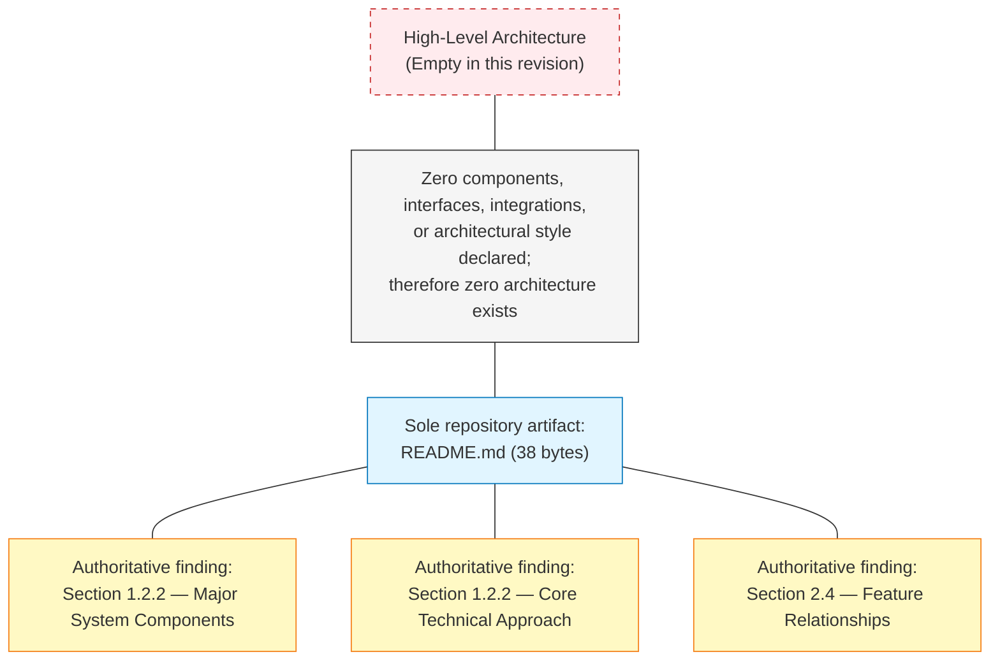
```mermaid
graph TD
    Note["High-Level Architecture<br/>(Empty in this revision)"]
    Reason["Zero components, interfaces, integrations,<br/>or architectural style declared;<br/>therefore zero architecture exists"]
    Evidence["Sole repository artifact:<br/>README.md (38 bytes)"]
    Source1["Authoritative finding:<br/>Section 1.2.2 — Major System Components"]
    Source2["Authoritative finding:<br/>Section 1.2.2 — Core Technical Approach"]
    Source3["Authoritative finding:<br/>Section 2.4 — Feature Relationships"]

    Note --- Reason
    Reason --- Evidence
    Evidence --- Source1
    Evidence --- Source2
    Evidence --- Source3

    style Note fill:#ffebee,stroke:#c62828,stroke-width:1px,stroke-dasharray: 5 5
    style Reason fill:#f5f5f5,stroke:#333,stroke-width:1px
    style Evidence fill:#e1f5ff,stroke:#0277bd,stroke-width:1px
    style Source1 fill:#fff9c4,stroke:#f57f17,stroke-width:1px
    style Source2 fill:#fff9c4,stroke:#f57f17,stroke-width:1px
    style Source3 fill:#fff9c4,stroke:#f57f17,stroke-width:1px
```

### 5.2.2 Core Components Table

The Core Components Table is empty. The repository's only artifact is `README.md`, and per Section 2.4.3 (Shared Components and Common Services Status), that artifact "is not a shared component or a common service in any architectural sense. It is a passive documentation file." Promoting a passive Markdown file to a component row with primary responsibilities, key dependencies, integration points, and critical considerations would constitute fabrication and would violate the Source-of-Truth principle in Section 1.4.1.

The table below preserves the canonical four-column shape (in conformance with the four-column constraint introduced in Section 2.6) so that future revisions may populate it once implementation components are added.

| Component Name | Primary Responsibility | Key Dependencies / Integrations | Critical Considerations |
|---|---|---|---|
| *(none)* | *(none — no component declared)* | *(none — no dependency or integration declared)* | *(none — no consideration declared)* |

**Future-revision population trigger:** addition of source code files that declare modules, services, packages, libraries, deployable units, or runtime processes (see Section 5.6.2).

### 5.2.3 Data Flow Description

No data flow exists in the repository. As recorded in Section 4.2.2.1 (Data Flow Between Systems), data flow requires both a producer and a consumer; the repository contains neither. The supporting elements that a data flow description would normally enumerate are each individually absent:

- **Primary data flows between components.** Per Section 5.2.2, no component exists; therefore no inter-component flow exists.
- **Integration patterns and protocols.** Per Section 2.4.2 (Integration Points Status), no integration is present; therefore no protocol — HTTP, gRPC, AMQP, MQTT, Kafka, WebSocket, file-drop, SFTP, or otherwise — is selected.
- **Data transformation points.** No transformation library, no ETL job, no schema-mapping artifact, and no serialization library is present per Section 3.3 (Frameworks & Libraries). Per Section 4.4.1.2 (Data Persistence Points), no place in any flow durably writes data.
- **Key data stores and caches.** Per Section 3.6.1 (Current State) the database-and-storage inventory is empty; per Section 3.6.4 (Caching Strategy) "no caching strategy is recorded."

Because all four data-flow elements resolve to "none," no data-flow narrative can be written. Future revisions will replace this paragraph with a substantive description once persistence configuration, integration code, or message-broker configuration is added (see Section 5.6.2).

### 5.2.4 External Integration Points Table

The External Integration Points Table is empty. Per Section 1.2.1 (Integration with Existing Enterprise Landscape) and Section 2.4.2 (Integration Points Status), no integrations, external system touchpoints, APIs, data sources, identity providers, message brokers, or enterprise service references are present. Per Section 1.2.3 (Key Performance Indicators), no service-level agreements, service-level objectives, service-level indicators, or quality metrics are documented; consequently the "SLA Requirements" column cannot carry any quoted value.

The table below preserves the canonical four-column shape so that future revisions may populate it once integration evidence is added.

| System Name | Integration Type | Data Exchange Pattern / Protocol | SLA Requirements |
|---|---|---|---|
| *(none)* | *(none — no integration declared)* | *(none — no protocol or pattern declared)* | *(none — no SLA documented)* |

**Future-revision population trigger:** addition of API contracts (OpenAPI, GraphQL schema, Protobuf, AsyncAPI, WSDL), integration code, webhook handlers, identity-provider configuration, message-broker configuration, or external-service SDK references (see Section 5.6.2).

---

## 5.3 COMPONENT DETAILS

### 5.3.1 Component Inventory Reaffirmed

The repository's complete component inventory, established in Section 1.2.2 (Major System Components), comprises exactly one row:

| Artifact | Type | Architectural Status |
|---|---|---|
| `README.md` | Markdown documentation file | Per Section 2.4.3: "not a shared component or a common service in any architectural sense. It is a passive documentation file." |

Because the sole repository artifact is a passive documentation file rather than a runtime component, the Component Details sub-bullets requested by the Section 5 prompt cannot be authored as adopted facts. Each sub-bullet is recorded as empty below, with the dispositive reason cited.

### 5.3.2 Component Sub-Element Status

| Component Sub-Element | Present-State Finding | Authoritative Source |
|---|---|---|
| Purpose and responsibilities | The only "purpose" of the sole artifact is to declare a project title via a Markdown H1 heading; it has no runtime responsibility, no service contract, and no behavioral surface. | Section 1.2.2 (Major System Components); Section 2.4.3 (Shared Components and Common Services Status) |
| Technologies and frameworks used | None. No programming language, framework, runtime, or library is declared. | Section 3.2 (Programming Languages); Section 3.3 (Frameworks & Libraries) |
| Key interfaces and APIs | None. No REST, GraphQL, gRPC, message, library, CLI, or file-contract interface is declared. | Section 2.4.2 (Integration Points Status); Section 4.2.2.2 (API Interactions) |
| Data persistence requirements | None. No database, file store, blob store, queue, cache, or in-memory data structure is declared. | Section 3.6.1 (Current State); Section 3.6.3 (Data Persistence Strategy); Section 4.4.1.2 (Data Persistence Points) |
| Scaling considerations | None. No workload, concurrent-user model, transaction volume, data growth projection, or scaling axis is declared. | Section 2.5.3 (Scalability Considerations) |

### 5.3.3 Reserved Component Interaction Diagram

The diagram below is reserved as the canonical shape of a component interaction diagram. The placeholder nodes will be replaced by concrete components when implementation artifacts are added. No node, edge, layer, or label is asserted as adopted in the present revision. The shape reuses the Reserved Layered View convention from Section 3.8.2 (Reserved Layered View for Future Revisions) and the swim-lane convention from Section 4.5.6 (Reserved Swim-Lane Workflow Scaffold).

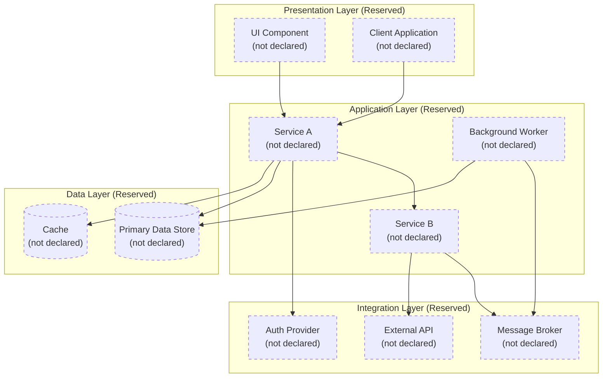
```mermaid
graph TD
    subgraph PresentationLayer["Presentation Layer (Reserved)"]
        UIComponent["UI Component<br/>(not declared)"]
        ClientApp["Client Application<br/>(not declared)"]
    end

    subgraph ApplicationLayer["Application Layer (Reserved)"]
        ServiceA["Service A<br/>(not declared)"]
        ServiceB["Service B<br/>(not declared)"]
        Worker["Background Worker<br/>(not declared)"]
    end

    subgraph IntegrationLayer["Integration Layer (Reserved)"]
        AuthProvider["Auth Provider<br/>(not declared)"]
        MessageBroker["Message Broker<br/>(not declared)"]
        ExternalAPI["External API<br/>(not declared)"]
    end

    subgraph DataLayer["Data Layer (Reserved)"]
        PrimaryStore[("Primary Data Store<br/>(not declared)")]
        CacheStore[("Cache<br/>(not declared)")]
    end

    UIComponent --> ServiceA
    ClientApp --> ServiceA
    ServiceA --> ServiceB
    ServiceA --> AuthProvider
    ServiceA --> PrimaryStore
    ServiceA --> CacheStore
    ServiceB --> MessageBroker
    ServiceB --> ExternalAPI
    Worker --> MessageBroker
    Worker --> PrimaryStore

    style UIComponent stroke-dasharray: 5 5
    style ClientApp stroke-dasharray: 5 5
    style ServiceA stroke-dasharray: 5 5
    style ServiceB stroke-dasharray: 5 5
    style Worker stroke-dasharray: 5 5
    style AuthProvider stroke-dasharray: 5 5
    style MessageBroker stroke-dasharray: 5 5
    style ExternalAPI stroke-dasharray: 5 5
    style PrimaryStore stroke-dasharray: 5 5
    style CacheStore stroke-dasharray: 5 5
```

Dashed node borders denote reserved placeholders. Layers are labeled "(Reserved)" to confirm that no component or interaction has been declared in the repository.

### 5.3.4 Reserved State Transition Diagram

The diagram below is reserved as the canonical shape of a component state transition diagram, mirroring the convention established in Section 4.5.5 (Reserved State Transition Diagram Scaffold). No state, event, transition, or guard condition is asserted as adopted.

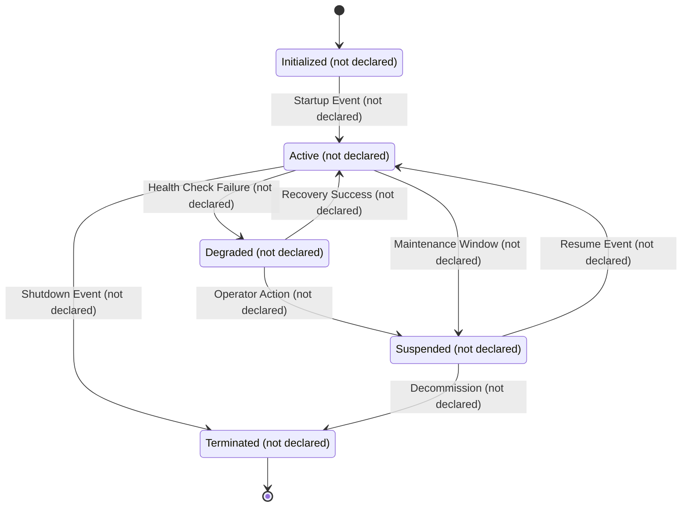
```mermaid
stateDiagram-v2
    [*] --> Initialized
    Initialized: Initialized (not declared)
    Active: Active (not declared)
    Degraded: Degraded (not declared)
    Suspended: Suspended (not declared)
    Terminated: Terminated (not declared)

    Initialized --> Active: Startup Event (not declared)
    Active --> Degraded: Health Check Failure (not declared)
    Degraded --> Active: Recovery Success (not declared)
    Degraded --> Suspended: Operator Action (not declared)
    Active --> Suspended: Maintenance Window (not declared)
    Suspended --> Active: Resume Event (not declared)
    Active --> Terminated: Shutdown Event (not declared)
    Suspended --> Terminated: Decommission (not declared)
    Terminated --> [*]
```

### 5.3.5 Reserved Sequence Diagram for Key Flows

The diagram below is reserved as the canonical shape of a key-flow sequence diagram, mirroring the convention established in Section 4.5.4 (Reserved Integration Sequence Diagram Scaffold). No participant, message, or interaction is asserted as adopted.

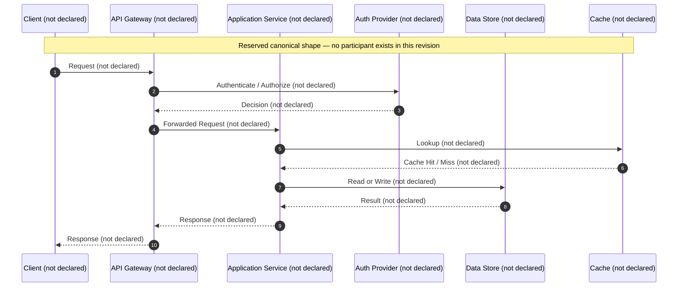
```mermaid
sequenceDiagram
    autonumber
    participant Client as Client (not declared)
    participant Gateway as API Gateway (not declared)
    participant Service as Application Service (not declared)
    participant Auth as Auth Provider (not declared)
    participant Store as Data Store (not declared)
    participant Cache as Cache (not declared)

    Note over Client,Cache: Reserved canonical shape — no participant exists in this revision
    Client->>Gateway: Request (not declared)
    Gateway->>Auth: Authenticate / Authorize (not declared)
    Auth-->>Gateway: Decision (not declared)
    Gateway->>Service: Forwarded Request (not declared)
    Service->>Cache: Lookup (not declared)
    Cache-->>Service: Cache Hit / Miss (not declared)
    Service->>Store: Read or Write (not declared)
    Store-->>Service: Result (not declared)
    Service-->>Gateway: Response (not declared)
    Gateway-->>Client: Response (not declared)
```

---

## 5.4 TECHNICAL DECISIONS

### 5.4.1 Decision Category Status

The table below records the present-state finding for each technical-decision category requested by the Section 5 prompt. Every category resolves to "no decision recorded" because, per Section 1.2.2 (Core Technical Approach), "no technical approach, architectural pattern, programming language, framework, runtime environment, deployment model, or platform choice is declared in the repository."

| Decision Category | Present-State Finding | Authoritative Source |
|---|---|---|
| Architecture style decisions and tradeoffs | No architecture style declared; no tradeoff evaluation recorded. | Section 1.2.2 (Core Technical Approach); Section 5.2.1.1 |
| Communication pattern choices | No inter-component communication exists; no synchronous/asynchronous, request/response, publish/subscribe, or event-streaming decision recorded. | Section 2.4.2 (Integration Points Status); Section 5.2.3 |
| Data storage solution rationale | No storage solution selected; no relational/document/key-value/columnar/graph/time-series decision recorded. | Section 3.6.1 (Current State); Section 3.6.3 (Data Persistence Strategy) |
| Caching strategy justification | "No caching strategy is recorded" because the prerequisites for a cache (a latency-sensitive request/response path or a computed-value pipeline) are absent. | Section 3.6.4 (Caching Strategy); Section 4.4.1.3 (Caching Requirements) |
| Security mechanism selection | "No security implications can be enumerated from repository evidence." No authentication, authorization, secret-management, encryption, or compliance mechanism is selected. | Section 2.5.4 (Security Implications); Section 3.5.2 (Categories Surveyed and Confirmed Absent) |

### 5.4.2 Architecture Decision Records (ADRs)

No Architecture Decision Records are present in the repository. There is no `docs/adr/`, `architecture/decisions/`, `adr/`, or comparable directory; there is no ADR-format Markdown file (`NNNN-title.md`); and there is no design document of any kind beyond the single-line `README.md`. Per Section 1.4.1 (Source of Truth), no ADR may be reconstructed or inferred from external context.

The ADR catalogue therefore contains zero entries. The canonical four-column shape is preserved below for future-revision population:

| ADR ID | Title | Status | Decision Summary |
|---|---|---|---|
| *(none)* | *(none — no decision recorded)* | *(none)* | *(none)* |

**Future-revision population trigger:** addition of an ADR directory or design-decision documents (see Section 5.6.2).

### 5.4.3 Reserved Default-Stack Cross-Reference

The Section 5 prompt's request that decisions be "justified with tables and prose" presupposes that decisions exist. Where the repository declares none, the prompt-supplied "Default Technology Stack" enumeration captured in Section 3.10 (Reserved Default Stack Reference — Not Adopted) remains the only candidate decision set, and it is explicitly marked as **not adopted** there. Section 3.1.4 (Disposition of the Prompt-Supplied "Default Technology Stack") established that "none of these items is asserted as adopted by this repository in the present revision" and that the catalogue exists solely to:

1. Acknowledge the prompt input transparently;
2. Provide a reference table that future revisions may adopt, modify, or replace once implementation artifacts are added; and
3. Make explicit that any present-state claim of adoption would violate the Source-of-Truth principle.

That non-adoption posture is inherited verbatim here. No item from the default stack (Python, Flask, Langchain, TypeScript, React, TailwindCSS, React-Native, AWS, Auth0, MongoDB, Docker, Terraform, GitHub Actions, Swift, Kotlin, Objective-C, ElectronJS) is asserted as a technical decision in Section 5.

### 5.4.4 Reserved Decision Tree Diagram

The diagram below is reserved as the canonical shape of an architectural decision tree, in conformance with the Section 5 prompt's explicit request for a "decision tree diagram." It illustrates the canonical decision pivots an architecture review would traverse: deployment topology, persistence choice, communication style, identity model, and observability posture. No branch outcome is asserted as adopted.

```mermaid
flowchart TD
    Start(["Architecture Decision Entry Point<br/>(not declared)"])
    DeployStyle{"Deployment Topology<br/>(not declared)"}
    Monolith["Monolith Path<br/>(not declared)"]
    Modular["Modular Monolith Path<br/>(not declared)"]
    Microservices["Microservices Path<br/>(not declared)"]
    PersistChoice{"Persistence Choice<br/>(not declared)"}
    RelationalDB[("Relational Store<br/>(not declared)")]
    DocumentDB[("Document Store<br/>(not declared)")]
    KeyValueDB[("Key-Value Store<br/>(not declared)")]
    CommStyle{"Communication Style<br/>(not declared)"}
    SyncRPC["Synchronous RPC<br/>(not declared)"]
    AsyncEvents["Async Events<br/>(not declared)"]
    IdentityModel{"Identity Model<br/>(not declared)"}
    SelfHostedID["Self-Hosted Identity<br/>(not declared)"]
    FederatedID["Federated Identity<br/>(not declared)"]
    ObsPosture{"Observability Posture<br/>(not declared)"}
    LogsOnly["Logs Only<br/>(not declared)"]
    LogsMetrics["Logs + Metrics<br/>(not declared)"]
    FullTelemetry["Logs + Metrics + Traces<br/>(not declared)"]
    Outcome(["Architecture Outcome<br/>(not declared)"])

    Start --> DeployStyle
    DeployStyle -->|Single Unit| Monolith
    DeployStyle -->|Modular Unit| Modular
    DeployStyle -->|Distributed| Microservices
    Monolith --> PersistChoice
    Modular --> PersistChoice
    Microservices --> PersistChoice
    PersistChoice -->|Structured| RelationalDB
    PersistChoice -->|Semi-Structured| DocumentDB
    PersistChoice -->|Low-Latency Lookup| KeyValueDB
    RelationalDB --> CommStyle
    DocumentDB --> CommStyle
    KeyValueDB --> CommStyle
    CommStyle -->|Request/Response| SyncRPC
    CommStyle -->|Event-Driven| AsyncEvents
    SyncRPC --> IdentityModel
    AsyncEvents --> IdentityModel
    IdentityModel -->|In-House| SelfHostedID
    IdentityModel -->|Outsourced| FederatedID
    SelfHostedID --> ObsPosture
    FederatedID --> ObsPosture
    ObsPosture -->|Minimal| LogsOnly
    ObsPosture -->|Standard| LogsMetrics
    ObsPosture -->|Comprehensive| FullTelemetry
    LogsOnly --> Outcome
    LogsMetrics --> Outcome
    FullTelemetry --> Outcome

    style Start stroke-dasharray: 5 5
    style DeployStyle stroke-dasharray: 5 5
    style Monolith stroke-dasharray: 5 5
    style Modular stroke-dasharray: 5 5
    style Microservices stroke-dasharray: 5 5
    style PersistChoice stroke-dasharray: 5 5
    style RelationalDB stroke-dasharray: 5 5
    style DocumentDB stroke-dasharray: 5 5
    style KeyValueDB stroke-dasharray: 5 5
    style CommStyle stroke-dasharray: 5 5
    style SyncRPC stroke-dasharray: 5 5
    style AsyncEvents stroke-dasharray: 5 5
    style IdentityModel stroke-dasharray: 5 5
    style SelfHostedID stroke-dasharray: 5 5
    style FederatedID stroke-dasharray: 5 5
    style ObsPosture stroke-dasharray: 5 5
    style LogsOnly stroke-dasharray: 5 5
    style LogsMetrics stroke-dasharray: 5 5
    style FullTelemetry stroke-dasharray: 5 5
    style Outcome stroke-dasharray: 5 5
```

Dashed node borders denote reserved placeholders. Every decision pivot is annotated "(not declared)" to confirm that no architecture decision has been recorded in the repository.

---

## 5.5 CROSS-CUTTING CONCERNS

### 5.5.1 Cross-Cutting Concern Status

The table below records the present-state finding for each cross-cutting concern requested by the Section 5 prompt. Every concern resolves to "no approach recorded" because the artifact classes that would evidence it are absent.

| Cross-Cutting Concern | Present-State Finding | Authoritative Source |
|---|---|---|
| Monitoring and observability approach | No monitoring or observability integration is configured (Datadog, New Relic, Sentry, Prometheus, Grafana, OpenTelemetry exporters all absent). | Section 3.5.2 (Categories Surveyed and Confirmed Absent); Section 4.4.2.3 (Error Notification Flows) |
| Logging and tracing strategy | No logging integration is configured (Splunk, Elastic Stack, CloudWatch, Loggly, Papertrail all absent); no tracing library or exporter is configured. | Section 3.5.2 (Categories Surveyed and Confirmed Absent) |
| Error handling patterns | No retry mechanism, no fallback process, no error notification flow, and no recovery procedure exists; no error-handling middleware, retry library, or circuit-breaker is configured. | Section 4.4.2.1–4.4.2.4 (Error Handling) |
| Authentication and authorization framework | No identity provider, SDK, configuration, or policy is present; no AuthN/AuthZ framework is selected. | Section 2.5.4 (Security Implications); Section 3.5.2 (Categories Surveyed and Confirmed Absent) |
| Performance requirements and SLAs | No performance requirements are documented; no KPIs, SLOs, SLIs, or quality metrics are recorded. | Section 2.5.2 (Performance Requirements); Section 1.2.3 (Key Performance Indicators) |
| Disaster recovery procedures | "There is no software to maintain, no dependencies to patch, no infrastructure to operate, no telemetry to monitor, and no runbook to execute." No backup, replication, failover, or RTO/RPO target is declared. | Section 2.5.5 (Maintenance Requirements); Section 4.4.2.4 (Recovery Procedures) |

### 5.5.2 Reserved Error Handling Flow Diagram

The diagram below is reserved as the canonical shape of an error-handling flow, in conformance with the Section 5 prompt's explicit request for an "error handling flow" diagram. It mirrors the convention established in Section 4.5.3 (Reserved Error Handling Flowchart Scaffold) and adapts it to a cross-cutting-concern lens: an operation attempt, an outcome classifier, a transient-vs-permanent decision, a retry-with-backoff loop, a fallback path, an error notification step, a dead-letter sink, and a recovery review step. No retry policy, no backoff strategy, no fallback path, no notification channel, no dead-letter sink, and no recovery review process is asserted as adopted.

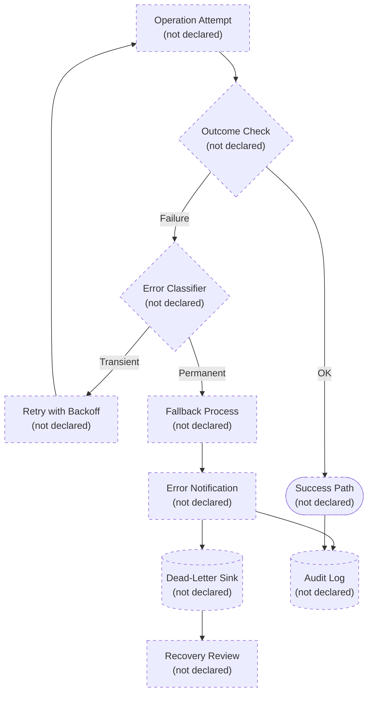
```mermaid
flowchart TD
    OperationAttempt["Operation Attempt<br/>(not declared)"]
    OutcomeCheck{"Outcome Check<br/>(not declared)"}
    SuccessPath(["Success Path<br/>(not declared)"])
    ErrorClassifier{"Error Classifier<br/>(not declared)"}
    TransientRetry["Retry with Backoff<br/>(not declared)"]
    PermanentFallback["Fallback Process<br/>(not declared)"]
    ErrorNotify["Error Notification<br/>(not declared)"]
    DeadLetter[("Dead-Letter Sink<br/>(not declared)")]
    RecoveryReview["Recovery Review<br/>(not declared)"]
    AuditLog[("Audit Log<br/>(not declared)")]

    OperationAttempt --> OutcomeCheck
    OutcomeCheck -->|OK| SuccessPath
    OutcomeCheck -->|Failure| ErrorClassifier
    ErrorClassifier -->|Transient| TransientRetry
    ErrorClassifier -->|Permanent| PermanentFallback
    TransientRetry --> OperationAttempt
    PermanentFallback --> ErrorNotify
    ErrorNotify --> DeadLetter
    DeadLetter --> RecoveryReview
    ErrorNotify --> AuditLog
    SuccessPath --> AuditLog

    style OperationAttempt stroke-dasharray: 5 5
    style OutcomeCheck stroke-dasharray: 5 5
    style SuccessPath stroke-dasharray: 5 5
    style ErrorClassifier stroke-dasharray: 5 5
    style TransientRetry stroke-dasharray: 5 5
    style PermanentFallback stroke-dasharray: 5 5
    style ErrorNotify stroke-dasharray: 5 5
    style DeadLetter stroke-dasharray: 5 5
    style RecoveryReview stroke-dasharray: 5 5
    style AuditLog stroke-dasharray: 5 5
```

Dashed node borders denote reserved placeholders. The diamond shapes denote where decision points would appear; the cylinder shapes denote where durable sinks would exist. No node corresponds to an actually existing error-handling step.

---

## 5.6 DOCUMENT VERSIONING POSTURE FOR THIS SECTION

### 5.6.1 Living Document Inheritance

Per Section 1.4.3 (Living Document Expectation), Section 2.8.3 (Document Versioning Posture), Section 3.12.1 (Living Document Inheritance), and Section 4.8.1 (Living Document Inheritance), this Technical Specification is a Living Document. The System Architecture section is expected to evolve substantially when artifacts that define components, interfaces, decisions, or cross-cutting mechanisms are added to the repository. Until such artifacts appear, regenerations of this section will continue to reflect the placeholder state documented here.

### 5.6.2 Trigger Events for Section 5 Population

The table below enumerates the repository events that should cause this section to be regenerated with substantive content. It is structured analogously to the trigger-event tables in Section 2.8.3, Section 3.12.2, and Section 4.8.2, but expressed in terms of architecture-relevant artifacts.

| Trigger Event | Expected Revision Effect on Section 5 |
|---|---|
| Addition of source code files that declare modules, services, packages, libraries, or runtime processes | Section 5.2.1 (System Overview) is populated with the inferred architectural style; Section 5.2.2 (Core Components Table) lists each component with its primary responsibility, dependencies, integration points, and critical considerations; Section 5.3 (Component Details) is populated per-component. |
| Addition of API contracts (OpenAPI, GraphQL schema, Protobuf, AsyncAPI, WSDL) | Section 5.2.3 (Data Flow Description) and Section 5.2.4 (External Integration Points Table) are populated; Section 5.3.5 (Reserved Sequence Diagram for Key Flows) is replaced with contract-derived sequence diagrams. |
| Addition of containerization or orchestration manifests (`Dockerfile`, `docker-compose.yml`, Helm chart, Kubernetes manifests, Kustomize overlays) | Section 5.2.1.3 (System Boundaries and Major Interfaces) is populated with deployment-topology boundaries; Section 5.3.3 (Reserved Component Interaction Diagram) is replaced with a deployment-aware component diagram. |
| Addition of message-broker or event-streaming configuration (Kafka, RabbitMQ, SQS, SNS, EventBridge, Pub/Sub, NATS) | Section 5.4.1 (Decision Category Status — communication pattern row) is populated; event-driven flows are added to Section 5.2.3 (Data Flow Description). |
| Addition of caching configuration (Redis, Memcached, in-process cache library, CDN) | Section 5.4.1 (Decision Category Status — caching row) is populated; Section 5.2.3 (Data Flow Description) is updated to depict cache lookups. |
| Addition of authentication / authorization code or configuration (Auth0/Okta/Azure AD/Cognito SDK references, OAuth/OIDC client configuration, JWT signing keys, RBAC policies) | Section 5.4.1 (security mechanism row) and Section 5.5.1 (AuthN/AuthZ row) are populated. |
| Addition of observability, monitoring, logging, or tracing integration (Datadog, New Relic, Sentry, Prometheus, Grafana, OpenTelemetry, Splunk, Elastic Stack, CloudWatch) | Section 5.5.1 (monitoring and logging rows) is populated; instrumentation flows are added to Section 5.5.2 (Reserved Error Handling Flow Diagram). |
| Addition of resilience patterns (retry libraries such as `tenacity`/`retry`/Polly/resilience4j, circuit-breaker configuration, bulkhead configuration) | Section 5.5.1 (error handling row) is populated; Section 5.5.2 (Reserved Error Handling Flow Diagram) is replaced with a declared error-handling pipeline. |
| Addition of performance budgets, SLOs, SLAs, or quality-of-service annotations | Section 5.5.1 (performance row) is populated; SLA columns in Section 5.2.4 (External Integration Points Table) carry quoted values. |
| Addition of disaster-recovery runbooks, backup configuration, HA topology, or RTO/RPO documentation | Section 5.5.1 (disaster recovery row) is populated with concrete procedures and targets. |
| Addition of Architecture Decision Records (ADRs) in a `docs/adr/` or equivalent directory | Section 5.4.2 (ADR catalogue) is populated row-by-row; Section 5.4.1 (Decision Category Status) is updated with rationale derived from each ADR. |
| Addition of database schemas, migrations, or persistence-layer configuration | Section 5.3.2 (data persistence row) is populated; Section 5.4.1 (storage row) is populated. |
| Addition of CI/CD pipeline files (`.github/workflows/`, `.gitlab-ci.yml`, `Jenkinsfile`, etc.) and infrastructure-as-code (`*.tf`, Pulumi, CDK, CloudFormation) | Section 5.2.1.3 (System Boundaries) is updated with deployment and platform-operations boundaries. |
| Resolution of `AAP` and `project guide` terminology through repository content | Conditional and illustrative cross-references (e.g., Section 5.4.3 default-stack cross-reference) are replaced by interpretation-bound architecture documentation. |

Until at least one of these events occurs, regenerations of this section will continue to reflect the placeholder state documented here.

---

## 5.7 REFERENCES

### 5.7.1 Files Examined

- `README.md` — The repository's sole file (38 bytes). Examined in full to confirm that no architectural style declaration, no component manifest, no interface definition, no integration descriptor, no design decision record, and no cross-cutting-concern configuration is written in the only place they could plausibly be expressed. The file contains a single Markdown H1 heading (`# -With-default-AAP-and-project-guide-`) and nothing else.

### 5.7.2 Folders Explored

- `/` (repository root, depth 0) — Confirmed to contain exactly one first-order child (`README.md`) and zero subdirectories. The depth of 0 is the maximum meaningful depth because no subdirectories exist. Used in this section to confirm the comprehensive absence of source code, API contracts, deployment manifests, infrastructure-as-code, observability configuration, error-handling middleware, identity-provider configuration, persistence configuration, caching configuration, and Architecture Decision Record documents.

### 5.7.3 Technical Specification Sections Cross-Referenced

- **Section 1.1 (Executive Summary)** — Provided the authoritative repository inventory: one file, zero subdirectories, 38 bytes.
- **Section 1.2 (System Overview)** — Section 1.2.1 (Integration with Existing Enterprise Landscape) established the absence of integration touchpoints; Section 1.2.2 (Primary System Capabilities) provided the dispositive statement that no features, workflows, services, jobs, user interfaces, APIs, or behavioral functions exist; Section 1.2.2 (Major System Components) provided the single-row component inventory; Section 1.2.2 (Core Technical Approach) provided the dispositive statement that no architectural pattern, language, framework, runtime, deployment model, or platform choice is declared; Section 1.2.3 (Key Performance Indicators) confirmed no KPIs or SLOs are documented.
- **Section 1.3 (Scope)** — Section 1.3.2 (Excluded Features and Capabilities) catalogued the comprehensive absence of application logic, configuration, infrastructure, data, quality assurance, operations, dependencies, and security artifacts that would be needed to populate Section 5.
- **Section 1.4 (Document Caveats and Interpretive Guidance)** — Section 1.4.1 (Source of Truth) governed the prohibition on inventing components, integrations, decisions, or mechanisms; Section 1.4.2 (Ambiguity Acknowledgement) governed the non-selection of any `AAP`-derived architecture; Section 1.4.3 (Living Document Expectation) governed the versioning posture in Section 5.6.
- **Section 2.1 (Preamble: Applicability of This Section)** — Provided the preamble template structure replicated in Section 5.1.
- **Section 2.4 (Feature Relationships)** — Section 2.4.1 (Dependency Map Status) provided the empty-state Mermaid diagram convention reused in Section 5.2.1.4; Section 2.4.2 (Integration Points Status) provided the dispositive quotation foreclosing the External Integration Points Table; Section 2.4.3 (Shared Components and Common Services Status) provided the dispositive statement that the sole repository artifact is a passive documentation file and not a component in any architectural sense.
- **Section 2.5 (Implementation Considerations)** — Section 2.5.2 (Performance Requirements) foreclosed SLA / KPI assertions in Section 5.5.1; Section 2.5.3 (Scalability Considerations) foreclosed scaling considerations in Section 5.3.2; Section 2.5.4 (Security Implications) foreclosed authentication/authorization claims in Section 5.5.1; Section 2.5.5 (Maintenance Requirements) foreclosed disaster-recovery claims in Section 5.5.1.
- **Section 2.6 (Traceability Matrix)** — Established the four-column constraint on tables, honored throughout Section 5.
- **Section 2.7 (Terminology-Dependent Interpretations)** — Governed the non-adoption of any `AAP`-derived architectural interpretation.
- **Section 2.8 (Assumptions, Constraints, and Versioning)** — Section 2.8.2 (Constraints) governed the prohibition on inventing technology assumptions; Section 2.8.3 (Document Versioning Posture) provided the trigger-event table pattern replicated in Section 5.6.2.
- **Section 3.1 (Preamble: Applicability of This Section)** — Section 3.1.4 (Disposition of the Prompt-Supplied "Default Technology Stack") provided the non-adoption posture inherited verbatim in Section 5.4.3.
- **Section 3.2 (Programming Languages)** — Confirmed empty programming-language inventory, foreclosing technology rows in Section 5.3.2.
- **Section 3.3 (Frameworks & Libraries)** — Confirmed empty framework/library inventory, foreclosing technology rows in Section 5.3.2.
- **Section 3.5 (Third-Party Services)** — Section 3.5.2 (Categories Surveyed and Confirmed Absent) confirmed the absence of monitoring/observability, logging, identity, and communications providers, foreclosing the cross-cutting-concern rows in Section 5.5.1.
- **Section 3.6 (Databases & Storage)** — Section 3.6.1 (Current State) foreclosed data-store rows in Section 5.3.2 and Section 5.4.1; Section 3.6.3 (Data Persistence Strategy) provided the "no data persistence strategy is recorded" statement quoted in Section 5.4.1; Section 3.6.4 (Caching Strategy) provided the "no caching strategy is recorded" statement quoted in Section 5.4.1.
- **Section 3.7 (Development & Deployment)** — Confirmed the absence of dev tooling, build systems, containerization, CI/CD, and infrastructure-as-code, foreclosing deployment-topology claims in Section 5.2.1.3.
- **Section 3.8 (Technology Stack Visualization)** — Section 3.8.1 (Present-State Diagram) provided the empty-state Mermaid convention replicated in Section 5.2.1.4; Section 3.8.2 (Reserved Layered View for Future Revisions) provided the reserved scaffolding convention (subgraphs, dashed borders, "(not declared)" annotations) replicated in Section 5.3.3.
- **Section 3.10 (Reserved Default Stack Reference — Not Adopted)** — Provided the non-adoption posture and the explicit catalogue of prompt-supplied default-stack items, cross-referenced from Section 5.4.3.
- **Section 3.11 (Security, Integration, and Compatibility Considerations)** — Confirmed empty security, integration, and compatibility inventories, foreclosing the security and integration rows in Section 5.5.1.
- **Section 3.12 (Document Versioning Posture for This Section)** — Provided the trigger-event table pattern replicated in Section 5.6.2.
- **Section 4.1 (Preamble: Applicability of This Section)** — Provided the four-part preamble structure (state reaffirmation, constraints, directives, applicability) replicated in Section 5.1.
- **Section 4.2 (System Workflows)** — Section 4.2.2.1 (Data Flow Between Systems) provided the dispositive observation that "data flow requires both a producer and a consumer; the repository contains neither," quoted in Section 5.2.3.
- **Section 4.4 (Technical Implementation)** — Section 4.4.1.2 (Data Persistence Points), Section 4.4.1.3 (Caching Requirements), and Section 4.4.2.1–4.4.2.4 (Error Handling) provided the empty-state findings replicated in Sections 5.4.1 and 5.5.1.
- **Section 4.5 (Required Diagrams)** — Section 4.5.3 (Reserved Error Handling Flowchart Scaffold) provided the canonical shape replicated in Section 5.5.2; Section 4.5.4 (Reserved Integration Sequence Diagram Scaffold) provided the canonical shape replicated in Section 5.3.5; Section 4.5.5 (Reserved State Transition Diagram Scaffold) provided the canonical shape replicated in Section 5.3.4; Section 4.5.6 (Reserved Swim-Lane Workflow Scaffold) provided the layered-subgraph convention replicated in Section 5.3.3.
- **Section 4.8 (Document Versioning Posture for This Section)** — Provided the trigger-event table pattern replicated in Section 5.6.2.

### 5.7.4 Search Operations Performed (Without Supplemental Results)

- Semantic file search for "architecture components services modules implementation" — 0 results.
- Semantic folder search for "source code application services components" — 0 results.
- Filesystem search for `.blitzyignore` files — 0 results.
- Filesystem search for typical source-code and configuration file extensions in the repository — only `README.md` found within the repository scope.

### 5.7.5 Web Searches Performed

- None. The System Architecture section is grounded exclusively in repository contents and in cross-referenced earlier sections of this Technical Specification, in conformance with Section 1.4.1 (Source of Truth). No external research was conducted, and no external interpretation of `AAP`, `project guide`, or any plausible architectural archetype has been introduced as adopted.

# 6. SYSTEM COMPONENTS DESIGN

## 6.1 Core Services Architecture

### 6.1.1 Applicability Determination

**Core Services Architecture is not applicable for this system.**

The Section 6.1 prompt provides an explicit escape clause: *"If the system does not require microservices, distributed architecture, or distinct service components, clearly state 'Core Services Architecture is not applicable for this system' and explain why."* That clause is dispositive for this repository. The repository contains exactly one file (`README.md`, 38 bytes) whose contents are a single Markdown H1 heading (`# -With-default-AAP-and-project-guide-`) and zero subdirectories. There are no services, no service boundaries, no communication channels, no discovery registries, no load balancers, no circuit breakers, no retry libraries, no scaling axes, no resilience mechanisms, and no recoverable workloads. Every prerequisite that the Section 6.1 prompt presupposes is structurally absent.

Per Section 1.2.2 (Major System Components), the repository's component inventory contains exactly one row — `README.md`, a Markdown documentation file — and "there are no additional modules, services, libraries, runtime processes, or deployable units." Per Section 2.4.3 (Shared Components and Common Services Status), that sole artifact "is not a shared component or a common service in any architectural sense. It is a passive documentation file." Per Section 1.2.2 (Core Technical Approach), "no technical approach, architectural pattern, programming language, framework, runtime environment, deployment model, or platform choice is declared in the repository."

This "not applicable" determination applies uniformly to all three Section 6.1 prompt subgroups — Service Components, Scalability Design, and Resilience Patterns — and to every individual concern enumerated under them. In keeping with the documentation convention established across Sections 2.1, 3.1, 4.1, and 5.1, the remainder of this section preserves the prompt's requested structure as scaffolding, records the empty present-state finding for each concern with traceable cross-references to authoritative source sections, and provides reserved canonical-shape diagram scaffolds for the three diagrams the prompt explicitly requires.

### 6.1.2 Repository State Reaffirmation

This Core Services Architecture section is bounded by the same evidentiary discipline established in Sections 1.4.1 (Source of Truth), 2.1.1, 3.1.1, 4.1.1, and 5.1.1. The repository's complete inventory is recapitulated below for in-place reference.

| Attribute | Value |
|---|---|
| Total files | 1 |
| Total subdirectories | 0 |
| Sole file present | `README.md` (38 bytes) |
| README content | One Markdown H1 heading: `# -With-default-AAP-and-project-guide-` |

Per Section 1.4.1 (Source of Truth), "every statement is grounded in the repository's actual contents. Where the repository is silent on a topic, this document is also silent. No external assumptions about technology choice, business intent, organizational sponsorship, or product strategy have been introduced." Per Section 1.4.2 (Ambiguity Acknowledgement), the undefined `AAP` term in the README heading carries multiple plausible meanings (Ansible Automation Platform, Application Approval Process, and others), and this Technical Specification "deliberately refrains from selecting one interpretation." Accordingly, no domain-specific service architecture (e.g., an Ansible Automation Platform controller-and-execution-environment topology) may be selected as a basis for populating Section 6.1.

### 6.1.3 Governing Constraints From Prior Sections

The following constraints, inherited from earlier sections of this Technical Specification, are dispositive for the empty present-state finding throughout Section 6.1. They mirror the constraint-table convention established in Section 5.1.2.

| Constraint | Source Section | Application to Section 6.1 |
|---|---|---|
| "No technical approach, architectural pattern, programming language, framework, runtime environment, deployment model, or platform choice is declared in the repository." | Section 1.2.2 (Core Technical Approach) | No service, communication pattern, discovery registry, load-balancing layer, or runtime hosting model can be asserted. |
| "There are no additional modules, services, libraries, runtime processes, or deployable units." | Section 1.2.2 (Major System Components) | The service inventory is empty by definition. |
| "No integrations, external system touchpoints, APIs, data sources, identity providers, message brokers, or enterprise service references are present in the repository." | Section 1.2.1 (Integration with Existing Enterprise Landscape); Section 2.4.2 (Integration Points Status) | No inter-service communication channel exists; no synchronous or asynchronous protocol is selected. |
| "No scalability considerations apply. There is no workload, no concurrent user model, no transaction volume, no data growth projection, and no horizontal or vertical scaling axis defined by any artifact in the repository." | Section 2.5.3 (Scalability Considerations) | Every scalability concern resolves to "no approach recorded." |
| "No performance requirements are documented." | Section 2.5.2 (Performance Requirements) | No latency, throughput, or capacity target may be quoted. |
| "There is no software to maintain, no dependencies to patch, no infrastructure to operate, no telemetry to monitor, and no runbook to execute." | Section 2.5.5 (Maintenance Requirements) | No disaster-recovery procedure or failover topology may be defined. |
| "No retry mechanisms are implemented. The repository contains no retry library configuration (e.g., `tenacity`, `retry`, Polly, resilience4j), no exponential-backoff helper, and no idempotency-key tracking." | Section 4.4.2.1 (Retry Mechanisms) | No retry, circuit-breaker, or backoff policy may be asserted. |
| "No fallback processes are implemented. Fallback semantics presuppose a primary path that can degrade and a secondary path that can substitute for it. Neither path exists in the repository." | Section 4.4.2.2 (Fallback Processes) | No fallback or graceful-degradation policy may be asserted. |
| "No recovery procedures are documented." | Section 4.4.2.4 (Recovery Procedures) | No disaster-recovery, RTO/RPO target, or failover playbook may be specified. |
| "No error-handling middleware, retry library, or circuit-breaker is configured." | Section 5.5.1 (Cross-Cutting Concern Status) | The resilience-pattern inventory is empty. |
| "No containerization is configured. No `Dockerfile`, `Containerfile`, `docker-compose.yml`, `compose.yaml`, `.dockerignore`, Helm chart, Kustomize overlay, or Kubernetes manifest is present." | Section 3.7.4 (Containerization) | No load-balancing layer, auto-scaling controller, or replica topology may be drawn. |
| "No infrastructure-as-code is present." | Section 3.7.6 (Infrastructure as Code) | No declarative scaling policy, failover region, or redundancy topology exists. |

### 6.1.4 Service Components — Not Applicable

The Section 6.1 prompt enumerates six service-component concerns. Each resolves to "not applicable" because the prerequisite — a set of distinct services that can have boundaries, communicate, register with a discovery registry, balance load, break circuits, or retry — does not exist in the repository.

#### 6.1.4.1 Service Boundaries and Responsibilities

No service boundaries exist. Per Section 1.2.2 (Major System Components), the component inventory contains exactly one row — `README.md`, a Markdown documentation file — and there are no additional modules, services, libraries, runtime processes, or deployable units. Per Section 2.4.3 (Shared Components and Common Services Status), that sole artifact "is not a shared component or a common service in any architectural sense. It is a passive documentation file."

A service boundary delineates the responsibilities and the public surface of a runtime process; a passive Markdown file is not a runtime process. Promoting it to a service would constitute fabrication and would violate the Source-of-Truth principle established in Section 1.4.1.

#### 6.1.4.2 Inter-Service Communication Patterns

No inter-service communication patterns exist. Per Section 2.4.2 (Integration Points Status), "no integrations, external system touchpoints, APIs, data sources, identity providers, message brokers, or enterprise service references are present in the repository." Per Section 5.2.1.3 (System Boundaries and Major Interfaces), no major interface — REST endpoint, GraphQL schema, gRPC service, message-broker topic, file-format contract, CLI surface, library API, or webhook — is declared.

Inter-service communication requires at least two services and a transport mechanism; the repository declares zero of each. The table below catalogues the categories of communication patterns that would be evaluated in a future revision, each of which is currently confirmed absent.

| Communication Pattern Category | Repository Evidence | Status |
|---|---|---|
| Synchronous request/response (REST, gRPC, GraphQL) | No HTTP server, no gRPC service definition, no GraphQL schema | Not applicable |
| Asynchronous messaging (Kafka, RabbitMQ, SQS/SNS, EventBridge, Pub/Sub) | No broker configuration, no topic declaration, no consumer code | Not applicable |
| Event streaming and event sourcing | No stream definition, no event store, no projection logic | Not applicable |
| File-based or shared-storage exchange | No file-drop directory, no shared-storage manifest | Not applicable |

#### 6.1.4.3 Service Discovery Mechanisms

No service discovery mechanism exists. Service discovery presupposes a population of services that can register with a registry (Consul, Eureka, etcd, ZooKeeper, Kubernetes DNS, AWS Cloud Map, Azure Service Fabric Naming Service) and a client that can resolve service names to network endpoints. Per Section 1.2.2 (Core Technical Approach), no runtime, framework, or platform choice is declared. Per Section 3.7.4 (Containerization) and Section 3.7.6 (Infrastructure as Code), no orchestration platform (Kubernetes, Nomad, ECS, Service Fabric, OpenShift) is configured. No service-mesh artifact (Istio, Linkerd, Consul Connect, AWS App Mesh) is present.

#### 6.1.4.4 Load Balancing Strategy

No load-balancing strategy exists. Load balancing presupposes (a) multiple replicas of a service whose traffic must be distributed and (b) a load-balancer component (hardware appliance, cloud load balancer, reverse proxy such as NGINX/HAProxy/Envoy, or Kubernetes Service / Ingress). Per Section 3.7.4 (Containerization), no container, replica set, or pod definition is declared. Per Section 3.7.6 (Infrastructure as Code), no IaC artifact configures a load balancer of any kind. Per Section 2.5.3 (Scalability Considerations), no workload or concurrent user model is defined, so no traffic exists to balance.

#### 6.1.4.5 Circuit Breaker Patterns

No circuit-breaker pattern is implemented. As recorded in Section 5.5.1 (Cross-Cutting Concern Status), "no error-handling middleware, retry library, or circuit-breaker is configured." Circuit breakers (e.g., resilience4j, Polly, Hystrix, Istio outlier detection, Envoy circuit breaker filters) presuppose a remote call that can fail and a state machine that tracks failure thresholds. Per Section 4.4.2.1 (Retry Mechanisms), no remote-call retry library is configured. Per Section 2.4.2 (Integration Points Status), there is no remote call to wrap.

#### 6.1.4.6 Retry and Fallback Mechanisms

No retry or fallback mechanisms are implemented. Per Section 4.4.2.1 (Retry Mechanisms), "no retry mechanisms are implemented. The repository contains no retry library configuration (e.g., `tenacity`, `retry`, Polly, resilience4j), no exponential-backoff helper, and no idempotency-key tracking." Per Section 4.4.2.2 (Fallback Processes), "no fallback processes are implemented. Fallback semantics presuppose a primary path that can degrade and a secondary path that can substitute for it. Neither path exists in the repository."

### 6.1.5 Scalability Design — Not Applicable

The Section 6.1 prompt enumerates five scalability concerns. Each resolves to "not applicable" because the prerequisite — a workload whose resource usage can be scaled along some axis — does not exist in the repository.

#### 6.1.5.1 Horizontal and Vertical Scaling Approach

No scaling approach is declared. Per Section 2.5.3 (Scalability Considerations), "no scalability considerations apply. There is no workload, no concurrent user model, no transaction volume, no data growth projection, and no horizontal or vertical scaling axis defined by any artifact in the repository." Horizontal scaling (adding replicas) and vertical scaling (increasing instance size) both presuppose a deployable unit with measurable resource consumption. Per Section 1.2.2 (Major System Components), there are no deployable units.

#### 6.1.5.2 Auto-Scaling Triggers and Rules

No auto-scaling triggers or rules exist. Auto-scaling configuration normally appears in Kubernetes Horizontal Pod Autoscaler manifests, AWS Application Auto Scaling policies, Azure Monitor autoscale rules, Google Cloud autoscaler definitions, or equivalent. Per Section 3.7.4 (Containerization) and Section 3.7.6 (Infrastructure as Code), none of those artifact classes is present. Per Section 1.2.3 (Key Performance Indicators) and Section 2.5.2 (Performance Requirements), no metric, KPI, SLO, or threshold is documented from which a trigger could be derived.

#### 6.1.5.3 Resource Allocation Strategy

No resource allocation strategy is recorded. Resource allocation strategy normally manifests as container resource requests and limits, JVM heap configuration, Node.js worker counts, Python process counts, database connection-pool sizes, or cloud-provider instance-type selections. Per Section 3.7 (Development & Deployment), no such artifact exists; the entire development-and-deployment inventory is empty across editor configuration, linting, type checking, pre-commit hooks, local environment files, build descriptors, containerization manifests, CI/CD pipelines, and infrastructure-as-code.

#### 6.1.5.4 Performance Optimization Techniques

No performance optimization techniques are recorded. As recorded in Section 2.5.2 (Performance Requirements), "no performance requirements are documented." Performance optimization presupposes both a measurable performance characteristic and an optimization target. Per Section 4.4.1.3 (Caching Requirements), "no caching requirements are declared." Per Section 4.4.1.2 (Data Persistence Points), no persistence point exists where query optimization, index tuning, or read-replica routing could be applied.

#### 6.1.5.5 Capacity Planning Guidelines

No capacity planning guidelines are recorded. Capacity planning normally requires forecasted demand (request rates, data volumes, user counts, growth projections), resource consumption baselines (CPU, memory, I/O per request), and headroom targets (peak-to-average ratios, burst tolerance). Per Section 1.2.3 (Key Performance Indicators) and Section 2.5.3 (Scalability Considerations), none of these inputs is documented in the repository.

### 6.1.6 Resilience Patterns — Not Applicable

The Section 6.1 prompt enumerates five resilience concerns. Each resolves to "not applicable" because the prerequisite — a system that can fail in ways that resilience patterns mitigate — does not exist in the repository.

#### 6.1.6.1 Fault Tolerance Mechanisms

No fault tolerance mechanisms exist. As recorded in Section 5.5.1 (Cross-Cutting Concern Status), "no retry mechanism, no fallback process, no error notification flow, and no recovery procedure exists; no error-handling middleware, retry library, or circuit-breaker is configured." Fault tolerance presupposes a runtime that can experience faults; the sole repository artifact is a passive Markdown file with no runtime behavior beyond static display by a Markdown renderer.

#### 6.1.6.2 Disaster Recovery Procedures

No disaster recovery procedures are documented. Per Section 4.4.2.4 (Recovery Procedures), "no recovery procedures are documented." Per Section 2.5.5 (Maintenance Requirements), "there is no software to maintain, no dependencies to patch, no infrastructure to operate, no telemetry to monitor, and no runbook to execute." No RTO (Recovery Time Objective), RPO (Recovery Point Objective), backup schedule, restore drill, or DR-site topology may therefore be specified.

#### 6.1.6.3 Data Redundancy Approach

No data redundancy approach exists. Per Section 3.6.1 (Current State), the database-and-storage inventory is empty across all surveyed categories — primary OLTP database, secondary analytical database, cache, search index, message queue, object storage, file/network storage, and vector/AI store. Data redundancy (replication, multi-AZ deployment, cross-region replication, backup retention) presupposes a data store; with zero data stores, the redundancy set is also zero.

#### 6.1.6.4 Failover Configurations

No failover configurations exist. Per Section 3.7.6 (Infrastructure as Code), no Terraform, Pulumi, CloudFormation, CDK, Bicep, Ansible, Chef, Puppet, or SaltStack artifact is present from which a failover topology — active-active, active-passive, hot/warm/cold standby, multi-region, multi-zone — could be derived. Per Section 3.7.4 (Containerization), no Kubernetes Deployment, StatefulSet, or ReplicaSet declares a replica count from which redundancy could be inferred.

#### 6.1.6.5 Service Degradation Policies

No service degradation policies exist. Service degradation policies (graceful degradation, feature flags, traffic shaping, request shedding, queue-based load leveling) presuppose a baseline service whose quality of service can degrade. Per Section 3.5.2 (Categories Surveyed and Confirmed Absent), no feature-flag platform (LaunchDarkly, Optimizely, Split, Unleash) is configured. Per Section 5.5.1 (Cross-Cutting Concern Status), no monitoring or observability integration (Datadog, New Relic, Sentry, Prometheus, Grafana, OpenTelemetry) exists from which degradation signals could be derived.

### 6.1.7 Required Diagrams (Reserved Canonical Scaffolds)

The Section 6.1 prompt explicitly requires three diagrams: a service interaction diagram, a scalability architecture diagram, and a resilience pattern implementations diagram. In conformance with the reserved-scaffold convention established in Sections 3.8.2, 4.5.2 through 4.5.6, 5.2.1.4, and 5.5.2 — under which empty-state sections preserve canonical-shape scaffolds with dashed-border nodes and "(not declared)" labels — each required diagram is provided below as a reserved scaffold. No participant, component, scaling axis, replica, broker, registry, autoscaler, circuit breaker, retry policy, or failover region in any of the three diagrams is asserted as adopted. The scaffolds exist exclusively to make the canonical structure of each diagram type visible for future revisions.

#### 6.1.7.1 Reserved Service Interaction Diagram

The diagram below is reserved as the canonical shape of a service-interaction view for a hypothetical multi-service architecture. It illustrates the structural elements that the Section 6.1 prompt enumerates under "Service Components": a population of services exchanging traffic through a load balancer, registering with a service-discovery registry, and brokering asynchronous exchanges through a message broker. No service, edge, registry, broker, or annotation is asserted as adopted; each is labeled "(not declared)" in conformance with Section 2.4.2 (Integration Points Status).

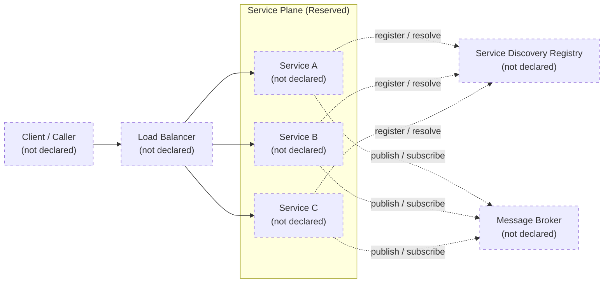
```mermaid
flowchart LR
    Client["Client / Caller<br/>(not declared)"]
    LB["Load Balancer<br/>(not declared)"]
    Registry["Service Discovery Registry<br/>(not declared)"]
    Broker["Message Broker<br/>(not declared)"]

    subgraph ServicePlane["Service Plane (Reserved)"]
        SvcA["Service A<br/>(not declared)"]
        SvcB["Service B<br/>(not declared)"]
        SvcC["Service C<br/>(not declared)"]
    end

    Client --> LB
    LB --> SvcA
    LB --> SvcB
    LB --> SvcC
    SvcA -.->|register / resolve| Registry
    SvcB -.->|register / resolve| Registry
    SvcC -.->|register / resolve| Registry
    SvcA -.->|publish / subscribe| Broker
    SvcB -.->|publish / subscribe| Broker
    SvcC -.->|publish / subscribe| Broker

    style Client stroke-dasharray: 5 5
    style LB stroke-dasharray: 5 5
    style Registry stroke-dasharray: 5 5
    style Broker stroke-dasharray: 5 5
    style SvcA stroke-dasharray: 5 5
    style SvcB stroke-dasharray: 5 5
    style SvcC stroke-dasharray: 5 5
```

Dashed node borders and dashed edges denote reserved placeholders. The diagram is provided exclusively to preserve the canonical shape of a service-interaction view for use when implementation artifacts are added; no element in the diagram corresponds to anything declared in the repository at this revision.

#### 6.1.7.2 Reserved Scalability Architecture Diagram

The diagram below is reserved as the canonical shape of a scalability architecture for a hypothetical horizontally-scaled service backed by a managed datastore tier with read replicas. It illustrates the structural elements the Section 6.1 prompt enumerates under "Scalability Design": an ingress with traffic distribution, a replica pool governed by an autoscaler driven by metric signals, and an underlying data tier with read replicas. No replica, autoscaler, metric source, storage tier, or scaling policy is asserted as adopted; per Section 2.5.3 (Scalability Considerations), no scalability axis is defined by any repository artifact.

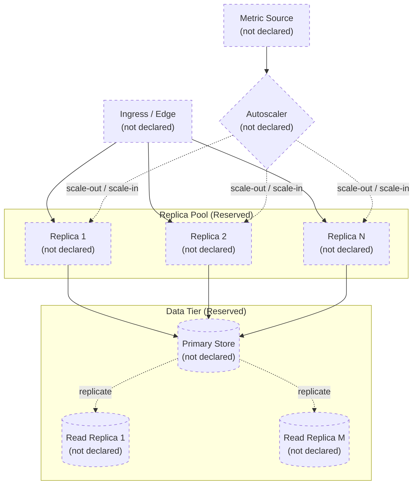
```mermaid
flowchart TD
    Ingress["Ingress / Edge<br/>(not declared)"]
    Autoscaler{"Autoscaler<br/>(not declared)"}
    Metrics["Metric Source<br/>(not declared)"]

    subgraph ReplicaPool["Replica Pool (Reserved)"]
        R1["Replica 1<br/>(not declared)"]
        R2["Replica 2<br/>(not declared)"]
        Rn["Replica N<br/>(not declared)"]
    end

    subgraph DataTier["Data Tier (Reserved)"]
        Primary[("Primary Store<br/>(not declared)")]
        ReadReplica1[("Read Replica 1<br/>(not declared)")]
        ReadReplicaM[("Read Replica M<br/>(not declared)")]
    end

    Ingress --> R1
    Ingress --> R2
    Ingress --> Rn
    Metrics --> Autoscaler
    Autoscaler -.->|scale-out / scale-in| R1
    Autoscaler -.->|scale-out / scale-in| R2
    Autoscaler -.->|scale-out / scale-in| Rn
    R1 --> Primary
    R2 --> Primary
    Rn --> Primary
    Primary -.->|replicate| ReadReplica1
    Primary -.->|replicate| ReadReplicaM

    style Ingress stroke-dasharray: 5 5
    style Autoscaler stroke-dasharray: 5 5
    style Metrics stroke-dasharray: 5 5
    style R1 stroke-dasharray: 5 5
    style R2 stroke-dasharray: 5 5
    style Rn stroke-dasharray: 5 5
    style Primary stroke-dasharray: 5 5
    style ReadReplica1 stroke-dasharray: 5 5
    style ReadReplicaM stroke-dasharray: 5 5
```

Dashed node borders and dashed edges denote reserved placeholders. The diamond shape denotes a decision point (scale-out vs. scale-in) that would be embodied by an autoscaler controller; the cylinder shapes denote durable data stores. No replica, metric signal, autoscaler policy, or storage tier corresponds to an actually existing element.

#### 6.1.7.3 Reserved Resilience Pattern Implementations Diagram

The diagram below is reserved as the canonical shape of a resilience-pattern composition for a hypothetical multi-region deployment. It illustrates the structural elements the Section 6.1 prompt enumerates under "Resilience Patterns": a primary region serving live traffic, a secondary region in failover standby, a health check that drives failover routing decisions, a circuit breaker protecting downstream calls, a retry-with-backoff loop, a fallback path, a degraded-mode policy that controls graceful degradation, and a replicated backup store that supports recovery. No region, health check, circuit breaker, retry policy, fallback path, degraded-mode rule, or backup configuration is asserted as adopted; per Section 4.4.2 (Error Handling) and Section 5.5.1 (Cross-Cutting Concern Status), none of these mechanisms is configured in the repository.

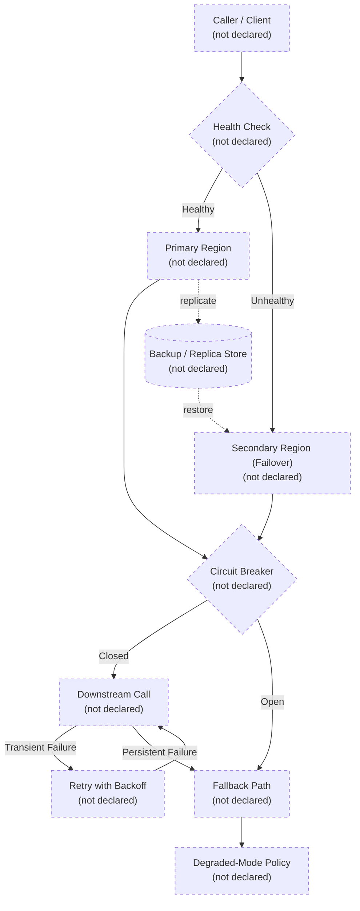
```mermaid
flowchart TD
    Caller["Caller / Client<br/>(not declared)"]
    HealthCheck{"Health Check<br/>(not declared)"}
    PrimaryRegion["Primary Region<br/>(not declared)"]
    SecondaryRegion["Secondary Region (Failover)<br/>(not declared)"]
    CircuitBreaker{"Circuit Breaker<br/>(not declared)"}
    DownstreamCall["Downstream Call<br/>(not declared)"]
    RetryBackoff["Retry with Backoff<br/>(not declared)"]
    Fallback["Fallback Path<br/>(not declared)"]
    DegradedMode["Degraded-Mode Policy<br/>(not declared)"]
    BackupStore[("Backup / Replica Store<br/>(not declared)")]

    Caller --> HealthCheck
    HealthCheck -->|Healthy| PrimaryRegion
    HealthCheck -->|Unhealthy| SecondaryRegion
    PrimaryRegion --> CircuitBreaker
    SecondaryRegion --> CircuitBreaker
    CircuitBreaker -->|Closed| DownstreamCall
    CircuitBreaker -->|Open| Fallback
    DownstreamCall -->|Transient Failure| RetryBackoff
    RetryBackoff --> DownstreamCall
    DownstreamCall -->|Persistent Failure| Fallback
    Fallback --> DegradedMode
    PrimaryRegion -.->|replicate| BackupStore
    BackupStore -.->|restore| SecondaryRegion

    style Caller stroke-dasharray: 5 5
    style HealthCheck stroke-dasharray: 5 5
    style PrimaryRegion stroke-dasharray: 5 5
    style SecondaryRegion stroke-dasharray: 5 5
    style CircuitBreaker stroke-dasharray: 5 5
    style DownstreamCall stroke-dasharray: 5 5
    style RetryBackoff stroke-dasharray: 5 5
    style Fallback stroke-dasharray: 5 5
    style DegradedMode stroke-dasharray: 5 5
    style BackupStore stroke-dasharray: 5 5
```

Dashed node borders and dashed edges denote reserved placeholders. The diamond shapes denote decision points (health-status routing, circuit-breaker open/closed gating); the cylinder shape denotes a durable replica store. No node, edge, or annotation corresponds to an actually existing resilience mechanism.

### 6.1.8 Future-Revision Population Triggers

The empty present-state finding in Section 6.1 will remain unchanged until the repository acquires artifacts that would evidence at least one service, scaling axis, or resilience mechanism. The table below catalogues the trigger events that would warrant repopulating each Section 6.1 subsection in a future revision. The trigger schema mirrors the convention established in Sections 3.12 (Document Versioning Posture), 4.7 (Reserved Schemas for Future Revisions), and 5.6 (Document Versioning Posture).

| Trigger Class | Triggering Artifact Examples | Section 6.1 Subsection Affected |
|---|---|---|
| Service declarations | Source code for a runnable program; build descriptor (`package.json`, `pom.xml`, `go.mod`, `requirements.txt`, `Cargo.toml`, `Gemfile`); service-definition file; deployable unit manifest | 6.1.4.1 Service Boundaries; 6.1.7.1 Service Interaction Diagram |
| Communication contracts | OpenAPI/Swagger, GraphQL schema, gRPC `.proto`, AsyncAPI, message-broker topic declaration, webhook handler | 6.1.4.2 Inter-Service Communication Patterns |
| Discovery / mesh configuration | Consul, Eureka, etcd, ZooKeeper, Kubernetes Service, AWS Cloud Map, Istio, Linkerd, Consul Connect, AWS App Mesh manifests | 6.1.4.3 Service Discovery Mechanisms |
| Load-balancing configuration | Kubernetes Service / Ingress, NGINX/HAProxy/Envoy config, cloud load-balancer IaC, reverse-proxy declaration | 6.1.4.4 Load Balancing Strategy |
| Resilience library configuration | resilience4j, Polly, Hystrix, `tenacity`, `retry`, Istio outlier detection, Envoy circuit-breaker filter configuration | 6.1.4.5 Circuit Breaker; 6.1.4.6 Retry & Fallback; 6.1.6.1 Fault Tolerance |
| Scaling configuration | Horizontal Pod Autoscaler, AWS Application Auto Scaling, Azure Monitor autoscale, Google Cloud autoscaler manifests | 6.1.5.1 Scaling Approach; 6.1.5.2 Auto-Scaling Triggers; 6.1.7.2 Scalability Architecture Diagram |
| Performance baselines | KPI definitions, SLO/SLI documents, performance-test scripts (k6, Locust, JMeter, Gatling), profiling baselines | 6.1.5.3 Resource Allocation; 6.1.5.4 Performance Optimization; 6.1.5.5 Capacity Planning |
| Disaster-recovery artifacts | Runbook, RTO/RPO statement, backup-and-restore manifest, multi-region IaC, failover playbook | 6.1.6.2 Disaster Recovery; 6.1.6.4 Failover; 6.1.7.3 Resilience Diagram |
| Data redundancy configuration | Replicated database manifest, multi-AZ or multi-region storage declaration, backup-retention policy | 6.1.6.3 Data Redundancy |
| Degradation policy artifacts | Feature-flag platform configuration (LaunchDarkly, Optimizely, Split, Unleash), traffic-shaping rules, queue-based load-leveling configuration | 6.1.6.5 Service Degradation |

When any of these triggering artifacts is added to the repository, the corresponding subsection above must be re-evaluated and either populated with substantive content or expanded to reflect the new evidence. Until at least one such trigger fires, the Section 6.1 "not applicable" determination must be re-affirmed at every revision.

### 6.1.9 References

#### Files Examined

- `README.md` — The repository's sole file (38 bytes); contents consist of a single Markdown H1 heading (`# -With-default-AAP-and-project-guide-`). Establishes the comprehensive absence of any service, scaling, or resilience artifact.

#### Folders Explored

- Repository root (depth 0) — Confirmed to contain exactly one child (`README.md`, type: file) and zero subdirectories. Depth 0 is the maximum meaningful depth since no subdirectories exist.

#### Technical Specification Sections Cross-Referenced

- **Section 1.1 (Executive Summary)** — Repository inventory of 1 file, 0 subdirectories, 38 bytes
- **Section 1.2 (System Overview)** — No system capabilities, components, integrations, or technical approach declared; ambiguity of `AAP` term acknowledged
- **Section 1.4 (Document Caveats and Interpretive Guidance)** — Source-of-Truth principle and ambiguity acknowledgement
- **Section 2.4 (Feature Relationships)** — Empty dependency map; zero integration points; sole artifact is not a service
- **Section 2.5 (Implementation Considerations)** — No technical constraints, no performance requirements, no scalability considerations, no security implications, no maintenance requirements
- **Section 3.5 (Third-Party Services)** — All nine third-party service categories surveyed and confirmed absent
- **Section 3.6 (Databases & Storage)** — All eight storage categories surveyed and confirmed absent
- **Section 3.7 (Development & Deployment)** — No dev tooling, build system, containerization, CI/CD, or IaC
- **Section 4.4 (Technical Implementation)** — No state management, persistence, caching, transaction boundaries, retry mechanisms, fallback processes, error notification flows, or recovery procedures
- **Section 4.5 (Required Diagrams)** — Established reserved-scaffold convention with dashed borders and "(not declared)" labels
- **Section 5.1 (Preamble: Applicability of This Section)** — Established governing-constraints schema and per-subsection applicability determination convention
- **Section 5.2 (High-Level Architecture)** — Empty Core Components Table; empty External Integration Points Table; empty-state high-level architecture diagram convention
- **Section 5.5 (Cross-Cutting Concerns)** — Confirmed absence of monitoring, logging, tracing, error handling, authN/Z framework, performance SLAs, and disaster recovery; reserved error-handling flow diagram

#### Search Operations Underlying These Findings

- `get_source_folder_contents` on repository root — Confirmed only `README.md` exists; zero subdirectories
- `read_file` on `README.md` — Confirmed single-line H1 heading content
- `search_files` for "microservices distributed services components" — Zero results
- `search_folders` for "services architecture distributed components" — Zero results

## 6.2 Database Design

### 6.2.1 Applicability Determination

**Database Design is not applicable to this system.**

The Section 6.2 prompt provides an explicit escape clause: *"If the system does not require or direct database or persistent storage interactions are not clearly evident, clearly state 'Database Design is not applicable to this system' and explain why."* That clause is dispositive for this repository. The repository contains exactly one file (`README.md`, 38 bytes) whose contents are a single Markdown H1 heading (`# -With-default-AAP-and-project-guide-`) and zero subdirectories. There are no database drivers, connection strings, schemas, migrations, ORM definitions, query layers, persistence configurations, cache clients, replication topologies, or backup policies. Every prerequisite that the Section 6.2 prompt presupposes is structurally absent.

Per Section 3.6.1 (Current State), "the database-and-storage inventory for this repository is **empty**." Per Section 3.6.2 (Storage Categories Surveyed and Confirmed Absent), all eight storage categories — primary OLTP database, secondary/analytical database, cache, search index, message queue, object/blob storage, file/network storage, and vector/AI store — were surveyed and confirmed absent. Per Section 4.4.1.2 (Data Persistence Points), "no data persistence points exist," and per Section 4.4.1.4 (Transaction Boundaries), "no transaction boundaries exist."

This "not applicable" determination applies uniformly to all four Section 6.2 prompt subgroups — Schema Design, Data Management, Compliance Considerations, and Performance Optimization — and to every individual concern enumerated under them. In keeping with the documentation convention established across Sections 2.1, 3.1, 4.1, 5.1, and the immediately preceding Section 6.1, the remainder of this section preserves the prompt's requested structure as scaffolding, records the empty present-state finding for each concern with traceable cross-references to authoritative source sections, and provides reserved canonical-shape diagram scaffolds for the three diagrams the prompt explicitly requires (Database Schema, Data Flow, and Replication Architecture).

### 6.2.2 Repository State Reaffirmation

This Database Design section is bounded by the same evidentiary discipline established in Sections 1.4.1 (Source of Truth), 2.1.1, 3.1.1, 4.1.1, 5.1.1, and 6.1.2. The repository's complete inventory is recapitulated below for in-place reference.

| Attribute | Value |
|---|---|
| Total files | 1 |
| Total subdirectories | 0 |
| Sole file present | `README.md` (38 bytes) |
| README content | One Markdown H1 heading: `# -With-default-AAP-and-project-guide-` |

Per Section 1.4.1 (Source of Truth), "every statement is grounded in the repository's actual contents. Where the repository is silent on a topic, this document is also silent. No external assumptions about technology choice, business intent, organizational sponsorship, or product strategy have been introduced." Per Section 1.4.2 (Ambiguity Acknowledgement), the undefined `AAP` term in the README heading carries multiple plausible meanings (Ansible Automation Platform, Application Approval Process, and others), and this Technical Specification "deliberately refrains from selecting one interpretation." Accordingly, no domain-specific data model (for example, an Ansible Automation Platform inventory-and-job-template schema, an Application Approval Process workflow-state schema, or any other interpretation-dependent entity catalogue) may be selected as a basis for populating Section 6.2.

### 6.2.3 Governing Constraints From Prior Sections

The following constraints, inherited from earlier sections of this Technical Specification, are dispositive for the empty present-state finding throughout Section 6.2. They mirror the constraint-table convention established in Section 5.1.2 and Section 6.1.3.

| Constraint | Source Section | Application to Section 6.2 |
|---|---|---|
| "The database-and-storage inventory for this repository is **empty**." | Section 3.6.1 (Current State) | The entity-relationship inventory, data-model catalogue, and storage tier list are all empty. |
| All eight storage categories surveyed and confirmed absent (OLTP, analytical, cache, search, queue, object, file, vector). | Section 3.6.2 (Storage Categories Surveyed and Confirmed Absent) | No primary database, cache, search index, message queue, object store, file store, or vector store may appear in any schema, replication topology, or partitioning scheme. |
| "No data persistence strategy is recorded." | Section 3.6.3 (Data Persistence Strategy) | No write path, durability guarantee, or storage tier may be specified. |
| "No caching strategy is recorded." | Section 3.6.4 (Caching Strategy) | No cache layer, TTL, eviction policy, or cache-aside/write-through/write-behind pattern may be asserted. |
| "No MongoDB driver, connection string, schema file, or migration is present in the repository." | Section 3.6.6 (Cross-Reference to Default Stack Reference) | The prompt-supplied default (MongoDB, catalogued in Section 3.10.4) is reference-only; it cannot be asserted as adopted. |
| "No data persistence points exist." | Section 4.4.1.2 (Data Persistence Points) | No write boundary, no retention point, and no archival sink exists. |
| "No caching requirements are declared." | Section 4.4.1.3 (Caching Requirements) | No caching policy, layer, or invalidation strategy may be asserted. |
| "No transaction boundaries exist." | Section 4.4.1.4 (Transaction Boundaries) | No ACID/BASE boundary, no isolation level, and no unit-of-work boundary may be specified. |
| "No performance requirements are documented." | Section 2.5.2 (Performance Requirements) | No query-latency target, throughput SLA, or capacity benchmark may be quoted. |
| "There is no workload, no concurrent user model, no transaction volume, no data growth projection." | Section 2.5.3 (Scalability Considerations) | No partition strategy, sharding key, or read-replica fanout may be specified. |
| "No security implications can be enumerated from repository evidence." | Section 2.5.4 (Security Implications) | No access-control matrix, row-level security policy, encryption-at-rest scheme, or audit-log specification may be asserted. |
| "There is no software to maintain, no dependencies to patch, no infrastructure to operate." | Section 2.5.5 (Maintenance Requirements) | No backup schedule, restore drill, migration runbook, or disaster-recovery procedure may be defined. |
| "No recovery procedures are documented." | Section 4.4.2.4 (Recovery Procedures) | No RTO, RPO, or point-in-time-recovery target may be specified. |
| "No data redundancy approach exists." | Section 6.1.6.3 (Data Redundancy Approach) | No replication topology, multi-AZ deployment, or cross-region replica may be drawn. |

### 6.2.4 Schema Design — Not Applicable

The Section 6.2 prompt enumerates six schema-design concerns. Each resolves to "not applicable" because the prerequisite — a populated database or storage tier whose entities, attributes, indexes, partitions, replicas, and backups can be specified — does not exist in the repository.

#### 6.2.4.1 Entity Relationships

No entity relationships exist. An entity-relationship model presupposes a set of entities (tables, collections, documents, or aggregates) and a set of cardinality-bearing relationships among them (one-to-one, one-to-many, many-to-many). Per Section 1.2.2 (Major System Components), the component inventory contains exactly one row — `README.md`, a Markdown documentation file — and no domain model, entity definition, ORM class, schema declaration, JSON Schema, or `.proto` file is present. Per Section 1.4.2 (Ambiguity Acknowledgement), the undefined `AAP` term cannot be expanded into a presumptive domain (for example, into Ansible Automation Platform's `Inventory`, `JobTemplate`, `Project`, and `Credential` entities) without violating the Source-of-Truth principle established in Section 1.4.1.

#### 6.2.4.2 Data Models and Structures

No data models or structures are declared. The repository contains no SQL DDL (`CREATE TABLE`, `CREATE TYPE`, `CREATE VIEW`), no NoSQL collection definitions, no document validation schemas (e.g., MongoDB JSON Schema validators, DynamoDB attribute definitions), no ORM model classes (SQLAlchemy `Model`, Django `Model`, Mongoose `Schema`, Prisma `model`, Sequelize, TypeORM, Hibernate `@Entity`), no Protocol Buffer messages, no Avro schemas, and no GraphQL type definitions. Per Section 3.6.5 (Reserved Schema for Future Revisions), the schema role/technology/version/reference/backup/justification table is empty (`*(none)*` across every column).

| Model Artifact Class | Examples Sought | Present in Repository? |
|---|---|---|
| Relational DDL | `.sql` files, Flyway/Liquibase changelogs, ORM-generated DDL | No |
| Document / NoSQL schemas | Mongoose schemas, MongoDB JSON Schema validators, DynamoDB table definitions | No |
| Strongly-typed contracts | Protocol Buffers (`.proto`), Avro (`.avsc`), Thrift IDL, JSON Schema | No |
| ORM model classes | SQLAlchemy, Django ORM, Hibernate, Prisma, Sequelize, TypeORM | No |

#### 6.2.4.3 Indexing Strategy

No indexing strategy exists. Indexing presupposes (a) a storage engine that supports indexes (B-tree, hash, GIN/GiST, full-text, geospatial, vector, secondary, composite, partial, unique) and (b) a query workload whose access patterns motivate index selection. Per Section 3.6.2, no storage engine of any kind is present in the repository; per Section 4.4.1.2 (Data Persistence Points), no read or write path exists from which an access pattern could be derived. No `CREATE INDEX` statement, ORM `@Index` decorator, MongoDB index specification, or migration-driven index declaration is present.

The table below preserves the canonical shape of an index catalogue for use in a future revision and is empty in this revision.

| Index Name | Target Entity / Attributes | Index Type | Justification |
|---|---|---|---|
| *(none)* | *(none)* | *(none)* | *(none)* |

#### 6.2.4.4 Partitioning Approach

No partitioning approach is declared. Partitioning (horizontal sharding, vertical splitting, range/list/hash partitioning, time-based partitioning, tenant-isolated partitioning) presupposes a data volume large enough or an isolation requirement specific enough to motivate splitting a logical entity across physical storage units. Per Section 2.5.3 (Scalability Considerations), "no scalability considerations apply. There is no workload, no concurrent user model, no transaction volume, [and] no data growth projection." No partition key, shard key, distribution column, or partitioning function is declared by any repository artifact.

#### 6.2.4.5 Replication Configuration

No replication configuration is declared. As reaffirmed in Section 6.1.6.3 (Data Redundancy Approach), "no data redundancy approach exists. Per Section 3.6.1 (Current State), the database-and-storage inventory is empty across all surveyed categories... Data redundancy (replication, multi-AZ deployment, cross-region replication, backup retention) presupposes a data store; with zero data stores, the redundancy set is also zero." No replica-set manifest, primary/standby pairing, synchronous/asynchronous replication selector, replication lag tolerance, or read-replica routing rule is present.

#### 6.2.4.6 Backup Architecture

No backup architecture is declared. Backup architecture presupposes (a) a primary data store from which backups are taken, (b) a backup engine (logical dump tools such as `pg_dump`/`mongodump`, snapshot mechanisms such as EBS/RDS snapshots, continuous-archival mechanisms such as WAL shipping/binlog streaming/oplog tailing), (c) a backup sink (object storage, tape, cross-region replica), and (d) a retention and validation policy. Per Section 3.6.2, no primary data store exists; per Section 2.5.5 (Maintenance Requirements), "there is no software to maintain, no dependencies to patch, no infrastructure to operate, no telemetry to monitor, and no runbook to execute"; per Section 4.4.2.4 (Recovery Procedures), "no recovery procedures are documented." No RPO, RTO, retention window, restore-test schedule, or off-site copy is specified.

### 6.2.5 Data Management — Not Applicable

The Section 6.2 prompt enumerates five data-management concerns. Each resolves to "not applicable" because the prerequisite — a populated data store whose lifecycle, evolution, archival, retrieval, and caching can be managed — does not exist in the repository.

#### 6.2.5.1 Migration Procedures

No migration procedures are declared. The repository contains no migration toolchain configuration: no Alembic (`alembic.ini`, `versions/`), no Flyway (`flyway.conf`, `db/migration/V*.sql`), no Liquibase (`changelog.xml`, `changelog.yaml`), no Django migrations (`migrations/`), no Knex (`knexfile.js`, `migrations/`), no Sequelize-CLI, no `mongo-migrate`, no Prisma Migrate, no Atlas, and no Rails `db/migrate/`. Per Section 3.7 (Development & Deployment), the entire development-and-deployment inventory is empty across editor configuration, linting, type checking, pre-commit hooks, local environment files, build descriptors, containerization manifests, CI/CD pipelines, and infrastructure-as-code; there is no pipeline in which a migration step could even be executed.

#### 6.2.5.2 Versioning Strategy

No schema versioning strategy is declared. Schema versioning presupposes a schema whose evolution can be tracked across time, typically via versioned migration files, schema-registry entries (Confluent Schema Registry, AWS Glue Schema Registry, Apicurio), or document-version markers on stored records. With zero schemas declared (Section 6.2.4.2), the versioning surface is also zero. No schema-registry endpoint, no `__schema_version__` field convention, no compatibility-mode policy (backward, forward, full), and no contract-test suite is present.

#### 6.2.5.3 Archival Policies

No archival policies are declared. Archival presupposes hot data that can become cold, a destination tier for cold data (warehouse, data lake, object-store archive class such as S3 Glacier or Azure Archive Storage, tape), and a transition rule (time-based, access-frequency-based, regulatory-trigger-based). Per Section 3.6.2, no hot tier exists from which data could age into a cold tier; per Section 4.4.1.2 (Data Persistence Points), "no data persistence points exist." No object-lifecycle rule, archival policy document, or cold-storage manifest is present.

#### 6.2.5.4 Data Storage and Retrieval Mechanisms

No data storage and retrieval mechanisms exist. Storage and retrieval mechanisms presuppose a storage engine (Section 3.6.2 confirms none), a client/driver (no driver dependency is declared in any manifest because no manifest exists per Section 3.4 — Open Source Dependencies), and an access pattern (no read or write call site exists in source because no source exists per Section 1.2.2 — Major System Components). The table below preserves the canonical shape of a storage-and-retrieval catalogue for use in a future revision and is empty in this revision.

| Mechanism | Role (Read / Write / Both) | Driver / Library | Status |
|---|---|---|---|
| *(none)* | *(none)* | *(none)* | Not applicable |

#### 6.2.5.5 Caching Policies

No caching policies are declared. As recorded in Section 3.6.4 (Caching Strategy), "no caching strategy is recorded. Caching presupposes a request/response path or a computed-value pipeline whose latency or throughput characteristics motivate a cache." As recorded in Section 4.4.1.3 (Caching Requirements), "no caching requirements are declared." No cache client (Redis, Memcached, Hazelcast, in-process LRU library), no TTL policy, no eviction policy (LRU, LFU, FIFO, ARC), no invalidation strategy (cache-aside, write-through, write-behind, refresh-ahead), and no CDN configuration is present in the repository.

### 6.2.6 Compliance Considerations — Not Applicable

The Section 6.2 prompt enumerates five compliance concerns. Each resolves to "not applicable" because the prerequisite — data subject to retention, fault-tolerance, privacy, audit, or access-control obligations — does not exist in the repository.

#### 6.2.6.1 Data Retention Rules

No data retention rules are declared. Retention rules presuppose (a) stored data classified into retention categories (transactional, operational, audit, personal/PII, PHI, financial) and (b) a regulatory or business policy governing minimum-retain and maximum-retain windows (GDPR, HIPAA, SOX, PCI DSS, CCPA, sector-specific schedules). Per Section 4.4.1.2 (Data Persistence Points), no place in any flow durably writes data; therefore no retention category exists to govern. The table below preserves the canonical shape of a retention catalogue and is empty in this revision.

| Data Category | Retention Window | Regulatory Basis | Status |
|---|---|---|---|
| *(none)* | *(none)* | *(none)* | Not applicable |

#### 6.2.6.2 Backup and Fault Tolerance Policies

No backup and fault tolerance policies are declared. Per Section 6.2.4.6 (Backup Architecture), no backup architecture exists. Per Section 4.4.2.4 (Recovery Procedures), "no recovery procedures are documented." Per Section 5.5.1 (Cross-Cutting Concern Status), as cross-referenced in Section 6.1.3, "there is no software to maintain, no dependencies to patch, no infrastructure to operate, no telemetry to monitor, and no runbook to execute." No backup schedule, retention period, restore-test cadence, RTO, RPO, multi-AZ topology, cross-region replica, or failover playbook is declared.

#### 6.2.6.3 Privacy Controls

No privacy controls are declared. Privacy controls presuppose (a) personal data subject to a privacy regime (GDPR personal data, CCPA personal information, HIPAA PHI), (b) a classification taxonomy mapping fields to sensitivity tiers, and (c) technical controls (field-level encryption, tokenization, pseudonymization, data-subject-access workflows, right-to-erasure mechanisms). As recorded in Section 2.5.4 (Security Implications), "no security implications can be enumerated from repository evidence." No data classification, encryption-at-rest configuration, encryption-in-transit configuration, key-management integration (AWS KMS, Azure Key Vault, GCP KMS, HashiCorp Vault), or privacy-by-design control is present.

#### 6.2.6.4 Audit Mechanisms

No audit mechanisms are declared. Audit mechanisms presuppose a logging integration (Section 3.5.2 records that no logging integration — Splunk, Elastic Stack, CloudWatch, Loggly, Papertrail — is configured), a database-level audit feature (e.g., PostgreSQL `pgaudit`, MySQL audit log, MongoDB audit subsystem, SQL Server Audit, Oracle Fine-Grained Auditing), and a downstream review process. None of these is present. Per Section 5.5.1 (Cross-Cutting Concern Status), as cross-referenced in Section 6.1.3, no observability or audit-log telemetry exists.

#### 6.2.6.5 Access Controls

No access controls are declared. Access controls presuppose an authentication framework that identifies principals and an authorization framework that maps principals to permissible operations on data. As recorded in Section 2.5.4 (Security Implications), no AuthN/AuthZ framework, identity provider integration, role-based-access-control (RBAC) matrix, attribute-based-access-control (ABAC) policy, row-level security policy, column-level masking rule, or database-user grant scheme is documented. Per Section 3.10.3 (Reserved Authentication & Cloud), the prompt-supplied default authentication provider (Auth0) is catalogued as "not adopted."

### 6.2.7 Performance Optimization — Not Applicable

The Section 6.2 prompt enumerates five performance-optimization concerns. Each resolves to "not applicable" because the prerequisite — a database workload whose queries, caches, connections, replicas, and batches can be tuned — does not exist in the repository.

#### 6.2.7.1 Query Optimization Patterns

No query optimization patterns are declared. Query optimization presupposes (a) a query language (SQL, MongoDB Query Language, Cypher, GraphQL, OQL) executed against (b) a storage engine with (c) an optimizer that produces (d) execution plans whose costs can be (e) measured and tuned. None of these exists. Per Section 6.1.5.4 (Performance Optimization Techniques), "no performance optimization techniques are recorded." No `EXPLAIN`/`EXPLAIN ANALYZE` plan capture, slow-query log, query-rewrite rule, hint, materialized view, denormalization decision, or covering-index strategy is present.

#### 6.2.7.2 Caching Strategy

No caching strategy is declared. As recorded in Section 3.6.4 (Caching Strategy), reproduced verbatim: "no caching strategy is recorded. Caching presupposes a request/response path or a computed-value pipeline whose latency or throughput characteristics motivate a cache." As recorded in Section 4.4.1.3 (Caching Requirements), "no caching requirements are declared." This subsection inherits both findings unchanged.

#### 6.2.7.3 Connection Pooling

No connection pooling is declared. Connection pooling presupposes (a) a database to which connections are established and (b) a pooling library or component (HikariCP, c3p0, DBCP, pgbouncer, PgPool-II, mongoose's built-in pool, SQLAlchemy `QueuePool`, mysql2 pool, generic-pool). Per Section 3.6.2, no database is configured; per Section 3.4 (Open Source Dependencies), no dependency manifest exists in which a pooling library could be declared. No pool size, idle timeout, maximum-lifetime, validation-query, or leak-detection threshold is specified.

#### 6.2.7.4 Read/Write Splitting

No read/write splitting is declared. Read/write splitting presupposes (a) a primary that accepts writes, (b) one or more read replicas, and (c) a routing layer (driver-level read preference such as MongoDB's `secondaryPreferred`, proxy-level routing such as ProxySQL or Amazon RDS Proxy, application-level dual-DataSource routing). Per Section 6.2.4.5 (Replication Configuration), no replication topology exists; per Section 2.5.3 (Scalability Considerations), no workload exists to be split. No `readPreference`, no replica DNS endpoint, and no routing rule is present.

#### 6.2.7.5 Batch Processing Approach

No batch processing approach is declared. Batch processing presupposes (a) a workload of records to process in bulk, (b) a batching engine (cron-driven scripts, Spring Batch, AWS Batch, Apache Spark, Flink, Beam, Airflow, Dagster, Prefect), and (c) a target store. Per Section 2.5.3 (Scalability Considerations), no workload is declared; per Section 3.6.2, no source or target store exists. No batch window, batch-size limit, parallelism setting, or retry-and-resume convention is specified.

### 6.2.8 Required Diagrams (Reserved Canonical Scaffolds)

The Section 6.2 prompt explicitly requires three diagrams: a **database schema diagram (ERD)**, a **data flow diagram**, and a **replication architecture diagram**. In conformance with the reserved-scaffold convention established in Sections 3.8.2, 4.5.2 through 4.5.6, 5.2.1.4, 5.5.2, and 6.1.7 — under which empty-state sections preserve canonical-shape scaffolds with dashed-border nodes and "(not declared)" labels — each required diagram is provided below as a reserved scaffold. No entity, attribute, relationship, key, index, data store, cache, backup sink, replica, region, or routing element in any of the three diagrams is asserted as adopted. The scaffolds exist exclusively to make the canonical structure of each diagram type visible for future revisions.

#### 6.2.8.1 Reserved Database Schema Diagram (ERD)

The diagram below is reserved as the canonical shape of an entity-relationship view for a hypothetical relational or document-oriented schema. It illustrates the structural elements the Section 6.2 prompt enumerates under "Schema Design": entities with primary-key attributes, foreign-key relationships with cardinalities, and reserved positions for indexed attributes. No entity, attribute, relationship, primary key, foreign key, or index is asserted as adopted; per Section 1.4.2 (Ambiguity Acknowledgement), no domain interpretation is selected, and per Section 6.2.4.1, the entity-relationship inventory is empty.

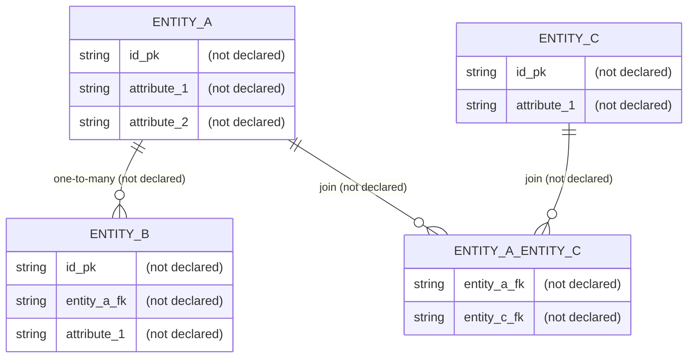
```mermaid
erDiagram
    ENTITY_A {
        string id_pk "(not declared)"
        string attribute_1 "(not declared)"
        string attribute_2 "(not declared)"
    }
    ENTITY_B {
        string id_pk "(not declared)"
        string entity_a_fk "(not declared)"
        string attribute_1 "(not declared)"
    }
    ENTITY_C {
        string id_pk "(not declared)"
        string attribute_1 "(not declared)"
    }
    ENTITY_A_ENTITY_C {
        string entity_a_fk "(not declared)"
        string entity_c_fk "(not declared)"
    }

    ENTITY_A ||--o{ ENTITY_B : "one-to-many (not declared)"
    ENTITY_A ||--o{ ENTITY_A_ENTITY_C : "join (not declared)"
    ENTITY_C ||--o{ ENTITY_A_ENTITY_C : "join (not declared)"
```

The ERD scaffold above is provided exclusively to preserve the canonical shape of an entity-relationship view (entities with attributes, primary-key markers, foreign-key markers, and cardinality-annotated relationships including a many-to-many resolved through a junction table) for use when implementation artifacts are added. No entity, attribute, key, or relationship in the diagram corresponds to anything declared in the repository at this revision. The reserved index and constraint catalogues that would normally accompany this ERD are documented below.

##### 6.2.8.1.1 Reserved Index Catalogue

| Entity (Table / Collection) | Index Name | Indexed Attributes / Type | Status |
|---|---|---|---|
| *(none)* | *(none)* | *(none)* | Not applicable |

##### 6.2.8.1.2 Reserved Constraint Catalogue

| Entity (Table / Collection) | Constraint Name | Constraint Kind (PK / FK / UNIQUE / CHECK / NOT NULL) | Status |
|---|---|---|---|
| *(none)* | *(none)* | *(none)* | Not applicable |

Both catalogues are empty in this revision in conformance with Section 6.2.4.2 (no schema declared) and Section 6.2.4.3 (no indexing strategy). They preserve the canonical column shape required by the Section 6.2 prompt's "Document all indexes and constraints" directive for future population.

#### 6.2.8.2 Reserved Data Flow Diagram

The diagram below is reserved as the canonical shape of a data-flow view for a hypothetical persistence pathway. It illustrates the structural elements the Section 6.2 prompt enumerates under "Data Management": a producer that initiates a write, an application-tier write path, a primary data store, a cache layer interposed on the read path, a consumer that initiates a read, and a backup sink that captures point-in-time copies. No producer, consumer, application tier, data store, cache, backup sink, or directional edge is asserted as adopted; per Section 5.2.3 (Data Flow Description), as cross-referenced from Section 4.4.1.2 (Data Persistence Points), "no place in any flow durably writes data."

```mermaid
flowchart LR
    Producer["Producer / Writer<br/>(not declared)"]
    Consumer["Consumer / Reader<br/>(not declared)"]
    AppWrite["Application Write Path<br/>(not declared)"]
    AppRead["Application Read Path<br/>(not declared)"]
    Cache[("Cache Layer<br/>(not declared)")]
    PrimaryDB[("Primary Data Store<br/>(not declared)")]
    BackupSink[("Backup Sink<br/>(not declared)")]
    CacheDecision{"Cache Hit?<br/>(not declared)"}

    Producer --> AppWrite
    AppWrite --> PrimaryDB
    Consumer --> AppRead
    AppRead --> CacheDecision
    CacheDecision -->|Hit| Cache
    CacheDecision -->|Miss| PrimaryDB
    PrimaryDB -.->|populate| Cache
    PrimaryDB -.->|snapshot / archive| BackupSink

    style Producer stroke-dasharray: 5 5
    style Consumer stroke-dasharray: 5 5
    style AppWrite stroke-dasharray: 5 5
    style AppRead stroke-dasharray: 5 5
    style Cache stroke-dasharray: 5 5
    style PrimaryDB stroke-dasharray: 5 5
    style BackupSink stroke-dasharray: 5 5
    style CacheDecision stroke-dasharray: 5 5
```

Dashed node borders and dashed edges denote reserved placeholders. The cylinder shapes denote durable data stores (primary, cache, and backup sink); the diamond shape denotes a routing decision (cache hit versus miss). No producer, consumer, application tier, data store, cache, backup sink, or directional edge in the diagram corresponds to anything declared in the repository at this revision.

#### 6.2.8.3 Reserved Replication Architecture Diagram

The diagram below is reserved as the canonical shape of a replication topology for a hypothetical multi-region deployment. It illustrates the structural elements the Section 6.2 prompt enumerates under "Schema Design — Replication Configuration" and "Performance Optimization — Read/Write Splitting": a primary region containing a primary database that accepts writes, a synchronous replica within the primary region for high availability, an asynchronous replica in a secondary region for disaster recovery, a backup-storage tier in object storage, a replication-lag monitor that observes replica freshness, and a read-routing decision point. No region, database, replica, backup store, monitor, or routing rule is asserted as adopted; per Section 6.2.4.5 (Replication Configuration), no replication configuration is declared.

```mermaid
flowchart TD
    WriteClient["Write Client<br/>(not declared)"]
    ReadClient["Read Client<br/>(not declared)"]
    RoutingDecision{"Read / Write Split<br/>(not declared)"}
    LagMonitor["Replication Lag Monitor<br/>(not declared)"]

    subgraph PrimaryRegion["Primary Region (Reserved)"]
        PrimaryDB[("Primary Database<br/>(not declared)")]
        SyncReplica[("Synchronous Replica<br/>(not declared)")]
    end

    subgraph SecondaryRegion["Secondary Region (Reserved)"]
        AsyncReplica[("Asynchronous Replica<br/>(not declared)")]
    end

    subgraph BackupTier["Backup Tier (Reserved)"]
        BackupStore[("Backup Storage<br/>(not declared)")]
    end

    WriteClient --> RoutingDecision
    ReadClient --> RoutingDecision
    RoutingDecision -->|Write| PrimaryDB
    RoutingDecision -->|Read| SyncReplica
    RoutingDecision -.->|DR Read| AsyncReplica
    PrimaryDB -->|synchronous| SyncReplica
    PrimaryDB -.->|asynchronous| AsyncReplica
    PrimaryDB -.->|snapshot / WAL ship| BackupStore
    SyncReplica -.->|lag signal| LagMonitor
    AsyncReplica -.->|lag signal| LagMonitor

    style WriteClient stroke-dasharray: 5 5
    style ReadClient stroke-dasharray: 5 5
    style RoutingDecision stroke-dasharray: 5 5
    style LagMonitor stroke-dasharray: 5 5
    style PrimaryDB stroke-dasharray: 5 5
    style SyncReplica stroke-dasharray: 5 5
    style AsyncReplica stroke-dasharray: 5 5
    style BackupStore stroke-dasharray: 5 5
```

Dashed node borders and dashed edges denote reserved placeholders. The cylinder shapes denote durable data stores (primary, synchronous replica, asynchronous replica, and backup storage); the diamond shape denotes the read/write routing decision point that would be embodied by a driver-level read preference, a database proxy, or an application-level router. No region, database, replica, backup store, monitor, or routing rule in the diagram corresponds to anything declared in the repository at this revision.

### 6.2.9 Future-Revision Population Triggers

The empty present-state finding in Section 6.2 will remain unchanged until the repository acquires artifacts that would evidence at least one storage component, schema declaration, migration, replication topology, or backup configuration. The table below catalogues the trigger events that would warrant repopulating each Section 6.2 subsection in a future revision. The trigger schema mirrors the convention established in Sections 3.12 (Document Versioning Posture), 4.7 (Reserved Schemas for Future Revisions), 5.6 (Document Versioning Posture), and 6.1.8 (Future-Revision Population Triggers).

| Trigger Class | Triggering Artifact Examples | Section 6.2 Subsection(s) Affected |
|---|---|---|
| Schema declarations | DDL files (`.sql`), ORM model classes (SQLAlchemy, Django ORM, Mongoose, Prisma, Sequelize, TypeORM, Hibernate), schema contracts (`.proto`, `.avsc`, JSON Schema, OpenAPI components) | 6.2.4.1 Entity Relationships; 6.2.4.2 Data Models; 6.2.8.1 ERD |
| Database connection configuration | Connection-string environment variables, driver imports (psycopg, mysql-connector, mongo-driver, redis-py, ioredis, jedis, mongoose), DataSource configuration files | 6.2.4 Schema Design; 6.2.5 Data Management |
| Migration toolchain | Alembic, Flyway, Liquibase, Django migrations, Knex, Sequelize-CLI, mongo-migrate, Prisma Migrate, Atlas, Rails `db/migrate/` manifests | 6.2.5.1 Migration Procedures; 6.2.5.2 Versioning Strategy |
| Index declarations | `CREATE INDEX` statements, ORM `@Index` decorators, MongoDB index specifications, partial/covering/composite index manifests | 6.2.4.3 Indexing Strategy; 6.2.8.1.1 Index Catalogue |
| Partition / sharding declarations | Partition keys in DDL, MongoDB sharding configuration, Cassandra partitioning columns, DynamoDB partition-key definitions, Citus distribution columns | 6.2.4.4 Partitioning Approach |
| Replication / cluster topology | Replica-set definitions, multi-region IaC, RDS Multi-AZ configuration, MongoDB replica-set config, PostgreSQL streaming-replication setup, Galera/Patroni clusters | 6.2.4.5 Replication Configuration; 6.2.7.4 Read/Write Splitting; 6.2.8.3 Replication Diagram |
| Backup configuration | `pg_dump`/`mongodump` cron jobs, AWS Backup plans, RDS snapshot policies, Velero/Stash manifests, MongoDB snapshot schedules, retention-policy IaC | 6.2.4.6 Backup Architecture; 6.2.6.2 Backup & Fault Tolerance |
| Caching configuration | Redis/Memcached/Hazelcast client configuration, application-level cache imports, CDN configuration (CloudFront, Fastly, Cloudflare, Akamai), HTTP cache headers | 6.2.5.5 Caching Policies; 6.2.7.2 Caching Strategy |
| Audit and compliance configuration | Database audit-log enabling (`pgaudit`, MySQL audit log, MongoDB audit), GDPR/HIPAA/PCI classification tags, encryption-at-rest configuration, KMS integration | 6.2.6 Compliance Considerations (all subsections) |
| Performance tooling | Connection-pool config (HikariCP, pgbouncer, mongoose pool, SQLAlchemy `QueuePool`), query-plan capture, slow-query log enabling, APM instrumentation | 6.2.7.1 Query Optimization; 6.2.7.3 Connection Pooling |
| Archival / lifecycle configuration | Object-storage lifecycle rules (S3 lifecycle, Azure Blob lifecycle, GCS lifecycle), data-warehouse load pipelines, cold-storage tiering policies | 6.2.5.3 Archival Policies; 6.2.6.1 Data Retention |
| Batch processing manifests | Cron schedules, AWS Batch job definitions, Spring Batch jobs, Spark/Flink/Beam pipelines, Airflow/Dagster/Prefect DAGs | 6.2.7.5 Batch Processing Approach |

When any of these triggering artifacts is added to the repository, the corresponding subsection(s) above must be re-evaluated and either populated with substantive content or expanded to reflect the new evidence. Until at least one such trigger fires, the Section 6.2 "not applicable" determination must be re-affirmed at every revision.

### 6.2.10 References

#### Files Examined

- `README.md` — The repository's sole file (38 bytes); contents consist of a single Markdown H1 heading (`# -With-default-AAP-and-project-guide-`). Establishes the comprehensive absence of any database, schema, migration, persistence configuration, cache, replication topology, or backup artifact.

#### Folders Explored

- Repository root (depth 0) — Confirmed to contain exactly one child (`README.md`, type: file) and zero subdirectories (excluding `.git/` version-control metadata). Depth 0 is the maximum meaningful depth since no subdirectories exist.

#### Technical Specification Sections Cross-Referenced

- **Section 1.1 (Executive Summary)** — Repository inventory of 1 file, 0 subdirectories, 38 bytes
- **Section 1.2 (System Overview)** — No system capabilities, components, integrations, or technical approach declared; ambiguity of `AAP` term acknowledged
- **Section 1.3 (Scope)** — In-scope is the project-title declaration; out-of-scope explicitly includes "all database schemas, data models, migrations, and persistence concerns"
- **Section 1.4 (Document Caveats and Interpretive Guidance)** — Source-of-Truth principle (1.4.1) and Ambiguity Acknowledgement (1.4.2)
- **Section 2.5 (Implementation Considerations)** — No technical constraints, no performance requirements, no scalability considerations, no security implications, no maintenance requirements
- **Section 3.4 (Open Source Dependencies)** — No dependency manifest exists in which a database driver, ORM, migration tool, or cache client could be declared
- **Section 3.5 (Third-Party Services)** — All third-party-service categories surveyed and confirmed absent, including logging integrations on which audit mechanisms would depend
- **Section 3.6 (Databases & Storage)** — **MOST AUTHORITATIVE SOURCE**: Empty database/storage inventory across all eight surveyed categories; no data persistence strategy; no caching strategy; MongoDB referenced but explicitly not adopted
- **Section 3.7 (Development & Deployment)** — No build descriptor, containerization manifest, CI/CD pipeline, or IaC artifact exists in which database provisioning, migrations, or backups could be configured
- **Section 3.10 (Reserved Default Stack Reference)** — MongoDB catalogued in Section 3.10.4 as the prompt-supplied default but explicitly "not adopted"
- **Section 4.4 (Technical Implementation)** — No state transitions; "no data persistence points exist"; "no caching requirements are declared"; "no transaction boundaries exist"; "no recovery procedures are documented"
- **Section 4.5 (Required Diagrams)** — Established reserved-scaffold convention with dashed borders and "(not declared)" labels
- **Section 5.1 (Preamble: Applicability of This Section)** — Established governing-constraints schema and per-subsection applicability determination convention
- **Section 5.2 (High-Level Architecture)** — Data flow description confirms "no place in any flow durably writes data"
- **Section 5.5 (Cross-Cutting Concerns)** — Confirmed absence of monitoring, logging, error handling, AuthN/AuthZ framework, performance SLAs, and disaster recovery on which audit mechanisms, access controls, and backup/fault-tolerance policies would depend
- **Section 6.1 (Core Services Architecture)** — **MOST DIRECT PRECEDENT**: Section 6.1.6.3 confirms "no data redundancy approach exists"; Section 6.1.7 establishes the reserved-canonical-scaffold pattern adopted in Section 6.2.8

#### Search Operations Underlying These Findings

- `get_source_folder_contents` on repository root — Confirmed only `README.md` exists; zero subdirectories
- `read_file` on `README.md` — Confirmed single-line H1 heading content of 38 bytes
- `search_files` for "database schema migration data model storage configuration" — Zero results
- `search_folders` for "database storage data persistence directory" — Zero results
- Filesystem search for `.blitzyignore` files — Zero results (confirmed no ignore rules suppress evidence)
- Filesystem listing of repository contents — Confirmed only `README.md` and `.git/` directory present

## 6.3 Integration Architecture

### 6.3.1 Applicability Determination

**Integration Architecture is not applicable for this system.**

The Section 6.3 prompt provides an explicit escape clause: *"If the system does not require integration with external systems or services, clearly state 'Integration Architecture is not applicable for this system' and explain why."* That clause is dispositive for this repository. The repository contains exactly one file (`README.md`, 38 bytes) whose contents are a single Markdown H1 heading (`# -With-default-AAP-and-project-guide-`) and zero subdirectories. There are no protocols, APIs, authentication frameworks, authorization policies, rate-limiting middleware, versioning conventions, API documentation artifacts, event producers, event consumers, message brokers, stream processors, batch schedulers, retry handlers, third-party SDKs, legacy interfaces, API gateways, or external service contracts. Every prerequisite that the Section 6.3 prompt presupposes is structurally absent.

Per Section 1.2.1 (Integration with Existing Enterprise Landscape), *"no integrations, external system touchpoints, APIs, data sources, identity providers, message brokers, or enterprise service references are present in the repository."* Per Section 1.3.2 (Integration Points Not Covered), *"no integration code, client library, API contract, webhook definition, or interface specification exists in the repository."* Per Section 2.4.3 (Shared Components and Common Services Status), the sole artifact `README.md` *"is not a shared component or a common service in any architectural sense. It is a passive documentation file."* Per Section 3.11.2 (Integration Requirements Between Components), *"with zero components and zero integrations, there are no integration requirements to document in this revision."*

This "not applicable" determination applies uniformly to all three Section 6.3 prompt subgroups — **API Design**, **Message Processing**, and **External Systems** — and to every individual concern enumerated under them. In keeping with the documentation convention established across Sections 2.1, 3.1, 4.1, 5.1, 6.1, and 6.2, the remainder of this section preserves the prompt's requested structure as scaffolding, records the empty present-state finding for each concern with traceable cross-references to authoritative source sections, and provides reserved canonical-shape diagram scaffolds for the three diagrams the prompt explicitly requires (Integration Flow, API Architecture, and Message Flow Sequence).

### 6.3.2 Repository State Reaffirmation

This Integration Architecture section is bounded by the same evidentiary discipline established in Sections 1.4.1 (Source of Truth), 2.1.1, 3.1.1, 4.1.1, 5.1.1, 6.1.2, and 6.2.2. The repository's complete inventory is recapitulated below for in-place reference.

| Attribute | Value |
|---|---|
| Total files | 1 |
| Total subdirectories | 0 |
| Sole file present | `README.md` (38 bytes) |
| README content | One Markdown H1 heading: `# -With-default-AAP-and-project-guide-` |

Per Section 1.4.1 (Source of Truth), *"every statement is grounded in the repository's actual contents. Where the repository is silent on a topic, this document is also silent. No external assumptions about technology choice, business intent, organizational sponsorship, or product strategy have been introduced."* Per Section 1.4.2 (Ambiguity Acknowledgement), the undefined `AAP` term in the README heading carries multiple plausible meanings (Ansible Automation Platform, Application Approval Process, and others), and this Technical Specification *"deliberately refrains from selecting one interpretation."* Accordingly, no domain-specific integration topology (for example, an Ansible Automation Platform controller-and-execution-environment API surface, an Application Approval Process webhook callback contract, or any other interpretation-dependent integration pattern) may be selected as a basis for populating Section 6.3.

### 6.3.3 Governing Constraints From Prior Sections

The following constraints, inherited from earlier sections of this Technical Specification, are dispositive for the empty present-state finding throughout Section 6.3. They mirror the constraint-table convention established in Section 5.1.2, Section 6.1.3, and Section 6.2.3.

| Constraint | Source Section | Application to Section 6.3 |
|---|---|---|
| "No integrations, external system touchpoints, APIs, data sources, identity providers, message brokers, or enterprise service references are present in the repository." | Section 1.2.1 (Integration with Existing Enterprise Landscape); Section 2.4.2 (Integration Points Status) | All three subgroups (API Design, Message Processing, External Systems) resolve to "not applicable." |
| "No integration code, client library, API contract, webhook definition, or interface specification exists in the repository." | Section 1.3.2 (Integration Points Not Covered) | No API surface, SDK call site, broker producer/consumer, or webhook handler exists to document. |
| "No major interface — REST endpoint, GraphQL schema, gRPC service, message-broker topic, file-format contract, CLI surface, library API, or webhook — is declared." | Section 5.2.1.3 (System Boundaries and Major Interfaces) | No interface exists to govern via API design, message processing, or external-system contract. |
| The framework-and-library inventory is "empty." | Section 3.3.1 (Frameworks & Libraries Current State) | No web framework (Flask, FastAPI, Express, Spring Boot, Django REST Framework, Hapi, NestJS), API framework, or messaging library is configured. |
| The open-source dependency inventory is empty across all surveyed ecosystems. | Section 3.4.1 (Open Source Dependencies Current State) | No SDK, API client library, broker driver, gateway client, or HTTP library is declared. |
| The third-party service inventory is "empty." | Section 3.5.1 (Third-Party Services Current State) | No external API, identity provider, monitoring service, communications service, or payment service is integrated. |
| All nine third-party service categories surveyed and confirmed absent. | Section 3.5.2 (Categories Surveyed and Confirmed Absent) | No external service contract, SLA pin, or vendor SDK version may be quoted. |
| All eight storage categories surveyed and confirmed absent, including "message queue" (Kafka, RabbitMQ, SQS/SNS, EventBridge, Pub/Sub). | Section 3.6.2 (Storage Categories Surveyed and Confirmed Absent) | No message queue, broker, topic, or stream is configured. |
| "With zero components and zero integrations, there are no integration requirements to document in this revision." | Section 3.11.2 (Integration Requirements Between Components) | Direct authoritative statement of empty integration state. |
| "Compatibility requirements (runtime version pinning, OS targets, browser support matrices, hardware constraints) presuppose a runtime or platform binding. No such binding is declared." | Section 3.11.3 (Compatibility Requirements) | No API versioning matrix, compatibility band, or contract-version policy may be asserted. |
| "Data flow requires both a producer and a consumer; the repository contains neither." | Section 4.2.2.1 (Data Flow Between Systems) | No integration data flow can be charted. |
| "With no client, no server, no contract (OpenAPI, GraphQL schema, Protobuf), and no endpoint configuration, no request/response sequence can be charted." | Section 4.2.2.2 (API Interactions) | No API design can be specified. |
| "Event processing requires (a) a publisher capable of emitting events, (b) a transport capable of routing them, and (c) a subscriber capable of consuming them; none of these exists in the repository." | Section 4.2.2.3 (Event Processing Flows) | No event processing patterns or stream processing design exists. |
| "No scheduler configuration (cron, Airflow DAGs, Step Functions, Azure Data Factory, AWS Glue), no batch job definition (Kubernetes Jobs, ECS Tasks, Spark jobs), and no orchestration descriptor that could trigger or sequence batch execution." | Section 4.2.2.4 (Batch Processing Sequences) | No batch processing flows exist. |
| "No retry mechanisms are implemented. The repository contains no retry library configuration (e.g., `tenacity`, `retry`, Polly, resilience4j), no exponential-backoff helper, and no idempotency-key tracking." | Section 4.4.2.1 (Retry Mechanisms) | No integration-level error handling strategy may be defined. |
| "No error notification flows are implemented... no monitoring/observability integration... no logging integration... and no communications integration is configured." | Section 4.4.2.3 (Error Notification Flows) | No DLQ-to-operator notification channel, no incident-routing webhook, exists. |
| Empty External Integration Points Table (`*(none)*` across System Name, Integration Type, Data Exchange Pattern/Protocol, SLA Requirements). | Section 5.2.4 (External Integration Points) | Empty integration points table is canonical for Section 6.3. |
| "No inter-component communication exists; no synchronous/asynchronous, request/response, publish/subscribe, or event-streaming decision recorded." | Section 5.4.1 (Decision Category Status) | No protocol selection, messaging style, or transport binding decision exists. |
| "No identity provider, SDK, configuration, or policy is present; no AuthN/AuthZ framework is selected." | Section 5.5.1 (Cross-Cutting Concern Status) | No authentication or authorization framework exists for API design. |
| All four inter-service communication pattern categories (sync REST/gRPC/GraphQL, async messaging, event streaming, file-based) confirmed absent. | Section 6.1.4.2 (Inter-Service Communication Patterns) | No communication style decision underlies any integration pattern. |
| "No containerization is configured... no infrastructure-as-code is present." | Section 3.7.4 (Containerization); Section 3.7.6 (Infrastructure as Code) | No API gateway IaC, ingress controller manifest, or service mesh declaration may be drawn. |

### 6.3.4 API Design — Not Applicable

The Section 6.3 prompt enumerates six API-design concerns. Each resolves to "not applicable" because the prerequisite — an API contract, server runtime, and client population — does not exist in the repository. The table below catalogues each concern with its authoritative absence source.

| API Design Concern | Repository Evidence | Authoritative Source |
|---|---|---|
| Protocol specifications | No HTTP server, gRPC service, GraphQL schema, WebSocket endpoint, AMQP/MQTT handler, or SOAP service is configured. | Section 4.2.2.2; Section 5.2.1.3; Section 6.1.4.2 |
| Authentication methods | No identity provider, AuthN library, OAuth/OIDC client, JWT signing key, API key scheme, or mTLS configuration is present. | Section 2.5.4; Section 3.5.2; Section 5.5.1 |
| Authorization framework | No RBAC matrix, ABAC policy, policy engine (OPA, Casbin), scope/claim mapping, or permission catalog is configured. | Section 2.5.4; Section 5.5.1 |
| Rate limiting strategy | No rate-limiting middleware (express-rate-limit, slowapi, Bucket4j, redis-rate-limiter), gateway throttle policy, or quota manifest is declared. | Section 3.3.1; Section 3.4.1; Section 3.5.2 |
| Versioning approach | No URI-versioning, header-versioning, or media-type-versioning convention; no API contract file (OpenAPI, GraphQL schema, Protobuf, AsyncAPI) exists to version. | Section 3.11.3; Section 4.2.2.2 |
| Documentation standards | No OpenAPI/Swagger specification, GraphQL schema documentation, Postman collection, AsyncAPI definition, or API documentation generator is configured. | Section 3.4.1; Section 4.2.2.2 |

#### 6.3.4.1 Protocol Specifications

No protocol is selected. Per Section 4.2.2.2 (API Interactions), *"with no client, no server, no contract (OpenAPI, GraphQL schema, Protobuf), and no endpoint configuration, no request/response sequence can be charted."* Per Section 5.2.1.3 (System Boundaries and Major Interfaces), *"no major interface — REST endpoint, GraphQL schema, gRPC service, message-broker topic, file-format contract, CLI surface, library API, or webhook — is declared."* Per Section 6.1.4.2 (Inter-Service Communication Patterns), all four communication pattern categories — synchronous request/response (REST, gRPC, GraphQL), asynchronous messaging (Kafka, RabbitMQ, SQS/SNS, EventBridge, Pub/Sub), event streaming and event sourcing, and file-based or shared-storage exchange — are confirmed absent. No transport library (Express, Fastify, FastAPI, Flask, Spring Web, ASP.NET Core, Hapi, Nest.js, Gin, Echo, Actix, Rocket, grpc-go, grpc-java, ariadne, graphene, apollo-server) is imported by any artifact, because Section 3.4.1 records that the open-source dependency inventory is empty across all surveyed ecosystems.

#### 6.3.4.2 Authentication Methods

No authentication method is configured. Per Section 2.5.4 (Security Implications), *"no security implications can be enumerated from repository evidence."* Per Section 5.5.1 (Cross-Cutting Concern Status), *"no identity provider, SDK, configuration, or policy is present; no AuthN/AuthZ framework is selected."* The repository contains no OAuth 2.0 / OIDC client configuration, no JWT signing/verification keys or middleware (jsonwebtoken, PyJWT, jose, jjwt), no API-key scheme or key-vault binding, no mutual-TLS (mTLS) client/server certificate, no SAML or WS-Federation configuration, no Passport.js strategy declaration, no Auth0/Okta/Cognito/Azure AD/Keycloak SDK import, and no session-cookie management. Per Section 3.10.3 (Reserved Authentication & Cloud), the prompt-supplied default identity provider (Auth0) is catalogued as *"not adopted."*

#### 6.3.4.3 Authorization Framework

No authorization framework is configured. Authorization framework selection presupposes (a) an authenticated principal that the framework can decide about and (b) a resource catalog whose operations are gated. Neither prerequisite exists. The repository contains no role-based access control (RBAC) matrix, no attribute-based access control (ABAC) policy, no policy engine (Open Policy Agent / OPA, Casbin, AWS Cedar, AuthZed/SpiceDB), no scoped-token catalog (OAuth scopes, JWT claims), no entitlement catalog, and no permission-check library (casl, accesscontrol, casbin clients). Per Section 5.5.1, no AuthN/AuthZ framework is selected; the authorization decision plane is therefore empty.

#### 6.3.4.4 Rate Limiting Strategy

No rate-limiting strategy is declared. Rate limiting presupposes (a) a request-bearing transport that can carry quota metadata and (b) a quota store (in-memory bucket, Redis, Memcached, gateway-managed counters) that can enforce limits. The repository contains no rate-limiting middleware (express-rate-limit, koa-ratelimit, slowapi, Flask-Limiter, Bucket4j, Resilience4j RateLimiter, ratelimit-go, redis-rate-limiter), no gateway throttle policy (Kong rate-limiting plugin, AWS API Gateway usage plan, Apigee SpikeArrest, Envoy rate-limit filter), no per-client quota manifest, and no request-cost accounting. Per Section 1.2.3 (Key Performance Indicators) and Section 2.5.2 (Performance Requirements), no throughput target, request-rate baseline, or quota target is documented from which a rate-limit threshold could be derived.

#### 6.3.4.5 Versioning Approach

No API versioning approach is declared. API versioning presupposes (a) at least one published version of an API contract and (b) a strategy for evolving that contract under backward- or forward-compatibility constraints. The repository contains no API contract file (OpenAPI/Swagger YAML, GraphQL schema, gRPC `.proto`, AsyncAPI specification, WSDL), no URI-versioning convention (`/v1/...`, `/v2/...`), no header-versioning convention (`Accept-Version`, `Api-Version`), no media-type-versioning convention (`application/vnd.example.v1+json`), no semver pin for a contract, and no deprecation manifest. Per Section 3.11.3 (Compatibility Requirements), *"compatibility requirements (runtime version pinning, OS targets, browser support matrices, hardware constraints) presuppose a runtime or platform binding. No such binding is declared."*

#### 6.3.4.6 Documentation Standards

No API documentation standard is adopted. API documentation presupposes (a) an API contract to document and (b) a generator or renderer (Swagger UI, Redoc, GraphQL Voyager / GraphiQL, AsyncAPI Generator, Protobuf docs, Postman documentation, Stoplight, ReadMe). The repository contains none of these. The sole repository artifact, `README.md`, contains a single Markdown H1 heading and no embedded API documentation, OpenAPI fragment, or endpoint catalog. Per Section 1.3.2 (Integration Points Not Covered), *"no integration code, client library, API contract, webhook definition, or interface specification exists in the repository."*

The table below preserves the canonical shape of an API documentation catalogue for use in a future revision and is empty in this revision.

| API Surface | Contract Artifact | Documentation Renderer | Status |
|---|---|---|---|
| *(none)* | *(none)* | *(none)* | Not applicable |

### 6.3.5 Message Processing — Not Applicable

The Section 6.3 prompt enumerates five message-processing concerns. Each resolves to "not applicable" because the prerequisite — a publisher, a transport, and a subscriber — does not exist in the repository. The table below catalogues each concern with its authoritative absence source.

| Message Processing Concern | Repository Evidence | Authoritative Source |
|---|---|---|
| Event processing patterns | No event publisher, no event subscriber, no event handler, no event-schema registry. | Section 4.2.2.3; Section 6.1.4.2 |
| Message queue architecture | No message queue or broker (Kafka, RabbitMQ, SQS, SNS, EventBridge, Pub/Sub, NATS, Azure Service Bus) is present. | Section 3.6.2; Section 4.2.2.3 |
| Stream processing design | No stream definition, no event store, no projection logic, no Spark/Flink/Beam/Kafka Streams/Kinesis configuration. | Section 6.1.4.2 |
| Batch processing flows | No cron schedule, Airflow DAG, Step Functions state machine, AWS Glue job, Azure Data Factory pipeline, or Spring Batch job is declared. | Section 4.2.2.4 |
| Error handling strategy | No retry library, exponential-backoff helper, idempotency tracker, dead-letter queue, or poison-message handler is configured. | Section 4.4.2.1; Section 4.4.2.3; Section 5.5.1 |

#### 6.3.5.1 Event Processing Patterns

No event processing patterns exist. Per Section 4.2.2.3 (Event Processing Flows), *"event processing requires (a) a publisher capable of emitting events, (b) a transport capable of routing them, and (c) a subscriber capable of consuming them; none of these exists in the repository."* The repository contains no event-emitter library import (Node.js `events`, RxJS, Reactor, Akka), no event-schema declaration (Avro, Protobuf events, CloudEvents specification), no event handler registration, no choreography or orchestration pattern artifact, no saga manifest, no outbox-pattern table, and no event-sourcing aggregate.

#### 6.3.5.2 Message Queue Architecture

No message queue architecture exists. Per Section 3.6.2 (Storage Categories Surveyed and Confirmed Absent), the "message queue" storage category — including Kafka, RabbitMQ, AWS SQS/SNS, Amazon EventBridge, Google Cloud Pub/Sub, and equivalent brokers — is confirmed absent. No broker client driver (kafka-python, confluent-kafka, librdkafka, pika, amqplib, @aws-sdk/client-sqs, @aws-sdk/client-sns, @azure/service-bus, @google-cloud/pubsub, nats.js) is declared in any dependency manifest, because Section 3.4.1 records that the open-source dependency inventory is empty. No topic declaration, queue manifest, partition strategy, consumer-group configuration, exchange/binding/routing-key definition, message-retention policy, or broker-tier IaC artifact is present.

#### 6.3.5.3 Stream Processing Design

No stream processing design exists. Stream processing presupposes (a) a continuous event source, (b) a processing topology (windowed aggregation, stateful joins, projections, materialized views), and (c) a sink that emits the processed result. The repository contains no Kafka Streams topology, no Apache Flink job graph, no Apache Beam pipeline (in any SDK), no Apache Spark Streaming or Structured Streaming job, no Kinesis Data Analytics application, no Materialize/Risingwave declaration, and no event-store projection. Per Section 6.1.4.2, event streaming and event sourcing are confirmed absent from the inter-service communication pattern catalog.

#### 6.3.5.4 Batch Processing Flows

No batch processing flows exist. Per Section 4.2.2.4 (Batch Processing Sequences), *"the repository contains no scheduler configuration (cron, Airflow DAGs, Step Functions, Azure Data Factory, AWS Glue), no batch job definition (Kubernetes Jobs, ECS Tasks, Spark jobs), and no orchestration descriptor that could trigger or sequence batch execution."* No cron expression file, no `Jenkinsfile` batch stage, no GitHub Actions scheduled workflow (`schedule:` block), no GitLab CI scheduled pipeline, no Argo Workflows manifest, no Tekton Pipeline, no Dagster job definition, no Prefect flow declaration, and no Luigi task graph is present.

#### 6.3.5.5 Error Handling Strategy

No integration-level error handling strategy is declared. Per Section 4.4.2.1 (Retry Mechanisms), *"no retry mechanisms are implemented. The repository contains no retry library configuration (e.g., `tenacity`, `retry`, Polly, resilience4j), no exponential-backoff helper, and no idempotency-key tracking."* Per Section 4.4.2.3 (Error Notification Flows), *"no error notification flows are implemented... no monitoring/observability integration... no logging integration... and no communications integration is configured."* No dead-letter queue (DLQ), no poison-message quarantine policy, no parking-lot pattern, no message TTL, no consumer-side retry with exponential backoff and jitter, no idempotency-key store, and no compensating-action handler is present. Per Section 5.5.1, no error-handling middleware, retry library, or circuit-breaker is configured.

### 6.3.6 External Systems — Not Applicable

The Section 6.3 prompt enumerates four external-system concerns. Each resolves to "not applicable" because the prerequisite — an outbound or inbound integration with a system outside the repository's deployable unit — does not exist in the repository. The table below catalogues each concern with its authoritative absence source.

| External Systems Concern | Repository Evidence | Authoritative Source |
|---|---|---|
| Third-party integration patterns | All nine third-party service categories surveyed and confirmed absent (External APIs/SaaS, Auth providers, Monitoring, Logging, Cloud platform, Payment, Communications, AI/ML, Feature flags). | Section 3.5.2 |
| Legacy system interfaces | No SOAP client, file-drop directory, SFTP script, JDBC/ODBC bridge, mainframe gateway, or messaging-bridge artifact is present. | Section 1.2.1; Section 2.4.2 |
| API gateway configuration | No Kong, AWS API Gateway, Apigee, Tyk, Envoy gateway, NGINX Plus, Azure API Management, or AWS App Mesh configuration is present. | Section 3.7.4; Section 3.7.6 |
| External service contracts | No service-level agreement, no rate-limit contract, no SDK version pin, no webhook handler, no inbound-callback URL is declared. | Section 1.2.3; Section 5.2.4 |

#### 6.3.6.1 Third-Party Integration Patterns

No third-party integration patterns exist. Per Section 3.5.1 (Third-Party Services Current State), *"the third-party service inventory for this repository is **empty**."* Per Section 3.5.2 (Categories Surveyed and Confirmed Absent), all nine third-party service categories were surveyed and confirmed absent. The repository contains no synchronous API-client adapter (Stripe, Twilio, SendGrid, Mailgun, Slack, GitHub, Salesforce, HubSpot, Zendesk), no asynchronous webhook handler, no anti-corruption layer, no published-language translator, no shared-kernel module, no customer-supplier integration adapter, and no conformist integration shim.

The table below preserves the canonical shape of a third-party integration catalogue for use in a future revision and is empty in this revision.

| Service Category | Provider | Integration Pattern | Status |
|---|---|---|---|
| *(none)* | *(none)* | *(none)* | Not applicable |

#### 6.3.6.2 Legacy System Interfaces

No legacy system interfaces exist. Legacy-integration patterns presuppose at least one of: (a) a SOAP/WSDL client targeting a legacy SOA endpoint, (b) a file-drop / file-pickup convention against a network share, (c) an SFTP/FTPS batch transfer script, (d) a JDBC/ODBC bridge to a legacy relational database, (e) a mainframe gateway (e.g., IBM CICS Transaction Gateway, IBM MQ, Tuxedo), (f) an EDI translator (X12, EDIFACT), or (g) a screen-scraping adapter. Per Section 1.2.1 (Integration with Existing Enterprise Landscape), no enterprise-landscape touchpoint of any kind is declared. Per Section 2.4.2 (Integration Points Status), the integration-points inventory is empty.

#### 6.3.6.3 API Gateway Configuration

No API gateway configuration exists. API gateway selection presupposes (a) a population of upstream services that the gateway can route to and (b) an ingress policy (authentication, rate-limit, transformation, observability) that the gateway can apply. Per Section 1.2.2 (Major System Components), there are no services. Per Section 3.7.4 (Containerization), no container runtime is configured. Per Section 3.7.6 (Infrastructure as Code), no Kong declarative config, no AWS API Gateway CloudFormation/CDK manifest, no Apigee proxy bundle, no Tyk gateway YAML, no Envoy gateway configuration, no NGINX Plus configuration, no Azure API Management ARM template, no AWS App Mesh declaration, no Google Cloud Endpoints OpenAPI spec, and no Cloudflare Workers / Cloudflare API Shield configuration is present.

#### 6.3.6.4 External Service Contracts

No external service contracts exist. External-service contracts presuppose at least (a) a declared dependency on an external system, (b) a documented service-level agreement (SLA) or service-level objective (SLO) governing that dependency, and (c) a contract surface (request/response schema, error-code catalog, idempotency rule, retry policy). Per Section 5.2.4 (External Integration Points), the External Integration Points Table is empty (`*(none)*` across System Name, Integration Type, Data Exchange Pattern/Protocol, and SLA Requirements columns). Per Section 1.2.3 (Key Performance Indicators), no KPIs are documented from which an SLA/SLO floor or ceiling could be derived.

The table below preserves the canonical shape of an external-service-contract catalogue for use in a future revision and is empty in this revision.

| External System | Contract Surface | SLA / SLO | Status |
|---|---|---|---|
| *(none)* | *(none)* | *(none)* | Not applicable |

### 6.3.7 Required Diagrams (Reserved Canonical Scaffolds)

The Section 6.3 prompt explicitly requires three diagram classes: an **integration flow diagram**, an **API architecture diagram**, and a **message flow diagram** (including a sequence diagram for key flows). In conformance with the reserved-scaffold convention established in Sections 3.8.2, 4.5.2 through 4.5.6, 5.2.1.4, 5.3.3 through 5.3.5, 5.5.2, 6.1.7, and 6.2.8 — under which empty-state sections preserve canonical-shape scaffolds with dashed-border nodes and "(not declared)" labels — each required diagram is provided below as a reserved scaffold. No client, gateway, service, broker, queue, topic, consumer, dead-letter queue, identity provider, external API, or directional edge in any of the three diagrams is asserted as adopted. The scaffolds exist exclusively to make the canonical structure of each diagram type visible for future revisions.

#### 6.3.7.1 Reserved Integration Flow Diagram

The diagram below is reserved as the canonical shape of an integration-flow view for a hypothetical multi-service system that calls outbound to a third-party API, publishes asynchronously to a message broker, and persists to a data store. It illustrates the structural elements the Section 6.3 prompt enumerates across all three subgroups: an external client traversing an edge gateway to reach a service plane, the service plane fanning out to a message broker for asynchronous integration, to a third-party / external API for synchronous integration, and to a data store for persistence. No client, gateway, service, broker, external API, or data store is asserted as adopted; per Section 5.2.4 (External Integration Points), the integration-points table is empty.

```mermaid
flowchart LR
    ExtClient["External Client<br/>(not declared)"]
    Partner["Partner / B2B System<br/>(not declared)"]

    subgraph EdgeTier["Edge Tier (Reserved)"]
        Gateway["API Gateway<br/>(not declared)"]
        WebhookIn["Inbound Webhook Handler<br/>(not declared)"]
    end

    subgraph ServicePlane["Service Plane (Reserved)"]
        SvcA["Service A<br/>(not declared)"]
        SvcB["Service B<br/>(not declared)"]
    end

    subgraph IntegrationTier["Integration Tier (Reserved)"]
        Broker["Message Broker<br/>(not declared)"]
        ExtAPI["Third-Party API<br/>(not declared)"]
        Store[("Data Store<br/>(not declared)")]
        Legacy["Legacy System Interface<br/>(not declared)"]
    end

    ExtClient -->|HTTP / gRPC| Gateway
    Partner -.->|inbound callback| WebhookIn
    Gateway --> SvcA
    Gateway --> SvcB
    WebhookIn --> SvcA
    SvcA -.->|publish / consume| Broker
    SvcB -.->|publish / consume| Broker
    SvcA -.->|outbound call| ExtAPI
    SvcB -.->|file-drop / SOAP / JDBC| Legacy
    SvcA --> Store
    SvcB --> Store

    style ExtClient stroke-dasharray: 5 5
    style Partner stroke-dasharray: 5 5
    style Gateway stroke-dasharray: 5 5
    style WebhookIn stroke-dasharray: 5 5
    style SvcA stroke-dasharray: 5 5
    style SvcB stroke-dasharray: 5 5
    style Broker stroke-dasharray: 5 5
    style ExtAPI stroke-dasharray: 5 5
    style Store stroke-dasharray: 5 5
    style Legacy stroke-dasharray: 5 5
```

Dashed node borders and dashed edges denote reserved placeholders. The cylinder shape denotes a durable data store. No external client, partner system, gateway, webhook handler, service, broker, third-party API, data store, or legacy interface corresponds to anything declared in the repository at this revision.

#### 6.3.7.2 Reserved API Architecture Diagram

The diagram below is reserved as the canonical shape of an API architecture for a hypothetical multi-tenant API surface. It illustrates the structural elements the Section 6.3 prompt enumerates under "API Design": a heterogeneous client population (web, mobile, partner), an edge tier composed of an API gateway with chained authentication, rate-limiting, and version-routing gates, and a service tier hosting the upstream API implementations. An identity provider is shown as a sidecar dependency of the AuthN/AuthZ gate. No client, gateway, gate, router, identity provider, or upstream service is asserted as adopted; per Section 5.5.1, no AuthN/AuthZ framework is selected, and per Section 5.2.1.3, no API surface is declared.

```mermaid
flowchart TD
    WebClient["Web Client<br/>(not declared)"]
    MobileClient["Mobile Client<br/>(not declared)"]
    PartnerClient["Partner / B2B Client<br/>(not declared)"]

    subgraph EdgeTier["Edge / Gateway Tier (Reserved)"]
        Gateway["API Gateway<br/>(not declared)"]
        AuthGate{"AuthN / AuthZ Gate<br/>(not declared)"}
        RateLimit{"Rate Limit / Throttle<br/>(not declared)"}
        VersionRouter{"Version Router<br/>(not declared)"}
        DocPortal["API Documentation Portal<br/>(not declared)"]
    end

    subgraph IdentityTier["Identity Tier (Reserved)"]
        IDP["Identity Provider<br/>(not declared)"]
    end

    subgraph ServiceTier["Service Tier (Reserved)"]
        SvcV1["Service vN-1<br/>(not declared)"]
        SvcV2["Service vN<br/>(not declared)"]
    end

    WebClient --> Gateway
    MobileClient --> Gateway
    PartnerClient --> Gateway
    Gateway --> AuthGate
    AuthGate -.->|verify token / introspect| IDP
    AuthGate -->|allowed| RateLimit
    AuthGate -->|denied 401/403| Gateway
    RateLimit -->|within quota| VersionRouter
    RateLimit -->|exceeded 429| Gateway
    VersionRouter -->|legacy version| SvcV1
    VersionRouter -->|current version| SvcV2
    DocPortal -.->|publishes contract for| WebClient
    DocPortal -.->|publishes contract for| PartnerClient

    style WebClient stroke-dasharray: 5 5
    style MobileClient stroke-dasharray: 5 5
    style PartnerClient stroke-dasharray: 5 5
    style Gateway stroke-dasharray: 5 5
    style AuthGate stroke-dasharray: 5 5
    style RateLimit stroke-dasharray: 5 5
    style VersionRouter stroke-dasharray: 5 5
    style DocPortal stroke-dasharray: 5 5
    style IDP stroke-dasharray: 5 5
    style SvcV1 stroke-dasharray: 5 5
    style SvcV2 stroke-dasharray: 5 5
```

Dashed node borders and dashed edges denote reserved placeholders. The diamond shapes denote decision points (authentication outcome, rate-limit verdict, version-routing dispatch) that would be embodied by gateway policies, middleware chains, or sidecar proxies. No client, gateway, gate, router, documentation portal, identity provider, or upstream service in the diagram corresponds to anything declared in the repository at this revision.

#### 6.3.7.3 Reserved Message Flow Sequence Diagram

The diagram below is reserved as the canonical shape of an asynchronous message flow for a hypothetical publish/subscribe interaction. It illustrates the structural elements the Section 6.3 prompt enumerates under "Message Processing": a producer that emits an event, a broker that routes the event to a topic or queue, a consumer that processes the event, a retry-with-backoff loop for transient failures, a dead-letter queue (DLQ) for poison messages, and an error-notification channel for operator awareness. Autonumbered messages clarify ordering. No producer, broker, topic, queue, consumer, DLQ, or notification channel is asserted as adopted; per Section 4.2.2.3, *"event processing requires (a) a publisher capable of emitting events, (b) a transport capable of routing them, and (c) a subscriber capable of consuming them; none of these exists in the repository."*

```mermaid
sequenceDiagram
    autonumber
    participant Producer as "Producer / Publisher (not declared)"
    participant Broker as "Broker / Topic / Queue (not declared)"
    participant Consumer as "Consumer / Subscriber (not declared)"
    participant DLQ as "Dead Letter Queue (not declared)"
    participant Notify as "Error Notification Channel (not declared)"

    Producer->>Broker: publish(event payload) [not declared]
    Note over Producer,Broker: Schema / contract<br/>(not declared)
    Broker->>Consumer: deliver(event) [not declared]
    alt Successful processing
        Consumer-->>Broker: ack [not declared]
    else Transient failure
        Consumer-->>Broker: nack [not declared]
        Note over Broker,Consumer: Retry with exponential<br/>backoff + jitter<br/>(not declared)
        Broker->>Consumer: redeliver(event) [not declared]
    else Persistent failure (max attempts exceeded)
        Consumer->>DLQ: forward poison message [not declared]
        DLQ->>Notify: emit alert / incident [not declared]
        Notify-->>Producer: backpressure signal (optional) [not declared]
    end
```

Every participant and every message exchange in the diagram is annotated "(not declared)." The diagram is provided exclusively to preserve the canonical shape of an asynchronous-messaging flow (publish → deliver → ack/nack → retry → DLQ → notify) for use when implementation artifacts are added. No participant, message, alternative branch, or note corresponds to anything declared in the repository at this revision.

### 6.3.8 Future-Revision Population Triggers

The empty present-state finding in Section 6.3 will remain unchanged until the repository acquires artifacts that would evidence at least one API contract, broker configuration, batch schedule, gateway manifest, third-party SDK, or legacy-system bridge. The table below catalogues the trigger events that would warrant repopulating each Section 6.3 subsection in a future revision. The trigger schema mirrors the convention established in Sections 3.12 (Document Versioning Posture), 4.7 (Reserved Schemas for Future Revisions), 5.6 (Document Versioning Posture), 6.1.8, and 6.2.9.

| Trigger Class | Triggering Artifact Examples | Section 6.3 Subsection(s) Affected |
|---|---|---|
| API contract declaration | OpenAPI/Swagger YAML, GraphQL schema (`.graphql`), gRPC `.proto`, AsyncAPI specification, WSDL, JSON Schema for HTTP payloads | 6.3.4.1 Protocol Specifications; 6.3.4.5 Versioning Approach; 6.3.4.6 Documentation Standards |
| API framework / library import | Flask, FastAPI, Express, Hapi, NestJS, Spring Boot, Django REST Framework, Gin, Echo, ASP.NET Core, Fastify, grpc-go/java/python imports | 6.3.4.1 Protocol Specifications |
| Authentication library configuration | Passport.js, jsonwebtoken, PyJWT, jose, jjwt, OAuth/OIDC client SDKs, Auth0/Okta/Cognito/Azure AD/Keycloak SDK imports | 6.3.4.2 Authentication Methods; 6.3.4.3 Authorization Framework |
| Authorization policy artifacts | RBAC role catalogs, ABAC policies, Open Policy Agent rego files, Casbin model/policy, AWS Cedar policies, AuthZed schema | 6.3.4.3 Authorization Framework |
| Rate-limiting middleware | express-rate-limit, koa-ratelimit, slowapi, Flask-Limiter, Bucket4j, Resilience4j RateLimiter, redis-rate-limiter, gateway throttle plugins | 6.3.4.4 Rate Limiting Strategy |
| Message broker client / configuration | kafka-python, confluent-kafka, librdkafka, pika, amqplib, @aws-sdk/client-sqs/sns, @azure/service-bus, @google-cloud/pubsub, nats.js | 6.3.5.1 Event Processing Patterns; 6.3.5.2 Message Queue Architecture |
| Stream processing manifest | Kafka Streams topology, Apache Flink job, Apache Beam pipeline, Spark Streaming/Structured Streaming, Kinesis Data Analytics, Materialize, Risingwave declarations | 6.3.5.3 Stream Processing Design |
| Batch processing configuration | Cron schedules, GitHub Actions `schedule:`, Airflow DAGs, AWS Step Functions, Azure Data Factory pipelines, Spring Batch jobs, Argo Workflows, Dagster jobs, Prefect flows | 6.3.5.4 Batch Processing Flows |
| Error handling configuration | tenacity, retry, Polly, resilience4j configuration; DLQ declarations; idempotency-key middleware; outbox-pattern tables; compensating-action handlers | 6.3.5.5 Error Handling Strategy |
| API gateway IaC | Kong declarative config, AWS API Gateway CloudFormation/CDK, Apigee proxy bundles, Tyk YAML, Envoy gateway config, NGINX Plus, Azure API Management ARM, AWS App Mesh manifests | 6.3.6.3 API Gateway Configuration |
| Third-party SDK imports | Twilio, SendGrid, Stripe, AWS/Azure/GCP SDKs, OpenAI/Anthropic clients, Slack/Teams webhooks, Salesforce/HubSpot SDKs, Snowflake/Databricks connectors | 6.3.6.1 Third-Party Integration Patterns; 6.3.6.4 External Service Contracts |
| Legacy system bridges | SOAP/WSDL client configurations, SFTP scripts, file-drop handlers, JDBC/ODBC connection strings to legacy databases, IBM MQ / CICS gateway clients, EDI translators | 6.3.6.2 Legacy System Interfaces |
| Inbound webhook handler | HTTP route mounted at `/webhooks/...`, request-signature verifier (HMAC, JWS), provider-specific verifier (Stripe `Stripe-Signature`, GitHub `X-Hub-Signature-256`, Slack `X-Slack-Signature`) | 6.3.4.1 Protocol Specifications; 6.3.6.1 Third-Party Integration Patterns |
| API documentation generators | Swagger UI, Redoc, GraphQL Voyager / GraphiQL, AsyncAPI Generator, Protobuf docs renderer, Postman collection export, Stoplight, ReadMe configurations | 6.3.4.6 Documentation Standards |

When any of these triggering artifacts is added to the repository, the corresponding subsection(s) above must be re-evaluated and either populated with substantive content or expanded to reflect the new evidence. Until at least one such trigger fires, the Section 6.3 "not applicable" determination must be re-affirmed at every revision.

### 6.3.9 References

#### 6.3.9.1 Files Examined

- `README.md` — The repository's sole file (38 bytes); contents consist of a single Markdown H1 heading (`# -With-default-AAP-and-project-guide-`). Establishes the comprehensive absence of any integration artifact (API contract, SDK import, broker configuration, gateway manifest, batch schedule, webhook handler, or legacy bridge).

#### 6.3.9.2 Folders Explored

- Repository root (depth 0) — Confirmed via repository inventory to contain exactly one child (`README.md`, type: file) and zero subdirectories (excluding `.git/` version-control metadata). Depth 0 is the maximum meaningful depth since no subdirectories exist.

#### 6.3.9.3 Technical Specification Sections Cross-Referenced

- **Section 1.1 (Executive Summary)** — Repository inventory of 1 file, 0 subdirectories, 38 bytes; pre-implementation placeholder state.
- **Section 1.2 (System Overview)** — Section 1.2.1 confirms no enterprise integration landscape; Section 1.2.2 confirms no major system components; Section 1.2.3 confirms no KPIs from which SLAs could be derived; ambiguity of `AAP` term acknowledged.
- **Section 1.3 (Scope)** — Section 1.3.2 confirms no integration code, client library, API contract, webhook definition, or interface specification exists.
- **Section 1.4 (Document Caveats and Interpretive Guidance)** — Source-of-Truth principle (1.4.1) and Ambiguity Acknowledgement (1.4.2).
- **Section 2.4 (Feature Relationships)** — Section 2.4.2 confirms empty integration points; Section 2.4.3 confirms `README.md` is not a shared component.
- **Section 2.5 (Implementation Considerations)** — No technical constraints, no performance requirements, no scalability considerations, no security implications (including no AuthN/AuthZ), no maintenance requirements.
- **Section 3.3 (Frameworks & Libraries)** — Empty framework/library inventory; no web/API/messaging framework configured.
- **Section 3.4 (Open Source Dependencies)** — Empty dependency manifest inventory across all surveyed ecosystems; no SDK, API client library, or broker driver declared.
- **Section 3.5 (Third-Party Services)** — Section 3.5.1 confirms empty third-party service inventory; Section 3.5.2 confirms all nine categories absent (External APIs/SaaS, Auth providers, Monitoring, Logging, Cloud platform, Payment, Communications, AI/ML, Feature flags).
- **Section 3.6 (Databases & Storage)** — Section 3.6.2 confirms message queue / broker category absent (Kafka, RabbitMQ, SQS/SNS, EventBridge, Pub/Sub).
- **Section 3.7 (Development & Deployment)** — No containerization, no CI/CD, no infrastructure-as-code in which a gateway, ingress, or service mesh could be configured.
- **Section 3.10 (Reserved Default Stack Reference)** — Auth0 (in Section 3.10.3) and AWS (in Section 3.10.3) catalogued as "not adopted."
- **Section 3.11 (Security, Integration, and Compatibility Considerations)** — Section 3.11.2 directly states "no integration requirements to document"; Section 3.11.3 confirms no compatibility/versioning binding.
- **Section 4.2 (System Workflows)** — Section 4.2.2.1 (Data Flow Between Systems), 4.2.2.2 (API Interactions), 4.2.2.3 (Event Processing Flows), 4.2.2.4 (Batch Processing Sequences) all confirm absent.
- **Section 4.4 (Technical Implementation)** — Section 4.4.2.1 (Retry Mechanisms) and 4.4.2.3 (Error Notification Flows) confirm no resilience or operator-notification surface exists.
- **Section 4.5 (Required Diagrams)** — Established reserved-scaffold convention with dashed borders and "(not declared)" labels; Section 4.5.4 provides directly reusable integration sequence diagram scaffold.
- **Section 5.1 (Preamble: Applicability of This Section)** — Established governing-constraints schema and per-subsection applicability determination convention.
- **Section 5.2 (High-Level Architecture)** — Section 5.2.1.3 confirms no major interface declared; Section 5.2.4 confirms empty External Integration Points Table.
- **Section 5.3 (Component Details)** — Reserved component interaction diagram with explicit "Integration Layer" subgraph showing AuthProvider/MessageBroker/ExternalAPI placeholders.
- **Section 5.4 (Technical Decisions)** — Section 5.4.1 confirms no communication-pattern decision recorded (sync/async, request/response, pub/sub, event streaming).
- **Section 5.5 (Cross-Cutting Concerns)** — Section 5.5.1 confirms no AuthN/AuthZ framework, no error-handling middleware, no retry library, no circuit-breaker.
- **Section 6.1 (Core Services Architecture)** — **MOST DIRECT PRECEDENT**: established the "not applicable" template, including governing-constraints table, per-concern findings, reserved canonical scaffolds with dashed borders, future-revision triggers; Section 6.1.4.2 confirms all four communication pattern categories absent.
- **Section 6.2 (Database Design)** — **PARALLEL PRECEDENT**: established consistent structure for Section 6.X "not applicable" determinations; reinforces empty broker / no-persistence findings.

#### 6.3.9.4 Search Operations Underlying These Findings

- Repository inventory via `get_source_folder_contents` on repository root — Confirmed only `README.md` exists; zero subdirectories.
- `read_file` on `README.md` — Confirmed single-line H1 heading content of 38 bytes.
- Filesystem listing of repository contents — Confirmed only `README.md` and `.git/` directory present.
- Filesystem search for `.blitzyignore` files — Zero results (confirmed no ignore rules suppress evidence of integration artifacts).
- Cross-section retrieval via `get_tech_spec_section` for Sections 6.1 (Core Services Architecture) and 6.2 (Database Design) — confirmed the structural template for "not applicable" determinations and reserved-canonical-scaffold conventions.

## 6.4 Security Architecture

### 6.4.1 Applicability Determination

**Detailed Security Architecture is not applicable for this system.**

The Section 6.4 prompt provides an explicit escape clause: *"If the system does not require specific security considerations beyond standard practices, clearly state 'Detailed Security Architecture is not applicable for this system' and explain which standard security practices will be followed instead."* That clause is dispositive for this repository. The repository contains exactly one file (`README.md`, 38 bytes) whose contents are a single Markdown H1 heading (`# -With-default-AAP-and-project-guide-`) and zero subdirectories. There are no authentication frameworks, identity-provider integrations, multi-factor-authentication configurations, session managers, token-issuance pipelines, password-policy enforcers, role catalogs, permission stores, policy engines, audit-logging pipelines, encryption configurations, key-management bindings, masking rules, secure-communication endpoints, or compliance-control artifacts. Every prerequisite that the Section 6.4 prompt presupposes — under each of its three subgroups (Authentication Framework, Authorization System, Data Protection) — is structurally absent.

As recorded in Section 2.5.4 (Security Implications), *"no security implications can be enumerated from repository evidence. As recorded in Section 1.3.2 (Excluded Features and Capabilities), 'all authentication, authorization, secret management, and compliance artifacts' are out-of-scope due to absence. The repository contains no attack surface beyond the static text of a single Markdown file, and that text exposes no secrets, credentials, tokens, or sensitive metadata."* As recorded in Section 3.11.1 (Security Implications of Technology Choices), *"because no technology has been selected, no technology-specific threat model, hardening guideline, supply-chain attestation, or compliance binding can be authored in this revision."* As recorded in Section 5.5.1 (Cross-Cutting Concern Status), *"no identity provider, SDK, configuration, or policy is present; no AuthN/AuthZ framework is selected."*

This "not applicable" determination applies uniformly to all three Section 6.4 prompt subgroups — **Authentication Framework**, **Authorization System**, and **Data Protection** — and to every individual concern enumerated under them. In keeping with the documentation convention established across Sections 2.1, 3.1, 4.1, 5.1, 6.1, 6.2, and 6.3, the remainder of this section (a) records the standard security practices that nevertheless apply to a placeholder repository of this kind, (b) preserves the prompt's requested structure as scaffolding with traceable cross-references to authoritative source sections, (c) provides a reserved security control matrix, (d) provides reserved canonical-shape diagram scaffolds for the three diagram classes the prompt explicitly requires (authentication flow, authorization flow, security zones), and (e) catalogues the trigger events that would warrant repopulating each subsection in a future revision.

### 6.4.2 Standard Security Practices Followed

Although the Section 6.4 prompt's "specific security considerations" do not apply, the repository is nevertheless governed by a baseline set of standard security practices that arise from its current minimal state and from the evidentiary discipline established in Section 1.4.1 (Source of Truth). Each practice below is grounded in an authoritative source section and does not require any artifact change to remain in effect.

| Standard Practice | How It Applies to This Repository | Authoritative Source |
|---|---|---|
| Minimal attack surface | The repository contains no executable code, no runtime, no network listener, and no parser of untrusted input; "the repository contains no attack surface beyond the static text of a single Markdown file." | Section 2.5.4 (Security Implications) |
| No secrets in repository | The README's single Markdown H1 heading "exposes no secrets, credentials, tokens, or sensitive metadata"; no `.env`, `.pem`, `.key`, `secret.yaml`, `credentials.json`, or `id_rsa` artifact is present. | Section 2.5.4 (Security Implications) |
| Zero dependency / supply-chain risk | The dependency-supply-chain surface is empty; with zero dependencies, the repository has zero exposure to transitive vulnerabilities, dependency confusion attacks, typosquatting, or registry compromise events in this revision. | Section 3.4.4 (Security Posture of the Dependency Surface); Section 3.11.1 |
| No CI/CD compromise vector | No CI/CD pipeline (GitHub Actions, GitLab CI, CircleCI, Jenkins, Travis CI) is configured; no workflow secret, deploy key, or pipeline-as-code artifact exists that could be compromised. | Section 3.7.5 (CI/CD Pipeline Configuration) |
| No infrastructure attack surface | No container runtime, container registry, Kubernetes manifest, Helm chart, or infrastructure-as-code artifact (Terraform, Pulumi, CloudFormation, CDK, Bicep, Ansible, Chef, Puppet) is present; no cloud account, IAM role, or network resource is provisioned. | Section 3.7.4 (Containerization); Section 3.7.6 (Infrastructure as Code) |
| Source-of-Truth discipline | The Technical Specification refuses to assert security mechanisms that are not evidenced in the repository, preventing fabricated compliance claims, hardening guidelines, or threat-model bindings. | Section 1.4.1 (Source of Truth) |
| Ambiguity-Acknowledgement discipline | The undefined `AAP` term in the README is not expanded into any domain-specific security model (e.g., Ansible Automation Platform's RBAC), preventing inadvertent adoption of an unintended security posture. | Section 1.4.2 (Ambiguity Acknowledgement) |
| Standard version-control workflow | The sole maintenance event applicable to the repository is "an edit to `README.md`, performed manually through ordinary version-control workflows" (Git); branch protection, code review, and signed-commit conventions remain available at the hosting layer without requiring repository configuration. | Section 2.5.5 (Maintenance Requirements) |

These practices constitute the entirety of the security posture that can be asserted with evidence at this revision. They do not substitute for a designed security architecture; they describe the residual security characteristics of a repository whose sole artifact is a passive Markdown documentation file.

### 6.4.3 Repository State Reaffirmation

This Security Architecture section is bounded by the same evidentiary discipline established in Sections 1.4.1 (Source of Truth), 2.1.1, 3.1.1, 4.1.1, 5.1.1, 6.1.2, 6.2.2, and 6.3.2. The repository's complete inventory is recapitulated below for in-place reference.

| Attribute | Value |
|---|---|
| Total files | 1 |
| Total subdirectories | 0 |
| Sole file present | `README.md` (38 bytes) |
| README content | One Markdown H1 heading: `# -With-default-AAP-and-project-guide-` |

Per Section 1.4.1 (Source of Truth), *"every statement is grounded in the repository's actual contents. Where the repository is silent on a topic, this document is also silent. No external assumptions about technology choice, business intent, organizational sponsorship, or product strategy have been introduced."* Per Section 1.4.2 (Ambiguity Acknowledgement), the undefined `AAP` term in the README heading carries multiple plausible meanings (Ansible Automation Platform, Application Approval Process, and others), and this Technical Specification *"deliberately refrains from selecting one interpretation."* Accordingly, no domain-specific security architecture (for example, Ansible Automation Platform's controller-and-execution-environment RBAC, AWX role hierarchies, an Application Approval Process workflow-state authorization model, or any other interpretation-dependent control plane) may be selected as a basis for populating Section 6.4.

### 6.4.4 Governing Constraints From Prior Sections

The following constraints, inherited from earlier sections of this Technical Specification, are dispositive for the empty present-state finding throughout Section 6.4. They mirror the constraint-table convention established in Section 5.1.2, Section 6.1.3, Section 6.2.3, and Section 6.3.3.

| Constraint | Source Section | Application to Section 6.4 |
|---|---|---|
| "No security implications can be enumerated from repository evidence." | Section 2.5.4 (Security Implications) | All three subgroups (Authentication, Authorization, Data Protection) resolve to "not applicable." |
| "The repository contains no attack surface beyond the static text of a single Markdown file, and that text exposes no secrets, credentials, tokens, or sensitive metadata." | Section 2.5.4 (Security Implications) | No threat model, hardening baseline, or compensating control is required at this revision. |
| "All authentication, authorization, secret management, and compliance artifacts" are out-of-scope. | Section 1.3.2 (Excluded Features and Capabilities) | No artifact class in any Section 6.4 subgroup may be asserted as adopted. |
| "Because no technology has been selected, no technology-specific threat model, hardening guideline, supply-chain attestation, or compliance binding can be authored in this revision." | Section 3.11.1 (Security Implications of Technology Choices) | No CIS Benchmark, OWASP guideline binding, NIST control mapping, or framework-specific hardening rule may be quoted. |
| "With zero dependencies, the repository has zero exposure to transitive vulnerabilities, dependency confusion attacks, typosquatting, or registry compromise events in this revision." | Section 3.4.4 (Security Posture of the Dependency Surface) | No SCA tool, SBOM artifact, or supply-chain attestation (SLSA, in-toto, Sigstore) is required at this revision. |
| "No identity provider, SDK, configuration, or policy is present; no AuthN/AuthZ framework is selected." | Section 5.5.1 (Cross-Cutting Concern Status) | The authentication-framework and authorization-system inventories are empty by definition. |
| Auth0 catalogued as the prompt-supplied default authentication provider but "**not adopted**" in this revision. | Section 3.10.3 (Reserved Authentication & Cloud) | No identity-provider integration may be asserted; Auth0 remains a reference enumeration only. |
| AWS catalogued as the prompt-supplied default cloud platform but "**not adopted**" in this revision. | Section 3.10.3 (Reserved Authentication & Cloud) | No KMS (AWS KMS), secrets store (AWS Secrets Manager, Parameter Store), or IAM artifact may be asserted. |
| All nine third-party service categories surveyed and confirmed absent, including identity providers (Auth0, Okta, Azure AD, AWS Cognito, Keycloak, Firebase Auth, OAuth/OIDC clients) and logging/observability integrations (Splunk, Elastic Stack, CloudWatch, Datadog, New Relic, Sentry). | Section 3.5.2 (Categories Surveyed and Confirmed Absent) | No identity provider exists to authenticate principals; no audit-log aggregator exists to receive security events. |
| "No data persistence points exist." | Section 4.4.1.2 (Data Persistence Points) | No data exists at rest; encryption-at-rest, masking, tokenization, and retention controls are vacuous. |
| The database-and-storage inventory is empty across all eight surveyed categories. | Section 3.6.1 (Current State); Section 3.6.2 | No row-level security, column-level masking, KMS-integrated storage tier, or database-audit feature applies. |
| "No major interface — REST endpoint, GraphQL schema, gRPC service, message-broker topic, file-format contract, CLI surface, library API, or webhook — is declared." | Section 5.2.1.3 (System Boundaries and Major Interfaces) | No transport exists over which TLS, mTLS, JWT, OAuth, or API-key protection could be configured. |
| "No access controls are declared. Access controls presuppose an authentication framework that identifies principals and an authorization framework that maps principals to permissible operations on data." | Section 6.2.6.5 (Access Controls) | Direct authoritative statement of empty access-control state. |
| "No privacy controls are declared… no data classification, encryption-at-rest configuration, encryption-in-transit configuration, key-management integration (AWS KMS, Azure Key Vault, GCP KMS, HashiCorp Vault), or privacy-by-design control is present." | Section 6.2.6.3 (Privacy Controls) | The data-protection subgroup is empty by definition. |
| "No audit mechanisms are declared… no logging integration… no database-level audit feature… and no downstream review process." | Section 6.2.6.4 (Audit Mechanisms) | Audit-logging control resolves to "not applicable." |

### 6.4.5 Authentication Framework — Not Applicable

The Section 6.4 prompt enumerates five authentication-framework concerns. Each resolves to "not applicable" because the prerequisite — an identity provider, an authenticated principal, a credential, a session, or a token — does not exist in the repository. The table below catalogues each concern with its authoritative absence source.

| Authentication Concern | Repository Evidence | Authoritative Source |
|---|---|---|
| Identity management | No identity-provider SDK, tenant configuration, user store, directory binding, or federation declaration. | Section 3.5.2; Section 5.5.1; Section 3.10.3 |
| Multi-factor authentication | No MFA library, WebAuthn/FIDO2 binding, TOTP library, SMS/email OTP provider, hardware-token integration, or step-up-authentication rule. | Section 5.5.1; Section 6.3.4.2 |
| Session management | No session middleware, cookie configuration, session store (Redis, Memcached), idle-timeout policy, or absolute-timeout policy. | Section 6.3.4.2; Section 5.5.1 |
| Token handling | No JWT signing/verification key, no token-issuance pipeline, no refresh-token rotation policy, no JWT/PASETO/Macaroon library import. | Section 6.3.4.2 |
| Password policies | No password hash store, no password-strength policy, no password-reset workflow, no breach-detection integration (HIBP). | Section 5.5.1; Section 2.5.4 |

#### 6.4.5.1 Identity Management

No identity management is declared. Identity management presupposes (a) an identity store (LDAP/Active Directory, an identity-as-a-service tenant, a self-hosted directory such as Keycloak or FreeIPA, or an embedded user table) and (b) an integration with a runtime that can authenticate principals against that store. Per Section 3.5.2 (Categories Surveyed and Confirmed Absent), no identity-provider integration of any kind — Auth0, Okta, Azure AD, AWS Cognito, Keycloak, Firebase Auth, or OAuth/OIDC client — is present. Per Section 5.5.1 (Cross-Cutting Concern Status), *"no identity provider, SDK, configuration, or policy is present; no AuthN/AuthZ framework is selected."* Per Section 3.10.3 (Reserved Authentication & Cloud), the prompt-supplied default identity provider (Auth0) is catalogued as **not adopted**; its presence in Section 3.10.3 is a reference enumeration only and does not constitute an architectural commitment.

No tenant identifier, directory connection string, federation metadata document (SAML XML metadata, OIDC discovery document `.well-known/openid-configuration`), SCIM endpoint, group-mapping rule, or just-in-time-provisioning configuration is present in the repository.

#### 6.4.5.2 Multi-Factor Authentication

No multi-factor authentication is declared. MFA presupposes (a) a primary authentication factor whose strength MFA augments and (b) one or more additional factors (knowledge, possession, inherence) supplied via a library or service. Per Section 6.3.4.2 (Authentication Methods), the repository contains no authentication primitives at all. No WebAuthn / FIDO2 library import (`@simplewebauthn/server`, `webauthn4j`, `py_webauthn`, `fido2-node`), no TOTP library (`otplib`, `pyotp`, `speakeasy`, `googleauth`), no SMS/voice OTP provider integration (Twilio Verify, Authy, AWS SNS, Vonage), no email OTP workflow, no push-notification MFA provider (Duo, Okta Verify, Microsoft Authenticator), no hardware-token binding (YubiKey, Titan, SoloKey), no biometric capture, and no step-up-authentication rule is present.

#### 6.4.5.3 Session Management

No session management is declared. Session management presupposes (a) a runtime that issues sessions after authentication and (b) a session store (server-side memory, Redis, Memcached, database-backed sessions) and/or a stateless session carrier (signed/encrypted cookie). Per Section 6.3.4.2 (Authentication Methods), as cross-referenced from Section 6.3, *"no session-cookie management"* is present. No session middleware (`express-session`, `koa-session`, `flask-session`, `iron-session`, Spring Session, `gorilla/sessions`), no cookie attribute policy (`HttpOnly`, `Secure`, `SameSite=Strict/Lax`, `Path`, `Domain`, `Max-Age`), no idle-timeout or absolute-timeout policy, no session-fixation defense, no session-binding policy (IP/UA pinning), no concurrent-session policy, and no session-revocation mechanism is declared.

#### 6.4.5.4 Token Handling

No token handling is declared. Token handling presupposes (a) a signing key (HMAC secret, RSA/ECDSA/EdDSA key pair) or a key reference (JWKS URL, KMS key ID, vault key path), (b) a token issuer that mints tokens of a chosen format, and (c) a token verifier on every protected resource. Per Section 6.3.4.2 (Authentication Methods), the repository contains "no JWT signing/verification keys or middleware (jsonwebtoken, PyJWT, jose, jjwt), no API-key scheme or key-vault binding, no mutual-TLS (mTLS) client/server certificate, no SAML or WS-Federation configuration, no Passport.js strategy declaration, no Auth0/Okta/Cognito/Azure AD/Keycloak SDK import."

No token format is selected (JWT, PASETO, Macaroon, opaque bearer, session cookie). No claims schema (`sub`, `aud`, `iss`, `exp`, `nbf`, `iat`, `jti`, scopes), no signing algorithm (HS256/RS256/ES256/EdDSA), no key-rotation policy, no refresh-token rotation policy, no token-revocation list, no token-introspection endpoint, no audience-restriction policy, no token binding (DPoP, MTLS-bound tokens) is configured.

#### 6.4.5.5 Password Policies

No password policies are declared. Password policies presuppose a primary credential — a memorized secret — that can be hashed, stored, rotated, expired, or compared against a breach corpus. Per Section 5.5.1, no AuthN framework is selected. Per Section 2.5.4 (Security Implications), no security implications can be enumerated. The repository contains no password hashing library import (`bcrypt`, `argon2`, `scrypt`, `pbkdf2`, libsodium password APIs), no password-strength validator (`zxcvbn`, OWASP PassFault), no password-rotation enforcement, no password-history store, no breach-detection integration (HaveIBeenPwned API), no account-lockout policy, and no password-reset workflow.

The table below preserves the canonical shape of a password-policy catalogue for use in a future revision and is empty in this revision.

| Policy Element | Threshold / Algorithm | Justification | Status |
|---|---|---|---|
| *(none)* | *(none)* | *(none)* | Not applicable |

### 6.4.6 Authorization System — Not Applicable

The Section 6.4 prompt enumerates five authorization-system concerns. Each resolves to "not applicable" because the prerequisite — an authenticated principal, a resource catalog, a permission model, and a decision engine — does not exist in the repository. The table below catalogues each concern with its authoritative absence source.

| Authorization Concern | Repository Evidence | Authoritative Source |
|---|---|---|
| Role-based access control | No role catalog, no role-to-permission mapping, no role assignment, no role hierarchy. | Section 6.2.6.5; Section 6.3.4.3 |
| Permission management | No permission catalog, no permission-check library, no entitlement store. | Section 6.3.4.3 |
| Resource authorization | No resource catalog, no protected-resource registry, no operation enumeration. | Section 5.2.1.3; Section 6.3.4.3 |
| Policy enforcement points | No middleware, gateway filter, sidecar policy agent, or library decision point. | Section 6.3.4.3 |
| Audit logging | No logging integration, no audit-event schema, no audit sink, no downstream review process. | Section 5.5.1; Section 6.2.6.4 |

#### 6.4.6.1 Role-Based Access Control

No role-based access control (RBAC) is declared. RBAC presupposes (a) a finite set of named roles, (b) a permission catalog assignable to roles, (c) a principal-to-role assignment store, and optionally (d) a role hierarchy. Per Section 6.3.4.3 (Authorization Framework), the repository contains *"no role-based access control (RBAC) matrix, no attribute-based access control (ABAC) policy, no policy engine (Open Policy Agent / OPA, Casbin, AWS Cedar, AuthZed/SpiceDB), no scoped-token catalog (OAuth scopes, JWT claims), no entitlement catalog, and no permission-check library (casl, accesscontrol, casbin clients)."* Per Section 6.2.6.5 (Access Controls), *"no access controls are declared. Access controls presuppose an authentication framework that identifies principals and an authorization framework that maps principals to permissible operations on data."*

The table below preserves the canonical shape of an RBAC role catalogue for use in a future revision and is empty in this revision.

| Role Name | Permission Set | Inheritance | Status |
|---|---|---|---|
| *(none)* | *(none)* | *(none)* | Not applicable |

#### 6.4.6.2 Permission Management

No permission management is declared. Permission management presupposes a permission catalog whose entries can be granted, revoked, audited, and reviewed. Per Section 6.3.4.3, no permission-check library (`casl`, `accesscontrol`, `casbin-node`, `oso`, `permify`, `authzed-node`) is imported. No fine-grained entitlement (e.g., `documents:read`, `documents:write:own`, `admin:tenants:create`) and no permission grant or revocation workflow is declared. No just-in-time access elevation, no privileged-access-management binding (CyberArk, BeyondTrust, HashiCorp Vault Privileged Access, Teleport), and no access-request approval workflow is present.

#### 6.4.6.3 Resource Authorization

No resource authorization is declared. Resource authorization presupposes a population of protected resources (URLs, RPC methods, GraphQL fields, database rows, S3 keys, message-broker topics) and a policy that determines whether a given principal may perform a given operation on each resource. Per Section 5.2.1.3 (System Boundaries and Major Interfaces), no interface — REST endpoint, GraphQL schema, gRPC service, message-broker topic, file-format contract, CLI surface, library API, or webhook — is declared. With zero protected resources, the authorization decision plane is vacuous.

No URL-pattern guard, no method-decorator (`@PreAuthorize`, `@Authorize`, `@requires_permission`), no GraphQL directive (`@auth`, `@hasRole`, `@hasScope`), no resource-tag or label-based policy, and no row-level-security predicate is declared.

#### 6.4.6.4 Policy Enforcement Points

No policy enforcement points are declared. A policy enforcement point (PEP) is the runtime component that intercepts a request, consults a policy decision point (PDP), and grants or denies the operation. Per Section 6.3.4.3, no policy engine (OPA, Casbin, AWS Cedar, AuthZed/SpiceDB) is configured to serve as a PDP. Per Section 6.1.4 and Section 6.3.7.2, no API gateway, ingress controller, sidecar proxy, or service-mesh policy filter (Istio AuthorizationPolicy, Linkerd policy, Envoy RBAC filter, Kuma TrafficPermission, AWS App Mesh) is configured to serve as a PEP. No middleware chain, decorator, or library hook acts as an in-process PEP because no runtime exists.

The diagrammatic PEP/PDP/PIP/PAP separation (XACML reference architecture) is preserved as a reserved scaffold in Section 6.4.9.2 below.

#### 6.4.6.5 Audit Logging

No audit logging is declared. Audit logging presupposes (a) a structured event schema for security-relevant events (authentication success/failure, authorization decisions, privilege elevation, data access, configuration changes), (b) a logging pipeline that emits events to a durable sink, and (c) a downstream review process (SIEM, log-aggregation platform, compliance reviewer). Per Section 6.2.6.4 (Audit Mechanisms), *"no audit mechanisms are declared. Audit mechanisms presuppose a logging integration (Section 3.5.2 records that no logging integration — Splunk, Elastic Stack, CloudWatch, Loggly, Papertrail — is configured), a database-level audit feature (e.g., PostgreSQL `pgaudit`, MySQL audit log, MongoDB audit subsystem, SQL Server Audit, Oracle Fine-Grained Auditing), and a downstream review process. None of these is present."* Per Section 5.5.1, no monitoring, logging, or tracing integration exists. The Reserved Error Handling Flow Diagram in Section 5.5.2 already shows an `Audit Log` node as a reserved (dashed-border) placeholder.

### 6.4.7 Data Protection — Not Applicable

The Section 6.4 prompt enumerates five data-protection concerns. Each resolves to "not applicable" because the prerequisite — data at rest, data in transit, key material, classified fields, or governed records — does not exist in the repository. The table below catalogues each concern with its authoritative absence source.

| Data Protection Concern | Repository Evidence | Authoritative Source |
|---|---|---|
| Encryption standards | No cipher selection, no FIPS binding, no transport-cipher suite, no at-rest encryption configuration. | Section 6.2.6.3; Section 3.11.1 |
| Key management | No KMS binding (AWS KMS, Azure Key Vault, GCP KMS, HashiCorp Vault); no key rotation, no envelope encryption, no HSM. | Section 6.2.6.3 |
| Data masking rules | No field-level encryption, no tokenization, no pseudonymization, no dynamic data masking, no redaction policy. | Section 6.2.6.3 |
| Secure communication | No TLS certificate, no TLS-version policy, no cipher-suite policy, no mTLS, no transport library configured. | Section 6.3.4.1; Section 5.2.1.3 |
| Compliance controls | No GDPR, HIPAA, SOX, PCI DSS, CCPA, ISO 27001, SOC 2, or FedRAMP control implementation. | Section 6.2.6 (entire); Section 3.11.1 |

#### 6.4.7.1 Encryption Standards

No encryption standards are declared. Encryption-standard selection presupposes (a) data that must be protected (at rest, in transit, or in use), (b) a chosen algorithm family (AES-GCM, AES-CBC + HMAC, ChaCha20-Poly1305 for symmetric; RSA-OAEP, ECIES, X25519 for asymmetric), (c) a key size and mode of operation, and (d) a compliance binding (FIPS 140-3, Common Criteria, eIDAS). Per Section 6.2.6.3 (Privacy Controls), *"no privacy controls are declared… no data classification, encryption-at-rest configuration, encryption-in-transit configuration, key-management integration (AWS KMS, Azure Key Vault, GCP KMS, HashiCorp Vault), or privacy-by-design control is present."* Per Section 3.11.1, no technology-specific hardening guideline can be authored. No cipher catalog, no FIPS-mode toggle, no cipher-suite allowlist, no signature scheme selection, and no hash-function selection (SHA-256, SHA-3, BLAKE2/3) is present.

#### 6.4.7.2 Key Management

No key management is declared. Key management presupposes (a) key material (symmetric secrets, asymmetric key pairs, signing keys), (b) a key custodian (KMS service, HSM, vault, or in-process key store), (c) a key-lifecycle policy (generation, distribution, rotation, revocation, destruction), and (d) access controls on the key custodian. The repository contains no KMS integration (AWS KMS, Azure Key Vault, GCP Cloud KMS, HashiCorp Vault, CyberArk Conjur, Akeyless), no HSM binding (CloudHSM, Azure Dedicated HSM, Thales Luna, YubiHSM, SoftHSM), no envelope-encryption pattern, no key-rotation schedule, no Bring-Your-Own-Key (BYOK) or Hold-Your-Own-Key (HYOK) declaration, no PKI hierarchy, and no certificate-authority binding (Let's Encrypt, AWS ACM, Azure Key Vault Certificates, Google CAS, internal CA).

No `.pem`, `.key`, `.crt`, `.p12`, `.jks`, `.keystore`, `.gpg`, `.age`, or `secret.yaml` artifact is present in the repository.

#### 6.4.7.3 Data Masking Rules

No data masking rules are declared. Data masking presupposes (a) classified fields (PII, PHI, payment-card data, financial data, secrets) and (b) a masking mechanism (field-level encryption, tokenization, pseudonymization, dynamic data masking, format-preserving encryption, redaction, k-anonymity, differential privacy). Per Section 6.2.6.3 (Privacy Controls), no field-level encryption, tokenization, or pseudonymization is present. Per Section 4.4.1.2 (Data Persistence Points), no data exists at rest to mask; per Section 5.2.1.3, no interface exists in transit over which masking could be applied.

No tokenization-service binding (TokenEx, Skyflow, Very Good Security, Basis Theory, Privacera, AWS DataZone), no format-preserving encryption library (Voltage, Protegrity, OpenFPE), no PII-detection library (Microsoft Presidio, Google DLP, AWS Macie), and no log-redaction filter is configured.

#### 6.4.7.4 Secure Communication

No secure communication is declared. Secure communication presupposes (a) a transport that carries data between endpoints and (b) a cryptographic envelope (TLS, mTLS, IPSec, WireGuard, SSH, application-layer encryption) that protects confidentiality and integrity in transit. Per Section 5.2.1.3 (System Boundaries and Major Interfaces), no transport — REST endpoint, GraphQL schema, gRPC service, message-broker topic, file-format contract, CLI surface, library API, or webhook — is declared. Per Section 6.3.4.1 (Protocol Specifications), no transport library is imported.

No TLS configuration (`tls.min_version`, cipher-suite allowlist, ALPN protocols, OCSP stapling, HSTS policy), no mTLS / SPIFFE / SPIRE identity binding, no Web PKI certificate, no internal PKI binding, no certificate-pinning policy, no message-level encryption (XML Encryption, JOSE/JWE, COSE, MIME/PGP, S/MIME), and no transport-layer-security IaC (AWS ACM certificates, cert-manager, Caddy automatic TLS, Let's Encrypt ACME client) is present.

#### 6.4.7.5 Compliance Controls

No compliance controls are declared. Compliance controls presuppose (a) a regulated data class (personal data under GDPR/CCPA, protected health information under HIPAA, payment-card data under PCI DSS, financial data under SOX, classified data under FedRAMP/FISMA) and (b) a control set mapped to a framework's requirements (GDPR Articles 5/25/30/32/33/35, HIPAA Security Rule §164.308/310/312/314, PCI DSS Requirements 1–12, SOC 2 Trust Services Criteria, ISO 27001 Annex A, NIST 800-53, CIS Controls). Per Section 6.2.6 (Compliance Considerations) — applicable in its entirety — no privacy controls, audit mechanisms, access controls, retention rules, or backup/fault-tolerance policies are declared.

The compliance-requirements catalogue below preserves the canonical shape of a regulatory-mapping table for future revisions and is uniformly resolved to "not applicable" in this revision because no governed data or processing exists.

| Regulatory Framework | Applicable Data / Processing | Implementation Status | Authoritative Source |
|---|---|---|---|
| GDPR (EU) | None — no personal data is processed | Not applicable | Section 6.2.6.3 (Privacy Controls) |
| CCPA / CPRA (California) | None — no personal information of consumers is processed | Not applicable | Section 6.2.6.3 |
| HIPAA (US Healthcare) | None — no protected health information (PHI) is processed | Not applicable | Section 6.2.6.3 |
| PCI DSS (Payments) | None — no cardholder data is processed; no payment provider integrated (per Section 3.5.2) | Not applicable | Section 3.5.2; Section 6.2.6.3 |
| SOX (US Public Companies) | None — no financial reporting data is processed | Not applicable | Section 6.2.6 |
| SOC 2 (Trust Services) | None — no service provided to customers; no Trust Service Criterion in scope | Not applicable | Section 6.2.6; Section 1.3.2 |
| ISO/IEC 27001 (ISMS) | None — no information assets to inventory beyond a 38-byte Markdown file | Not applicable | Section 2.5.4 |
| NIST 800-53 / FedRAMP | None — no system to authorize, no boundary to define | Not applicable | Section 3.11.1 |

### 6.4.8 Security Control Matrix (Reserved Scaffold)

The Section 6.4 prompt explicitly requires inclusion of "security control matrices." The matrix below preserves the canonical four-column shape adopted from Section 2.6.2 (Reserved Matrix Schema) and re-used in Sections 6.1.3, 6.2.3, 6.3.3, and 6.4.4. Every cell resolves to "not declared / not applicable" in this revision because the prerequisite control surface — a runtime that processes requests, persists data, and identifies principals — is structurally absent. The matrix is reserved for population when artifacts in Section 6.4.10 (Future-Revision Population Triggers) are added.

| Control Domain | Required Mechanism | Adoption Status | Authoritative Source |
|---|---|---|---|
| Identity assurance (NIST 800-63 IAL) | Identity-proofing workflow, document/biometric verification | Not declared | Section 5.5.1; Section 3.5.2 |
| Authenticator strength (NIST 800-63 AAL) | Single-factor / multi-factor / phishing-resistant authenticators | Not declared | Section 6.4.5.2 |
| Federation assurance (NIST 800-63 FAL) | Bearer / holder-of-key assertion; assertion encryption | Not declared | Section 6.4.5.1 |
| Session lifecycle | Idle timeout, absolute timeout, re-authentication trigger | Not declared | Section 6.4.5.3 |
| Token lifecycle | Issuance, refresh, rotation, revocation, introspection | Not declared | Section 6.4.5.4 |
| Credential storage | Adaptive password hash; key custodian for non-password secrets | Not declared | Section 6.4.5.5 |
| Coarse-grained authorization | Role-based or scope-based decisions on coarse resources | Not declared | Section 6.4.6.1 |
| Fine-grained authorization | Attribute-, relationship-, or policy-based decisions | Not declared | Section 6.4.6.2; Section 6.4.6.4 |
| Policy decision/enforcement separation | PDP / PEP / PIP / PAP architecture (XACML pattern) | Not declared | Section 6.4.6.4 |
| Security event logging | Auth events, AuthZ decisions, data access, configuration changes | Not declared | Section 6.4.6.5 |
| Encryption in transit | TLS configuration; mTLS for service-to-service | Not declared | Section 6.4.7.4 |
| Encryption at rest | Disk, database, object storage, backup encryption | Not declared | Section 6.4.7.1 |
| Key management | KMS-managed keys; rotation, separation of duties | Not declared | Section 6.4.7.2 |
| Data classification & masking | Tag-driven masking; field-level encryption; tokenization | Not declared | Section 6.4.7.3 |
| Regulatory mapping | GDPR / HIPAA / PCI DSS / SOX / SOC 2 / ISO 27001 controls | Not declared | Section 6.4.7.5 |
| Supply-chain attestation | SBOM, SLSA, in-toto, Sigstore signatures | Not declared | Section 3.4.4 |
| Vulnerability management | Dependency scanning (SCA), SAST, DAST, container scanning | Not declared | Section 3.4.4; Section 3.11.1 |

### 6.4.9 Required Diagrams (Reserved Canonical Scaffolds)

The Section 6.4 prompt explicitly requires three diagram classes: an **authentication flow diagram**, an **authorization flow diagram**, and a **security zone diagram**. In conformance with the reserved-scaffold convention established in Sections 3.8.2, 4.5.2 through 4.5.6, 5.2.1.4, 5.3.3 through 5.3.5, 5.5.2, 6.1.7, 6.2.8, and 6.3.7 — under which empty-state sections preserve canonical-shape scaffolds with dashed-border nodes and "(not declared)" labels — each required diagram is provided below as a reserved scaffold. No participant, gate, identity provider, token, decision point, policy store, audit sink, security zone, perimeter device, or directional edge in any of the three diagrams is asserted as adopted. The scaffolds exist exclusively to make the canonical structure of each diagram type visible for future revisions.

#### 6.4.9.1 Reserved Authentication Flow Diagram

The diagram below is reserved as the canonical shape of an authentication flow for a hypothetical OIDC-style interactive authentication. It illustrates the structural elements the Section 6.4 prompt enumerates under "Authentication Framework": a user-agent that initiates authentication, a relying party (application) that delegates to an identity provider, a credential gate that validates the primary factor, an MFA challenge that validates a second factor, a token issuance step that produces a session or bearer token, a token verifier on every protected resource, and an audit-log sink that records authentication outcomes. No participant, gate, identity provider, token, verifier, or audit sink is asserted as adopted; per Section 5.5.1, no AuthN framework is selected.

```mermaid
flowchart TD
    User["User / Client<br/>(not declared)"]
    RP["Relying Party / Application<br/>(not declared)"]
    IDP["Identity Provider<br/>(not declared)"]
    CredGate{"Primary Credential Gate<br/>(not declared)"}
    MFAChallenge{"MFA Challenge<br/>(not declared)"}
    TokenIssuer["Token Issuance Endpoint<br/>(not declared)"]
    SessionStore[("Session / Token Store<br/>(not declared)")]
    Verifier{"Token / Session Verifier<br/>(not declared)"}
    Resource["Protected Resource<br/>(not declared)"]
    AuthAudit[("Authentication Audit Log<br/>(not declared)")]
    DenyPath["401 / 403 Response<br/>(not declared)"]

    User --> RP
    RP -->|redirect / delegate| IDP
    IDP --> CredGate
    CredGate -->|valid primary factor| MFAChallenge
    CredGate -->|invalid| DenyPath
    MFAChallenge -->|second factor verified| TokenIssuer
    MFAChallenge -->|second factor failed| DenyPath
    TokenIssuer -.->|persist session / refresh| SessionStore
    TokenIssuer -->|access token / id token| RP
    RP -->|presents token| Verifier
    Verifier -->|valid| Resource
    Verifier -->|invalid / expired| DenyPath
    CredGate -.->|emit event| AuthAudit
    MFAChallenge -.->|emit event| AuthAudit
    TokenIssuer -.->|emit event| AuthAudit
    Verifier -.->|emit event| AuthAudit

    style User stroke-dasharray: 5 5
    style RP stroke-dasharray: 5 5
    style IDP stroke-dasharray: 5 5
    style CredGate stroke-dasharray: 5 5
    style MFAChallenge stroke-dasharray: 5 5
    style TokenIssuer stroke-dasharray: 5 5
    style SessionStore stroke-dasharray: 5 5
    style Verifier stroke-dasharray: 5 5
    style Resource stroke-dasharray: 5 5
    style AuthAudit stroke-dasharray: 5 5
    style DenyPath stroke-dasharray: 5 5
```

Dashed node borders and dashed edges denote reserved placeholders. The diamond shapes denote decision points (primary credential validation, MFA challenge, token verification) that would be embodied by an identity provider, an authentication middleware, or a token-introspection client. The cylinder shapes denote durable sinks (session/token store, authentication audit log). No participant, decision point, store, or directional edge in the diagram corresponds to anything declared in the repository at this revision.

#### 6.4.9.2 Reserved Authorization Flow Diagram

The diagram below is reserved as the canonical shape of an authorization flow following the XACML reference architecture (PEP / PDP / PIP / PAP separation). It illustrates the structural elements the Section 6.4 prompt enumerates under "Authorization System": an authenticated principal whose request is intercepted by a policy enforcement point (PEP), evaluated by a policy decision point (PDP) against policies retrieved from a policy administration point (PAP) and enriched with attributes from a policy information point (PIP), with a permit/deny outcome routed to the protected resource and an audit-log sink that records every decision. No principal, PEP, PDP, PIP, PAP, policy store, or audit sink is asserted as adopted; per Section 6.3.4.3, no policy engine is configured.

```mermaid
flowchart LR
    Principal["Authenticated Principal<br/>(not declared)"]
    PEP{"Policy Enforcement Point<br/>(PEP) (not declared)"}
    PDP{"Policy Decision Point<br/>(PDP) (not declared)"}
    PIP["Policy Information Point<br/>(PIP) (not declared)"]
    PAP["Policy Administration Point<br/>(PAP) (not declared)"]
    PolicyStore[("Policy / Role / Permission Store<br/>(not declared)")]
    AttributeStore[("Attribute / Context Store<br/>(not declared)")]
    Resource["Protected Resource<br/>(not declared)"]
    DenyResp["Deny / 403 Response<br/>(not declared)"]
    AuthzAudit[("Authorization Audit Log<br/>(not declared)")]

    Principal -->|request + token| PEP
    PEP -->|decision request| PDP
    PDP -->|fetch attributes| PIP
    PIP --> AttributeStore
    PDP -->|fetch policy| PAP
    PAP --> PolicyStore
    PDP -->|Permit| PEP
    PDP -->|Deny| PEP
    PEP -->|Permit| Resource
    PEP -->|Deny| DenyResp
    PDP -.->|log decision| AuthzAudit
    PEP -.->|log enforcement| AuthzAudit

    style Principal stroke-dasharray: 5 5
    style PEP stroke-dasharray: 5 5
    style PDP stroke-dasharray: 5 5
    style PIP stroke-dasharray: 5 5
    style PAP stroke-dasharray: 5 5
    style PolicyStore stroke-dasharray: 5 5
    style AttributeStore stroke-dasharray: 5 5
    style Resource stroke-dasharray: 5 5
    style DenyResp stroke-dasharray: 5 5
    style AuthzAudit stroke-dasharray: 5 5
```

Dashed node borders and dashed edges denote reserved placeholders. The diamond shapes denote decision and enforcement points (PEP intercept, PDP evaluation) that would be embodied by middleware, a sidecar policy agent, a service-mesh authorization filter, or a library decision hook. The cylinder shapes denote durable stores (policy/role/permission store, attribute/context store, authorization audit log). No principal, decision point, store, or directional edge in the diagram corresponds to anything declared in the repository at this revision.

#### 6.4.9.3 Reserved Security Zone Diagram

The diagram below is reserved as the canonical shape of a security-zone topology for a hypothetical defense-in-depth deployment. It illustrates the structural elements expected under the Section 6.4 prompt's "Data Protection — Secure communication" concern by externalizing the trust boundaries: an untrusted Public Zone (the Internet), a DMZ tier containing externally-reachable proxies and gateways, an Application Zone containing internal services, a Data Zone containing data stores and key custodians, and a Management Zone containing administrative access paths. Perimeter controls (firewall/WAF, identity-aware proxy, micro-segmentation, secrets/key access broker) are shown between zones. No zone, perimeter device, gateway, service, store, or directional edge is asserted as adopted; per Section 3.7.6 (Infrastructure as Code), no IaC artifact defines any network topology.

```mermaid
flowchart TD
    Internet["Public Internet / Untrusted Zone<br/>(not declared)"]
    EdgeFirewall{"Edge Firewall / WAF<br/>(not declared)"}

    subgraph DMZ["DMZ (Reserved)"]
        ReverseProxy["Reverse Proxy / Ingress<br/>(not declared)"]
        APIGW["API Gateway<br/>(not declared)"]
        IAP["Identity-Aware Proxy<br/>(not declared)"]
    end

    PerimeterAppFW{"Internal Firewall / NSG<br/>(not declared)"}

    subgraph AppZone["Application Zone (Reserved)"]
        AppSvc["Application Services<br/>(not declared)"]
        InternalSvc["Internal Services<br/>(not declared)"]
        ServiceMesh["Service Mesh / mTLS Plane<br/>(not declared)"]
    end

    PerimeterDataFW{"Data-Tier Firewall / Network Policy<br/>(not declared)"}

    subgraph DataZone["Data Zone (Reserved)"]
        PrimaryDB[("Primary Data Store<br/>(not declared)")]
        ObjectStore[("Object / Blob Store<br/>(not declared)")]
        KMS[("Key Custodian / KMS / HSM<br/>(not declared)")]
        SecretsStore[("Secrets Manager<br/>(not declared)")]
    end

    subgraph MgmtZone["Management Zone (Reserved)"]
        AdminBastion["Admin Bastion / Jump Host<br/>(not declared)"]
        SIEM[("SIEM / Audit Sink<br/>(not declared)")]
    end

    Internet --> EdgeFirewall
    EdgeFirewall -->|allowed| ReverseProxy
    EdgeFirewall -->|allowed| APIGW
    ReverseProxy --> IAP
    APIGW --> IAP
    IAP --> PerimeterAppFW
    PerimeterAppFW -->|allowed| AppSvc
    AppSvc -.->|mTLS| ServiceMesh
    InternalSvc -.->|mTLS| ServiceMesh
    AppSvc --> InternalSvc
    InternalSvc --> PerimeterDataFW
    PerimeterDataFW -->|allowed| PrimaryDB
    PerimeterDataFW -->|allowed| ObjectStore
    AppSvc -.->|fetch secret| SecretsStore
    AppSvc -.->|envelope encrypt| KMS
    PrimaryDB -.->|encrypt-at-rest via| KMS
    ObjectStore -.->|encrypt-at-rest via| KMS
    AdminBastion -.->|out-of-band access| AppZone
    AdminBastion -.->|out-of-band access| DataZone
    EdgeFirewall -.->|ship events| SIEM
    AppSvc -.->|ship events| SIEM
    IAP -.->|ship events| SIEM
    PrimaryDB -.->|ship events| SIEM

    style Internet stroke-dasharray: 5 5
    style EdgeFirewall stroke-dasharray: 5 5
    style ReverseProxy stroke-dasharray: 5 5
    style APIGW stroke-dasharray: 5 5
    style IAP stroke-dasharray: 5 5
    style PerimeterAppFW stroke-dasharray: 5 5
    style AppSvc stroke-dasharray: 5 5
    style InternalSvc stroke-dasharray: 5 5
    style ServiceMesh stroke-dasharray: 5 5
    style PerimeterDataFW stroke-dasharray: 5 5
    style PrimaryDB stroke-dasharray: 5 5
    style ObjectStore stroke-dasharray: 5 5
    style KMS stroke-dasharray: 5 5
    style SecretsStore stroke-dasharray: 5 5
    style AdminBastion stroke-dasharray: 5 5
    style SIEM stroke-dasharray: 5 5
```

Dashed node borders and dashed edges denote reserved placeholders. The diamond shapes denote perimeter-control decision points (edge firewall/WAF, internal firewall/NSG, data-tier firewall/network policy) that would be embodied by cloud security groups, network policies, host-based firewalls, or service-mesh authorization rules. The cylinder shapes denote durable stores (data stores, key custodians, secrets managers, audit sink). No zone, perimeter device, gateway, service, store, or directional edge in the diagram corresponds to anything declared in the repository at this revision.

### 6.4.10 Future-Revision Population Triggers

The empty present-state finding in Section 6.4 will remain unchanged until the repository acquires artifacts that would evidence at least one authentication primitive, authorization primitive, or data-protection control. The table below catalogues the trigger events that would warrant repopulating each Section 6.4 subsection in a future revision. The trigger schema mirrors the convention established in Sections 3.12 (Document Versioning Posture), 4.7 (Reserved Schemas for Future Revisions), 5.6 (Document Versioning Posture), 6.1.8, 6.2.9, and 6.3.8.

| Trigger Class | Triggering Artifact Examples | Section 6.4 Subsection(s) Affected |
|---|---|---|
| Identity-provider SDK / configuration | Auth0, Okta, Cognito, Azure AD, Keycloak, Firebase Auth SDK imports; OIDC discovery document; SAML metadata; tenant configuration; federation broker | 6.4.5.1 Identity Management |
| Authentication library imports | Passport.js strategy declaration; `jsonwebtoken`, PyJWT, jose, jjwt; OAuth/OIDC client libraries; SAML toolkits | 6.4.5.4 Token Handling; 6.4.5.1 Identity Management |
| MFA / WebAuthn / FIDO2 configuration | `@simplewebauthn/server`, `py_webauthn`, TOTP libraries (`otplib`, `pyotp`), Twilio Verify / Authy / Duo bindings, push-MFA providers | 6.4.5.2 Multi-Factor Authentication |
| Session middleware / cookie policy | `express-session`, `flask-session`, Spring Session; cookie attribute policy (`HttpOnly`, `Secure`, `SameSite`); session store (Redis, Memcached) | 6.4.5.3 Session Management |
| Password infrastructure | `bcrypt`/`argon2`/`scrypt`/`pbkdf2` imports; password-strength validators (`zxcvbn`); HIBP integration; reset workflow | 6.4.5.5 Password Policies |
| RBAC / ABAC artifacts | Role catalogs, role-to-permission mappings, `@PreAuthorize`/`@Authorize` annotations, casl/accesscontrol/casbin imports, OPA rego files, AWS Cedar, AuthZed/SpiceDB schema | 6.4.6.1 RBAC; 6.4.6.2 Permission Management |
| Policy engines | Open Policy Agent (OPA), Casbin, AWS Cedar, AuthZed/SpiceDB, Oso, Permify deployments and policy bundles | 6.4.6.4 Policy Enforcement Points |
| Resource-protection annotations | OpenAPI security schemes; GraphQL `@auth`/`@hasRole`/`@hasScope` directives; gRPC interceptors; URL-pattern guards | 6.4.6.3 Resource Authorization |
| Audit-logging integration | Splunk, Elastic Stack, CloudWatch, Datadog, Sentry exporters; structured-logging libraries (`pino`, `winston`, `structlog`); SIEM forwarders | 6.4.6.5 Audit Logging |
| Encryption configuration | TLS certificates and policy; cipher-suite allowlists; FIPS toggles; at-rest encryption flags (S3 SSE, EBS, RDS, MongoDB Encrypted Storage Engine) | 6.4.7.1 Encryption Standards; 6.4.7.4 Secure Communication |
| Key-management bindings | AWS KMS / Azure Key Vault / GCP Cloud KMS / HashiCorp Vault SDK imports; HSM bindings (CloudHSM, Thales Luna); key-rotation policies; cert-manager / ACME clients | 6.4.7.2 Key Management |
| Data-masking infrastructure | Tokenization SDKs (TokenEx, Skyflow, Very Good Security); format-preserving encryption (Voltage, Protegrity); PII detection (Microsoft Presidio, Google DLP, AWS Macie); log-redaction filters | 6.4.7.3 Data Masking Rules |
| Compliance documentation | Data classification taxonomy; retention-policy declarations; DPIA records; SOC 2 / ISO 27001 control mappings; HIPAA Business Associate Agreement; PCI DSS scoping document | 6.4.7.5 Compliance Controls |
| Network / zone artifacts | VPC IaC (Terraform/CloudFormation/Bicep); security groups; network policies (Kubernetes NetworkPolicy, Calico, Cilium); service-mesh policies (Istio AuthorizationPolicy); WAF rules | 6.4.9.3 Security Zone Diagram |

When any of these triggering artifacts is added to the repository, the corresponding subsection(s) above must be re-evaluated and either populated with substantive content or expanded to reflect the new evidence. Until at least one such trigger fires, the Section 6.4 "Detailed Security Architecture is not applicable" determination must be re-affirmed at every revision.

### 6.4.11 References

#### 6.4.11.1 Files Examined

- `README.md` — The repository's sole file (38 bytes); contents consist of a single Markdown H1 heading (`# -With-default-AAP-and-project-guide-`). Establishes the comprehensive absence of any security artifact (authentication SDK, identity-provider configuration, MFA library, session middleware, token signing key, RBAC catalog, policy engine, audit-log integration, encryption configuration, KMS binding, masking rule, TLS certificate, or compliance documentation).

#### 6.4.11.2 Folders Explored

- Repository root (depth 0) — Confirmed to contain exactly one child (`README.md`, type: file) and zero subdirectories (excluding `.git/` version-control metadata). Depth 0 is the maximum meaningful depth since no subdirectories exist; no `security/`, `auth/`, `iam/`, `policies/`, `certs/`, `keys/`, `secrets/`, or equivalent directory is present.

#### 6.4.11.3 Technical Specification Sections Cross-Referenced

- **Section 1.1 (Executive Summary)** — Repository inventory of 1 file, 0 subdirectories, 38 bytes; pre-implementation placeholder state.
- **Section 1.2 (System Overview)** — Section 1.2.1 confirms no enterprise integration landscape (no identity provider, no enterprise service); Section 1.2.2 confirms no major system components; ambiguity of `AAP` term acknowledged.
- **Section 1.3 (Scope)** — Section 1.3.2 explicitly excludes "all authentication, authorization, secret management, and compliance artifacts" as out-of-scope.
- **Section 1.4 (Document Caveats and Interpretive Guidance)** — Section 1.4.1 (Source of Truth) prohibits asserting unevidenced security mechanisms; Section 1.4.2 (Ambiguity Acknowledgement) prohibits expanding `AAP` into any presumptive security model.
- **Section 2.5 (Implementation Considerations)** — **MOST DIRECT SOURCE**: Section 2.5.4 (Security Implications) provides the dispositive statement that "no security implications can be enumerated from repository evidence" and that the repository "contains no attack surface beyond the static text of a single Markdown file"; Section 2.5.5 (Maintenance Requirements) records that the sole applicable maintenance event is README editing via ordinary version-control workflows.
- **Section 2.6 (Traceability Matrix)** — Section 2.6.2 (Reserved Matrix Schema) established the four-column table convention reused throughout Section 6.4.
- **Section 3.4 (Open Source Dependencies)** — Section 3.4.4 (Security Posture of the Dependency Surface) confirms "zero exposure to transitive vulnerabilities, dependency confusion attacks, typosquatting, or registry compromise events in this revision."
- **Section 3.5 (Third-Party Services)** — Section 3.5.2 confirms absence of all identity providers (Auth0, Okta, Azure AD, AWS Cognito, Keycloak, Firebase Auth, OAuth/OIDC clients), all monitoring/observability tools, and all logging integrations on which audit pipelines would depend.
- **Section 3.7 (Development & Deployment)** — Section 3.7.4 (Containerization), Section 3.7.5 (CI/CD Pipeline Configuration), and Section 3.7.6 (Infrastructure as Code) collectively confirm no infrastructure attack surface, no pipeline compromise vector, and no IaC artifact in which network zones, IAM roles, KMS keys, or WAF rules could be defined.
- **Section 3.10 (Reserved Default Stack Reference)** — Section 3.10.3 catalogues Auth0 (authentication provider) and AWS (cloud platform) as the prompt-supplied defaults but explicitly "not adopted."
- **Section 3.11 (Security, Integration, and Compatibility Considerations)** — **MOST DIRECT SOURCE**: Section 3.11.1 directly states that "because no technology has been selected, no technology-specific threat model, hardening guideline, supply-chain attestation, or compliance binding can be authored in this revision."
- **Section 4.2 (System Workflows)** — All workflow subsections (data-flow, API interaction, event-processing, batch-processing) confirmed absent, eliminating any workflow over which security controls could be applied.
- **Section 4.4 (Technical Implementation)** — Section 4.4.1.2 confirms no data persistence points (no data at rest to encrypt); Section 4.4.2.3 confirms no error-notification flow (no incident pipeline for security events).
- **Section 4.5 (Required Diagrams)** — Established reserved-scaffold convention with dashed borders and "(not declared)" labels.
- **Section 5.1 (Preamble: Applicability of This Section)** — Established governing-constraints schema and per-subsection applicability-determination convention.
- **Section 5.2 (High-Level Architecture)** — Section 5.2.1.3 confirms no major interface declared over which AuthN/AuthZ could be enforced.
- **Section 5.3 (Component Details)** — Section 5.3.3 (Reserved Component Interaction Diagram) and Section 5.3.5 (Reserved Sequence Diagram for Key Flows) include Auth Provider participants in the reserved Integration Layer scaffold.
- **Section 5.4 (Technical Decisions)** — Section 5.4.1 confirms "no authentication, authorization, secret-management, encryption, or compliance mechanism is selected."
- **Section 5.5 (Cross-Cutting Concerns)** — **MOST DIRECT PRECEDENT**: Section 5.5.1 directly states "no identity provider, SDK, configuration, or policy is present; no AuthN/AuthZ framework is selected"; Section 5.5.2 (Reserved Error Handling Flow Diagram) includes a reserved Audit Log node directly reusable by Section 6.4.
- **Section 5.6 (Document Versioning Posture)** — Section 5.6.2 enumerates "addition of authentication / authorization code or configuration" as a trigger for Section 5 repopulation; same triggers apply to Section 6.4.
- **Section 6.1 (Core Services Architecture)** — Established the "not applicable" template adopted by Section 6.4.
- **Section 6.2 (Database Design)** — Section 6.2.6.3 (Privacy Controls) provides the direct authoritative statement on absent encryption-at-rest, KMS integration, field-level masking, and tokenization; Section 6.2.6.4 (Audit Mechanisms) provides the direct authoritative statement on absent audit infrastructure; Section 6.2.6.5 (Access Controls) provides the direct authoritative statement on absent access controls.
- **Section 6.3 (Integration Architecture)** — Section 6.3.4.2 (Authentication Methods) and Section 6.3.4.3 (Authorization Framework) provide the direct precedent text confirming absence of OAuth/OIDC clients, JWT middleware, API-key schemes, mTLS, SAML, Passport.js, identity-provider SDKs, session-cookie management, RBAC matrices, ABAC policies, policy engines, scoped-token catalogs, entitlement catalogs, and permission-check libraries; Section 6.3.7.2 (Reserved API Architecture Diagram) provides the AuthN/AuthZ Gate scaffold reused as a reference for Section 6.4.9.

#### 6.4.11.4 Search Operations Underlying These Findings

- Repository inventory via `get_source_folder_contents` on repository root — Confirmed only `README.md` exists; zero subdirectories.
- `read_file` on `README.md` — Confirmed single-line H1 heading content of 38 bytes.
- Filesystem listing of repository contents — Confirmed only `README.md` is present at the repository root.
- Filesystem search for `.blitzyignore` files — Zero results; no ignore rules suppress evidence of security artifacts.
- `search_files` for "authentication authorization security policy configuration" — Zero results.
- `search_folders` for "security authentication identity provider" — Zero results.
- Cross-section retrieval via `get_tech_spec_section` for Sections 6.1, 6.2, 6.3, 5.5, 3.10, 3.11, 2.5, and 1.4 — Confirmed the structural template for "not applicable" determinations, the reserved-canonical-scaffold conventions, the governing-constraints schema, and the authoritative source statements quoted throughout Section 6.4.

## 6.5 Monitoring and Observability

### 6.5.1 Applicability Determination

**Detailed Monitoring Architecture is not applicable for this system.**

The Section 6.5 prompt provides an explicit escape clause: *"If the system does not require specific monitoring beyond basic health checks, clearly state 'Detailed Monitoring Architecture is not applicable for this system' and explain which basic monitoring practices will be followed instead."* That clause is dispositive for this repository. The repository contains exactly one file (`README.md`, 38 bytes) whose contents are a single Markdown H1 heading (`# -With-default-AAP-and-project-guide-`) and zero subdirectories. There are no metric emitters, no log producers, no trace exporters, no instrumentation libraries, no health-check endpoints, no alert rules, no alert managers, no notification channels, no dashboard manifests, no SLI catalogs, no SLO declarations, no SLA documents, no runbooks, no post-mortem templates, and no incident-response procedures. Every prerequisite that the Section 6.5 prompt presupposes — under each of its three subgroups (Monitoring Infrastructure, Observability Patterns, Incident Response) — is structurally absent.

As recorded in Section 5.5.1 (Cross-Cutting Concern Status), *"no monitoring or observability integration is configured (Datadog, New Relic, Sentry, Prometheus, Grafana, OpenTelemetry exporters all absent)"* and *"no logging integration is configured (Splunk, Elastic Stack, CloudWatch, Loggly, Papertrail all absent); no tracing library or exporter is configured."* As recorded in Section 2.5.5 (Maintenance Requirements), *"there is no software to maintain, no dependencies to patch, no infrastructure to operate, no telemetry to monitor, and no runbook to execute."* As recorded in Section 4.4.2.3 (Error Notification Flows), *"no error notification flows are implemented… no monitoring/observability integration… no logging integration… and no communications integration is configured. There is therefore no channel by which an error could be reported and no consumer who could receive a report."* As recorded in Section 4.4.2.4 (Recovery Procedures), *"recovery procedures cannot be defined for a system that does not exist."* As recorded in Section 1.2.3 (Key Performance Indicators), *"no KPIs, service-level objectives, service-level indicators, or quality metrics are documented in the repository."*

This "not applicable" determination applies uniformly to all three Section 6.5 prompt subgroups — **Monitoring Infrastructure**, **Observability Patterns**, and **Incident Response** — and to every individual concern enumerated under them. In keeping with the documentation convention established across Sections 2.1, 3.1, 4.1, 5.1, 6.1, 6.2, 6.3, and 6.4, the remainder of this section (a) records the basic monitoring practices that nevertheless apply to a placeholder repository of this kind, (b) preserves the prompt's requested structure as scaffolding with traceable cross-references to authoritative source sections, (c) provides reserved Metrics Definitions, Alert Threshold Matrix, and SLA Requirements tables (each constrained to no more than four columns per the prompt's explicit output-format requirement), (d) provides reserved canonical-shape diagram scaffolds for the three diagram classes the prompt explicitly requires (monitoring architecture, alert flow, dashboard layouts), and (e) catalogues the trigger events that would warrant repopulating each subsection in a future revision.

### 6.5.2 Basic Monitoring Practices Followed

Although the Section 6.5 prompt's "specific monitoring considerations" do not apply, the repository is nevertheless governed by a baseline set of basic monitoring practices that arise from its current minimal state and from the evidentiary discipline established in Section 1.4.1 (Source of Truth). Each practice below is grounded in an authoritative source section and does not require any artifact change to remain in effect.

| Basic Practice | How It Applies to This Repository | Authoritative Source |
|---|---|---|
| No telemetry-emission surface | The repository has no runtime, no process, no network listener, and no scheduled task that could emit metrics, logs, or traces; there is therefore nothing to instrument or collect. | Section 2.5.5 (Maintenance Requirements); Section 1.2.2 (Major System Components) |
| No health-check endpoint to expose | The sole artifact is a passive Markdown documentation file with no `/health`, `/healthz`, `/ready`, or `/live` endpoint; readiness and liveness probes presuppose a serving process which does not exist. | Section 1.2.2 (Major System Components); Section 5.2.1.3 (System Boundaries and Major Interfaces) |
| No SLI to compute, no SLO to assert, no SLA to enforce | Per Section 1.2.3, "no KPIs, service-level objectives, service-level indicators, or quality metrics are documented in the repository"; this Technical Specification "cannot bind the project to any quantitative or qualitative success benchmarks in its current revision." | Section 1.2.3 (Key Performance Indicators); Section 2.5.2 (Performance Requirements) |
| Version-control platform availability monitoring | The repository's hosting platform (a Git remote) provides standard repository-availability monitoring at its own status-page layer, outside the scope of any repository-resident configuration. | Section 2.5.5 (Maintenance Requirements) |
| Markdown rendering as the only observable behavior | The single Markdown rendering "capability" implied by the README file — by any conformant Markdown renderer — is the only externally-observable behavior; per Section 2.5.2, this rendering "has no declared performance target," so there is no metric to compute or threshold to monitor. | Section 1.2.2 (Primary System Capabilities); Section 2.5.2 (Performance Requirements) |
| Source-of-Truth discipline | This Technical Specification refuses to assert monitoring mechanisms (instrumentation libraries, exporters, dashboards, alert rules, runbooks) that are not evidenced in the repository, preventing fabricated SLA bindings, fictional alert thresholds, or imaginary on-call rotations. | Section 1.4.1 (Source of Truth) |
| Ambiguity-Acknowledgement discipline | The undefined `AAP` term in the README is not expanded into any domain-specific monitoring model (e.g., Ansible Automation Platform's analytics/automation-statistics endpoints), preventing inadvertent adoption of an unintended observability posture. | Section 1.4.2 (Ambiguity Acknowledgement) |
| Standard version-control workflow | The sole maintenance event applicable to the repository is "an edit to `README.md`, performed manually through ordinary version-control workflows" (Git); commit history, branch protection, and pull-request review remain available at the hosting layer as the de facto change-monitoring channel without requiring repository configuration. | Section 2.5.5 (Maintenance Requirements) |

These practices constitute the entirety of the monitoring posture that can be asserted with evidence at this revision. They do not substitute for a designed observability architecture; they describe the residual operational characteristics of a repository whose sole artifact is a passive Markdown documentation file.

### 6.5.3 Repository State Reaffirmation

This Monitoring and Observability section is bounded by the same evidentiary discipline established in Sections 1.4.1 (Source of Truth), 2.1.1, 3.1.1, 4.1.1, 5.1.1, 6.1.2, 6.2.2, 6.3.2, and 6.4.3. The repository's complete inventory is recapitulated below for in-place reference.

| Attribute | Value |
|---|---|
| Total files | 1 |
| Total subdirectories | 0 |
| Sole file present | `README.md` (38 bytes) |
| README content | One Markdown H1 heading: `# -With-default-AAP-and-project-guide-` |

Per Section 1.4.1 (Source of Truth), *"every statement is grounded in the repository's actual contents. Where the repository is silent on a topic, this document is also silent. No external assumptions about technology choice, business intent, organizational sponsorship, or product strategy have been introduced."* Per Section 1.4.2 (Ambiguity Acknowledgement), the undefined `AAP` term in the README heading carries multiple plausible meanings (Ansible Automation Platform, Application Approval Process, and others), and this Technical Specification *"deliberately refrains from selecting one interpretation."* Accordingly, no domain-specific monitoring topology (for example, Ansible Automation Platform's Analytics service, automation-statistics endpoints, controller liveness probes, AWX job-status feeds, an Application Approval Process workflow-state telemetry pipeline, or any other interpretation-dependent observability model) may be selected as a basis for populating Section 6.5.

### 6.5.4 Governing Constraints From Prior Sections

The following constraints, inherited from earlier sections of this Technical Specification, are dispositive for the empty present-state finding throughout Section 6.5. They mirror the constraint-table convention established in Section 5.1.2, Section 6.1.3, Section 6.2.3, Section 6.3.3, and Section 6.4.4.

| Constraint | Source Section | Application to Section 6.5 |
|---|---|---|
| "No monitoring or observability integration is configured (Datadog, New Relic, Sentry, Prometheus, Grafana, OpenTelemetry exporters all absent)." | Section 5.5.1 (Cross-Cutting Concern Status); Section 3.5.2 | All five Monitoring Infrastructure concerns resolve to "not applicable." |
| "No logging integration is configured (Splunk, Elastic Stack, CloudWatch, Loggly, Papertrail all absent); no tracing library or exporter is configured." | Section 5.5.1 (Cross-Cutting Concern Status); Section 3.5.2 | Log aggregation and distributed tracing concerns are empty by definition. |
| "No performance requirements are documented; no KPIs, SLOs, SLIs, or quality metrics are recorded." | Section 5.5.1; Section 2.5.2; Section 1.2.3 | Performance metrics, SLA monitoring, and capacity tracking concerns have no targets, baselines, or thresholds to quote. |
| "There is no software to maintain, no dependencies to patch, no infrastructure to operate, no telemetry to monitor, and no runbook to execute." | Section 2.5.5 (Maintenance Requirements); Section 5.5.1 | Direct authoritative statement of empty telemetry surface and empty runbook inventory. |
| "No error notification flows are implemented… no monitoring/observability integration… no logging integration… and no communications integration is configured. There is therefore no channel by which an error could be reported and no consumer who could receive a report." | Section 4.4.2.3 (Error Notification Flows) | Alert routing and escalation procedures cannot be defined; there is no channel and no consumer. |
| "No recovery procedures are documented… Recovery procedures cannot be defined for a system that does not exist." | Section 4.4.2.4 (Recovery Procedures) | Runbooks and post-mortem processes have no recovery target to operationalize. |
| "Because none of the above are present, this Technical Specification cannot bind the project to any quantitative or qualitative success benchmarks in its current revision." | Section 1.2.3 (Key Performance Indicators) | No SLI, SLO, or SLA may be quoted; the reserved SLA Requirements table is empty. |
| All nine third-party service categories surveyed and confirmed absent, including monitoring/observability and logging/log aggregation. | Section 3.5.2 (Categories Surveyed and Confirmed Absent) | No APM vendor, log aggregator, or tracing backend is integrated; no SaaS observability contract exists. |
| Out-of-scope items explicitly include "all CI/CD pipelines, observability hooks, alerting, and operational runbooks." | Section 1.3.2 (Excluded Features and Capabilities) | Observability hooks, alerts, and runbooks are out-of-scope by direct enumeration. |
| "No containerization is configured… no infrastructure-as-code is present." | Section 3.7.4 (Containerization); Section 3.7.6 (Infrastructure as Code) | No Kubernetes liveness/readiness probe, no ALB/ELB health-check configuration, no Prometheus AlertManager rule, no Grafana dashboard JSON, no Datadog monitor manifest, and no CloudWatch alarm IaC may be drawn. |
| "Because no technology has been selected, no technology-specific threat model, hardening guideline, supply-chain attestation, or compliance binding can be authored in this revision." | Section 3.11.1 (Security Implications of Technology Choices) | No technology-specific instrumentation guideline (e.g., OpenTelemetry Java auto-instrumentation, Node.js `@opentelemetry/api` semantic conventions) may be quoted. |
| "No major interface — REST endpoint, GraphQL schema, gRPC service, message-broker topic, file-format contract, CLI surface, library API, or webhook — is declared." | Section 5.2.1.3 (System Boundaries and Major Interfaces) | No interface exists whose latency, error rate, or saturation could be measured; no `/health` route to probe. |
| "There is no workload, no concurrent user model, no transaction volume, no data growth projection." | Section 2.5.3 (Scalability Considerations) | No capacity planning baseline, no autoscaling trigger, and no growth projection may be quoted. |
| Section 5.4.4 (Reserved Decision Tree Diagram) explicitly contains an "Observability Posture" decision node with branches "(not declared)." | Section 5.4 (Technical Decisions) | The observability posture decision is unmade; populating Section 6.5 would require first making that decision. |
| "Addition of observability, monitoring, logging, or tracing integration (Datadog, New Relic, Sentry, Prometheus, Grafana, OpenTelemetry, Splunk, Elastic Stack, CloudWatch)" enumerated as a Section 5 repopulation trigger. | Section 5.6.2 (Trigger Events for Section 5 Population) | Until at least one such artifact is added, the Section 6.5 "not applicable" determination must be re-affirmed at every revision. |
| AWS (cloud platform) and Auth0 (authentication) catalogued as the prompt-supplied defaults but "**not adopted**"; no monitoring tool appears even on the default-stack reference. | Section 3.10 (Reserved Default Stack Reference); Section 3.5.4 | No "default monitoring tool" can be cross-referenced; even the reserved default-stack catalog enumerates no observability vendor. |

### 6.5.5 Monitoring Infrastructure — Not Applicable

The Section 6.5 prompt enumerates five monitoring-infrastructure concerns. Each resolves to "not applicable" because the prerequisite — a producing system that emits telemetry to be collected, aggregated, traced, alerted on, or visualized — does not exist in the repository. The table below catalogues each concern with its authoritative absence source.

| Monitoring Infrastructure Concern | Repository Evidence | Authoritative Source |
|---|---|---|
| Metrics collection | No metric emitter, no Prometheus client, no StatsD client, no OpenTelemetry Metrics SDK, no Micrometer registry, no Dropwizard Metrics registry; no scrape configuration; no push gateway. | Section 5.5.1; Section 3.5.2 |
| Log aggregation | No logging library configuration; no Fluent Bit / Fluentd / Vector / Logstash / Filebeat / Promtail pipeline; no log shipper; no log aggregator (Splunk, Elastic Stack, CloudWatch, Loggly, Papertrail). | Section 5.5.1; Section 3.5.2 |
| Distributed tracing | No tracing library, no OpenTelemetry SDK, no Jaeger/Zipkin client, no X-Ray SDK, no Cloud Trace integration; no trace exporter; no trace context propagation. | Section 5.5.1 |
| Alert management | No alert rule definition, no Prometheus AlertManager configuration, no Grafana alert rule, no Datadog monitor, no CloudWatch alarm, no PagerDuty/OpsGenie/VictorOps webhook configuration, no notification channel. | Section 4.4.2.3; Section 5.5.1 |
| Dashboard design | No Grafana dashboard JSON, no Datadog dashboard YAML, no Kibana saved object, no CloudWatch dashboard, no Splunk dashboard XML, no New Relic dashboard JSON; no panel arrangement to document. | Section 5.5.1; Section 3.5.2 |

#### 6.5.5.1 Metrics Collection

No metrics collection is declared. Metrics collection presupposes (a) a process whose runtime characteristics — counters of events, gauges of resource levels, histograms of operation durations, summaries of operation outcomes — can be sampled and (b) a collection mechanism (pull-based scrape, push gateway, agent sidecar, embedded exporter). Per Section 5.5.1 (Cross-Cutting Concern Status), *"no monitoring or observability integration is configured (Datadog, New Relic, Sentry, Prometheus, Grafana, OpenTelemetry exporters all absent)."* Per Section 3.5.2 (Categories Surveyed and Confirmed Absent), the entire monitoring/observability category — Datadog, New Relic, Sentry, Prometheus, Grafana, and OpenTelemetry exporters — is confirmed absent. Per Section 1.2.2 (Major System Components), there is no runtime process whose characteristics could be sampled.

No metrics-emitter library import (`prometheus_client`, `prom-client`, `micrometer-core`, `dropwizard-metrics`, `statsd-client`, `opentelemetry-metrics`), no metric-registry initialization, no metric-name catalog, no metric-cardinality budget, no `/metrics` scrape endpoint, no push-gateway target, no scrape interval, and no metric retention policy is present in the repository.

#### 6.5.5.2 Log Aggregation

No log aggregation is declared. Log aggregation presupposes (a) processes emitting log lines or structured log events, (b) a forwarder or shipper that transports those records to a central tier, and (c) an aggregator that indexes them for search, analysis, and retention. Per Section 5.5.1, *"no logging integration is configured (Splunk, Elastic Stack, CloudWatch, Loggly, Papertrail all absent)."* Per Section 6.2.6.4 (Audit Mechanisms), *"no audit mechanisms are declared. Audit mechanisms presuppose a logging integration… and a downstream review process. None of these is present."* Per Section 6.4.6.5 (Audit Logging), no security-event logging schema or sink is declared.

No structured-logging library configuration (`pino`, `winston`, `bunyan`, `structlog`, `loguru`, `serilog`, `log4j`, `logback`, `slog`, `zerolog`, `zap`), no log-shipper configuration (Fluent Bit, Fluentd, Vector, Logstash, Filebeat, Promtail), no log-aggregator binding (Splunk HEC, Elastic Beats, CloudWatch Logs Agent, Loggly token, Papertrail endpoint, Datadog Agent, Grafana Loki), no log-level policy, no log-format convention (JSON, logfmt, OTLP), no log-sampling rule, and no log-retention window is declared.

#### 6.5.5.3 Distributed Tracing

No distributed tracing is declared. Distributed tracing presupposes (a) at least two services exchanging requests, (b) trace-context propagation through transport headers (W3C Trace Context `traceparent`/`tracestate`, B3, Jaeger format), and (c) a trace exporter that emits spans to a tracing backend. Per Section 6.1.4.1 (Service Boundaries and Responsibilities), the service inventory is empty; per Section 6.1.4.2 (Inter-Service Communication Patterns), no inter-service communication exists. With zero services and zero communication channels, no distributed trace can exist.

No tracing-SDK import (`opentelemetry-api`, `opentelemetry-sdk`, `@opentelemetry/api`, `@opentelemetry/sdk-trace-node`, Jaeger client, Zipkin client, AWS X-Ray SDK, Google Cloud Trace client, Honeycomb beeline, Datadog `dd-trace`, New Relic agent, Elastic APM agent), no OTLP exporter configuration, no sampler configuration (always-on, ratio-based, parent-based, tail-based), no `traceparent` propagation middleware, and no span-attribute convention is declared in the repository.

#### 6.5.5.4 Alert Management

No alert management is declared. Alert management presupposes (a) metric or log signals from which alert conditions can be derived, (b) alert-rule definitions that classify those conditions by severity, (c) an alert manager that groups, deduplicates, and routes notifications, and (d) one or more notification channels (email, SMS, paging, chat webhook) that deliver alerts to a consumer. Per Section 4.4.2.3 (Error Notification Flows), *"no error notification flows are implemented. Per Section 3.5.2 (Categories Surveyed and Confirmed Absent), no monitoring/observability integration (Datadog, New Relic, Sentry, Prometheus, Grafana, OpenTelemetry exporters), no logging integration (Splunk, Elastic Stack, CloudWatch, Loggly, Papertrail), and no communications integration (Twilio, SendGrid, Mailgun, Slack/Microsoft Teams webhooks) is configured. There is therefore no channel by which an error could be reported and no consumer who could receive a report."*

No Prometheus AlertManager configuration, no Grafana alert rule, no Datadog monitor manifest, no CloudWatch alarm IaC, no Azure Monitor alert rule, no Google Cloud Alerting policy, no PagerDuty integration token, no OpsGenie API key, no VictorOps webhook, no Splunk Observability detector, no Sentry alert rule, and no Slack/Microsoft Teams/email notification channel is present in the repository.

#### 6.5.5.5 Dashboard Design

No dashboard design is declared. Dashboard design presupposes (a) a metric/log/trace source from which panels can be populated and (b) a dashboard-rendering tool (Grafana, Datadog, Kibana, CloudWatch Dashboards, Splunk Dashboard Studio, New Relic Insights, Honeycomb boards). Per Section 5.5.1, none of these data sources or rendering tools is configured. Per Section 6.5.5.1, no metric exists to chart; per Section 6.5.5.2, no log stream exists to query; per Section 6.5.5.3, no trace exists to visualize.

No Grafana dashboard JSON manifest, no Datadog dashboard YAML, no Kibana saved-object export, no CloudWatch dashboard CloudFormation/Terraform resource, no Splunk dashboard XML, no New Relic dashboard JSON, no panel arrangement specification (overview / service detail / SLO / capacity / RED-method / USE-method), and no user-role-to-dashboard binding is declared in the repository.

### 6.5.6 Observability Patterns — Not Applicable

The Section 6.5 prompt enumerates five observability-pattern concerns. Each resolves to "not applicable" because the prerequisite — a serving system whose health, performance, business behavior, service level, or capacity can be observed — does not exist in the repository. The table below catalogues each concern with its authoritative absence source.

| Observability Pattern Concern | Repository Evidence | Authoritative Source |
|---|---|---|
| Health checks | No `/health`, `/healthz`, `/ready`, `/live` endpoint; no Kubernetes liveness/readiness probe; no ELB/ALB health-check configuration; no serving process exists. | Section 1.2.2; Section 5.2.1.3; Section 3.7.4 |
| Performance metrics | No latency histogram, throughput counter, saturation gauge, or RED/USE-method metric; no performance baseline or budget. | Section 2.5.2; Section 1.2.3 |
| Business metrics | No KPI definitions, no funnel events, no conversion counters, no domain-specific outcome metrics; no business logic exists to instrument. | Section 1.2.3; Section 1.2.2 |
| SLA monitoring | No SLI, SLO, SLA, error-budget policy, burn-rate alert, or service-level commitment is declared; the External Integration Points Table's "SLA Requirements" column is empty (`*(none)*`). | Section 1.2.3; Section 5.2.4 |
| Capacity tracking | No workload baseline, no concurrent user model, no transaction volume, no data growth projection, no scaling axis. | Section 2.5.3; Section 6.1.5.5 |

#### 6.5.6.1 Health Checks

No health checks are declared. Health-check endpoints presuppose (a) a serving process that can respond to health probes and (b) a probing client (load balancer health-check, Kubernetes liveness/readiness probe, container-orchestrator readiness gate, external uptime monitor such as Pingdom/StatusCake/Better Stack/UptimeRobot). Per Section 5.2.1.3 (System Boundaries and Major Interfaces), *"no major interface — REST endpoint, GraphQL schema, gRPC service, message-broker topic, file-format contract, CLI surface, library API, or webhook — is declared."* Per Section 3.7.4 (Containerization), no Kubernetes Deployment, StatefulSet, or Pod manifest declares a `livenessProbe`, `readinessProbe`, or `startupProbe`. Per Section 3.7.6 (Infrastructure as Code), no AWS ELB/ALB/NLB target-group health-check configuration, no Azure Application Gateway health-probe rule, and no Google Cloud Load Balancer health-check manifest is present.

No `/health`, `/healthz`, `/ready`, `/live`, `/status`, or `/ping` endpoint exists; no health-check library (`@godaddy/terminus`, `actuator`, `healthcheck-go`, `flask-healthz`, `express-healthcheck`) is imported; no dependency-aware health probe (database connectivity check, cache reachability check, broker liveness check, downstream API ping) is declared.

#### 6.5.6.2 Performance Metrics

No performance metrics are declared. Performance metrics presuppose (a) a workload that exercises a measurable resource and (b) a metric-emission surface that captures performance characteristics. Per Section 2.5.2 (Performance Requirements), *"no performance requirements are documented. As recorded in Section 1.2.3 (Key Performance Indicators), 'no KPIs, service-level objectives, service-level indicators, or quality metrics are documented in the repository.' The single Markdown rendering 'capability' implied by the README file has no declared performance target."* Per Section 6.1.5.4 (Performance Optimization Techniques), *"no performance optimization techniques are recorded."*

No RED-method (Rate, Errors, Duration) instrumentation, no USE-method (Utilization, Saturation, Errors) instrumentation, no Apdex score declaration, no p50/p95/p99 latency target, no throughput baseline (requests per second, transactions per minute, events per second), no error-rate budget, and no resource-saturation gauge (CPU, memory, disk, network, file descriptor) is declared in the repository.

#### 6.5.6.3 Business Metrics

No business metrics are declared. Business metrics presuppose (a) domain logic that produces business-meaningful events (user signups, transactions, conversions, revenue, retention) and (b) an instrumentation surface that tags such events for analysis. Per Section 1.2.2 (Major System Components), the component inventory contains exactly one row — `README.md`, a Markdown documentation file — and *"there are no additional modules, services, libraries, runtime processes, or deployable units."* Per Section 1.2.3 (Key Performance Indicators), *"no measurable objectives are documented in the repository; no critical success factors are documented in the repository; no KPIs, service-level objectives, service-level indicators, or quality metrics are documented in the repository."*

No funnel-event catalog, no conversion-rate counter, no monthly-active-user (MAU) / daily-active-user (DAU) tracker, no revenue counter, no retention-cohort metric, no engagement metric, no analytics SDK import (Segment, Mixpanel, Amplitude, Heap, PostHog, Snowplow, Rudderstack), and no event-tracking taxonomy is declared. Per Section 1.4.2 (Ambiguity Acknowledgement), the undefined `AAP` term cannot be expanded into any presumptive business domain (for example, Ansible Automation Platform's job-success-rate, playbook-execution-count, or inventory-host-coverage analytics) without violating the Source-of-Truth principle established in Section 1.4.1.

#### 6.5.6.4 SLA Monitoring

No SLA monitoring is declared. SLA monitoring presupposes (a) a service-level agreement that specifies a quantitative commitment (e.g., 99.9% availability, p95 < 200 ms, error budget ≤ 0.1%) and (b) a measurement pipeline that continuously evaluates whether the commitment is being met. Per Section 1.2.3 (Key Performance Indicators), *"no KPIs, service-level objectives, service-level indicators, or quality metrics are documented in the repository… Because none of the above are present, this Technical Specification cannot bind the project to any quantitative or qualitative success benchmarks in its current revision."* Per Section 5.2.4 (External Integration Points), as quoted in Section 6.3.3, the External Integration Points Table is empty across "System Name, Integration Type, Data Exchange Pattern/Protocol, SLA Requirements" — the SLA column carries `*(none)*`.

No SLI catalog (availability ratio, success ratio, latency-distribution percentile, freshness lag, correctness ratio), no SLO declaration (target percentage, evaluation window, reset cadence), no error-budget policy, no burn-rate alert (multi-window multi-burn-rate per Google SRE Book conventions), no monthly availability report, no quarterly service review, and no SLA-penalty/credit clause is declared in the repository.

#### 6.5.6.5 Capacity Tracking

No capacity tracking is declared. Capacity tracking presupposes (a) a resource whose utilization can be measured (compute, memory, storage, network bandwidth, connection pool, message-queue depth, database connections), (b) a baseline forecast of demand, and (c) a headroom target driving capacity decisions. Per Section 2.5.3 (Scalability Considerations), *"no scalability considerations apply. There is no workload, no concurrent user model, no transaction volume, no data growth projection, and no horizontal or vertical scaling axis defined by any artifact in the repository."* Per Section 6.1.5.5 (Capacity Planning Guidelines), *"no capacity planning guidelines are recorded… capacity planning normally requires forecasted demand (request rates, data volumes, user counts, growth projections), resource consumption baselines (CPU, memory, I/O per request), and headroom targets (peak-to-average ratios, burst tolerance). Per Section 1.2.3 (Key Performance Indicators) and Section 2.5.3 (Scalability Considerations), none of these inputs is documented in the repository."*

No resource-utilization gauge, no capacity-forecast report, no growth-projection curve, no headroom target, no autoscaling threshold (per Section 6.1.5.2, no auto-scaling triggers exist), no quota tracker, no cost-per-request baseline, and no FinOps/cost-attribution tag is declared in the repository.

### 6.5.7 Incident Response — Not Applicable

The Section 6.5 prompt enumerates five incident-response concerns. Each resolves to "not applicable" because the prerequisite — an incident-producing system, an alerting channel, an on-call rotation, a runbook, and a review process — does not exist in the repository. The table below catalogues each concern with its authoritative absence source.

| Incident Response Concern | Repository Evidence | Authoritative Source |
|---|---|---|
| Alert routing | No notification channel, no PagerDuty/OpsGenie/VictorOps integration, no Slack/Teams/email webhook, no routing policy. | Section 4.4.2.3; Section 5.5.1 |
| Escalation procedures | No on-call rotation, no escalation policy, no service-ownership map, no severity matrix, no acknowledgement-timeout policy. | Section 4.4.2.3; Section 2.5.5 |
| Runbooks | "No runbook to execute"; no `docs/runbooks/`, `runbooks/`, or operational-playbook directory; no incident-response procedure document. | Section 2.5.5; Section 4.4.2.4 |
| Post-mortem processes | No blameless post-mortem template, no incident-review record, no root-cause-analysis document, no remediation-tracking ticket. | Section 4.4.2.4; Section 1.3.2 |
| Improvement tracking | No action-item backlog, no SLO retrospective, no error-budget review cadence, no continuous-improvement program. | Section 1.2.3; Section 1.3.2 |

#### 6.5.7.1 Alert Routing

No alert routing is declared. Alert routing presupposes (a) an alert source that produces alert payloads and (b) a routing engine that maps alerts to consumers via match labels, severity, service tags, or time-of-day rules. Per Section 4.4.2.3 (Error Notification Flows), *"no monitoring/observability integration… no logging integration… and no communications integration (Twilio, SendGrid, Mailgun, Slack/Microsoft Teams webhooks) is configured. There is therefore no channel by which an error could be reported and no consumer who could receive a report."* Per Section 5.5.1, no monitoring or alerting subsystem exists.

No Prometheus AlertManager `route` tree, no Datadog notification policy, no PagerDuty service mapping, no OpsGenie team assignment, no VictorOps escalation chain, no Slack webhook URL, no Microsoft Teams connector, no email distribution list, and no SMS gateway is declared.

#### 6.5.7.2 Escalation Procedures

No escalation procedures are declared. Escalation procedures presuppose (a) a population of responders organized into a rotation (primary, secondary, escalation tiers) and (b) a policy that promotes unacknowledged alerts up the rotation after configurable time-outs. Per Section 2.5.5 (Maintenance Requirements), there is no runbook to execute and no infrastructure to operate; per Section 1.3.2 (Excluded Features and Capabilities), "all CI/CD pipelines, observability hooks, alerting, and operational runbooks" are out-of-scope. With no system to operate, no rotation can be defined; with no alerting plane, no escalation policy can be expressed.

No on-call schedule (PagerDuty Schedule, OpsGenie Schedule, Grafana OnCall Schedule), no service-ownership map (CODEOWNERS file, service catalog, Backstage component descriptor), no severity matrix (SEV-1 / SEV-2 / SEV-3 / SEV-4 definitions), no acknowledgement-timeout policy, no incident-commander assignment policy, and no executive-notification trigger is declared.

#### 6.5.7.3 Runbooks

No runbooks are declared. A runbook is an operationally-curated document that prescribes the diagnostic steps and remediation actions for a known failure mode. Per Section 2.5.5 (Maintenance Requirements), *"there is no software to maintain, no dependencies to patch, no infrastructure to operate, no telemetry to monitor, and no runbook to execute."* Per Section 4.4.2.4 (Recovery Procedures), *"no recovery procedures are documented… Recovery procedures cannot be defined for a system that does not exist."* Per Section 1.3.2, "operational runbooks" are explicitly out-of-scope.

No `docs/runbooks/` directory, no `runbooks/` directory, no `playbooks/` directory, no `RUNBOOK.md` file, no `INCIDENT.md` file, no Confluence-exported runbook artifact, no Backstage TechDocs runbook collection, and no on-call-runbook URL is referenced in the repository.

#### 6.5.7.4 Post-Mortem Processes

No post-mortem process is declared. A post-mortem process presupposes (a) incidents that have occurred, (b) a structured review template (blameless post-mortem, 5-Whys, Root-Cause Analysis, Fishbone/Ishikawa diagram, Causal-Loop Diagram), and (c) a follow-through mechanism that tracks remediation items to closure. Per Section 4.4.2.4 (Recovery Procedures), no recovery procedure exists; per Section 2.5.5 (Maintenance Requirements), no telemetry exists to detect an incident in the first place. With no incidents to review, no post-mortem record can exist.

No `docs/postmortems/` directory, no incident-review template file, no Etsy-style debriefing-facilitation guide, no Google-SRE-style postmortem-meeting agenda, no remediation-item tracker (Jira project, GitHub Issues label, Linear cycle), and no post-mortem-publication cadence is declared in the repository.

#### 6.5.7.5 Improvement Tracking

No improvement tracking is declared. Improvement tracking presupposes (a) a baseline of observed system behavior, (b) a target state derived from SLOs or quality goals, and (c) a closed-loop process (action items, owners, due dates, status) that drives the system toward the target. Per Section 1.2.3 (Key Performance Indicators), *"no measurable objectives are documented in the repository; no critical success factors are documented in the repository; no KPIs, service-level objectives, service-level indicators, or quality metrics are documented in the repository."* Per Section 1.3.2, "observability hooks, alerting, and operational runbooks" are out-of-scope.

No SLO-retrospective cadence, no error-budget review meeting, no quarterly business review, no operational-review framework (DORA metrics tracking, SPACE framework, Accelerate metrics), no continuous-improvement ticket queue, no PDCA (Plan-Do-Check-Act) cycle artifact, and no post-mortem-action-item burndown chart is declared in the repository.

### 6.5.8 Reserved Metrics, Alert Threshold, and SLA Tables

The Section 6.5 prompt explicitly requires (a) "Markdown tables for metrics definitions," (b) "alert threshold matrices," and (c) "SLA requirements." The tables below preserve the canonical four-column shape adopted from Section 2.6.2 (Reserved Matrix Schema) and re-used in Sections 6.1.3, 6.2.3, 6.3.3, 6.4.4, and 6.4.8. Each table is constrained to no more than four columns per the prompt's explicit output-format requirement. Every row is empty in this revision because the prerequisite signals, alert sources, and service-level commitments are structurally absent.

#### 6.5.8.1 Reserved Metrics Definitions

The table below preserves the canonical shape of a metrics catalogue for use in a future revision and is empty in this revision. The metric-type column accepts the four standard Prometheus/OpenTelemetry metric kinds (Counter, Gauge, Histogram, Summary).

| Metric Name | Metric Type (Counter / Gauge / Histogram / Summary) | Source / Collection Method | Status |
|---|---|---|---|
| *(none)* | *(none)* | *(none)* | Not applicable |

#### 6.5.8.2 Reserved Alert Threshold Matrix

The table below preserves the canonical shape of an alert-threshold matrix for use in a future revision and is empty in this revision. The severity column accepts standard severity tiers (e.g., SEV-1 / SEV-2 / SEV-3 / SEV-4 or Critical / High / Medium / Low) once an alerting plane is configured.

| Alert Name | Threshold / Condition | Severity | Status |
|---|---|---|---|
| *(none)* | *(none)* | *(none)* | Not applicable |

#### 6.5.8.3 Reserved SLA Requirements

The table below preserves the canonical shape of an SLA-requirements catalogue for use in a future revision and is empty in this revision. As recorded in Section 1.2.3 (Key Performance Indicators), *"this Technical Specification cannot bind the project to any quantitative or qualitative success benchmarks in its current revision."* The empty state below is therefore canonical, not provisional.

| Service / Capability | SLI (Service-Level Indicator) | SLO Target (Service-Level Objective) | Status |
|---|---|---|---|
| *(none)* | *(none)* | *(none)* | Not applicable |

### 6.5.9 Required Diagrams (Reserved Canonical Scaffolds)

The Section 6.5 prompt explicitly requires three diagram classes: a **monitoring architecture** diagram, an **alert flow** diagram, and a **dashboard layouts** diagram. In conformance with the reserved-scaffold convention established in Sections 3.8.2, 4.5.2 through 4.5.6, 5.2.1.4, 5.3.3 through 5.3.5, 5.5.2, 6.1.7, 6.2.8, 6.3.7, and 6.4.9 — under which empty-state sections preserve canonical-shape scaffolds with dashed-border nodes and "(not declared)" labels — each required diagram is provided below as a reserved scaffold. No application, instrumentation library, collector, aggregator, backend, alert rule, alert manager, routing policy, notification channel, on-call rotation, dashboard panel, or directional edge in any of the three diagrams is asserted as adopted. The scaffolds exist exclusively to make the canonical structure of each diagram type visible for future revisions.

#### 6.5.9.1 Reserved Monitoring Architecture Diagram

The diagram below is reserved as the canonical shape of a monitoring architecture for a hypothetical observability stack covering the three observability "pillars" (metrics, logs, traces). It illustrates the structural elements the Section 6.5 prompt enumerates under "Monitoring Infrastructure": instrumented applications emitting metrics, logs, and traces through pillar-specific collectors and aggregation backends, with a query/visualization layer driving dashboards and an alerting layer that consumes signals from each backend. No application, instrumentation library, collector, backend, dashboard tool, or alerting component is asserted as adopted; per Section 5.5.1, none of these elements is configured.

```mermaid
flowchart LR
    App["Application / Service<br/>(not declared)"]
    Instrument["Instrumentation Library<br/>(OpenTelemetry / SDK)<br/>(not declared)"]
    HealthEP["Health-Check Endpoint<br/>/health · /ready · /live<br/>(not declared)"]

    subgraph CollectTier["Collection Tier (Reserved)"]
        MetricsAgent["Metrics Collector<br/>(Prometheus / OTLP)<br/>(not declared)"]
        LogShipper["Log Shipper<br/>(Fluent Bit / Vector)<br/>(not declared)"]
        TraceAgent["Trace Collector<br/>(OTLP / Jaeger Agent)<br/>(not declared)"]
    end

    subgraph BackendTier["Aggregation Backend Tier (Reserved)"]
        MetricsBackend[("Metrics Store<br/>(Prometheus TSDB / Datadog)<br/>(not declared)")]
        LogBackend[("Log Aggregator<br/>(Elastic / Loki / CloudWatch)<br/>(not declared)")]
        TraceBackend[("Trace Store<br/>(Tempo / Jaeger / X-Ray)<br/>(not declared)")]
    end

    subgraph QueryTier["Query & Visualization Tier (Reserved)"]
        Dashboard["Dashboard<br/>(Grafana / Datadog / Kibana)<br/>(not declared)"]
        QueryAPI["Query API<br/>(PromQL / LogQL / TraceQL)<br/>(not declared)"]
    end

    subgraph AlertTier["Alerting Tier (Reserved)"]
        AlertEval{"Alert Rule Evaluation<br/>(not declared)"}
        AlertMgr["Alert Manager<br/>(not declared)"]
        NotifyChan["Notification Channels<br/>(PagerDuty / Slack / Email)<br/>(not declared)"]
    end

    Uptime["External Uptime Probe<br/>(not declared)"]

    App --> Instrument
    App -.-> HealthEP
    Uptime -.->|probe| HealthEP
    Instrument -->|metrics| MetricsAgent
    Instrument -->|logs| LogShipper
    Instrument -->|traces| TraceAgent
    MetricsAgent --> MetricsBackend
    LogShipper --> LogBackend
    TraceAgent --> TraceBackend
    MetricsBackend --> QueryAPI
    LogBackend --> QueryAPI
    TraceBackend --> QueryAPI
    QueryAPI --> Dashboard
    MetricsBackend -.->|metric signal| AlertEval
    LogBackend -.->|log signal| AlertEval
    AlertEval -->|fires| AlertMgr
    AlertMgr --> NotifyChan

    style App stroke-dasharray: 5 5
    style Instrument stroke-dasharray: 5 5
    style HealthEP stroke-dasharray: 5 5
    style Uptime stroke-dasharray: 5 5
    style MetricsAgent stroke-dasharray: 5 5
    style LogShipper stroke-dasharray: 5 5
    style TraceAgent stroke-dasharray: 5 5
    style MetricsBackend stroke-dasharray: 5 5
    style LogBackend stroke-dasharray: 5 5
    style TraceBackend stroke-dasharray: 5 5
    style Dashboard stroke-dasharray: 5 5
    style QueryAPI stroke-dasharray: 5 5
    style AlertEval stroke-dasharray: 5 5
    style AlertMgr stroke-dasharray: 5 5
    style NotifyChan stroke-dasharray: 5 5
```

Dashed node borders and dashed edges denote reserved placeholders. The diamond shape denotes the alert-rule-evaluation decision point that would be embodied by a rule engine (Prometheus rule, Grafana alert, Datadog monitor, CloudWatch alarm). The cylinder shapes denote durable storage tiers (metrics TSDB, log aggregator, trace store). No application, instrumentation library, collector, backend, dashboard, alert rule, alert manager, or notification channel in the diagram corresponds to anything declared in the repository at this revision.

#### 6.5.9.2 Reserved Alert Flow Diagram

The diagram below is reserved as the canonical shape of an alert lifecycle from signal detection to incident closure. It illustrates the structural elements the Section 6.5 prompt enumerates under "Incident Response": a metric/log source feeding a rule evaluator, an alert manager that groups and deduplicates alerts, a routing decision that selects notification channels based on severity and service ownership, an on-call responder who acknowledges the alert, a runbook consulted during diagnosis, a resolution path, and a post-mortem step that captures lessons learned and feeds improvement tracking. No signal source, rule, alert manager, routing rule, notification channel, on-call rotation, runbook, or post-mortem record is asserted as adopted; per Section 4.4.2.3 (Error Notification Flows), no notification channel exists.

```mermaid
flowchart TD
    Signal["Metric / Log / Trace Signal<br/>(not declared)"]
    RuleEval{"Alert Rule Evaluation<br/>(threshold / anomaly)<br/>(not declared)"}
    AlertMgr["Alert Manager<br/>(grouping / dedup / silencing)<br/>(not declared)"]
    SeverityGate{"Severity Routing<br/>SEV-1 / 2 / 3 / 4<br/>(not declared)"}

    subgraph NotifyTier["Notification Tier (Reserved)"]
        Pager["Paging Channel<br/>(PagerDuty / OpsGenie)<br/>(not declared)"]
        Chat["Chat Channel<br/>(Slack / Teams)<br/>(not declared)"]
        Email["Email / Ticket Channel<br/>(not declared)"]
    end

    subgraph ResponseTier["Response Tier (Reserved)"]
        OnCall["On-Call Responder<br/>(not declared)"]
        Escalation{"Escalation Timeout?<br/>(not declared)"}
        Runbook[("Runbook / Playbook<br/>(not declared)")]
        Diagnose["Diagnosis & Mitigation<br/>(not declared)"]
    end

    subgraph ReviewTier["Review Tier (Reserved)"]
        Resolve["Resolution & Closure<br/>(not declared)"]
        PostMortem[("Post-Mortem Record<br/>(not declared)")]
        ActionItems[("Improvement Backlog<br/>(not declared)")]
    end

    SuppressNoise["Silenced / Suppressed<br/>(not declared)"]

    Signal --> RuleEval
    RuleEval -->|firing| AlertMgr
    RuleEval -->|below threshold| SuppressNoise
    AlertMgr --> SeverityGate
    SeverityGate -->|SEV-1 / SEV-2| Pager
    SeverityGate -->|SEV-3| Chat
    SeverityGate -->|SEV-4| Email
    Pager --> OnCall
    Chat --> OnCall
    Email --> OnCall
    OnCall --> Escalation
    Escalation -->|acknowledged| Diagnose
    Escalation -->|unacknowledged| Pager
    Diagnose -.->|consult| Runbook
    Diagnose --> Resolve
    Resolve --> PostMortem
    PostMortem --> ActionItems
    ActionItems -.->|feedback| RuleEval

    style Signal stroke-dasharray: 5 5
    style RuleEval stroke-dasharray: 5 5
    style AlertMgr stroke-dasharray: 5 5
    style SeverityGate stroke-dasharray: 5 5
    style Pager stroke-dasharray: 5 5
    style Chat stroke-dasharray: 5 5
    style Email stroke-dasharray: 5 5
    style OnCall stroke-dasharray: 5 5
    style Escalation stroke-dasharray: 5 5
    style Runbook stroke-dasharray: 5 5
    style Diagnose stroke-dasharray: 5 5
    style Resolve stroke-dasharray: 5 5
    style PostMortem stroke-dasharray: 5 5
    style ActionItems stroke-dasharray: 5 5
    style SuppressNoise stroke-dasharray: 5 5
```

Dashed node borders and dashed edges denote reserved placeholders. The diamond shapes denote decision points (rule evaluation outcome, severity-based routing, acknowledgement-timeout escalation) that would be embodied by an alert manager, routing policy, and escalation policy. The cylinder shapes denote durable artifacts (runbook, post-mortem record, improvement backlog). The feedback edge from "Improvement Backlog" back to "Alert Rule Evaluation" represents the closed-loop continuous-improvement cycle required by the Section 6.5 prompt's "Improvement tracking" concern. No signal source, rule, alert manager, severity gate, notification channel, on-call responder, escalation policy, runbook, post-mortem record, or action-item tracker in the diagram corresponds to anything declared in the repository at this revision.

#### 6.5.9.3 Reserved Dashboard Layout Diagram

The diagram below is reserved as the canonical shape of a multi-tier dashboard layout for a hypothetical observability program. It illustrates the structural elements the Section 6.5 prompt enumerates under "Monitoring Infrastructure — Dashboard design" and under "Observability Patterns — Performance metrics / Business metrics / SLA monitoring / Capacity tracking": an overview dashboard summarizing system health, a service-detail dashboard for per-service drill-down, a business-metrics dashboard for KPI tracking, an SLO/error-budget dashboard for service-level commitment status, and a capacity/forecast dashboard for resource planning. No dashboard, panel, query, or data source is asserted as adopted; per Section 6.5.5.5, no dashboard manifest exists.

```mermaid
flowchart TD
    Viewer["Operator / Stakeholder<br/>(not declared)"]
    Portal["Dashboard Portal / Home<br/>(not declared)"]

    subgraph OverviewBoard["Overview Dashboard (Reserved)"]
        OvHealth["System Health Summary Panel<br/>(not declared)"]
        OvAlerts["Active Alerts Panel<br/>(not declared)"]
        OvSLO["SLO Status Panel<br/>(not declared)"]
        OvTraffic["Traffic / Throughput Panel<br/>(not declared)"]
    end

    subgraph ServiceBoard["Service-Detail Dashboard (Reserved)"]
        SvcRED["RED Panel<br/>Rate / Errors / Duration<br/>(not declared)"]
        SvcUSE["USE Panel<br/>Utilization / Saturation / Errors<br/>(not declared)"]
        SvcDeps["Dependencies Panel<br/>(not declared)"]
        SvcLogs["Recent Logs Panel<br/>(not declared)"]
    end

    subgraph BusinessBoard["Business-Metrics Dashboard (Reserved)"]
        BizKPI["KPI Panel<br/>(not declared)"]
        BizFunnel["Funnel / Conversion Panel<br/>(not declared)"]
        BizRevenue["Revenue / Outcome Panel<br/>(not declared)"]
    end

    subgraph SLOBoard["SLO & Error-Budget Dashboard (Reserved)"]
        SLOTarget["SLO Target vs Achieved Panel<br/>(not declared)"]
        SLOBurn["Burn-Rate Panel<br/>(not declared)"]
        SLOBudget["Remaining Error-Budget Panel<br/>(not declared)"]
    end

    subgraph CapacityBoard["Capacity & Forecast Dashboard (Reserved)"]
        CapUtil["Resource Utilization Panel<br/>(not declared)"]
        CapForecast["Growth Forecast Panel<br/>(not declared)"]
        CapHeadroom["Headroom Panel<br/>(not declared)"]
    end

    Viewer --> Portal
    Portal --> OverviewBoard
    Portal --> ServiceBoard
    Portal --> BusinessBoard
    Portal --> SLOBoard
    Portal --> CapacityBoard

    style Viewer stroke-dasharray: 5 5
    style Portal stroke-dasharray: 5 5
    style OvHealth stroke-dasharray: 5 5
    style OvAlerts stroke-dasharray: 5 5
    style OvSLO stroke-dasharray: 5 5
    style OvTraffic stroke-dasharray: 5 5
    style SvcRED stroke-dasharray: 5 5
    style SvcUSE stroke-dasharray: 5 5
    style SvcDeps stroke-dasharray: 5 5
    style SvcLogs stroke-dasharray: 5 5
    style BizKPI stroke-dasharray: 5 5
    style BizFunnel stroke-dasharray: 5 5
    style BizRevenue stroke-dasharray: 5 5
    style SLOTarget stroke-dasharray: 5 5
    style SLOBurn stroke-dasharray: 5 5
    style SLOBudget stroke-dasharray: 5 5
    style CapUtil stroke-dasharray: 5 5
    style CapForecast stroke-dasharray: 5 5
    style CapHeadroom stroke-dasharray: 5 5
```

Dashed node borders denote reserved placeholders. The five subgraphs (Overview, Service-Detail, Business-Metrics, SLO & Error-Budget, Capacity & Forecast) correspond directly to the five observability-pattern concerns enumerated under Section 6.5's "Observability Patterns" subgroup (Health checks → Overview; Performance metrics → Service-Detail RED/USE; Business metrics → Business-Metrics board; SLA monitoring → SLO board; Capacity tracking → Capacity board). No portal, panel, viewer, or data source in the diagram corresponds to anything declared in the repository at this revision.

### 6.5.10 Future-Revision Population Triggers

The empty present-state finding in Section 6.5 will remain unchanged until the repository acquires artifacts that would evidence at least one telemetry-emission surface, log-aggregation pipeline, alert rule, dashboard manifest, health-check endpoint, SLO declaration, or runbook document. The table below catalogues the trigger events that would warrant repopulating each Section 6.5 subsection in a future revision. The trigger schema mirrors the convention established in Sections 3.12 (Document Versioning Posture), 4.7 (Reserved Schemas for Future Revisions), 5.6 (Document Versioning Posture), 6.1.8, 6.2.9, 6.3.8, and 6.4.10.

| Trigger Class | Triggering Artifact Examples | Section 6.5 Subsection(s) Affected |
|---|---|---|
| APM / observability SDK imports | OpenTelemetry SDK (`@opentelemetry/api`, `opentelemetry-api`), Datadog `dd-trace`, New Relic agent, Sentry SDK, Dynatrace OneAgent, Elastic APM, AppDynamics, Honeycomb beeline | 6.5.5.1 Metrics Collection; 6.5.5.3 Distributed Tracing |
| Metrics emitter libraries | `prometheus_client`, `prom-client`, `micrometer-core`, `dropwizard-metrics`, `statsd-client`, `opentelemetry-metrics`, `prometheus-net` | 6.5.5.1 Metrics Collection; 6.5.6.2 Performance Metrics |
| Logging library configuration | `structlog`, `pino`, `winston`, `bunyan`, `log4j`, `logback`, `serilog`, `slog`, `zerolog`, `zap` with structured-output configuration | 6.5.5.2 Log Aggregation |
| Log aggregation pipeline | Fluent Bit, Fluentd, Vector, Logstash, Filebeat, Promtail configurations; Splunk HEC, Elastic Beats, CloudWatch Logs Agent bindings | 6.5.5.2 Log Aggregation |
| Tracing exporters | OTLP exporter configuration, Jaeger client, Zipkin client, AWS X-Ray SDK, Google Cloud Trace client, Stackdriver Trace, OpenCensus exporters | 6.5.5.3 Distributed Tracing |
| Alert configuration | Prometheus AlertManager rules (`alerts.yml`), Grafana alert rules JSON, Datadog monitor manifests, CloudWatch alarm IaC, Azure Monitor rules, Sentry alert rules | 6.5.5.4 Alert Management; 6.5.7.1 Alert Routing |
| Dashboard manifests | Grafana dashboard JSON (`dashboards/*.json`), Datadog dashboard YAML, Kibana saved-object exports, CloudWatch dashboard IaC, Splunk dashboard XML, New Relic dashboard JSON | 6.5.5.5 Dashboard Design |
| Health-check endpoint configuration | `/health`, `/healthz`, `/ready`, `/live` route declarations; Kubernetes `livenessProbe`/`readinessProbe`/`startupProbe`; ELB/ALB/NLB target-group health-check configuration; Spring Boot Actuator `health` endpoint | 6.5.6.1 Health Checks |
| Performance baseline declarations | KPI definitions, RED/USE-method instrumentation, Apdex configuration, p50/p95/p99 latency targets, k6/Locust/JMeter/Gatling performance-test scripts | 6.5.6.2 Performance Metrics |
| Business-metrics instrumentation | Analytics SDK imports (Segment, Mixpanel, Amplitude, Heap, PostHog, Snowplow, Rudderstack); event-tracking taxonomy; funnel-event catalog | 6.5.6.3 Business Metrics |
| SLO / SLA documentation | Service-level objective YAML (e.g., OpenSLO, Sloth, Pyrra, Nobl9 manifests), error-budget tracking configuration, SLI catalog, SLA contract documents | 6.5.6.4 SLA Monitoring |
| Capacity-planning artifacts | Resource utilization forecasts, autoscaling triggers (Kubernetes HPA, AWS Application Auto Scaling, Azure Monitor autoscale rules), capacity reports, growth projections | 6.5.6.5 Capacity Tracking |
| Notification channel configuration | PagerDuty service tokens, OpsGenie API keys, VictorOps webhooks, Slack incoming-webhook URLs, Microsoft Teams connectors, email distribution lists, Twilio SMS gateway | 6.5.7.1 Alert Routing |
| On-call rotation / escalation policy | PagerDuty Schedule manifests, OpsGenie Schedule definitions, Grafana OnCall schedules, CODEOWNERS files, service-ownership maps, Backstage component descriptors | 6.5.7.2 Escalation Procedures |
| Runbook documents | `docs/runbooks/`, `runbooks/`, `playbooks/` directories; `RUNBOOK.md` files; Confluence/Backstage TechDocs runbook collections; per-service operational guides | 6.5.7.3 Runbooks |
| Post-mortem templates | `docs/postmortems/` directories, blameless post-mortem templates, RCA document templates, incident-review meeting agendas, Etsy/Google-SRE-style debriefing guides | 6.5.7.4 Post-Mortem Processes |
| Improvement-tracking infrastructure | DORA-metrics tracker, SLO-retrospective cadence, action-item burndown chart, continuous-improvement ticket queue, Jira project for remediation items | 6.5.7.5 Improvement Tracking |

When any of these triggering artifacts is added to the repository, the corresponding subsection(s) above must be re-evaluated and either populated with substantive content or expanded to reflect the new evidence. Until at least one such trigger fires, the Section 6.5 "Detailed Monitoring Architecture is not applicable" determination must be re-affirmed at every revision.

### 6.5.11 References

#### 6.5.11.1 Files Examined

- `README.md` — The repository's sole file (38 bytes); contents consist of a single Markdown H1 heading (`# -With-default-AAP-and-project-guide-`). Establishes the comprehensive absence of any monitoring or observability artifact (metric emitter, log producer, trace exporter, health-check endpoint, alert rule, alert manager, notification channel, dashboard manifest, SLI catalog, SLO declaration, SLA document, runbook, post-mortem template, or incident-response procedure).

#### 6.5.11.2 Folders Explored

- Repository root (depth 0) — Confirmed to contain exactly one child (`README.md`, type: file) and zero subdirectories (excluding `.git/` version-control metadata). Depth 0 is the maximum meaningful depth since no subdirectories exist; no `monitoring/`, `observability/`, `telemetry/`, `metrics/`, `logging/`, `tracing/`, `dashboards/`, `alerts/`, `runbooks/`, `playbooks/`, `postmortems/`, `docs/runbooks/`, `docs/postmortems/`, or equivalent directory is present.

#### 6.5.11.3 Technical Specification Sections Cross-Referenced

- **Section 1.1 (Executive Summary)** — Repository inventory of 1 file, 0 subdirectories, 38 bytes; pre-implementation placeholder state confirmed.
- **Section 1.2 (System Overview)** — Section 1.2.1 confirms no enterprise integration landscape; Section 1.2.2 confirms no major system components, no primary system capabilities, and no technical approach declared; Section 1.2.3 confirms no KPIs, SLOs, SLIs, or quality metrics are documented; ambiguity of `AAP` term acknowledged.
- **Section 1.3 (Scope)** — Section 1.3.2 (Excluded Features and Capabilities) explicitly excludes "all CI/CD pipelines, observability hooks, alerting, and operational runbooks" as out-of-scope.
- **Section 1.4 (Document Caveats and Interpretive Guidance)** — Section 1.4.1 (Source of Truth) prohibits asserting unevidenced monitoring mechanisms; Section 1.4.2 (Ambiguity Acknowledgement) prohibits expanding `AAP` into any presumptive observability model.
- **Section 2.5 (Implementation Considerations)** — **MOST DIRECT SOURCE**: Section 2.5.2 (Performance Requirements) records that "no performance requirements are documented" and that "the single Markdown rendering 'capability' implied by the README file has no declared performance target"; Section 2.5.3 (Scalability Considerations) confirms no workload or capacity baseline; Section 2.5.5 (Maintenance Requirements) provides the dispositive statement "there is no software to maintain, no dependencies to patch, no infrastructure to operate, no telemetry to monitor, and no runbook to execute."
- **Section 2.6 (Traceability Matrix)** — Section 2.6.2 (Reserved Matrix Schema) established the four-column table convention reused throughout Section 6.5.
- **Section 3.5 (Third-Party Services)** — **MOST DIRECT SOURCE**: Section 3.5.2 confirms absence of all monitoring/observability tools (Datadog, New Relic, Sentry, Prometheus, Grafana, OpenTelemetry exporters), all logging/log aggregation tools (Splunk, Elastic Stack, CloudWatch, Loggly, Papertrail), and all communications integrations (Twilio, SendGrid, Mailgun, Slack/Microsoft Teams webhooks) on which alert delivery would depend; Section 3.5.4 confirms no monitoring tool is even on the prompt-supplied default-stack reference.
- **Section 3.7 (Development & Deployment)** — Section 3.7.4 (Containerization), Section 3.7.5 (CI/CD Pipeline Configuration), and Section 3.7.6 (Infrastructure as Code) collectively confirm no Kubernetes liveness/readiness probe, no ELB/ALB health-check configuration, no Prometheus AlertManager rule, no Grafana dashboard JSON, no Datadog monitor manifest, and no CloudWatch alarm IaC may be drawn.
- **Section 3.10 (Reserved Default Stack Reference)** — Confirms AWS (cloud platform) and Auth0 (authentication) catalogued as defaults but "not adopted"; notably, no monitoring tool appears even on the default-stack list.
- **Section 3.11 (Security, Integration, and Compatibility Considerations)** — Section 3.11.1 confirms no technology-specific observability guideline can be authored.
- **Section 4.4 (Technical Implementation)** — **MOST DIRECT SOURCE for Incident Response**: Section 4.4.2.3 (Error Notification Flows) provides the dispositive statement that "no error notification flows are implemented… no monitoring/observability integration… no logging integration… and no communications integration is configured. There is therefore no channel by which an error could be reported and no consumer who could receive a report"; Section 4.4.2.4 (Recovery Procedures) provides the dispositive statement that "no recovery procedures are documented… Recovery procedures cannot be defined for a system that does not exist."
- **Section 4.5 (Required Diagrams)** — Established reserved-scaffold convention with dashed borders and "(not declared)" labels.
- **Section 5.1 (Preamble: Applicability of This Section)** — Established governing-constraints schema and per-subsection applicability-determination convention.
- **Section 5.2 (High-Level Architecture)** — Section 5.2.1.3 confirms no major interface declared whose latency/error rate/saturation could be measured; Section 5.2.4 confirms empty External Integration Points Table including the "SLA Requirements" column.
- **Section 5.4 (Technical Decisions)** — Section 5.4.4 (Reserved Decision Tree Diagram) explicitly contains an "Observability Posture" decision node with branches "(not declared)" for "Logs Only," "Logs + Metrics," and "Logs + Metrics + Traces."
- **Section 5.5 (Cross-Cutting Concerns)** — **MOST AUTHORITATIVE PRECEDENT**: Section 5.5.1 directly addresses all five row-categories relevant to Section 6.5 (monitoring/observability approach, logging/tracing strategy, error handling patterns, performance requirements and SLAs, disaster recovery procedures), all with "no approach recorded"; Section 5.5.2 (Reserved Error Handling Flow Diagram) provides the reusable AuditLog and DeadLetter scaffolds.
- **Section 5.6 (Document Versioning Posture)** — Section 5.6.2 explicitly enumerates "addition of observability, monitoring, logging, or tracing integration (Datadog, New Relic, Sentry, Prometheus, Grafana, OpenTelemetry, Splunk, Elastic Stack, CloudWatch)" as a Section 5 repopulation trigger; the same trigger class drives Section 6.5 repopulation.
- **Section 6.1 (Core Services Architecture)** — Established the "not applicable" template; Section 6.1.5.2 (Auto-Scaling Triggers and Rules) confirms no metric, KPI, SLO, or threshold exists from which a trigger could be derived; Section 6.1.5.5 (Capacity Planning Guidelines) confirms no capacity-planning input is documented; Section 6.1.6.5 (Service Degradation Policies) confirms no monitoring or observability integration exists from which degradation signals could be derived.
- **Section 6.2 (Database Design)** — Section 6.2.6.4 (Audit Mechanisms) confirms no logging integration on which audit pipelines (and by extension, audit-event observability) would depend.
- **Section 6.3 (Integration Architecture)** — Section 6.3.5.5 (Error Handling Strategy) confirms no DLQ, no operator-notification webhook, and no observability hook for integration-level errors; Section 6.3.6.4 (External Service Contracts) confirms the empty SLA column on External Integration Points.
- **Section 6.4 (Security Architecture)** — **MOST DIRECT TEMPLATE PRECEDENT**: provides the canonical structural pattern (Applicability Determination → Basic Practices Followed → Repository State → Governing Constraints → Per-Subgroup Findings → Reserved Tables → Required Diagrams as Reserved Scaffolds → Future-Revision Triggers → References) directly replicated by Section 6.5; Section 6.4.6.5 (Audit Logging) and Section 6.4.7.5 (Compliance Controls) reinforce the empty audit/observability surface.

#### 6.5.11.4 Search Operations Underlying These Findings

- Repository inventory via `get_source_folder_contents` on repository root — Confirmed only `README.md` exists; zero subdirectories.
- `read_file` on `README.md` — Confirmed single-line H1 heading content of 38 bytes.
- Filesystem listing of repository contents — Confirmed only `README.md` is present at the repository root (excluding `.git/` version-control metadata).
- Filesystem search for `.blitzyignore` files — Zero results; no ignore rules suppress evidence of monitoring or observability artifacts.
- Semantic file search for "monitoring observability telemetry metrics logging tracing alerting health check configuration" — Zero results.
- Semantic folder search for "monitoring observability telemetry alerts runbooks dashboards" — Zero results.
- Cross-section retrieval via `get_tech_spec_section` for Sections 6.1, 6.2, 6.3, 6.4, 5.5, 5.6, 4.4, 3.5, 2.5, 1.3, 1.4, and 1.2 — Confirmed the structural template for "not applicable" determinations, the reserved-canonical-scaffold conventions, the governing-constraints schema, and the authoritative source statements quoted throughout Section 6.5.

## 6.6 Testing Strategy

### 6.6.1 Applicability Determination

**Detailed Testing Strategy is not applicable for this system.**

The Section 6.6 prompt provides an explicit escape clause: *"If the system is a simple library, tool, or does not require comprehensive testing, clearly state 'Detailed Testing Strategy is not applicable for this system' and explain why, then document only the basic unit testing approach that will be used."* That clause is dispositive for this repository. The repository contains exactly one file (`README.md`, 38 bytes) whose contents are a single Markdown H1 heading (`# -With-default-AAP-and-project-guide-`) and zero subdirectories. There is no source code in any language to exercise, no module to import, no function to invoke, no class to instantiate, no API endpoint to call, no UI component to render, no database query to execute, no message-queue consumer to dispatch, no scheduled job to trigger, no test file, no testing framework, no test runner, no test fixture, no mock, no stub, no spy, no code-coverage instrumentation, no continuous-integration pipeline in which tests could execute, no test environment to provision, no test database to seed, no test data factory, and no quality gate to enforce. Every prerequisite that the Section 6.6 prompt presupposes — under each of its four subgroups (Testing Approach, Test Automation, Quality Metrics, and Required Diagrams) — is structurally absent.

As recorded in Section 1.3.2 (Excluded Features and Capabilities), quality assurance is explicitly enumerated as out-of-scope under the canonical formulation "**All automated tests, test fixtures, coverage tooling, and quality gates**." As recorded in Section 3.2.1 (Programming Languages — Current State), *"the programming-language inventory for this repository is empty. The repository contains no `.py`, `.js`, `.ts`, `.jsx`, `.tsx`, `.java`, `.kt`, `.swift`, `.m`, `.go`, `.rs`, `.rb`, `.cs`, `.cpp`, `.c`, `.h`, `.php`, `.scala`, `.dart`, `.lua`, `.r`, `.sql`, `.sh`, `.ps1`, or any other source file extension."* As recorded in Section 3.3.1 (Frameworks & Libraries — Current State), *"the framework-and-library inventory for this repository is empty. No core framework is declared, configured, or referenced. No supporting library is imported."* As recorded in Section 3.4.1 (Open Source Dependencies — Current State), *"the open-source dependency inventory for this repository is empty."* As recorded in Section 3.7.5 (CI/CD), *"no continuous integration or continuous deployment pipeline is configured."* As recorded in Section 2.5.5 (Maintenance Requirements), *"there is no software to maintain, no dependencies to patch, no infrastructure to operate, no telemetry to monitor, and no runbook to execute."* As recorded in Section 4.4.2.1 (Retry Mechanisms), *"no retry mechanisms are implemented"* — a logical equivalence reinforcing that no behavioral assertion of any kind has been authored against the repository.

This "not applicable" determination applies uniformly to all four Section 6.6 prompt subgroups — **Testing Approach**, **Test Automation**, **Quality Metrics**, and **Required Diagrams** — and to every individual concern enumerated under them. In keeping with the documentation convention established across Sections 2.1, 3.1, 4.1, 5.1, 6.1, 6.2, 6.3, 6.4, and 6.5, the remainder of this section (a) records the basic testing practices that nevertheless apply to a placeholder repository of this kind, (b) preserves the prompt's requested structure as scaffolding with traceable cross-references to authoritative source sections, (c) provides reserved Test Strategy, Quality Metrics, Test Tools, and Test Environment Resource tables (each constrained to no more than four columns per the prompt's explicit output-format requirement), (d) provides reserved canonical-shape diagram scaffolds for the three diagram classes the prompt explicitly requires (test execution flow, test environment architecture, test data flow), and (e) catalogues the trigger events that would warrant repopulating each subsection in a future revision.

### 6.6.2 Basic Testing Practices Followed

Although the Section 6.6 prompt's "comprehensive testing strategy" does not apply, the repository is nevertheless governed by a baseline set of basic testing practices that arise from its current minimal state and from the evidentiary discipline established in Section 1.4.1 (Source of Truth). Each practice below is grounded in an authoritative source section and does not require any artifact change to remain in effect. Per the explicit fallback in the Section 6.6 prompt, this subsection serves the role of "the basic unit testing approach that will be used" — recognizing that the only testable assertion at this revision is that the README file parses as valid Markdown by any conformant renderer.

| Basic Practice | How It Applies to This Repository | Authoritative Source |
|---|---|---|
| No executable code under test | The repository contains no source code in any of the surveyed languages; with zero functions, classes, modules, services, endpoints, or jobs, there is no behavioral surface to exercise with a unit test, integration test, or end-to-end test. | Section 3.2.1 (Programming Languages — Current State); Section 1.2.2 (Major System Components) |
| Markdown validity as the sole testable assertion | The single Markdown rendering "capability" implied by the `README.md` file is the only externally-observable behavior; this can be informally verified by any CommonMark-conformant renderer (e.g., GitHub's renderer, `markdownlint`, `cmark`) without a configured test framework. Per Section 2.5.2, this rendering "has no declared performance target," so no benchmark assertion applies either. | Section 1.2.2 (Primary System Capabilities); Section 2.5.2 (Performance Requirements) |
| Manual visual review as the only verification channel | Because no test runner is configured and no CI/CD pipeline exists, the only verification mechanism is human visual inspection of the rendered Markdown when the file is viewed on the hosting platform's web UI or in a local editor with Markdown preview. | Section 3.7.2 (Development Tooling); Section 3.7.5 (CI/CD) |
| Version-control review as a de facto quality gate | The hosting platform's pull-request review mechanism remains available as the de facto quality gate for any change to `README.md`; this gate is not configured in the repository but is provided by the Git remote at the hosting layer. | Section 2.5.5 (Maintenance Requirements) |
| Source-of-Truth discipline | This Technical Specification refuses to assert testing mechanisms (frameworks, coverage tools, mocking libraries, fixture systems, performance harnesses, contract-test brokers) that are not evidenced in the repository, preventing fabricated coverage targets, fictional success-rate guarantees, or imaginary quality gates. | Section 1.4.1 (Source of Truth) |
| Ambiguity-Acknowledgement discipline | The undefined `AAP` term in the README is not expanded into any domain-specific testing posture (for example, Ansible Automation Platform's `ansible-test` framework, sanity tests, or integration test suites), preventing inadvertent adoption of an unintended testing model. | Section 1.4.2 (Ambiguity Acknowledgement) |
| Zero supply-chain test surface | With zero declared dependencies across all eleven surveyed ecosystem manifests, there are no transitive testing libraries (pytest plugins, Jest matchers, JUnit extensions) and no test-time exposure to dependency-confusion or registry-compromise events at this revision. | Section 3.4.1 (Open Source Dependencies — Current State); Section 3.4.4 (Security Posture of the Dependency Surface) |
| No technology selection to constrain | Per Section 3.11.1, "because no technology has been selected, no technology-specific threat model, hardening guideline, supply-chain attestation, or compliance binding can be authored in this revision"; the analogous statement holds for testing — because no language has been selected, no language-specific test framework, coverage tool, mocking library, or assertion style can be authored either. | Section 3.11.1 (Security Implications of Technology Choices); Section 3.10 (Reserved Default Stack Reference) |

These practices constitute the entirety of the testing posture that can be asserted with evidence at this revision. They do not substitute for a designed testing strategy; they describe the residual verification characteristics of a repository whose sole artifact is a passive Markdown documentation file.

### 6.6.3 Repository State Reaffirmation

This Testing Strategy section is bounded by the same evidentiary discipline established in Sections 1.4.1 (Source of Truth), 2.1.1, 3.1.1, 4.1.1, 5.1.1, 6.1.2, 6.2.2, 6.3.2, 6.4.3, and 6.5.3. The repository's complete inventory is recapitulated below for in-place reference.

| Attribute | Value |
|---|---|
| Total files | 1 |
| Total subdirectories | 0 |
| Sole file present | `README.md` (38 bytes) |
| README content | One Markdown H1 heading: `# -With-default-AAP-and-project-guide-` |

Per Section 1.4.1 (Source of Truth), *"every statement is grounded in the repository's actual contents. Where the repository is silent on a topic, this document is also silent. No external assumptions about technology choice, business intent, organizational sponsorship, or product strategy have been introduced."* Per Section 1.4.2 (Ambiguity Acknowledgement), the undefined `AAP` term in the README heading carries multiple plausible meanings (Ansible Automation Platform, Application Approval Process, and others), and this Technical Specification *"deliberately refrains from selecting one interpretation."* Accordingly, no domain-specific testing posture (for example, Ansible Automation Platform's `ansible-test` sanity / integration / unit test types, Molecule role tests, AWX functional tests, an Application Approval Process workflow-state test harness, or any other interpretation-dependent test inventory) may be selected as a basis for populating Section 6.6.

### 6.6.4 Governing Constraints From Prior Sections

The following constraints, inherited from earlier sections of this Technical Specification, are dispositive for the empty present-state finding throughout Section 6.6. They mirror the constraint-table convention established in Section 5.1.2, Section 6.1.3, Section 6.2.3, Section 6.3.3, Section 6.4.4, and Section 6.5.4.

| Constraint | Source Section | Application to Section 6.6 |
|---|---|---|
| "All automated tests, test fixtures, coverage tooling, and quality gates" are explicitly out-of-scope. | Section 1.3.2 (Excluded Features and Capabilities) | Direct authoritative statement that the entire Section 6.6 subject matter is out-of-scope by enumeration. |
| "The programming-language inventory for this repository is empty… The repository contains no `.py`, `.js`, `.ts`, `.jsx`, `.tsx`, `.java`, `.kt`, `.swift`, `.m`, `.go`, `.rs`, `.rb`, `.cs`, `.cpp`, `.c`, `.h`, `.php`, `.scala`, `.dart`, `.lua`, `.r`, `.sql`, `.sh`, `.ps1`, or any other source file extension." | Section 3.2.1 (Programming Languages — Current State) | No language exists whose test runner could be invoked, whose syntax fixtures could be authored, or whose runtime could be mocked. |
| "The framework-and-library inventory for this repository is empty. No core framework is declared, configured, or referenced. No supporting library is imported." | Section 3.3.1 (Frameworks & Libraries — Current State) | No web framework, ORM, RPC framework, or messaging client exists whose integration with a test harness could be described. |
| "The open-source dependency inventory for this repository is empty." | Section 3.4.1 (Open Source Dependencies — Current State) | No test framework, no assertion library, no mocking library, no test-data factory, no coverage instrument, no contract-test library is declared as a dependency. |
| "No development tooling is configured in the repository." | Section 3.7.2 (Development Tooling) | No editor configuration, linter, formatter, type checker, or pre-commit hook exists in which test-related quality checks could be wired. |
| "No build system is configured. There is no Makefile, no `build.sh`, no Gradle wrapper, no `npm` script set, no `tox.ini`, no Bazel `BUILD` file, and no equivalent build orchestrator." | Section 3.7.3 (Build System) | No build orchestrator exists in which a `test` target, `npm test` script, `pytest` invocation, `cargo test` step, or equivalent test runner could be wired. |
| "No containerization is configured. No `Dockerfile`, `Containerfile`, `docker-compose.yml`, `compose.yaml`, `.dockerignore`, Helm chart, Kustomize overlay, or Kubernetes manifest is present." | Section 3.7.4 (Containerization) | No container image exists for hermetic test execution; no `docker-compose.test.yml` exists for integration-test service stand-up; no Kubernetes manifest exists for ephemeral test environments. |
| "No continuous integration or continuous deployment pipeline is configured." | Section 3.7.5 (CI/CD) | No pipeline exists in which automated tests could be triggered, executed in parallel, or have their reports published; all eight surveyed CI/CD hosts (GitHub Actions, GitLab CI, CircleCI, Jenkins, Azure DevOps, Bitbucket Pipelines, Travis CI, Drone CI) are confirmed absent. |
| "No infrastructure-as-code is present." | Section 3.7.6 (Infrastructure as Code) | No Terraform/Pulumi/CloudFormation/CDK/Bicep module exists for provisioning a test environment, a test database, a test-data lake, or test-only IAM credentials. |
| "No measurable objectives are documented in the repository; no critical success factors are documented in the repository; no KPIs, service-level objectives, service-level indicators, or quality metrics are documented in the repository." | Section 1.2.3 (Key Performance Indicators) | No target coverage percentage, no minimum success rate, no maximum flakiness budget, no p95 test-execution-time SLO, and no quality-gate threshold may be quoted. |
| "No performance requirements are documented… The single Markdown rendering 'capability' implied by the README file has no declared performance target." | Section 2.5.2 (Performance Requirements) | No performance budget exists against which a performance test (k6, Locust, JMeter, Gatling, Artillery) could be calibrated; no SLA threshold exists for load-test pass/fail decisions. |
| "No security implications can be enumerated from repository evidence… The repository contains no attack surface beyond the static text of a single Markdown file." | Section 2.5.4 (Security Implications) | No security test (SAST, DAST, IAST, SCA, container scan, fuzz target, penetration-test scenario) has any artifact to scan; no attack surface exists against which a security regression suite could be authored. |
| "There is no software to maintain, no dependencies to patch, no infrastructure to operate, no telemetry to monitor, and no runbook to execute." | Section 2.5.5 (Maintenance Requirements) | No test-environment-resource requirement (CPU, memory, ephemeral storage, network bandwidth, parallel-worker count) can be quantified; no test-infrastructure runbook exists. |
| "No monitoring or observability integration is configured… no logging integration is configured… no tracing library or exporter is configured." | Section 5.5.1 (Cross-Cutting Concern Status) | No telemetry pipeline exists into which test-execution metrics (test count, pass/fail counts, duration histograms, flake-rate counters) could be exported. |
| "No retry mechanisms are implemented." | Section 4.4.2.1 (Retry Mechanisms) | No retry contract exists for which behavioral assertions could be authored at any test level. |
| All nine third-party service categories surveyed and confirmed absent, including authentication, payments, communications, monitoring/observability, logging, search, mapping, ML, and storage providers. | Section 3.5.2 (Categories Surveyed and Confirmed Absent) | No external service exists to mock at the integration-test boundary; no provider sandbox account exists for end-to-end contract testing; no third-party API key is required for any test scenario. |
| "Because no technology has been selected, no technology-specific threat model, hardening guideline, supply-chain attestation, or compliance binding can be authored in this revision." | Section 3.11.1 (Security Implications of Technology Choices) | No language-specific test framework convention (pytest fixtures, Jest matchers, RSpec describe/context blocks, JUnit 5 extensions, Go subtests) may be selected or recommended. |
| "No major interface — REST endpoint, GraphQL schema, gRPC service, message-broker topic, file-format contract, CLI surface, library API, or webhook — is declared." | Section 5.2.1.3 (System Boundaries and Major Interfaces) | No interface exists against which a contract test (Pact, Spring Cloud Contract, Postman/Newman) or API test (Supertest, REST Assured, pytest-httpx) could be authored. |
| AWS (cloud platform), Auth0 (authentication), MongoDB (database), Docker (containerization), Terraform (IaC), and GitHub Actions (CI/CD) catalogued as the prompt-supplied defaults but explicitly "**not adopted**"; **no testing framework appears even on the default-stack reference**. | Section 3.10 (Reserved Default Stack Reference) | No "default test framework" may be cross-referenced from a reserved stack catalog; the absence is uniform across language, framework, and tooling. |
| Section 5.4.4 (Reserved Decision Tree Diagram) explicitly contains a "Testing Strategy" decision node with branches "(not declared)." | Section 5.4 (Technical Decisions) | The testing-strategy decision is unmade upstream; populating Section 6.6 would require first making that decision per the Reserved Decision Tree convention. |

### 6.6.5 Testing Approach — Not Applicable

The Section 6.6 prompt enumerates three Testing Approach subgroups: **Unit Testing**, **Integration Testing**, and **End-to-End Testing**, each with multiple individual concerns. Each concern resolves to "not applicable" because the prerequisite — a unit under test, an integration boundary between units, or an end-to-end user journey through a serving system — does not exist in the repository. The table below catalogues each concern with its authoritative absence source.

| Testing Approach Concern | Repository Evidence | Authoritative Source |
|---|---|---|
| Unit-test framework selection | No `*_test.py`, `*.test.js`, `*.spec.ts`, `*_test.go`, `*Test.java`, `*Tests.cs`, `*_spec.rb` file present; no `pytest.ini`, `jest.config.*`, `vitest.config.*`, `mocha.opts`, `karma.conf.js`, `phpunit.xml`, `tox.ini` configuration present. | Section 3.2.1; Section 3.4.1 |
| Integration-test infrastructure | No `tests/integration/` directory; no testcontainers / docker-compose-for-tests / in-memory-DB fixture; no embedded broker for messaging tests. | Section 3.7.4; Section 3.6.1 |
| End-to-end test framework | No `cypress/`, `e2e/`, `features/`, `playwright/` directory; no Cypress, Playwright, Selenium, WebDriverIO, Puppeteer, TestCafe, or Detox configuration. | Section 5.2.1.3; Section 3.3.1 |

#### 6.6.5.1 Unit Testing

**Status: Not Applicable.**

Unit testing presupposes (a) a discrete unit of code — a function, method, class, module, or component — whose behavior can be exercised in isolation; (b) a test framework that discovers, executes, and reports on test functions; (c) an assertion API that compares observed outcomes to expected outcomes; and (d) optionally a mocking framework that substitutes collaborators with controllable doubles. Per Section 3.2.1 (Programming Languages — Current State), no source code in any language is present; per Section 3.3.1, no framework is configured; per Section 3.4.1, no library — including no test library — is declared as a dependency.

The table below catalogues each Section 6.6 prompt concern under "Unit Testing" with its authoritative absence source.

| Unit Testing Concern (Per Prompt) | Repository Evidence | Authoritative Source |
|---|---|---|
| Testing frameworks and tools | No pytest, unittest, nose2, Jest, Vitest, Mocha, Jasmine, AVA, Tape, JUnit 4/5, TestNG, Spock, NUnit, xUnit, MSTest, RSpec, Minitest, Go testing, Cargo test, Catch2, GoogleTest, doctest, or any other framework dependency or configuration is present. | Section 3.3.1; Section 3.4.1 |
| Test organization structure | No `tests/`, `test/`, `spec/`, `__tests__/`, `src/test/java/`, `src/test/kotlin/`, or other test directory exists; no co-located `*_test.go` files; no `[file].test.[ext]` companion files. | Section 1.1.2; Section 3.7.2 |
| Mocking strategy | No `unittest.mock`, `pytest-mock`, `responses`, `vcrpy`, Sinon, `jest.mock`, Mockito, Moq, NSubstitute, RSpec mocks, `gomock`, `mockery`, or test-double library is imported or configured. | Section 3.4.1 |
| Code coverage requirements | No `coverage.py`, `pytest-cov`, `nyc`, `c8`, `istanbul`, JaCoCo, Cobertura, `coverlet`, `tarpaulin`, `gcov`/`lcov` configuration; no `.coveragerc`, `coverage.xml`, `codecov.yml`, `.nycrc`, or `sonar-project.properties`. | Section 3.4.1; Section 3.7.2 |
| Test naming conventions | No naming convention can be authored because no test file exists in which conventions could be exemplified; selection between `test_*` (pytest), `*Test` (JUnit), `*.test.*` (Jest), `Test*` (Go), `_spec.rb` (RSpec), `[Test]` attribute (xUnit/NUnit) presupposes a language and framework choice. | Section 3.2.1; Section 3.3.1 |
| Test data management | No fixture file (`conftest.py`, `fixtures/`, `__fixtures__/`, `testdata/`), no test factory (Factory Boy, factory_bot, FactoryGirl, Faker, fishery, model_mommy), no seed script, and no test-data manifest is present. | Section 1.1.2 |

Because the Section 6.6 prompt provides a fallback to "the basic unit testing approach that will be used" when comprehensive testing does not apply, this subsection explicitly documents that fallback: **at this revision, no unit testing approach is configured, and the only verifiable assertion against the repository is that the sole file (`README.md`) parses as valid Markdown by any CommonMark-conformant renderer.** This verification is performed informally during human review at the version-control layer; no automated assertion is wired. When source code is added, the future revision of this subsection will populate the framework, organization, mocking, coverage, naming, and data-management concerns above per the trigger schedule in Section 6.6.10.

#### 6.6.5.2 Integration Testing

**Status: Not Applicable.**

Integration testing presupposes (a) at least two units that interact across a boundary (in-process module-to-module, intra-service component-to-component, inter-service request-to-response, service-to-database, service-to-broker, service-to-external-API), (b) a test harness that stands up both sides of the boundary (real, in-memory, containerized, or mocked) and exercises the interaction, and (c) assertions over the boundary's contract (request shape, response shape, side effects, idempotency, error semantics). Per Section 6.1.4.1 (Service Boundaries and Responsibilities), the service inventory is empty; per Section 6.1.4.2 (Inter-Service Communication Patterns), no inter-service communication exists; per Section 6.2.1 (Schema Design), no database schema is declared; per Section 5.2.4 (External Integration Points), the External Integration Points Table is empty including its SLA Requirements column.

The table below catalogues each Section 6.6 prompt concern under "Integration Testing" with its authoritative absence source.

| Integration Testing Concern (Per Prompt) | Repository Evidence | Authoritative Source |
|---|---|---|
| Service integration test approach | No service exists to integrate; no service catalog, no inter-service-call inventory, no `tests/integration/` directory, no service-mesh deployment manifest. | Section 6.1.4.1; Section 5.2.1.3 |
| API testing strategy | No REST endpoint, GraphQL schema, gRPC service, or webhook declared; no OpenAPI/Swagger document, GraphQL SDL, `.proto` file, or AsyncAPI spec; no Postman collection, Newman runner, REST Assured suite, Supertest harness, pytest-httpx scenario, or pact-broker binding. | Section 5.2.1.3; Section 6.3 (Integration Architecture) |
| Database integration testing | No database is configured (per Section 3.6.1, no PostgreSQL, MySQL, SQLite, MongoDB, Redis, DynamoDB, Cosmos DB, Cassandra, or any other store); no `testcontainers` import, no `pytest-postgresql`/`pytest-mongodb` plugin, no Liquibase/Flyway test migration, no Testcontainers-Java/Testcontainers-Go binding. | Section 3.6.1 (Databases & Storage — Current State); Section 6.2 |
| External service mocking | No external service is integrated (per Section 3.5.2, all nine third-party-service categories surveyed and confirmed absent); no WireMock, MockServer, Mountebank, Nock, `responses`, `vcrpy`, `aioresponses`, `pytest-httpx`, MSW (Mock Service Worker), or Hoverfly configuration. | Section 3.5.2; Section 6.3.4 |
| Test environment management | No test-environment provisioning artifact (per Section 3.7.4, no Docker/Compose; per Section 3.7.6, no Terraform/Pulumi/CloudFormation); no ephemeral-environment automation (Vercel Preview, Netlify Deploy Preview, GitHub Codespaces, Gitpod, Render Preview, Heroku Review App); no `.env.test`, `config/test.yml`, or environment-specific configuration. | Section 3.7.4; Section 3.7.6 |

#### 6.6.5.3 End-to-End Testing

**Status: Not Applicable.**

End-to-end testing presupposes (a) a complete user-facing system whose entire stack (UI tier, API tier, persistence tier, integrations) is deployed and reachable, (b) a UI automation framework that drives a browser, native application, or other human interface, (c) a user journey or scenario that traverses multiple system tiers from initial action to final observable outcome, and (d) optionally a performance test layer that subjects the system to load and asserts against latency/throughput/error-rate SLOs. Per Section 1.2.2 (Major System Components), the component inventory contains exactly one row — `README.md`, a Markdown documentation file — and *"there are no additional modules, services, libraries, runtime processes, or deployable units."* Per Section 5.2.1.3, no major interface is declared. Per Section 2.5.3 (Scalability Considerations), *"there is no workload, no concurrent user model, no transaction volume, no data growth projection, and no horizontal or vertical scaling axis."*

The table below catalogues each Section 6.6 prompt concern under "End-to-End Testing" with its authoritative absence source.

| End-to-End Testing Concern (Per Prompt) | Repository Evidence | Authoritative Source |
|---|---|---|
| E2E test scenarios | No `tests/e2e/`, `cypress/e2e/`, `e2e/`, `features/`, `tests/acceptance/`, or `scenarios/` directory; no Gherkin `.feature` file (Cucumber, Behave, behat, SpecFlow, godog); no user-journey scenario catalog. | Section 1.1.2; Section 1.2.2 |
| UI automation approach | No Cypress, Playwright, Selenium (WebDriver, IDE, Grid), WebDriverIO, Puppeteer, TestCafe, Nightwatch, Robot Framework, Appium, Detox, Maestro, or Espresso configuration; no `cypress.config.*`, `playwright.config.*`, `selenide.properties`, or `wdio.conf.*`. | Section 3.3.1; Section 5.2.1.3 |
| Test data setup/teardown | No test-data lifecycle artifact (`beforeAll`/`afterAll`/`beforeEach`/`afterEach` hooks, pytest fixtures with `yield`, JUnit `@BeforeAll`/`@AfterAll`), no database-seed script, no factory/builder catalog, no synthetic-data generator (Faker, Mimesis, Bogus). | Section 4.4.1.2 (Data Persistence Points) |
| Performance testing requirements | No k6, Locust, JMeter, Gatling, Artillery, Vegeta, hey, wrk, ab (Apache Benchmark), or NBomber script; no performance SLO (per Section 2.5.2); no load-shape model (constant, ramp, spike, soak); no performance-test environment specification. | Section 2.5.2; Section 6.1.5.5 |
| Cross-browser testing strategy | No browser matrix declaration (Chrome, Firefox, Safari, Edge, mobile Safari, Android Chrome); no BrowserStack/Sauce Labs/LambdaTest/CrossBrowserTesting account binding; no `browsers` config block in any test framework; no UI exists to render in any browser. | Section 5.2.1.3; Section 3.3.1 |

### 6.6.6 Test Automation — Not Applicable

The Section 6.6 prompt enumerates six test-automation concerns. Each resolves to "not applicable" because the prerequisite — an automated pipeline in which tests can be triggered, executed, parallelized, reported, and remediated — does not exist in the repository. The table below catalogues each concern with its authoritative absence source.

| Test Automation Concern | Repository Evidence | Authoritative Source |
|---|---|---|
| CI/CD integration | No `.github/workflows/`, `.gitlab-ci.yml`, `.circleci/config.yml`, `Jenkinsfile`, `azure-pipelines.yml`, `bitbucket-pipelines.yml`, `.travis.yml`, or `.drone.yml`; no pipeline file in which a test stage could be declared. | Section 3.7.5 (CI/CD) |
| Automated test triggers | No webhook configuration (push, pull-request, schedule, manual dispatch); no Git hook (`.git/hooks/`, Husky, lefthook, pre-commit); no scheduled cron entry; no event-driven trigger (release published, tag created). | Section 3.7.5; Section 3.7.2 |
| Parallel test execution | No `pytest-xdist`, `jest --maxWorkers`, `mocha --parallel`, `go test -parallel`, `dotnet test --parallel`, `mvn -T`, `gradle --parallel`, or test-sharding plugin; no CI matrix-strategy declaration for sharded execution. | Section 3.4.1; Section 3.7.5 |
| Test reporting requirements | No JUnit XML output, no TestNG XML, no `.trx`, no TAP stream, no Allure result directory, no ReportPortal binding, no Cucumber JSON, no `--reporter` flag configuration; no `coverage.xml`, no Codecov / Coveralls / Code Climate / SonarQube binding. | Section 3.4.1; Section 5.5.1 |
| Failed test handling | No failure-classification policy, no automatic-bug-creation integration (Jira webhook, Linear API, GitHub Issues template), no `pytest --maxfail`, no `--bail` mocha flag, no on-failure-notification configuration. | Section 4.4.2.3 (Error Notification Flows); Section 5.5.1 |
| Flaky test management | No `pytest-rerunfailures`, no Jest `jest.retryTimes`, no `--retries` flag, no quarantine directory (`tests/quarantine/`, `flaky_tests/`), no flake-detection service (Datadog CI Visibility, Buildkite Test Analytics, Trunk Flaky Tests, CircleCI Test Insights). | Section 3.4.1; Section 5.5.1 |

#### 6.6.6.1 CI/CD Integration

No CI/CD integration is declared. Continuous integration of tests presupposes (a) a hosted pipeline runner, (b) a workflow definition file in the repository, and (c) at least one job step that invokes a test runner. Per Section 3.7.5 (CI/CD), *"no continuous integration or continuous deployment pipeline is configured"*; the eight surveyed hosts — **GitHub Actions, GitLab CI, CircleCI, Jenkins, Azure DevOps, Bitbucket Pipelines, Travis CI, and Drone CI** — are all confirmed absent. Per Section 1.3.2 (Excluded Features and Capabilities), all CI/CD pipelines are explicitly out-of-scope. No workflow YAML, no Jenkinsfile, no `.circleci/config.yml`, and no pipeline-as-code artifact may be authored at this revision because the testing-strategy decision (per Section 5.4.4 Reserved Decision Tree Diagram) is unmade upstream.

#### 6.6.6.2 Automated Test Triggers

No automated test triggers are declared. Test triggers presuppose (a) an event source (Git push, pull-request creation/update, scheduled cron, manual workflow dispatch, release event, tag event, external webhook) and (b) a pipeline that subscribes to the event. Per Section 3.7.5, no pipeline exists. Per Section 3.7.2 (Development Tooling), no pre-commit framework (`pre-commit`, Husky, lefthook, simple-git-hooks) is configured; no local-machine Git hook is committed to the repository; no `.husky/`, `.pre-commit-config.yaml`, or `lefthook.yml` is present. No trigger schema (on-push, on-PR, on-merge-to-main, on-tag, on-schedule, on-deploy, on-rollback) may be quoted.

#### 6.6.6.3 Parallel Test Execution

No parallel test execution is declared. Parallelism presupposes (a) tests that can be partitioned into independent subsets (no shared mutable state across partitions), (b) a runner that supports parallel execution (`pytest-xdist`, `jest --maxWorkers`, `mocha --parallel`, `go test -parallel`, `cargo test --jobs`, `dotnet test --parallel`, NUnit parallel-execution attributes, TestNG `parallel="methods"`/`"classes"`/`"tests"`), and (c) a compute environment (CI agents, self-hosted runners, container fleet) with sufficient resources to host concurrent workers. Per Section 6.1.5.1 (Service Boundary Definitions) and Section 6.1.5.2 (Auto-Scaling Triggers and Rules), no concurrent-workload model is defined; per Section 2.5.3, no concurrent user/transaction model exists. No worker count, no shard count, no test-distribution algorithm (round-robin, longest-first, file-based, class-based), and no per-shard time budget may be quoted.

#### 6.6.6.4 Test Reporting Requirements

No test reporting requirements are declared. Test reporting presupposes (a) a test runner that emits structured results in a recognized format (JUnit XML, TestNG XML, Microsoft `.trx`, TAP, NUnit XML, Cucumber JSON, Allure result JSON), (b) a CI step or external service that ingests the reports, and (c) a publication target (CI build summary, status check, dashboard, PR comment). Per Section 5.5.1, no monitoring/observability, logging, or tracing integration exists to consume test telemetry. Per Section 3.7.5, no CI step exists to publish a report. No coverage-reporting target (Codecov, Coveralls, Code Climate, SonarQube, SonarCloud, Codacy), no test-analytics target (Datadog CI Visibility, Buildkite Test Analytics, Launchable, Trunk), and no badge URL is referenced in the repository.

#### 6.6.6.5 Failed Test Handling

No failed-test-handling policy is declared. Failed-test handling presupposes (a) a definition of what constitutes a "failure" (assertion failure, timeout, error, unexpected pass on `xfail`), (b) a routing policy that classifies failures by severity and assigns owners, and (c) a downstream remediation channel (bug tracker ticket, on-call page, chat notification). Per Section 4.4.2.3 (Error Notification Flows), *"no error notification flows are implemented… no monitoring/observability integration… no logging integration… and no communications integration is configured. There is therefore no channel by which an error could be reported and no consumer who could receive a report."* By logical equivalence, no test failure has a notification channel; no responder is identified; no remediation ticket can be opened automatically.

#### 6.6.6.6 Flaky Test Management

No flaky-test-management policy is declared. Flake management presupposes (a) a test corpus large and stable enough that flake incidence is measurable, (b) instrumentation that distinguishes deterministic failures from non-deterministic re-runs, (c) a quarantine mechanism that isolates flaky tests from the main signal, and (d) a remediation queue with deflake-or-delete SLAs. With zero tests and zero runs in the repository, the flake-rate denominator is zero. No `pytest-rerunfailures`, no `jest.retryTimes`, no `mocha --retries`, no `--retry-each` CI flag, no flake-tracking service (CircleCI Test Insights, Datadog Test Visibility, Buildkite Test Analytics, Trunk Flaky Tests, BuildPulse, Allure TestOps), and no quarantine directory is present.

### 6.6.7 Quality Metrics — Not Applicable

The Section 6.6 prompt enumerates five quality-metrics concerns. Each resolves to "not applicable" because the prerequisite — a measurable signal whose value can be compared against a threshold — does not exist in the repository. The table below catalogues each concern with its authoritative absence source.

| Quality Metric Concern | Repository Evidence | Authoritative Source |
|---|---|---|
| Code coverage targets | No coverage instrument is configured; no `.coveragerc`, `pyproject.toml [tool.coverage]`, `.nycrc`, `vitest.config.coverage`, `jacoco.xml`, or `codecov.yml`. | Section 3.4.1; Section 1.2.3 |
| Test success rate requirements | No success-rate SLO declared (per Section 1.2.3, "no KPIs, SLOs, SLIs, or quality metrics are documented"); no historical run database against which a rate could be computed. | Section 1.2.3 |
| Performance test thresholds | No performance budget (per Section 2.5.2, "no performance requirements are documented"); no p50/p95/p99 latency target, no throughput target, no error-rate budget. | Section 2.5.2; Section 1.2.3 |
| Quality gates | No quality-gate mechanism (SonarQube Quality Gate, Codecov status check, GitHub branch-protection required check, GitLab merge-request approval rule, Bitbucket required builds). | Section 3.7.5; Section 5.5.1 |
| Documentation requirements | No documentation-coverage standard (docstring density, ADR catalog, API-reference completeness, runbook inventory, changelog discipline); no `docs/` directory, no documentation generator (Sphinx, MkDocs, Docusaurus, JSDoc, TypeDoc, javadoc, godoc, Hugo Book). | Section 3.7.2 |

#### 6.6.7.1 Code Coverage Targets

No code coverage targets are declared. Coverage targets presuppose (a) executable code, (b) a coverage instrument that records line/branch/statement/function coverage during a test run, and (c) a threshold below which the build fails. Per Section 3.2.1, no executable code exists in any language; per Section 3.4.1, no coverage tool (`coverage.py`, `pytest-cov`, `nyc`, `c8`, `istanbul`, JaCoCo, OpenCover, `coverlet`, `tarpaulin`, Cobertura, gcov/lcov, kcov, llvm-cov) is declared. No coverage threshold (e.g., 80% line, 70% branch, 90% function, 100% statement) may be quoted because the denominator (lines of code) is zero. The Section 6.6 prompt's reference to "Code coverage targets" therefore resolves trivially to "not applicable" at this revision.

#### 6.6.7.2 Test Success Rate Requirements

No test success rate requirements are declared. A success-rate requirement presupposes a stream of test runs whose pass/fail outcomes can be aggregated over a window. Per Section 1.2.3 (Key Performance Indicators), *"no KPIs, service-level objectives, service-level indicators, or quality metrics are documented in the repository."* With zero tests authored and zero runs executed, no success-rate denominator exists; no minimum acceptable pass rate (e.g., ≥99%, ≥99.5%, ≥99.9% across the last N runs) may be declared.

#### 6.6.7.3 Performance Test Thresholds

No performance test thresholds are declared. Performance thresholds presuppose (a) a performance test suite (k6 scripts, Locust user classes, JMeter test plans, Gatling simulations, Artillery scenarios) that subjects the system to known load shapes, (b) declared SLOs that the system commits to honor under load, and (c) pass/fail criteria mapping observed percentiles to threshold values. Per Section 2.5.2 (Performance Requirements), *"no performance requirements are documented… The single Markdown rendering 'capability' implied by the README file has no declared performance target."* Per Section 6.5.6.2 (Performance Metrics), *"no performance metrics are declared"* and no RED-method / USE-method / Apdex instrumentation exists. No p50/p95/p99 latency budget, no throughput floor (RPS, TPS, EPS), no concurrent-user ceiling, no error-rate ceiling, and no resource-saturation cap may be quoted.

#### 6.6.7.4 Quality Gates

No quality gates are declared. A quality gate is an automated decision point that fails a build (or blocks a merge, or prevents a deploy) when one or more measured quality signals fall outside an accepted range. Per Section 3.7.5 (CI/CD), no pipeline exists in which a gate could be evaluated. Per Section 5.5.1, no measurement integration exists from which a gate input could be drawn. No SonarQube Quality Gate condition, no Codecov status-check threshold, no `required_status_checks` branch-protection setting (GitHub), no merge-request approval rule (GitLab), no deployment gate (Azure DevOps Environments, Octopus Deploy lifecycle phase), and no policy-as-code rule (Open Policy Agent gatekeeper, Conftest) is present.

The table below preserves the canonical shape of a quality-gates catalogue for use in a future revision and is empty in this revision.

| Gate Stage | Signal & Threshold | Action on Failure | Status |
|---|---|---|---|
| *(none)* | *(none)* | *(none)* | Not applicable |

#### 6.6.7.5 Documentation Requirements

No documentation requirements for testing are declared. Test documentation presupposes (a) the existence of tests whose intent, setup, and expected outcomes can be narrated; (b) a documentation discipline that enforces narration (test docstrings, BDD-style `describe`/`it` strings, scenario descriptions); and (c) optionally a documentation-generation pipeline that surfaces test descriptions as living documentation (Allure, ReportPortal, Cucumber Living Doc, pytest-bdd reports). With zero tests authored, no test documentation can exist. Per Section 3.7.2 (Development Tooling), no documentation generator is configured; per Section 1.1.2, no `docs/` or equivalent directory exists.

### 6.6.8 Reserved Test Requirements, Strategy, and Tooling Tables

The Section 6.6 prompt explicitly requires "Markdown tables for test requirements" and "test strategy matrices," and directs the author to "document all testing tools and frameworks." The tables below preserve the canonical four-column shape adopted from Section 2.6.2 (Reserved Matrix Schema) and re-used in Sections 6.1.3, 6.2.3, 6.3.3, 6.4.4, 6.4.8, 6.5.4, and 6.5.8. Each table is constrained to no more than four columns per the prompt's explicit output-format requirement. Every row is empty in this revision because the prerequisite test corpus, test environment, test tooling, and quality-target catalog are structurally absent.

#### 6.6.8.1 Reserved Test Strategy Matrix

The table below preserves the canonical shape of a test-strategy matrix for use in a future revision and is empty in this revision. The Test Level column accepts the standard test-pyramid levels (Unit / Integration / Contract / End-to-End / Performance / Security) once a strategy is selected.

| Test Level | Scope of System Under Test | Primary Tool / Framework | Status |
|---|---|---|---|
| *(none)* | *(none)* | *(none)* | Not applicable |

#### 6.6.8.2 Reserved Quality Metrics Matrix

The table below preserves the canonical shape of a quality-metrics matrix for use in a future revision and is empty in this revision. As recorded in Section 1.2.3 (Key Performance Indicators), *"this Technical Specification cannot bind the project to any quantitative or qualitative success benchmarks in its current revision."* The empty state below is therefore canonical, not provisional.

| Quality Metric | Target Threshold | Measurement Source | Status |
|---|---|---|---|
| *(none)* | *(none)* | *(none)* | Not applicable |

#### 6.6.8.3 Reserved Test Tools Catalog

The table below preserves the canonical shape of a test-tools catalog for use in a future revision and is empty in this revision. The Tool Category column accepts standard testing-tool categories (Unit Test Framework / Mocking Library / Assertion Library / Coverage Instrument / Integration Test Harness / Contract Test Broker / E2E Framework / Performance Tool / Security Scanner / Reporting Service) once tools are selected.

| Tool Category | Tool / Library Name | Configuration Artifact | Status |
|---|---|---|---|
| *(none)* | *(none)* | *(none)* | Not applicable |

#### 6.6.8.4 Reserved Test Environment Resource Catalog

The Section 6.6 prompt's notes section requires "Specify resource requirements for test execution." The table below preserves the canonical shape of a test-environment resource catalog for use in a future revision and is empty in this revision because, per Section 2.5.5, *"there is no software to maintain, no dependencies to patch, no infrastructure to operate, no telemetry to monitor, and no runbook to execute"* — and by extension, no test-execution resource may be quantified.

| Resource Class | Required Capacity | Provisioning Mechanism | Status |
|---|---|---|---|
| *(none)* | *(none)* | *(none)* | Not applicable |

### 6.6.9 Required Diagrams (Reserved Canonical Scaffolds)

The Section 6.6 prompt explicitly requires three diagram classes: a **test execution flow** diagram, a **test environment architecture** diagram, and **test data flow** diagrams. In conformance with the reserved-scaffold convention established in Sections 3.8.2, 4.5.2 through 4.5.6, 5.2.1.4, 5.3.3 through 5.3.5, 5.5.2, 6.1.7, 6.2.8, 6.3.7, 6.4.9, and 6.5.9 — under which empty-state sections preserve canonical-shape scaffolds with dashed-border nodes and "(not declared)" labels — each required diagram is provided below as a reserved scaffold. No developer, runner, fixture, environment, tool, data store, gate, report sink, or directional edge in any of the three diagrams is asserted as adopted. The scaffolds exist exclusively to make the canonical structure of each diagram type visible for future revisions.

#### 6.6.9.1 Reserved Test Execution Flow Diagram

The diagram below is reserved as the canonical shape of a test execution flow from developer action through CI/CD pipeline to quality-gate verdict. It illustrates the structural elements the Section 6.6 prompt enumerates under "Test Automation" (CI/CD integration, automated test triggers, parallel test execution, test reporting, failed test handling) and under "Quality Metrics" (quality gates): a developer commit triggers the pipeline, which runs static-analysis, unit, integration, and end-to-end test stages in sequence; each stage feeds a report aggregator and a coverage aggregator; a quality-gate evaluator compares aggregated signals to thresholds; passing builds proceed to deploy while failing builds emit a failure notification and route flaky-test reruns to a quarantine handler. No developer, runner, stage, aggregator, gate, deploy target, notification channel, or quarantine policy is asserted as adopted; per Section 3.7.5, no pipeline exists.

```mermaid
flowchart TD
    Dev["Developer Commit / PR<br/>(not declared)"]
    Trigger{"Pipeline Trigger<br/>(push / PR / schedule)<br/>(not declared)"}
    Checkout["Checkout & Setup<br/>(not declared)"]

    subgraph StaticTier["Static Analysis Tier (Reserved)"]
        Lint["Lint / Format Check<br/>(not declared)"]
        TypeCheck["Type Check<br/>(not declared)"]
        SAST["SAST / Dependency Scan<br/>(not declared)"]
    end

    subgraph UnitTier["Unit Test Tier (Reserved)"]
        UnitShards["Parallel Unit Test Shards<br/>(not declared)"]
        UnitCov["Unit Coverage Collection<br/>(not declared)"]
    end

    subgraph IntegTier["Integration Test Tier (Reserved)"]
        IntegSetup["Service / DB Bring-Up<br/>(testcontainers / compose)<br/>(not declared)"]
        IntegRun["Integration Test Run<br/>(not declared)"]
        IntegTeardown["Tear-Down<br/>(not declared)"]
    end

    subgraph E2ETier["End-to-End Tier (Reserved)"]
        E2EProvision["Ephemeral Env Provision<br/>(not declared)"]
        E2ERun["E2E / UI Automation Run<br/>(not declared)"]
        E2EDecom["Env Decommission<br/>(not declared)"]
    end

    ReportAgg[("Report Aggregator<br/>(JUnit XML / Allure)<br/>(not declared)")]
    CovAgg[("Coverage Aggregator<br/>(Codecov / Sonar)<br/>(not declared)")]
    Gate{"Quality Gate Evaluation<br/>(thresholds / policy)<br/>(not declared)"}
    Deploy["Deploy / Release Stage<br/>(not declared)"]
    FailNotify["Failure Notification<br/>(chat / paging / ticket)<br/>(not declared)"]
    Quarantine[("Flaky Test Quarantine<br/>(not declared)")]

    Dev --> Trigger
    Trigger --> Checkout
    Checkout --> StaticTier
    Lint --> UnitTier
    TypeCheck --> UnitTier
    SAST --> UnitTier
    UnitShards --> UnitCov
    UnitCov --> IntegTier
    IntegSetup --> IntegRun
    IntegRun --> IntegTeardown
    IntegTeardown --> E2ETier
    E2EProvision --> E2ERun
    E2ERun --> E2EDecom
    UnitShards -.->|results| ReportAgg
    IntegRun -.->|results| ReportAgg
    E2ERun -.->|results| ReportAgg
    UnitCov -.->|coverage| CovAgg
    ReportAgg --> Gate
    CovAgg --> Gate
    Gate -->|Pass| Deploy
    Gate -->|Fail| FailNotify
    ReportAgg -.->|flake detection| Quarantine
    Quarantine -.->|rerun candidates| UnitShards

    style Dev stroke-dasharray: 5 5
    style Trigger stroke-dasharray: 5 5
    style Checkout stroke-dasharray: 5 5
    style Lint stroke-dasharray: 5 5
    style TypeCheck stroke-dasharray: 5 5
    style SAST stroke-dasharray: 5 5
    style UnitShards stroke-dasharray: 5 5
    style UnitCov stroke-dasharray: 5 5
    style IntegSetup stroke-dasharray: 5 5
    style IntegRun stroke-dasharray: 5 5
    style IntegTeardown stroke-dasharray: 5 5
    style E2EProvision stroke-dasharray: 5 5
    style E2ERun stroke-dasharray: 5 5
    style E2EDecom stroke-dasharray: 5 5
    style ReportAgg stroke-dasharray: 5 5
    style CovAgg stroke-dasharray: 5 5
    style Gate stroke-dasharray: 5 5
    style Deploy stroke-dasharray: 5 5
    style FailNotify stroke-dasharray: 5 5
    style Quarantine stroke-dasharray: 5 5
```

Dashed node borders and dashed edges denote reserved placeholders. The diamond shapes denote decision points (pipeline trigger evaluation, quality-gate threshold evaluation) that would be embodied by a CI workflow definition and a quality-gate policy. The cylinder shapes denote durable aggregators (report aggregator, coverage aggregator, flaky-test quarantine). The feedback edge from "Flaky Test Quarantine" back to "Parallel Unit Test Shards" represents the rerun/deflake loop required by the Section 6.6 prompt's "Flaky test management" concern. No developer, runner, stage, aggregator, gate, notification channel, or quarantine store in the diagram corresponds to anything declared in the repository at this revision.

#### 6.6.9.2 Reserved Test Environment Architecture Diagram

The diagram below is reserved as the canonical shape of a multi-tier test environment topology for a hypothetical software project covering the full test pyramid. It illustrates the structural elements the Section 6.6 prompt enumerates under "Integration Testing — Test environment management," "End-to-End Testing — UI automation approach," and the prompt's notes ("Document test environment needs," "Specify resource requirements for test execution"): a Local Developer Environment for unit and component testing; a CI Runner Environment for orchestrated automation; an Ephemeral Integration Environment provisioned per-PR with containerized service-and-database backing; an Ephemeral E2E Environment with full stack and seeded data; an Optional Performance Environment with isolated load-generation capacity; and an Optional Security / Penetration Environment with safe-to-attack instances. No environment, container, service, store, generator, or scanner is asserted as adopted; per Section 3.7.4 (Containerization) and Section 3.7.6 (Infrastructure as Code), no test-environment provisioning artifact exists.

```mermaid
flowchart LR
    subgraph LocalTier["Local Developer Environment (Reserved)"]
        LocalIDE["Developer IDE / CLI<br/>(not declared)"]
        LocalRunner["Local Test Runner<br/>(not declared)"]
        LocalMocks[("In-Memory Mocks / Stubs<br/>(not declared)")]
    end

    subgraph CITier["CI Runner Environment (Reserved)"]
        CIAgent["CI Runner / Agent<br/>(not declared)"]
        CIShards["Parallel Worker Pool<br/>(not declared)"]
        CICache[("Dependency / Build Cache<br/>(not declared)")]
    end

    subgraph IntegEnvTier["Ephemeral Integration Env (Reserved)"]
        IntegSUT["System Under Test<br/>(containerized)<br/>(not declared)"]
        IntegDB[("Ephemeral Database<br/>(testcontainers)<br/>(not declared)")]
        IntegBroker[("Ephemeral Broker / Cache<br/>(not declared)")]
        IntegMockSvc["WireMock / MockServer<br/>(not declared)"]
    end

    subgraph E2EEnvTier["Ephemeral E2E Env (Reserved)"]
        E2EStack["Full-Stack Deployment<br/>(not declared)"]
        E2EBrowser["Browser Grid<br/>(Selenium / Playwright / Sauce)<br/>(not declared)"]
        E2ESeed[("Seeded Test Data<br/>(not declared)")]
    end

    subgraph PerfEnvTier["Performance Env (Reserved)"]
        PerfGen["Load Generator<br/>(k6 / Locust / JMeter)<br/>(not declared)"]
        PerfSUT["Isolated SUT<br/>(production-like)<br/>(not declared)"]
        PerfMetrics[("Performance Metrics Sink<br/>(not declared)")]
    end

    subgraph SecEnvTier["Security / Pen-Test Env (Reserved)"]
        SecScanner["DAST Scanner<br/>(ZAP / Burp)<br/>(not declared)"]
        SecSCA["SCA / Container Scan<br/>(Snyk / Trivy / Grype)<br/>(not declared)"]
        SecTarget["Safe-to-Attack SUT<br/>(not declared)"]
    end

    LocalIDE --> LocalRunner
    LocalRunner --> LocalMocks
    LocalIDE -.->|push commit| CIAgent
    CIAgent --> CIShards
    CIShards -.->|read / write| CICache
    CIAgent -.->|provision| IntegSUT
    IntegSUT --> IntegDB
    IntegSUT --> IntegBroker
    IntegSUT -.->|external calls| IntegMockSvc
    CIAgent -.->|provision| E2EStack
    E2EStack --> E2ESeed
    E2EBrowser -->|drive UI| E2EStack
    CIAgent -.->|optional| PerfGen
    PerfGen -->|load| PerfSUT
    PerfSUT -.->|emit| PerfMetrics
    CIAgent -.->|optional| SecScanner
    CIAgent -.->|optional| SecSCA
    SecScanner -->|probe| SecTarget

    style LocalIDE stroke-dasharray: 5 5
    style LocalRunner stroke-dasharray: 5 5
    style LocalMocks stroke-dasharray: 5 5
    style CIAgent stroke-dasharray: 5 5
    style CIShards stroke-dasharray: 5 5
    style CICache stroke-dasharray: 5 5
    style IntegSUT stroke-dasharray: 5 5
    style IntegDB stroke-dasharray: 5 5
    style IntegBroker stroke-dasharray: 5 5
    style IntegMockSvc stroke-dasharray: 5 5
    style E2EStack stroke-dasharray: 5 5
    style E2EBrowser stroke-dasharray: 5 5
    style E2ESeed stroke-dasharray: 5 5
    style PerfGen stroke-dasharray: 5 5
    style PerfSUT stroke-dasharray: 5 5
    style PerfMetrics stroke-dasharray: 5 5
    style SecScanner stroke-dasharray: 5 5
    style SecSCA stroke-dasharray: 5 5
    style SecTarget stroke-dasharray: 5 5
```

Dashed node borders and dashed edges denote reserved placeholders. The cylinder shapes denote durable stores (in-memory mocks, dependency cache, ephemeral database, ephemeral broker, seeded test data, performance metrics sink). The six subgraphs correspond directly to the six logical environment tiers anticipated by a full-pyramid testing posture (Local, CI Runner, Ephemeral Integration, Ephemeral E2E, Performance, Security). No environment tier, runner, container, store, generator, browser grid, or scanner in the diagram corresponds to anything declared in the repository at this revision.

#### 6.6.9.3 Reserved Test Data Flow Diagram

The diagram below is reserved as the canonical shape of test data movement from synthesis through assertion to teardown. It illustrates the structural elements the Section 6.6 prompt enumerates under "Unit Testing — Test data management," "End-to-End Testing — Test data setup/teardown," and "Integration Testing — Database integration testing": data sources (factory libraries, fixture files, anonymized snapshots), a seed/loader step, the system under test that consumes the data, assertion logic that inspects observed state, a snapshot/diff store for regression baselines, an artifact archive for failure forensics, and a teardown step that returns the environment to a clean baseline. No factory, fixture, snapshot store, archive, or teardown policy is asserted as adopted; per Section 4.4.1.2 (Data Persistence Points), *"no data persistence points exist."*

```mermaid
flowchart TD
    subgraph DataSources["Test Data Sources (Reserved)"]
        Factory["Factory / Builder<br/>(FactoryBoy / factory_bot / Faker)<br/>(not declared)"]
        Fixture[("Static Fixture File<br/>(JSON / YAML / SQL)<br/>(not declared)")]
        Snapshot[("Anonymized Prod Snapshot<br/>(not declared)")]
        Synth["Synthetic Data Generator<br/>(Mimesis / Mockaroo)<br/>(not declared)"]
    end

    Loader["Seed / Loader<br/>(migrations / scripts)<br/>(not declared)"]
    SUT["System Under Test<br/>(not declared)"]
    Observed[("Observed State / Output<br/>(not declared)")]
    Expected[("Expected State / Golden<br/>(not declared)")]
    Assert{"Assertion / Diff<br/>(not declared)"}
    SnapStore[("Snapshot / Baseline Store<br/>(not declared)")]
    Artifacts[("Failure Artifacts<br/>(logs / screenshots / traces)<br/>(not declared)")]
    Teardown["Teardown / Cleanup<br/>(not declared)"]
    Report[("Test Result Record<br/>(not declared)")]

    Factory --> Loader
    Fixture --> Loader
    Snapshot --> Loader
    Synth --> Loader
    Loader -->|seed| SUT
    SUT -->|produce| Observed
    SnapStore -.->|fetch baseline| Expected
    Observed --> Assert
    Expected --> Assert
    Assert -->|pass| Report
    Assert -->|fail| Artifacts
    Artifacts --> Report
    Assert -.->|update baseline| SnapStore
    SUT --> Teardown
    Teardown -.->|drop / reset| Loader

    style Factory stroke-dasharray: 5 5
    style Fixture stroke-dasharray: 5 5
    style Snapshot stroke-dasharray: 5 5
    style Synth stroke-dasharray: 5 5
    style Loader stroke-dasharray: 5 5
    style SUT stroke-dasharray: 5 5
    style Observed stroke-dasharray: 5 5
    style Expected stroke-dasharray: 5 5
    style Assert stroke-dasharray: 5 5
    style SnapStore stroke-dasharray: 5 5
    style Artifacts stroke-dasharray: 5 5
    style Teardown stroke-dasharray: 5 5
    style Report stroke-dasharray: 5 5
```

Dashed node borders and dashed edges denote reserved placeholders. The diamond shape denotes the assertion/diff decision point that would be embodied by an assertion library (`assert`, `expect`, `should`, `assertThat`, `Assert.That`). The cylinder shapes denote durable stores (static fixtures, anonymized snapshots, observed-state captures, expected-state baselines, snapshot baselines, failure artifacts, test result records). The feedback edge from "Teardown / Cleanup" back to "Seed / Loader" represents the idempotent test-environment reset required for repeatable runs. No data source, loader, system under test, store, assertion, archive, or teardown step in the diagram corresponds to anything declared in the repository at this revision.

### 6.6.10 Future-Revision Population Triggers

The empty present-state finding in Section 6.6 will remain unchanged until the repository acquires artifacts that would evidence at least one test file, test framework configuration, mock library, coverage instrument, integration-test harness, E2E framework, performance tool, security scanner, CI/CD pipeline configuration, or quality-gate definition. The table below catalogues the trigger events that would warrant repopulating each Section 6.6 subsection in a future revision. The trigger schema mirrors the convention established in Sections 3.12 (Document Versioning Posture), 4.7 (Reserved Schemas for Future Revisions), 5.6 (Document Versioning Posture), 6.1.8, 6.2.9, 6.3.8, 6.4.10, and 6.5.10.

| Trigger Class | Triggering Artifact Examples | Section 6.6 Subsection(s) Affected |
|---|---|---|
| Source code in any language | `.py`, `.js`, `.ts`, `.jsx`, `.tsx`, `.java`, `.kt`, `.swift`, `.go`, `.rs`, `.rb`, `.cs`, `.cpp`, `.c`, `.php`, `.scala`, `.dart` files (per Section 3.2 trigger schedule) | 6.6.5.1 Unit Testing (prerequisite for all downstream subsections) |
| Unit test files | `test_*.py`, `*_test.py`, `*.test.js`, `*.spec.ts`, `*_test.go`, `*Test.java`, `*Tests.cs`, `*_spec.rb`, `*.test.tsx`, `*.test.jsx` | 6.6.5.1 Unit Testing |
| Test framework configuration | `pytest.ini`, `pyproject.toml [tool.pytest]`, `jest.config.*`, `vitest.config.*`, `mocha.opts`, `karma.conf.js`, `phpunit.xml`, `tox.ini`, `cargo.toml [dev-dependencies]`, `build.gradle [testImplementation]`, `pom.xml [scope=test]` | 6.6.5.1 Unit Testing |
| Mocking-library dependencies | `unittest.mock` usage, `pytest-mock`, Sinon, `jest.mock`, Mockito, Moq, NSubstitute, RSpec mocks, `gomock`, `testify/mock`, MSW (Mock Service Worker), `nock`, `responses`, `vcrpy` | 6.6.5.1 Unit Testing; 6.6.5.2 Integration Testing |
| Coverage instruments | `coverage.py`, `pytest-cov`, `nyc`, `c8`, `istanbul`, JaCoCo, Cobertura, `coverlet`, `tarpaulin`, `gcov`/`lcov`, kcov, llvm-cov; `.coveragerc`, `.nycrc`, `codecov.yml`, `coverage.xml` | 6.6.7.1 Code Coverage Targets; 6.6.6.4 Test Reporting |
| Integration test infrastructure | `tests/integration/` directory; testcontainers imports (`testcontainers-python`, `testcontainers-java`, `testcontainers-go`, `testcontainers-node`); `docker-compose.test.yml`; embedded-DB fixtures (`pytest-postgresql`, `sqlite::memory:` patterns) | 6.6.5.2 Integration Testing |
| API testing tools | Postman/Newman collections (`postman_collection.json`); REST Assured (`rest-assured` in Maven/Gradle); Supertest (`supertest` in package.json); pytest-httpx; HTTPie test scripts; Pact contract-test files (`pacts/`, `pact-broker` configuration); Spring Cloud Contract definitions | 6.6.5.2 Integration Testing |
| E2E test frameworks | Cypress (`cypress.config.*`, `cypress/`), Playwright (`playwright.config.*`, `tests/e2e/`), Selenium WebDriver, WebDriverIO (`wdio.conf.*`), Puppeteer, TestCafe (`.testcaferc.*`), Nightwatch, Robot Framework, Appium, Detox, Maestro, Espresso | 6.6.5.3 End-to-End Testing |
| UI automation configuration | `cypress.config.js`, `playwright.config.ts`, `wdio.conf.js`, `.testcaferc.json`, `nightwatch.conf.js`, browser-grid bindings (BrowserStack, Sauce Labs, LambdaTest), browser-matrix YAML | 6.6.5.3 End-to-End Testing |
| Performance test tools | k6 (`*.k6.js`), Locust (`locustfile.py`), JMeter (`*.jmx`), Gatling (`*.scala` simulations), Artillery (`*.yml` scenarios), Vegeta, hey, wrk, NBomber, Apache Benchmark scripts | 6.6.5.3 Performance Testing; 6.6.7.3 Performance Test Thresholds |
| Security test tools | Snyk, Dependabot configuration, OWASP ZAP scripts, Burp Suite extensions, Trivy/Grype IaC, `bandit`, `safety`, `audit-ci`, `npm audit` CI step, SAST configurations (SonarQube, Semgrep, CodeQL) | 6.6.5.2 / 6.6.5.3 (security cross-cutting); 6.6.7.4 Quality Gates |
| Mutation testing | `mutmut`, `cosmic-ray`, Stryker (`stryker.conf.js`), PIT (Pitest), `mutation-testing-elements`, `mull` configurations | 6.6.7.1 Code Coverage Targets |
| CI/CD pipeline configuration | `.github/workflows/*.yml`, `.gitlab-ci.yml`, `.circleci/config.yml`, `Jenkinsfile`, `azure-pipelines.yml`, `bitbucket-pipelines.yml`, `.travis.yml`, `.drone.yml` (with test stages) | 6.6.6.1 CI/CD Integration; 6.6.6.2 Automated Test Triggers |
| Parallelization configuration | `pytest-xdist`, Jest `maxWorkers`, mocha `--parallel`, CI matrix-strategy YAML, sharding plugins (`pytest-split`, `cypress-parallel`), per-shard timeout policies | 6.6.6.3 Parallel Test Execution |
| Test reporting integrations | JUnit XML output, Allure result directory, ReportPortal binding, Cucumber JSON, Codecov / Coveralls / Code Climate / SonarQube tokens, badge URLs in README, test-analytics services (Datadog CI Visibility, Buildkite Test Analytics, Trunk) | 6.6.6.4 Test Reporting Requirements |
| Flaky-test management | `pytest-rerunfailures`, Jest `retryTimes`, `--retries` flags, quarantine directories, flake-detection services (Trunk Flaky Tests, BuildPulse, CircleCI Test Insights) | 6.6.6.6 Flaky Test Management |
| Quality-gate definitions | SonarQube Quality Gate YAML, branch-protection required checks, GitLab merge-request approval rules, OPA Conftest policies, Codecov status-check thresholds | 6.6.7.4 Quality Gates |
| Test data management | `conftest.py` fixtures, `__fixtures__/` directories, Factory Boy / factory_bot / fishery / model_mommy factories, Faker / Mimesis / Bogus generators, seed scripts (`seed.sql`, `seed.js`, `seeders/`) | 6.6.5.1 Test Data Management; 6.6.5.3 Test Data Setup/Teardown |
| Documentation discipline | Docstring conventions, ADR catalog (`docs/adr/`), test naming standards documented in `CONTRIBUTING.md`, living-doc generators (Allure, ReportPortal, Cucumber Living Doc) | 6.6.7.5 Documentation Requirements |

When any of these triggering artifacts is added to the repository, the corresponding subsection(s) above must be re-evaluated and either populated with substantive content or expanded to reflect the new evidence. Until at least one such trigger fires, the Section 6.6 "Detailed Testing Strategy is not applicable" determination must be re-affirmed at every revision.

### 6.6.11 References

#### 6.6.11.1 Files Examined

- `README.md` — The repository's sole file (38 bytes); contents consist of a single Markdown H1 heading (`# -With-default-AAP-and-project-guide-`). Establishes the comprehensive absence of any testing artifact (test file, test framework configuration, mocking library, coverage instrument, integration-test harness, E2E framework, performance tool, security scanner, CI/CD pipeline with test stages, quality-gate definition, test data factory, or test-environment provisioning manifest).

#### 6.6.11.2 Folders Explored

- Repository root (depth 0) — Confirmed to contain exactly one child (`README.md`, type: file) and zero subdirectories (excluding `.git/` version-control metadata). Depth 0 is the maximum meaningful depth since no subdirectories exist; no `tests/`, `test/`, `spec/`, `__tests__/`, `cypress/`, `playwright/`, `e2e/`, `features/`, `fixtures/`, `testdata/`, `__fixtures__/`, `.github/workflows/`, `.circleci/`, or equivalent test-related directory is present.

#### 6.6.11.3 Technical Specification Sections Cross-Referenced

- **Section 1.1 (Executive Summary)** — Repository inventory of 1 file, 0 subdirectories, 38 bytes; pre-implementation placeholder state confirmed.
- **Section 1.2 (System Overview)** — Section 1.2.2 confirms no major system components and no primary system capabilities declared; Section 1.2.3 confirms no KPIs, SLOs, SLIs, or quality metrics are documented (dispositive for Section 6.6.7 Quality Metrics).
- **Section 1.3 (Scope)** — **MOST DIRECT SOURCE**: Section 1.3.2 (Excluded Features and Capabilities) explicitly enumerates "all automated tests, test fixtures, coverage tooling, and quality gates" as out-of-scope; this is the primary authoritative basis for the "not applicable" determination.
- **Section 1.4 (Document Caveats and Interpretive Guidance)** — Section 1.4.1 (Source of Truth) prohibits asserting unevidenced testing mechanisms; Section 1.4.2 (Ambiguity Acknowledgement) prohibits expanding `AAP` into any presumptive testing posture (e.g., `ansible-test`).
- **Section 2.5 (Implementation Considerations)** — **MOST DIRECT SOURCE for resource specification**: Section 2.5.2 (Performance Requirements) confirms no performance target exists against which a performance-test threshold could be set; Section 2.5.3 (Scalability Considerations) confirms no workload model exists for load testing; Section 2.5.4 (Security Implications) confirms no attack surface exists for security testing; Section 2.5.5 (Maintenance Requirements) provides the dispositive statement "there is no software to maintain, no dependencies to patch, no infrastructure to operate, no telemetry to monitor, and no runbook to execute" — by extension, no test-infrastructure resource is quantifiable.
- **Section 2.6 (Traceability Matrix)** — Section 2.6.2 (Reserved Matrix Schema) established the four-column table convention reused throughout Section 6.6.
- **Section 3.2 (Programming Languages)** — Section 3.2.1 (Current State) records the empty language inventory, dispositive for the absence of any language-specific test framework selection.
- **Section 3.3 (Frameworks & Libraries)** — Section 3.3.1 (Current State) records the empty framework/library inventory; no testing framework, assertion library, mocking library, or coverage instrument is configured.
- **Section 3.4 (Open Source Dependencies)** — Section 3.4.1 (Current State) records the empty dependency manifest across all eleven surveyed ecosystems (npm, PyPI/Python, Maven/Gradle/Java, Go modules, Cargo/Rust, RubyGems, Composer/PHP, NuGet/.NET, CocoaPods/SPM/Swift, Gradle/Android, pub.dev/Dart) — confirming no test-library dependency.
- **Section 3.5 (Third-Party Services)** — Section 3.5.2 confirms absence of all nine third-party-service categories; no external service exists to mock, no provider sandbox exists for contract testing, no test-analytics SaaS is integrated.
- **Section 3.6 (Databases & Storage)** — Section 3.6.1 (Current State) confirms empty database inventory; no database exists for integration testing.
- **Section 3.7 (Development & Deployment)** — **MOST DIRECT SOURCE for tooling absence**: Section 3.7.2 (Development Tooling) confirms no development tooling configured; Section 3.7.3 (Build System) confirms no build orchestrator in which a test target could be wired; Section 3.7.4 (Containerization) confirms no container image for hermetic test execution; Section 3.7.5 (CI/CD) confirms no pipeline across all eight surveyed hosts (GitHub Actions, GitLab CI, CircleCI, Jenkins, Azure DevOps, Bitbucket Pipelines, Travis CI, Drone CI); Section 3.7.6 (Infrastructure as Code) confirms no IaC for test-environment provisioning.
- **Section 3.10 (Reserved Default Stack Reference)** — Confirms AWS, Auth0, MongoDB, Docker, Terraform, and GitHub Actions catalogued as prompt-supplied defaults but "not adopted"; notably, **no test framework appears even on the default-stack reference**.
- **Section 3.11 (Security, Integration, and Compatibility Considerations)** — Section 3.11.1 confirms no technology-specific hardening guideline can be authored; by extension, no technology-specific test convention.
- **Section 4.4 (Technical Implementation)** — Section 4.4.1.2 (Data Persistence Points) confirms no data persistence on which database-integration tests would operate; Section 4.4.2.1 (Retry Mechanisms) confirms no behavioral retry contract to assert; Section 4.4.2.3 (Error Notification Flows) confirms no notification channel for failed-test handling.
- **Section 4.5 (Required Diagrams)** — Established reserved-scaffold convention with dashed borders and "(not declared)" labels.
- **Section 5.1 (Preamble: Applicability of This Section)** — Established governing-constraints schema and per-subsection applicability-determination convention.
- **Section 5.2 (High-Level Architecture)** — Section 5.2.1.3 (System Boundaries and Major Interfaces) confirms no interface declared against which contract or API tests could be authored; Section 5.2.4 (External Integration Points) confirms empty External Integration Points Table.
- **Section 5.4 (Technical Decisions)** — Section 5.4.4 (Reserved Decision Tree Diagram) contains a "Testing Strategy" decision node with branches "(not declared)"; the testing-strategy decision is unmade upstream.
- **Section 5.5 (Cross-Cutting Concerns)** — **MOST AUTHORITATIVE PRECEDENT**: Section 5.5.1 confirms no monitoring, logging, or tracing integration on which test telemetry could depend; no AuthN/AuthZ framework on which security tests could exercise principals.
- **Section 5.6 (Document Versioning Posture)** — Section 5.6.2 enumerates "addition of testing or quality-assurance artifacts" trigger class; same triggers drive Section 6.6 repopulation.
- **Section 6.1 (Core Services Architecture)** — Established the "not applicable" template; Section 6.1.4.1 confirms empty service catalog (no service-integration tests possible); Section 6.1.5 confirms empty scalability and capacity model (no load tests calibratable).
- **Section 6.2 (Database Design)** — Reinforced "not applicable" template; confirmed no schema or migration to test.
- **Section 6.3 (Integration Architecture)** — Reinforced "not applicable" template; confirmed no API, message broker, or external integration to contract-test.
- **Section 6.4 (Security Architecture)** — Reinforced "not applicable" template with "Standard Practices Followed" subsection (template directly mirrored by Section 6.6.2 "Basic Testing Practices Followed"); confirmed no security surface against which security regression tests could be authored.
- **Section 6.5 (Monitoring and Observability)** — **MOST DIRECT TEMPLATE PRECEDENT**: invoked the same prompt escape clause, documented "Basic Monitoring Practices Followed," preserved reserved metrics/alert/SLA tables and reserved canonical scaffolds for monitoring/alert/dashboard diagrams; Section 6.6 replicates this canonical structure directly.

#### 6.6.11.4 Search Operations Underlying These Findings

- Repository inventory via `get_source_folder_contents` on repository root — Confirmed only `README.md` exists; zero subdirectories.
- `read_file` on `README.md` — Confirmed single-line H1 heading content of 38 bytes (`# -With-default-AAP-and-project-guide-`).
- Filesystem listing of repository contents via `bash` — Confirmed only `README.md` is present at the repository root (excluding `.git/` version-control metadata).
- Filesystem search for `.blitzyignore` files — Zero results; no ignore rules suppress evidence of testing artifacts.
- Filesystem search for test-file glob patterns (`*test*`, `*spec*`, `pytest.ini`, `jest.config*`, `tox.ini`, `cypress.config*`, `playwright.config*`, `vitest.config*`, `karma.conf*`, `phpunit.xml`) — Zero in-repository results.
- Filesystem search for test-directory glob patterns (`tests/`, `test/`, `spec/`, `__tests__/`, `cypress/`, `e2e/`, `features/`) — Zero results.
- Filesystem search for coverage-configuration patterns (`.coveragerc`, `coverage.xml`, `.nycrc`, `codecov.yml`, `jest.coverage`) — Zero results.
- Filesystem search for CI/CD test-stage patterns (`.github/workflows/`, `.gitlab-ci.yml`, `.circleci/config.yml`, `Jenkinsfile`, `azure-pipelines.yml`) — Zero results.
- `search_files` semantic query for "test files unit tests test framework configuration" — Zero results.
- `search_folders` semantic query for "tests testing test suites quality assurance" — Zero results.
- Cross-section retrieval via `get_tech_spec_section` for Sections 6.5, 6.4, 6.3, 6.2, 6.1, 5.5, 5.4, 5.2, 4.4, 4.5, 3.10, 3.7, 3.4, 3.3, 3.2, 2.5, 2.6, 1.4, 1.3, 1.2, and 1.1 — Confirmed the structural template for "not applicable" determinations, the reserved-canonical-scaffold conventions, the governing-constraints schema, and the authoritative source statements quoted throughout Section 6.6.

# 7. User Interface Design

## 7.1 APPLICABILITY OF THIS SECTION

### 7.1.1 Section Determination

**No user interface required.**

The repository defines no user interface of any kind at this revision. There is no client-side application, no web frontend, no mobile application, no desktop application, no command-line interface with interactive prompts, no terminal user interface, no administrative console, and no embedded UI surface. Consequently, no UI design content can be authored from repository evidence, and this section records that absence rather than fabricate hypothetical screens, schemas, or interaction models.

### 7.1.2 Authoritative Justification

The determination above is grounded directly in the repository's pre-implementation state established in Section 1.1.2 (Repository State Snapshot): the repository contains exactly one file (`README.md`), zero subdirectories, and zero source-code, build, or configuration artifacts. The sole file's complete content is a single Markdown H1 heading (`# -With-default-AAP-and-project-guide-`), which is a passive documentation marker and not a UI artifact in any architectural sense.

Per the Source-of-Truth principle established in Section 1.4, no UI feature, screen, schema, interaction, or visual-design consideration may be asserted in the absence of evidence. Per the Ambiguity Acknowledgement principle, the undefined `AAP` term appearing in the README heading does not constitute evidence of a particular UI stack or product domain.

### 7.1.3 Conformance to Document Empty-State Convention

This section adheres to the empty-state documentation convention introduced in Sections 2.2 (Feature Catalog), 2.4 (Feature Relationships), 3.2 (Programming Languages), 3.3 (Frameworks & Libraries), 5.2 (High-Level Architecture), and 5.3 (Component Details). Each of those sections preserves canonical table shapes and reserved scaffolds populated with "(none — not declared)" rows so that future revisions may incrementally populate them as implementation evidence accrues. Section 7 follows the same convention.

---

## 7.2 EVIDENCE OF UI ABSENCE

### 7.2.1 Direct Repository-Level Evidence

The following physical facts about the repository confirm that no UI exists.

| Evidence Category | Observed State | Source |
|---|---|---|
| UI directories (`src/`, `pages/`, `components/`, `views/`, `frontend/`, `client/`, `public/`, `assets/`, `styles/`) | None present | Repository root traversal |
| Web-language source files (`.ts`, `.tsx`, `.js`, `.jsx`, `.html`, `.css`, `.scss`, `.vue`, `.svelte`) | None present | Section 3.2.1 |
| UI framework manifests (`package.json`, `tsconfig.json`, `vite.config.*`, `next.config.*`, `webpack.config.*`, `index.html`) | None present | Section 3.7 |
| Native / desktop UI sources (`.swift`, `.kt`, `.m`, Electron `main.js`) | None present | Section 3.10.6 |
| UI design artifacts (mockups, wireframes, Figma references, screenshots, design tokens) | None present | Direct file inspection |
| Routing, layout, or navigation declarations | None present | Direct file inspection |
| Interactive CLI prompt libraries or TUI frameworks | None present | Section 3.3.1 |

### 7.2.2 Corroborating Cross-References to Other Specification Sections

The absence of any UI is independently confirmed by the following authoritative findings already recorded elsewhere in this Technical Specification.

| Cross-Reference | Confirming Statement |
|---|---|
| Section 1.1.2 | Total files = 1; total subdirectories = 0; "Source code, build, or config artifacts = None." |
| Section 1.2.2 (Primary System Capabilities) | "No features, workflows, services, jobs, user interfaces, APIs, or behavioral functions exist." |
| Section 1.1.4 (Key Stakeholders and Users) | "No stakeholder roles, user personas, target audiences, or sponsoring organizations are identified anywhere in the repository." |
| Section 1.3 (Scope) | "User groups covered: None defined." |
| Section 2.2 (Feature Catalog) | The Feature Catalog is empty in this revision. |
| Section 3.2.1 (Programming Languages — Current State) | The programming-language inventory is empty; no `.ts`, `.tsx`, `.js`, `.jsx`, `.html`, `.css`, `.swift`, `.kt`, or any other source file extension is present. |
| Section 3.3.1 (Frameworks & Libraries — Current State) | The framework-and-library inventory is empty. |
| Section 3.10.2 (Reserved Frontend) | TypeScript, React, TailwindCSS, and React-Native are each explicitly marked "Adopted in This Revision? = **No**." |
| Section 4.2.1.1 (End-to-End User Journeys) | "No end-to-end user journey is implemented or documented in the repository." |
| Section 5.2.1.3 (System Boundaries and Major Interfaces) | "No major interface — REST endpoint, GraphQL schema, gRPC service, message-broker topic, file-format contract, CLI surface, library API, or webhook — is declared." |
| Section 5.3 (Component Details) | "Technologies and frameworks used = None"; "Key interfaces and APIs = None." |

---

## 7.3 RESERVED SCAFFOLD FOR FUTURE UI REVISIONS

This subsection preserves canonical table shapes for each UI-design concern enumerated in the section prompt — core UI technologies, UI use cases, UI/backend interaction boundaries, UI schemas, screens, user interactions, and visual design considerations — so that future revisions may populate them once implementation evidence is added. All rows are intentionally placeholders. Populating any row in the absence of evidence would violate Section 1.4.1 (Source of Truth).

### 7.3.1 Reserved Core UI Technologies Inventory

| UI Layer | Selected Technology | Adopted in This Revision? | Required Evidence for Future Adoption |
|---|---|---|---|
| *(none)* | *(none — no UI technology declared)* | No | Web/native/desktop UI source files and a corresponding manifest (see Section 3.10.2 for the reserved default frontend stack reference). |

**Note:** Section 3.10.2 (Reserved Frontend) lists TypeScript, React, TailwindCSS, and React-Native as prompt-supplied defaults that are **not adopted** in the present revision. Those entries remain reference enumerations only until UI source code and manifests are added to the repository.

### 7.3.2 Reserved UI Use Cases Inventory

| Use Case ID | Use Case Name | Primary Actor | Acceptance Criteria |
|---|---|---|---|
| *(none)* | *(none — no UI use case declared)* | *(none — no actor identified; see Section 1.1.4)* | *(none — no acceptance criterion documented)* |

### 7.3.3 Reserved UI / Backend Interaction Boundaries Inventory

| Boundary | Client Surface | Backend Surface | Protocol / Contract |
|---|---|---|---|
| *(none)* | *(none — no client declared)* | *(none — no backend declared per Section 5.2.1.3)* | *(none — no protocol declared)* |

### 7.3.4 Reserved UI Schemas Inventory

| Schema Name | Schema Type (Form / View Model / DTO / Validation) | Field Definitions | Validation Rules |
|---|---|---|---|
| *(none)* | *(none — no schema declared)* | *(none — no field declared)* | *(none — no rule declared)* |

### 7.3.5 Reserved Screens Inventory

| Screen ID | Screen Name | Route / Navigation Path | Primary Purpose |
|---|---|---|---|
| *(none)* | *(none — no screen declared)* | *(none — no route declared)* | *(none — no purpose declared)* |

### 7.3.6 Reserved User Interactions Inventory

| Interaction ID | Trigger (Click / Input / Gesture / Voice) | Target Element | Resulting Behavior |
|---|---|---|---|
| *(none)* | *(none — no trigger declared)* | *(none — no element declared)* | *(none — no behavior declared)* |

### 7.3.7 Reserved Visual Design Considerations Inventory

| Concern | Specification | Adopted in This Revision? |
|---|---|---|
| Design system / component library | *(none — not declared)* | No |
| Color palette / theming tokens | *(none — not declared)* | No |
| Typography scale | *(none — not declared)* | No |
| Layout grid and responsive breakpoints | *(none — not declared)* | No |
| Accessibility conformance (WCAG, ARIA, Section 508) | *(none — not declared)* | No |
| Internationalization / localization | *(none — not declared)* | No |
| Iconography and imagery guidelines | *(none — not declared)* | No |
| Motion / animation guidelines | *(none — not declared)* | No |

---

## 7.4 EMPTY-STATE UI ARCHITECTURE DIAGRAM

### 7.4.1 Diagram Convention

The diagram below depicts the entirety of the UI surface as of this document revision. It mirrors the empty-state visualization convention introduced in Section 2.4.1 (Dependency Map Status) and replicated in Sections 3.8.1 (Present-State Diagram), 4.5.1 (High-Level System Workflow), and 5.2.1.4 (Empty-State High-Level Architecture Diagram).

### 7.4.2 Diagram

```mermaid
graph TD
    UINote["User Interface Layer<br/>(Empty in this revision)"]
    Reason["Zero screens, components, routes,<br/>schemas, interactions, or design tokens declared;<br/>therefore zero UI exists"]
    Evidence["Sole repository artifact:<br/>README.md (single Markdown H1 heading)"]
    Source1["Authoritative finding:<br/>Section 1.2.2 — No user interfaces exist"]
    Source2["Authoritative finding:<br/>Section 3.10.2 — Reserved frontend stack NOT adopted"]
    Source3["Authoritative finding:<br/>Section 5.2.1.3 — No major interfaces declared"]
    Source4["Authoritative finding:<br/>Section 4.2.1.1 — No end-to-end user journey"]

    UINote --- Reason
    Reason --- Evidence
    Evidence --- Source1
    Evidence --- Source2
    Evidence --- Source3
    Evidence --- Source4

    style UINote fill:#ffebee,stroke:#c62828,stroke-width:1px,stroke-dasharray: 5 5
    style Reason fill:#f5f5f5,stroke:#333,stroke-width:1px
    style Evidence fill:#e1f5ff,stroke:#0277bd,stroke-width:1px
    style Source1 fill:#fff9c4,stroke:#f57f17,stroke-width:1px
    style Source2 fill:#fff9c4,stroke:#f57f17,stroke-width:1px
    style Source3 fill:#fff9c4,stroke:#f57f17,stroke-width:1px
    style Source4 fill:#fff9c4,stroke:#f57f17,stroke-width:1px
```

### 7.4.3 Diagram Interpretation

The diagram contains no UI nodes because none exist. The lone documentation file (`README.md`) is shown as the sole repository artifact and is not a UI element. The four "authoritative finding" nodes anchor the empty-state determination to cross-referenced sections that independently confirm the absence of any UI surface.

---

## 7.5 FUTURE-REVISION POPULATION TRIGGERS

### 7.5.1 Triggers That Would Activate UI Documentation

This Section 7 will be revised — and the placeholder tables in Section 7.3 will be populated with substantive content — when any of the following evidence appears in the repository:

| Trigger Category | Specific Evidence Required |
|---|---|
| Web UI source code | One or more `.html`, `.css`, `.scss`, `.ts`, `.tsx`, `.js`, `.jsx`, `.vue`, or `.svelte` files committed to the repository. |
| Web UI manifests | A `package.json` declaring a UI framework dependency, a `tsconfig.json`, an `index.html`, or a build configuration for Vite, webpack, Next.js, Rollup, Parcel, or an equivalent bundler. |
| Mobile UI source code | A React-Native project structure, a native iOS Xcode project (`.swift` / `.m`), a native Android Gradle project (`.kt`), or a Flutter project (`pubspec.yaml` with `.dart` sources). |
| Desktop UI source code | An Electron `main.js` plus `package.json` declaring Electron, or a Tauri / WPF / Qt / GTK project structure. |
| Interactive CLI / TUI | Source code importing a TUI library (e.g., `blessed`, `ink`, `urwid`, `bubbletea`) or implementing an interactive prompt flow. |
| Design artifacts | Committed design files, wireframes, screenshots, Figma export references, or a `design-system/` directory. |
| API surface for a UI client | A REST / GraphQL / gRPC contract that would imply a corresponding client (see Section 5.2.1.3 for the reserved interface scaffold). |

### 7.5.2 Documentation Update Cadence

Per Section 5.6 (Document Versioning Posture), this section will be re-evaluated whenever any of the triggers above is observed. Until then, Section 7 remains in the "No user interface required" state recorded in Section 7.1.1.

---

## 7.6 REFERENCES

### 7.6.1 Repository Files Examined

- `README.md` — The repository's sole file. Direct inspection confirmed its complete content is a single Markdown H1 heading (`# -With-default-AAP-and-project-guide-`) with no UI source code, no screen descriptions, no mockup references, and no design-related content.

### 7.6.2 Repository Folders Explored

- `/` (repository root, depth 0) — Confirmed to contain exactly one file (`README.md`) and zero subdirectories. No UI-related folders (e.g., `src/`, `pages/`, `components/`, `views/`, `frontend/`, `client/`, `public/`, `assets/`, `styles/`, `ui/`, `web/`, `mobile/`, `ios/`, `android/`, `desktop/`) exist at any depth.

### 7.6.3 Repository Searches Performed

- Filesystem search for `.blitzyignore` files — 0 results (no ignore restrictions apply).
- Semantic file search: "user interface frontend screens HTML CSS JavaScript" — 0 results.
- Semantic folder search: "user interface frontend web application views" — 0 results.
- Semantic file search: "React component view template page" — 0 results.

### 7.6.4 Technical Specification Sections Cross-Referenced

- **Section 1.1.2 (Repository State Snapshot)** — Establishes that the repository has 1 file, 0 subdirectories, and no source / build / config artifacts.
- **Section 1.1.4 (Key Stakeholders and Users)** — Confirms no user personas or actor roles are identified.
- **Section 1.2.2 (Primary System Capabilities)** — Direct statement that no user interfaces exist.
- **Section 1.3 (Scope)** — Confirms "User groups covered: None defined."
- **Section 1.4 (Document Caveats and Interpretive Guidance)** — Establishes the Source-of-Truth and Ambiguity-Acknowledgement principles that prohibit asserting UI features without evidence.
- **Section 2.2 (Feature Catalog)** — Confirms the empty Feature Catalog, which would otherwise enumerate UI-bearing features.
- **Section 3.2.1 (Programming Languages — Current State)** — Confirms no web-language source files are present.
- **Section 3.3.1 (Frameworks & Libraries — Current State)** — Confirms no UI framework declarations are present.
- **Section 3.10.2 (Reserved Frontend)** — Records that TypeScript, React, TailwindCSS, and React-Native are each "Not Adopted" in the present revision.
- **Section 3.10.6 (Reserved Native / Desktop Applications)** — Records that Swift, Kotlin, Objective-C, and Electron are each "Not Adopted."
- **Section 4.2.1.1 (End-to-End User Journeys)** — Confirms no user journey is implemented or documented.
- **Section 5.2.1.3 (System Boundaries and Major Interfaces)** — Confirms no UI/backend interface is declared.
- **Section 5.2.1.4 (Empty-State High-Level Architecture Diagram)** — Source of the empty-state diagram convention adopted in Section 7.4.
- **Section 5.3 (Component Details)** — Confirms no UI component is declared.

# 8. Infrastructure

## 8.1 APPLICABILITY DETERMINATION

### 8.1.1 Not-Applicable Finding

**Detailed Infrastructure Architecture is not applicable for this system.**

The Section 8 prompt provides an explicit escape clause: *"If the system is a standalone application or library that does not require deployment infrastructure, clearly state 'Detailed Infrastructure Architecture is not applicable for this system' and explain why, then document only the minimal build and distribution requirements."* That clause is dispositive for this repository. The repository contains exactly one file (`README.md`, 38 bytes) whose contents are a single Markdown H1 heading (`# -With-default-AAP-and-project-guide-`) and zero subdirectories. There is no deployable system, no runnable artifact, no container image, no orchestration manifest, no infrastructure-as-code declaration, no CI/CD pipeline, no cloud provider integration, no observability stack, and no network topology. Every prerequisite that the Section 8 prompt presupposes — across each of its six prompt subgroups (Deployment Environment, Cloud Services, Containerization, Orchestration, CI/CD Pipeline, Infrastructure Monitoring) — is structurally absent.

As established in Section 3.7.4 (Containerization), *"no containerization is configured. No `Dockerfile`, `Containerfile`, `docker-compose.yml`, `compose.yaml`, `.dockerignore`, Helm chart, Kustomize overlay, or Kubernetes manifest is present."* As established in Section 3.7.5 (CI/CD), *"no continuous integration or continuous deployment pipeline is configured"* across all eight surveyed CI/CD hosts (GitHub Actions, GitLab CI, CircleCI, Jenkins, Azure DevOps Pipelines, Bitbucket Pipelines, Travis CI, Drone CI). As established in Section 3.7.6 (Infrastructure as Code), *"no infrastructure-as-code is present. No Terraform module (`*.tf`, `*.tfvars`), Pulumi program, AWS CloudFormation template, AWS CDK app, Azure Bicep / ARM template, Google Cloud Deployment Manager configuration, Ansible playbook, Chef cookbook, Puppet manifest, or SaltStack state is declared."* As established in Section 2.5.5 (Maintenance Requirements), *"there is no software to maintain, no dependencies to patch, no infrastructure to operate, no telemetry to monitor, and no runbook to execute."* As established in Section 4.4.2.4 (Recovery Procedures), *"recovery procedures cannot be defined for a system that does not exist."*

### 8.1.2 Disposition Across Prompt Subgroups

This "not applicable" determination applies uniformly to all six Section 8 prompt subgroups. In keeping with the documentation convention established across Sections 2.1, 3.1, 4.1, 5.1, 6.1, 6.4, 6.5, 6.6, and 7.1, the remainder of this section (a) records the minimal build and distribution requirements per the prompt's fallback directive, (b) preserves the prompt's requested structure as scaffolding with traceable cross-references to authoritative source sections, (c) provides reserved canonical-shape diagram scaffolds for the four diagram classes the prompt explicitly requires (infrastructure architecture, deployment workflow, environment promotion flow, network architecture), (d) records the $0 cost baseline and the "not applicable" sizing posture mandated by Section 2.5.3 (Scalability Considerations), and (e) catalogues the trigger events that would warrant repopulating each subsection in a future revision.

| Prompt Subgroup | Disposition | Primary Authoritative Source |
|---|---|---|
| Deployment Environment | Not applicable; no deployable system | Section 1.2.2; Section 3.7 |
| Cloud Services | Not applicable; no cloud provider integration | Section 3.5.2; Section 3.10.3 |
| Containerization | Not applicable; no container manifests | Section 3.7.4 |
| Orchestration | Not applicable; no orchestrator manifests | Section 3.7.4; Section 6.1.4.3 |
| CI/CD Pipeline | Not applicable; no pipeline configuration | Section 3.7.5 |
| Infrastructure Monitoring | Not applicable; no monitoring stack | Section 6.5.5; Section 5.5.1 |

## 8.2 MINIMAL BUILD AND DISTRIBUTION REQUIREMENTS

### 8.2.1 Build and Distribution Baseline

The Section 8 prompt directs that when Detailed Infrastructure Architecture is not applicable, the section *"document only the minimal build and distribution requirements."* Because the sole repository artifact is a passive Markdown documentation file with no build step, no compiled output, no package, and no executable, the build-and-distribution baseline is correspondingly minimal. Each row below is grounded in an authoritative source section and does not require any artifact change to remain in effect.

| Aspect | Repository Reality | Authoritative Source |
|---|---|---|
| Build orchestrator | None — no Makefile, no `build.sh`, no Gradle wrapper, no `npm` script set, no `tox.ini`, no Bazel `BUILD` file, no equivalent build orchestrator | Section 3.7.3 (Build System) |
| Build artifact produced | None — `README.md` is itself the consumable artifact and requires no build step | Section 1.2.2 (Major System Components) |
| Distribution mechanism | Standard Markdown rendering by the Git hosting platform's built-in renderer; no separate distribution channel, registry, or release pipeline | Section 2.5.5 (Maintenance Requirements) |
| Versioning mechanism | Standard Git version-control workflow at the hosting layer; no release tag, semantic-version scheme, or changelog convention is declared in the repository | Section 2.5.5; Section 1.4.3 |
| Quality gate | Pull-request review at the Git hosting platform's collaboration layer (available by default, not configured by repository content) | Section 6.4.2 (Standard Security Practices Followed) |
| Sole maintenance event | *"An edit to `README.md`, performed manually through ordinary version-control workflows"* | Section 2.5.5 (Maintenance Requirements) |
| Runtime requirement | None — there is no runtime, no process, no network listener, no scheduled task | Section 2.5.5; Section 1.2.2 |
| Deployment requirement | None — there is no deployable component | Section 6.1.4.1 (Service Boundaries) |

### 8.2.2 Hosting-Layer Capabilities (Out of Repository Scope)

The capabilities listed below are provided by the Git hosting platform itself, not by any repository-resident configuration, and are therefore enumerated for completeness only. They do not constitute "adopted infrastructure" of this project and may not be cited as evidence of any deployment posture in this Technical Specification.

| Hosting-Layer Capability | Description | Provided By |
|---|---|---|
| Repository storage | Storage of the `README.md` file and its Git history | Git hosting platform (outside repository scope) |
| Markdown rendering | Conversion of `# -With-default-AAP-and-project-guide-` to displayed HTML | Standard Markdown renderer at the hosting layer |
| Availability monitoring | Repository-availability status at the hosting platform's own status-page layer | Hosting platform's status page |
| Access control | Account-level read/write permissions on the repository | Hosting platform's identity layer |

## 8.3 REPOSITORY STATE REAFFIRMATION

### 8.3.1 Complete Inventory

This Infrastructure section is bounded by the same evidentiary discipline established in Sections 1.4.1 (Source of Truth), 2.1.1, 3.1.1, 4.1.1, 5.1.1, 6.1.2, 6.2.2, 6.3.2, 6.4.3, 6.5.3, 6.6.2, and 7.1.1. The repository's complete inventory is recapitulated below for in-place reference.

| Attribute | Value |
|---|---|
| Total files | 1 |
| Total subdirectories | 0 |
| Sole file present | `README.md` (38 bytes) |
| README content | One Markdown H1 heading: `# -With-default-AAP-and-project-guide-` |

### 8.3.2 Source-of-Truth and Ambiguity Discipline

Per Section 1.4.1 (Source of Truth), *"every statement is grounded in the repository's actual contents. Where the repository is silent on a topic, this document is also silent. No external assumptions about technology choice, business intent, organizational sponsorship, or product strategy have been introduced."* Per Section 1.4.2 (Ambiguity Acknowledgement), the undefined `AAP` term in the README heading carries multiple plausible meanings (Ansible Automation Platform, Application Approval Process, and others), and this Technical Specification *"deliberately refrains from selecting one interpretation."* Accordingly, no domain-specific infrastructure topology (for example, Ansible Automation Platform's controller-mesh-with-execution-environments deployment model, AAP Hub container content delivery topology, AWX-on-Kubernetes operator pattern, or any other interpretation-dependent infrastructure binding) may be selected as a basis for populating Section 8.

### 8.3.3 Default Stack Reference Status

Per Section 3.10 (Reserved Default Stack Reference — Not Adopted), the prompt-supplied "default technology stack" enumerates four infrastructure-relevant defaults that are catalogued for reference only and **explicitly not adopted** in this revision. Each must remain unasserted in Section 8.

| Layer | Prompt-Supplied Default | Adopted? | Required Evidence for Future Adoption |
|---|---|---|---|
| Cloud platform | AWS | No (per Section 3.10.3) | AWS SDK imports, IaC modules targeting AWS, or AWS resource references |
| Containerization | Docker | No (per Section 3.10.5) | A `Dockerfile` or `docker-compose.yml` |
| Infrastructure as code | Terraform | No (per Section 3.10.5) | One or more `*.tf` files |
| CI/CD | GitHub Actions | No (per Section 3.10.5) | One or more workflow YAML files under `.github/workflows/` |

## 8.4 GOVERNING CONSTRAINTS FROM PRIOR SECTIONS

### 8.4.1 Constraint Inheritance Table

The following constraints, inherited from earlier sections of this Technical Specification, are dispositive for the empty present-state finding throughout Section 8. They mirror the constraint-table convention established in Section 5.1.2, Section 6.1.3, Section 6.4.4, and Section 6.5.4.

| Constraint | Source Section | Application to Section 8 |
|---|---|---|
| *"Where the repository is silent on a topic, this document is also silent. No external assumptions about technology choice… have been introduced."* | Section 1.4.1 (Source of Truth) | No infrastructure platform, environment type, or service may be asserted without artifact evidence. |
| *"This Technical Specification deliberately refrains from selecting one interpretation"* of `AAP`. | Section 1.4.2 (Ambiguity Acknowledgement) | No `AAP`-derived infrastructure (Ansible Automation Platform controllers, execution environments, automation hubs) may be selected. |
| *"All infrastructure-as-code, deployment manifests, container images, and orchestration definitions"* are out-of-scope; *"all CI/CD pipelines, observability hooks, alerting, and operational runbooks"* are out-of-scope; *"all configuration files, environment definitions, secrets, and feature flags"* are out-of-scope. | Section 1.3.2 (Excluded Features and Capabilities) | All Section 8 subgroups are out-of-scope by direct enumeration. |
| *"No technical approach, architectural pattern, programming language, framework, runtime environment, deployment model, or platform choice is declared in the repository."* | Section 1.2.2 (Core Technical Approach) | No infrastructure platform binding may be asserted. |
| *"There are no additional modules, services, libraries, runtime processes, or deployable units."* | Section 1.2.2 (Major System Components) | The deployable-unit inventory is empty; no compute, storage, or network resource is required. |
| *"No integrations, external system touchpoints, APIs, data sources, identity providers, message brokers, or enterprise service references are present in the repository."* | Section 1.2.1; Section 2.4.2 | No cloud SDK, no service binding, no third-party platform integration is present. |
| *"No scalability considerations apply. There is no workload, no concurrent user model, no transaction volume, no data growth projection, and no horizontal or vertical scaling axis defined by any artifact in the repository."* | Section 2.5.3 (Scalability Considerations) | No CPU, memory, storage, or network sizing can be derived. No autoscaling threshold may be specified. |
| *"No performance requirements are documented; no KPIs, SLOs, SLIs, or quality metrics are recorded."* | Section 2.5.2; Section 1.2.3 | No infrastructure capacity baseline or SLA target may be quoted. |
| *"There is no software to maintain, no dependencies to patch, no infrastructure to operate, no telemetry to monitor, and no runbook to execute."* | Section 2.5.5 (Maintenance Requirements) | The sole maintenance event is README editing via standard Git workflow. |
| *"No recovery procedures are documented… Recovery procedures cannot be defined for a system that does not exist."* | Section 4.4.2.4 (Recovery Procedures) | No backup, replication, failover, or RTO/RPO target may be defined. |
| *"No containerization is configured."* | Section 3.7.4 | The containerization subgroup is empty by definition. |
| *"No continuous integration or continuous deployment pipeline is configured"* across all eight surveyed CI/CD hosts. | Section 3.7.5 | The CI/CD Pipeline subgroup is empty by definition. |
| *"No infrastructure-as-code is present"* across all surveyed IaC tools. | Section 3.7.6 | Environment Management subgroup is empty by definition. |
| All nine third-party service categories surveyed and confirmed absent, including cloud platform integrations (AWS, Azure, GCP SDKs), monitoring/observability (Datadog, New Relic, Sentry, Prometheus, Grafana, OpenTelemetry), and logging/log aggregation (Splunk, Elastic Stack, CloudWatch, Loggly, Papertrail). | Section 3.5.2 (Categories Surveyed and Confirmed Absent) | No cloud account, no APM vendor, no log aggregator, and no observability backend is integrated. |
| *"Because no technology has been selected, no technology-specific threat model, hardening guideline, supply-chain attestation, or compliance binding can be authored in this revision."* | Section 3.11.1 | No CIS Benchmark, hardening guideline, or compliance framework binding may be quoted for infrastructure. |
| *"No major interface — REST endpoint, GraphQL schema, gRPC service, message-broker topic, file-format contract, CLI surface, library API, or webhook — is declared."* | Section 5.2.1.3 (System Boundaries and Major Interfaces) | No deployable surface exists that would require infrastructure. |
| Section 5.4.4 (Reserved Decision Tree Diagram) contains a "Deployment Topology" decision node with branches "(not declared)" for single-region/multi-region/edge. | Section 5.4 (Technical Decisions) | The deployment topology decision is unmade; populating Section 8 would require first making that decision. |
| *"Addition of containerization or orchestration manifests"* and *"addition of CI/CD pipeline files… and infrastructure-as-code"* enumerated as Section 5 repopulation triggers. | Section 5.6.2 (Trigger Events) | Same triggers drive Section 8 repopulation. |

## 8.5 DEPLOYMENT ENVIRONMENT — NOT APPLICABLE

The Section 8 prompt enumerates two deployment-environment subgroups: Target Environment Assessment and Environment Management. Each resolves to "not applicable" because the prerequisite — a deployable system that must be hosted in a specifiable environment — does not exist in the repository.

### 8.5.1 Target Environment Assessment — Empty

The four concerns the Section 8 prompt enumerates under Target Environment Assessment cannot be answered from repository evidence. The table below catalogues each concern with its authoritative absence source.

| Concern | Repository Evidence | Authoritative Source |
|---|---|---|
| Environment type (on-prem / cloud / hybrid / multi-cloud) | No cloud SDK import, no on-prem infrastructure manifest, no hypervisor declaration, no edge-computing artifact | Section 3.5.2; Section 3.7.6 |
| Geographic distribution requirements | No multi-region IaC, no CDN configuration, no geo-DNS rule, no data-residency declaration | Section 2.5.3; Section 3.7.6 |
| Resource requirements (compute / memory / storage / network) | No workload, no concurrent user model, no transaction volume, no data growth projection, no scaling axis | Section 2.5.3 (Scalability Considerations) |
| Compliance and regulatory requirements | No GDPR/HIPAA/PCI DSS/SOX/SOC 2/ISO 27001/FedRAMP scoping document; no governed data class | Section 6.4.7.5 (Compliance Controls) |

#### 8.5.1.1 Environment Type

No environment type is declared. Environment-type selection presupposes (a) a workload that must run somewhere and (b) a host platform (on-premises data center, public cloud provider, hybrid topology, multi-cloud federation, edge deployment). Per Section 1.2.2 (Major System Components), the deployable-unit inventory is empty. Per Section 3.5.2 (Categories Surveyed and Confirmed Absent), no cloud-platform integration (AWS SDKs, Azure SDKs, Google Cloud SDKs, IaC modules, service bindings) is present. No `terraform { backend "s3" }` block, no `azure.tf`, no `google_*` resource, no on-prem `vagrantfile`, no VMware vSphere manifest, and no bare-metal provisioning template (Tinkerbell, MAAS, Cobbler, Foreman) is declared.

#### 8.5.1.2 Geographic Distribution Requirements

No geographic distribution requirements are declared. Geographic distribution presupposes (a) a user population whose locations are known and (b) a topology that places replicas, caches, or edge nodes nearer to those users. Per Section 2.5.3 (Scalability Considerations), *"there is no workload, no concurrent user model, no transaction volume, no data growth projection, and no horizontal or vertical scaling axis defined by any artifact in the repository."* No multi-region IaC artifact, no CDN configuration (CloudFront, Fastly, Cloudflare, Akamai, BunnyCDN), no geo-DNS rule (Route 53 latency-based routing, NS1, DNSimple), no data-residency policy, and no sovereign-cloud binding is declared.

#### 8.5.1.3 Resource Requirements

No resource requirements are declared. Resource-requirements specification normally manifests as container resource requests/limits, VM instance-type selections, database connection-pool sizing, storage-capacity declarations, and network-bandwidth allocations. Per Section 6.1.5.3 (Resource Allocation Strategy), *"no resource allocation strategy is recorded."* Per Section 6.1.5.5 (Capacity Planning Guidelines), *"no capacity planning guidelines are recorded."* No CPU, memory, ephemeral-storage, persistent-volume, IOPS, throughput, or network-bandwidth target is present in the repository from which a sizing recommendation could be derived.

The table below preserves the canonical shape of a resource-sizing catalogue for use in a future revision and is empty in this revision.

| Resource Dimension | Baseline Target | Peak Target | Status |
|---|---|---|---|
| *(none)* | *(none)* | *(none)* | Not applicable |

#### 8.5.1.4 Compliance and Regulatory Requirements

No compliance or regulatory requirements are declared. Per Section 6.4.7.5 (Compliance Controls), no GDPR (EU), CCPA/CPRA (California), HIPAA (US Healthcare), PCI DSS (Payments), SOX (US Public Companies), SOC 2 (Trust Services), ISO/IEC 27001 (ISMS), or NIST 800-53 / FedRAMP control implementation exists. Per Section 3.11.1, no technology-specific compliance binding can be authored because no technology is selected. No data-residency policy, no encryption-at-rest mandate, no audit-retention window, no BAA (HIPAA Business Associate Agreement), no DPA (GDPR Data Processing Agreement), and no SCC (Standard Contractual Clauses) is referenced.

### 8.5.2 Environment Management — Empty

The four concerns the Section 8 prompt enumerates under Environment Management cannot be populated from repository evidence. The table below catalogues each concern with its authoritative absence source.

| Concern | Repository Evidence | Authoritative Source |
|---|---|---|
| Infrastructure as Code (IaC) approach | No Terraform, Pulumi, CloudFormation, CDK, Bicep, ARM, GCP DM, Ansible, Chef, Puppet, or SaltStack artifact | Section 3.7.6 |
| Configuration management strategy | No environment-variable schema, no config server, no parameter-store binding, no feature-flag platform | Section 3.5.2; Section 1.3.2 |
| Environment promotion strategy (dev / staging / prod) | No environment definitions; no environment-specific configuration files; no promotion workflow | Section 3.7; Section 1.3.2 |
| Backup and disaster recovery plans | No backup schedule, no replication topology, no RTO/RPO target, no restore drill, no failover playbook | Section 4.4.2.4; Section 2.5.5 |

#### 8.5.2.1 Infrastructure as Code Approach

No IaC approach is declared. Per Section 3.7.6 (Infrastructure as Code), *"no infrastructure-as-code is present. No Terraform module (`*.tf`, `*.tfvars`), Pulumi program, AWS CloudFormation template, AWS CDK app, Azure Bicep / ARM template, Google Cloud Deployment Manager configuration, Ansible playbook, Chef cookbook, Puppet manifest, or SaltStack state is declared."* With zero IaC artifacts, no declarative resource graph, state-management backend, module taxonomy, or workspace strategy can be specified.

#### 8.5.2.2 Configuration Management Strategy

No configuration management strategy is declared. Configuration management presupposes (a) a deployable unit whose behavior varies across environments and (b) a mechanism (environment variables, configuration files, parameter store, configuration server, feature flags) that supplies environment-specific values. Per Section 1.3.2, "all configuration files, environment definitions, secrets, and feature flags" are explicitly out-of-scope. No `.env*` file, no `config/` directory, no AWS Systems Manager Parameter Store reference, no HashiCorp Consul binding, no Spring Cloud Config server, no etcd configuration tree, no Kubernetes ConfigMap manifest, and no feature-flag platform integration (LaunchDarkly, Optimizely, Split, Unleash) is present.

#### 8.5.2.3 Environment Promotion Strategy

No environment promotion strategy is declared. Environment promotion (dev → staging → prod, or feature → dev → QA → UAT → staging → canary → prod) presupposes (a) multiple environments to promote between and (b) a promotion workflow that moves artifacts across them with controlled gating. With no environments defined (per Section 1.3.2, "environment definitions" are out-of-scope) and no pipeline configured (per Section 3.7.5), no promotion path can be expressed.

#### 8.5.2.4 Backup and Disaster Recovery Plans

No backup or disaster-recovery plan is declared. Per Section 4.4.2.4 (Recovery Procedures), *"no recovery procedures are documented… Recovery procedures cannot be defined for a system that does not exist."* Per Section 6.1.6.2 (Disaster Recovery Procedures), *"no RTO (Recovery Time Objective), RPO (Recovery Point Objective), backup schedule, restore drill, or DR-site topology may therefore be specified."* Per Section 6.1.6.3 (Data Redundancy Approach), the database-and-storage inventory is empty; with zero data stores, the redundancy set is also zero. No replication topology (active-active, active-passive, hot/warm/cold standby, multi-region, multi-zone), no backup-retention policy, no immutable-backup binding, and no game-day exercise log is declared.

## 8.6 CLOUD SERVICES — NOT APPLICABLE

### 8.6.1 Skip Determination

The Section 8 prompt directs: *"If the system does not use cloud services, clearly state why and skip this section."* That clause is dispositive. The repository uses no cloud services. Per Section 3.5.2 (Categories Surveyed and Confirmed Absent), the cloud-platform integrations category — AWS SDKs, Azure SDKs, Google Cloud SDKs, IaC modules targeting any cloud, service bindings — is empty. Per Section 3.10.3 (Reserved Authentication & Cloud), the prompt-supplied default cloud platform (AWS) is catalogued as **not adopted**; its presence in Section 3.10.3 is a reference enumeration only and does not constitute an architectural commitment.

### 8.6.2 Cloud-Provider Enumeration (All Absent)

| Cloud Provider | Expected Evidence | Present? |
|---|---|---|
| Amazon Web Services (AWS) | `boto3` import, `aws-sdk` import, `*.tf` with `aws_*` resources, CDK app, CloudFormation template | No |
| Microsoft Azure | `azure-identity` import, `@azure/*` SDK, `*.bicep`, ARM template, `*.tf` with `azurerm_*` resources | No |
| Google Cloud Platform (GCP) | `google-cloud-*` SDK, `*.tf` with `google_*` resources, Deployment Manager template | No |
| Oracle Cloud Infrastructure (OCI) | `oci-python-sdk` import, `*.tf` with `oci_*` resources, Resource Manager stack | No |
| IBM Cloud | `ibm-cloud-sdk-core` import, `*.tf` with `ibm_*` resources, Schematics workspace | No |
| DigitalOcean / Linode / Vultr / Hetzner | Provider SDK imports, provider-specific `*.tf` resources | No |
| Alibaba / Tencent / Huawei Cloud | Provider SDK imports, provider-specific `*.tf` resources | No |

Per the prompt's skip directive, the cloud-services subsections (provider selection and justification, core services required with versions, high availability design, cost optimization strategy, security and compliance considerations) are not populated and remain reserved for a future revision in which at least one of the evidence triggers above fires.

## 8.7 CONTAINERIZATION — NOT APPLICABLE

### 8.7.1 Skip Determination

The Section 8 prompt directs: *"If the system does not use containers, clearly state why and skip this section."* That clause is dispositive. The repository uses no containers. Per Section 3.7.4 (Containerization), *"no containerization is configured. No `Dockerfile`, `Containerfile`, `docker-compose.yml`, `compose.yaml`, `.dockerignore`, Helm chart, Kustomize overlay, or Kubernetes manifest is present."* Per Section 3.10.5, the prompt-supplied default containerization technology (Docker) is catalogued as **not adopted**.

### 8.7.2 Container-Artifact Enumeration (All Absent)

| Container Artifact Class | Expected File / Pattern | Present? |
|---|---|---|
| OCI image build descriptor | `Dockerfile`, `Containerfile`, `Dockerfile.dev`, `Dockerfile.prod` | No |
| Local-development orchestration | `docker-compose.yml`, `compose.yaml`, `docker-compose.override.yml` | No |
| Build-context exclusion | `.dockerignore`, `.podmanignore` | No |
| Image-tag / version metadata | `BuildKit` build args, `LABEL org.opencontainers.image.*` directives | No |
| Image-scanning baseline | Trivy/Grype/Snyk/Clair/Anchore configuration; `.trivyignore`; SBOM file (`syft`, `cyclonedx`, `spdx`) | No |
| Buildpack metadata | `project.toml`, `Procfile` for Cloud Native Buildpacks | No |

Per the prompt's skip directive, the containerization subsections (container platform selection, base image strategy, image versioning approach, build optimization techniques, security scanning requirements) are not populated and remain reserved for a future revision in which at least one of the evidence triggers above fires.

## 8.8 ORCHESTRATION — NOT APPLICABLE

### 8.8.1 Skip Determination

The Section 8 prompt directs: *"If the system does not require orchestration, clearly state why and skip this section."* That clause is dispositive. The repository requires no orchestration. Per Section 3.7.4 (Containerization), no Kubernetes manifest, Helm chart, or Kustomize overlay is present. Per Section 6.1.4.3 (Service Discovery Mechanisms), no orchestration platform (Kubernetes, Nomad, ECS, Service Fabric, OpenShift) is configured. Per Section 6.1.4.4 (Load Balancing Strategy), no container, replica set, or pod definition is declared.

### 8.8.2 Orchestration-Artifact Enumeration (All Absent)

| Orchestration Class | Expected File / Pattern | Present? |
|---|---|---|
| Kubernetes core | Deployment / StatefulSet / DaemonSet / Job / CronJob manifests; Service / Ingress; ConfigMap / Secret; HorizontalPodAutoscaler | No |
| Kubernetes packaging | Helm chart (`Chart.yaml`, `values.yaml`, `templates/`), Kustomize overlay (`kustomization.yaml`) | No |
| Kubernetes operators / CRDs | Operator SDK scaffold, custom resource definitions, controller-runtime references | No |
| HashiCorp Nomad | Nomad jobspec (`*.nomad`, `*.hcl`) | No |
| AWS Elastic Container Service | ECS task definition (`task-definition.json`), service definition, Capacity Provider strategy | No |
| Azure Container Apps / AKS | Container Apps YAML, AKS Bicep, Azure DevOps service-connection | No |
| Google Cloud Run / GKE | `service.yaml` (Knative), GKE deployment IaC | No |
| Docker Swarm | `docker stack` deploy file with swarm-mode services | No |
| Service mesh | Istio (`VirtualService`, `DestinationRule`, `AuthorizationPolicy`), Linkerd, Consul Connect, Kuma, AWS App Mesh, Cilium Service Mesh | No |

Per the prompt's skip directive, the orchestration subsections (orchestration platform selection, cluster architecture, service deployment strategy, auto-scaling configuration, resource allocation policies) are not populated and remain reserved for a future revision in which at least one of the evidence triggers above fires.

## 8.9 CI/CD PIPELINE — NOT APPLICABLE

The Section 8 prompt enumerates two CI/CD pipeline subgroups: Build Pipeline and Deployment Pipeline. Each resolves to "not applicable" because the prerequisite — a source artifact that requires building and an environment that requires deployment — does not exist in the repository.

### 8.9.1 Build Pipeline — Empty

Per Section 3.7.5 (CI/CD), *"no continuous integration or continuous deployment pipeline is configured"* across all eight surveyed pipeline-host configurations.

| CI/CD Host | Expected Configuration Path | Present? |
|---|---|---|
| GitHub Actions | `.github/workflows/*.yml` | No |
| GitLab CI | `.gitlab-ci.yml` | No |
| CircleCI | `.circleci/config.yml` | No |
| Jenkins | `Jenkinsfile` | No |
| Azure DevOps Pipelines | `azure-pipelines.yml` | No |
| Bitbucket Pipelines | `bitbucket-pipelines.yml` | No |
| Travis CI | `.travis.yml` | No |
| Drone CI | `.drone.yml` | No |

The five concerns the Section 8 prompt enumerates under Build Pipeline cannot be answered from repository evidence.

| Build Pipeline Concern | Repository Evidence | Authoritative Source |
|---|---|---|
| Source control triggers | No `on:` block, no webhook, no branch-protection automation, no scheduled `cron` trigger | Section 3.7.5 |
| Build environment requirements | No runner image, no toolchain matrix, no `actions/setup-*`, no container-based build step | Section 3.7.3; Section 3.7.5 |
| Dependency management | No `package.json`, `requirements.txt`, `pom.xml`, `go.mod`, `Cargo.toml`, `Gemfile`, no lockfile | Section 3.4 (Open Source Dependencies) |
| Artifact generation and storage | No artifact-upload step, no registry binding (Docker Hub, GHCR, ECR, ACR, GAR, Artifactory, Nexus) | Section 3.7.3 |
| Quality gates | No linter step, no unit-test step, no coverage gate, no SAST/DAST/SCA scan, no policy-as-code check (OPA, Conftest) | Section 6.6 (Testing Strategy) |

### 8.9.2 Deployment Pipeline — Empty

The five concerns the Section 8 prompt enumerates under Deployment Pipeline cannot be answered from repository evidence.

| Deployment Pipeline Concern | Repository Evidence | Authoritative Source |
|---|---|---|
| Deployment strategy (blue-green / canary / rolling) | No deployment manifest, no rollout configuration, no traffic-shifting rule, no Argo Rollouts / Flagger / Spinnaker binding | Section 3.7.4; Section 3.7.5 |
| Environment promotion workflow | No environment definitions; no GitOps repository structure (Argo CD `Application`, Flux `Kustomization`); no manual-approval gate | Section 1.3.2; Section 3.7.5 |
| Rollback procedures | No rollback workflow, no version-pinning policy, no `kubectl rollout undo`-equivalent automation, no blue-green flip-back rule | Section 4.4.2.4 |
| Post-deployment validation | No smoke-test job, no synthetic-probe configuration (`k6 cloud`, Datadog Synthetic, Grafana k6, Checkly), no SLO-burn-rate validation | Section 6.5.6.4; Section 6.6 |
| Release management process | No release-notes template, no `CHANGELOG.md`, no semantic-version automation (semantic-release, release-please), no GitHub Release / GitLab Tag automation | Section 2.5.5 |

## 8.10 INFRASTRUCTURE MONITORING — NOT APPLICABLE

### 8.10.1 Empty Monitoring Surface

The Section 8 prompt enumerates five infrastructure-monitoring concerns. Each resolves to "not applicable" because the prerequisite — infrastructure that produces telemetry to be collected, aggregated, alerted upon, and audited — does not exist in the repository. Per Section 6.5.1 (Applicability Determination), *"Detailed Monitoring Architecture is not applicable for this system"*; Section 8.10 inherits and applies that disposition to the specifically infrastructure-oriented monitoring concerns.

| Infrastructure Monitoring Concern | Repository Evidence | Authoritative Source |
|---|---|---|
| Resource monitoring approach | No metric emitter, no agent binding (CloudWatch Agent, Azure Monitor Agent, GCP Ops Agent, Datadog Agent, Telegraf, node_exporter), no resource-utilization scraper | Section 6.5.5.1; Section 5.5.1 |
| Performance metrics collection | No RED/USE-method instrumentation, no Apdex score, no p50/p95/p99 latency baseline, no throughput target | Section 6.5.6.2; Section 2.5.2 |
| Cost monitoring and optimization | No cost allocation tag, no FinOps tooling (CloudHealth, Apptio, Vantage, Spot, Cloudability), no budget alert, no Reserved-Instance / Savings-Plan binding | Section 6.5.6.5 |
| Security monitoring | No SIEM forwarder, no CSPM tool (Prisma Cloud, Wiz, Lacework, Orca, AWS Security Hub, Azure Defender, GCP SCC), no CWPP, no IDS/IPS rule, no GuardDuty / Microsoft Defender for Cloud / Chronicle binding | Section 6.4.6.5; Section 6.5.5.4 |
| Compliance auditing | No audit-log sink, no compliance scanner (AWS Config, Azure Policy, GCP Security Health Analytics, OpenSCAP, InSpec, Chef Compliance, Steampipe), no CIS Benchmark report | Section 6.4.7.5 |

### 8.10.2 Reserved Infrastructure Metrics, Alerts, and Cost Tables

The tables below preserve the canonical four-column shape adopted from Section 2.6.2 (Reserved Matrix Schema) and reused in Sections 6.1.3, 6.2.3, 6.3.3, 6.4.4, 6.4.8, and 6.5.8. Each table is empty in this revision and is reserved for use when at least one of the trigger artifacts in Section 8.14 is added to the repository.

#### 8.10.2.1 Reserved Infrastructure Metric Catalogue

| Metric Name | Resource Tier (Compute / Storage / Network / Identity) | Source / Collection Method | Status |
|---|---|---|---|
| *(none)* | *(none)* | *(none)* | Not applicable |

#### 8.10.2.2 Reserved Infrastructure Alert Threshold Matrix

| Alert Name | Threshold / Condition | Severity | Status |
|---|---|---|---|
| *(none)* | *(none)* | *(none)* | Not applicable |

#### 8.10.2.3 Reserved Cost-Monitoring Matrix

| Cost Dimension | Budget / Allocation | Alert Threshold | Status |
|---|---|---|---|
| *(none)* | *(none)* | *(none)* | Not applicable |

## 8.11 INFRASTRUCTURE COST ESTIMATES AND RESOURCE SIZING

### 8.11.1 Cost Estimate

The Section 8 prompt requires *"infrastructure cost estimates."* Per repository evidence, the infrastructure cost is **zero** in this revision. The cost basis below is grounded in the absence findings cumulatively recorded across the preceding subsections.

| Cost Category | Estimated Cost (USD / month) | Basis |
|---|---|---|
| Compute (VM / container / serverless) | $0.00 | No deployable unit exists (Section 1.2.2; Section 3.7.4) |
| Storage (block / object / file / backup) | $0.00 | No data persistence point exists (Section 4.4.1.2; Section 3.6) |
| Network (egress / load balancer / CDN / NAT / VPN / Direct Connect / ExpressRoute) | $0.00 | No interface, transport, or network artifact exists (Section 5.2.1.3; Section 3.7.6) |
| Database / managed data services | $0.00 | All eight storage categories absent (Section 3.6.1) |
| Identity / authentication services | $0.00 | No identity-provider integration (Section 3.5.2; Section 6.4.5.1) |
| Observability (metrics / logs / traces / APM) | $0.00 | No monitoring/observability integration (Section 6.5; Section 5.5.1) |
| CI/CD execution minutes / runners | $0.00 | No CI/CD pipeline configured (Section 3.7.5) |
| Container registry / artifact storage | $0.00 | No container or build artifact produced (Section 3.7.3; Section 3.7.4) |
| Secrets / key management | $0.00 | No KMS or secrets-manager binding (Section 6.4.7.2) |
| External SaaS subscriptions | $0.00 | All nine third-party service categories absent (Section 3.5.2) |
| **Total monthly infrastructure cost** | **$0.00** | **No provisioned infrastructure of any kind** |

The only material cost associated with the repository is the Git hosting platform's standard repository hosting at the hosting-layer pricing tier, which is provided outside the scope of this repository and is not declared by any repository artifact. No cost-allocation tag (`cost-center=…`, `environment=…`, `service=…`, `owner=…`), no FinOps tooling binding, no budget-alert configuration, and no Reserved-Instance / Savings-Plan declaration is present.

### 8.11.2 Resource Sizing Guidelines

The Section 8 prompt requires *"resource sizing guidelines."* Per Section 2.5.3 (Scalability Considerations), *"no scalability considerations apply. There is no workload, no concurrent user model, no transaction volume, no data growth projection, and no horizontal or vertical scaling axis defined by any artifact in the repository."* No CPU, memory, storage, or network sizing can be derived from a 38-byte Markdown documentation file. The sizing matrix below preserves the canonical shape for future revisions and is empty in this revision.

| Component | Sizing Baseline (Dev / Staging / Prod) | Scaling Trigger | Status |
|---|---|---|---|
| *(none)* | *(none)* | *(none)* | Not applicable |

## 8.12 REQUIRED DIAGRAMS (RESERVED CANONICAL SCAFFOLDS)

The Section 8 prompt explicitly requires four diagram classes: an **infrastructure architecture diagram**, a **deployment workflow diagram**, an **environment promotion flow**, and a **network architecture diagram**. In conformance with the reserved-scaffold convention established in Sections 3.8.2, 4.5.2 through 4.5.6, 5.2.1.4, 5.3.3 through 5.3.5, 5.5.2, 6.1.7, 6.2.8, 6.3.7, 6.4.9, and 6.5.9 — under which empty-state sections preserve canonical-shape scaffolds with dashed-border nodes and "(not declared)" labels — each required diagram is provided below as a reserved scaffold. No tier, zone, environment, gate, region, account, registry, pipeline stage, network segment, perimeter device, or directional edge in any of the four diagrams is asserted as adopted. The scaffolds exist exclusively to make the canonical structure of each diagram type visible for future revisions.

### 8.12.1 Reserved Infrastructure Architecture Diagram

The diagram below is reserved as the canonical layered view of an infrastructure architecture covering the five infrastructure tiers (Edge & DNS, Compute, Data, Identity & Secrets, Operations). It illustrates the structural elements the Section 8 prompt enumerates under Deployment Environment, Cloud Services, Containerization, Orchestration, and Infrastructure Monitoring. It is consistent with — and extends — the "Platform & Operations" subgraph reserved in Section 3.8.2 (Reserved Layered View for Future Revisions), whose `Container`, `IaC`, `CICD`, and `Observability` nodes correspond directly to the four infrastructure-relevant subgroups in Section 8. No tier, node, or edge is asserted as adopted; per Section 3.7 (Development & Deployment), every constituent artifact class is absent.

```mermaid
flowchart TD
    Users["Users / External Clients<br/>(not declared)"]
    DNS["DNS / CDN<br/>(not declared)"]
    WAF{"WAF / Edge Firewall<br/>(not declared)"}

    subgraph ComputeTier["Compute Tier (Reserved)"]
        LB["Load Balancer / Ingress<br/>(not declared)"]
        Orchestrator["Orchestrator<br/>(K8s / ECS / Nomad)<br/>(not declared)"]
        AppNode["Application Workload<br/>(VM / Container / Function)<br/>(not declared)"]
        WorkerNode["Background Worker<br/>(not declared)"]
    end

    subgraph DataTier["Data Tier (Reserved)"]
        PrimaryDB[("Primary Database<br/>(not declared)")]
        Cache[("Cache<br/>(not declared)")]
        ObjectStore[("Object Storage<br/>(not declared)")]
        Backup[("Backup Vault<br/>(not declared)")]
    end

    subgraph IdentityTier["Identity & Secrets Tier (Reserved)"]
        IDP["Identity Provider<br/>(not declared)"]
        Secrets[("Secrets Manager / KMS<br/>(not declared)")]
        IAM["IAM Policies / Roles<br/>(not declared)"]
    end

    subgraph OpsTier["Operations Tier (Reserved)"]
        IaC["Infrastructure as Code<br/>(not declared)"]
        Registry[("Container / Artifact Registry<br/>(not declared)")]
        CICD["CI/CD Pipeline<br/>(not declared)"]
        Observability["Observability Stack<br/>Metrics / Logs / Traces<br/>(not declared)"]
        Cost["Cost & Compliance Monitor<br/>(not declared)"]
    end

    Users --> DNS
    DNS --> WAF
    WAF -->|allowed| LB
    LB --> Orchestrator
    Orchestrator --> AppNode
    Orchestrator --> WorkerNode
    AppNode --> PrimaryDB
    AppNode --> Cache
    AppNode --> ObjectStore
    WorkerNode --> PrimaryDB
    PrimaryDB -.->|snapshot| Backup
    ObjectStore -.->|replicate| Backup
    AppNode -.->|authenticate| IDP
    AppNode -.->|fetch secret| Secrets
    Orchestrator -.->|assume role| IAM
    IaC -.->|provision| Orchestrator
    IaC -.->|provision| PrimaryDB
    IaC -.->|provision| Cache
    IaC -.->|provision| ObjectStore
    IaC -.->|provision| IAM
    CICD -.->|publish image| Registry
    Registry -.->|pull| Orchestrator
    Observability -.->|collect| AppNode
    Observability -.->|collect| Orchestrator
    Observability -.->|collect| PrimaryDB
    Cost -.->|attribute| Orchestrator
    Cost -.->|attribute| ObjectStore

    style Users stroke-dasharray: 5 5
    style DNS stroke-dasharray: 5 5
    style WAF stroke-dasharray: 5 5
    style LB stroke-dasharray: 5 5
    style Orchestrator stroke-dasharray: 5 5
    style AppNode stroke-dasharray: 5 5
    style WorkerNode stroke-dasharray: 5 5
    style PrimaryDB stroke-dasharray: 5 5
    style Cache stroke-dasharray: 5 5
    style ObjectStore stroke-dasharray: 5 5
    style Backup stroke-dasharray: 5 5
    style IDP stroke-dasharray: 5 5
    style Secrets stroke-dasharray: 5 5
    style IAM stroke-dasharray: 5 5
    style IaC stroke-dasharray: 5 5
    style Registry stroke-dasharray: 5 5
    style CICD stroke-dasharray: 5 5
    style Observability stroke-dasharray: 5 5
    style Cost stroke-dasharray: 5 5
```

Dashed node borders and dashed edges denote reserved placeholders. The diamond shape denotes the perimeter-control decision point (WAF / edge firewall). Cylinder shapes denote durable stores (databases, caches, object storage, backup vaults, secrets/KMS, container/artifact registries). No tier, node, or edge in the diagram corresponds to anything declared in the repository at this revision.

### 8.12.2 Reserved Deployment Workflow Diagram

The diagram below is reserved as the canonical shape of a deployment workflow from source commit to verified production deployment. It illustrates the structural elements the Section 8 prompt enumerates under "CI/CD Pipeline" (Build Pipeline + Deployment Pipeline): a source-control trigger, a build stage that produces and stores an artifact, a series of quality gates, a deployment strategy decision (rolling / blue-green / canary), per-environment apply steps, a post-deployment validation step, and a rollback decision that can return traffic to the prior version. No source repository, runner, registry, deployment strategy, environment, or rollback rule is asserted as adopted; per Section 3.7.5 (CI/CD), no pipeline configuration of any kind exists.

```mermaid
flowchart TD
    SrcCommit["Source Commit / Tag<br/>(not declared)"]
    Trigger{"Pipeline Trigger<br/>(push / PR / cron / manual)<br/>(not declared)"}

    subgraph BuildStage["Build Stage (Reserved)"]
        Checkout["Checkout & Setup<br/>(not declared)"]
        DepInstall["Dependency Install<br/>(not declared)"]
        Compile["Compile / Bundle<br/>(not declared)"]
        UnitTest["Unit Tests<br/>(not declared)"]
        StaticChecks["Lint / SAST / SCA / Secret Scan<br/>(not declared)"]
        BuildImage["Build Container Image / Artifact<br/>(not declared)"]
        SignSBOM["Sign & Generate SBOM<br/>(not declared)"]
        ArtifactStore[("Artifact / Image Registry<br/>(not declared)")]
    end

    QualityGate{"Quality Gates Passed?<br/>(coverage / SAST / vuln scan)<br/>(not declared)"}

    subgraph DeployStage["Deployment Stage (Reserved)"]
        StrategySel{"Deployment Strategy<br/>(rolling / blue-green / canary)<br/>(not declared)"}
        DeployDev["Deploy to Dev<br/>(not declared)"]
        DeployStg["Deploy to Staging<br/>(not declared)"]
        DeployProd["Deploy to Production<br/>(not declared)"]
        ProgressiveShift["Progressive Traffic Shift<br/>(not declared)"]
    end

    subgraph ValidateStage["Validation Stage (Reserved)"]
        SmokeTest["Smoke / Synthetic Tests<br/>(not declared)"]
        SLOCheck{"SLO / Burn-Rate Check<br/>(not declared)"}
        ManualGate{"Manual Approval Gate<br/>(not declared)"}
    end

    Rollback["Rollback / Revert<br/>(not declared)"]
    ReleaseRecord[("Release Notes / CHANGELOG<br/>(not declared)")]
    FailNotify["Failure Notification<br/>(not declared)"]

    SrcCommit --> Trigger
    Trigger -->|build job| Checkout
    Checkout --> DepInstall
    DepInstall --> Compile
    Compile --> UnitTest
    UnitTest --> StaticChecks
    StaticChecks --> BuildImage
    BuildImage --> SignSBOM
    SignSBOM --> ArtifactStore
    ArtifactStore --> QualityGate
    QualityGate -->|pass| StrategySel
    QualityGate -->|fail| FailNotify
    StrategySel --> DeployDev
    DeployDev --> SmokeTest
    SmokeTest --> SLOCheck
    SLOCheck -->|healthy| ManualGate
    SLOCheck -->|burning| Rollback
    ManualGate -->|approved| DeployStg
    DeployStg --> ProgressiveShift
    ProgressiveShift --> DeployProd
    DeployProd --> ReleaseRecord
    Rollback -.->|notify| FailNotify

    style SrcCommit stroke-dasharray: 5 5
    style Trigger stroke-dasharray: 5 5
    style Checkout stroke-dasharray: 5 5
    style DepInstall stroke-dasharray: 5 5
    style Compile stroke-dasharray: 5 5
    style UnitTest stroke-dasharray: 5 5
    style StaticChecks stroke-dasharray: 5 5
    style BuildImage stroke-dasharray: 5 5
    style SignSBOM stroke-dasharray: 5 5
    style ArtifactStore stroke-dasharray: 5 5
    style QualityGate stroke-dasharray: 5 5
    style StrategySel stroke-dasharray: 5 5
    style DeployDev stroke-dasharray: 5 5
    style DeployStg stroke-dasharray: 5 5
    style DeployProd stroke-dasharray: 5 5
    style ProgressiveShift stroke-dasharray: 5 5
    style SmokeTest stroke-dasharray: 5 5
    style SLOCheck stroke-dasharray: 5 5
    style ManualGate stroke-dasharray: 5 5
    style Rollback stroke-dasharray: 5 5
    style ReleaseRecord stroke-dasharray: 5 5
    style FailNotify stroke-dasharray: 5 5
```

Dashed node borders and dashed edges denote reserved placeholders. The diamond shapes denote decision points (pipeline trigger, quality-gate evaluation, deployment-strategy selection, SLO/burn-rate verdict, manual approval gate). Cylinder shapes denote durable artifacts (artifact/image registry, release-notes/CHANGELOG record). No source, runner, registry, strategy, environment, or rollback rule in the diagram corresponds to anything declared in the repository at this revision.

### 8.12.3 Reserved Environment Promotion Flow Diagram

The diagram below is reserved as the canonical shape of an environment promotion flow across the dev → staging → production lifecycle, with optional QA/UAT and canary intermediate environments. It illustrates the structural elements the Section 8 prompt enumerates under "Deployment Environment — Environment promotion strategy (dev/staging/prod)" and "CI/CD Pipeline — Deployment Pipeline — Environment promotion workflow." Per Section 1.3.2 (Excluded Features and Capabilities), "environment definitions" are explicitly out-of-scope; per Section 3.7.5 (CI/CD), no promotion workflow is configured. No environment, gate, automated check, manual approval, or promotion edge is asserted as adopted.

```mermaid
flowchart LR
    FeatureBranch["Feature Branch<br/>(not declared)"]
    PRGate{"Pull Request Review<br/>(not declared)"}

    subgraph DevEnv["Dev Environment (Reserved)"]
        DevDeploy["Dev Deploy<br/>(not declared)"]
        DevTests["Dev Integration Tests<br/>(not declared)"]
    end

    subgraph QAEnv["QA / UAT Environment (Reserved)"]
        QADeploy["QA Deploy<br/>(not declared)"]
        AcceptanceTests["Acceptance Tests<br/>(not declared)"]
        UATSignoff{"UAT Signoff<br/>(not declared)"}
    end

    subgraph StagingEnv["Staging Environment (Reserved)"]
        StgDeploy["Staging Deploy<br/>(not declared)"]
        StgPerf["Performance / Load Tests<br/>(not declared)"]
        StgSecurity["Security / DAST Scan<br/>(not declared)"]
        ChangeApproval{"Change Advisory Board / Approval<br/>(not declared)"}
    end

    subgraph CanaryEnv["Canary (Reserved)"]
        CanaryDeploy["Canary Deploy<br/>(small traffic %)<br/>(not declared)"]
        CanaryEval{"Canary Health Verdict<br/>(not declared)"}
    end

    subgraph ProdEnv["Production Environment (Reserved)"]
        ProdDeploy["Production Rollout<br/>(not declared)"]
        ProdMonitor["Post-Deploy Monitoring<br/>(not declared)"]
        RollbackPath["Rollback / Revert Path<br/>(not declared)"]
    end

    Backlog["Defect / Improvement Backlog<br/>(not declared)"]

    FeatureBranch --> PRGate
    PRGate -->|approved + checks pass| DevDeploy
    DevDeploy --> DevTests
    DevTests -->|green| QADeploy
    DevTests -->|red| Backlog
    QADeploy --> AcceptanceTests
    AcceptanceTests --> UATSignoff
    UATSignoff -->|signed off| StgDeploy
    UATSignoff -->|rejected| Backlog
    StgDeploy --> StgPerf
    StgPerf --> StgSecurity
    StgSecurity --> ChangeApproval
    ChangeApproval -->|approved| CanaryDeploy
    ChangeApproval -->|deferred| Backlog
    CanaryDeploy --> CanaryEval
    CanaryEval -->|healthy| ProdDeploy
    CanaryEval -->|unhealthy| RollbackPath
    ProdDeploy --> ProdMonitor
    ProdMonitor -->|incident| RollbackPath
    RollbackPath -.->|root cause| Backlog

    style FeatureBranch stroke-dasharray: 5 5
    style PRGate stroke-dasharray: 5 5
    style DevDeploy stroke-dasharray: 5 5
    style DevTests stroke-dasharray: 5 5
    style QADeploy stroke-dasharray: 5 5
    style AcceptanceTests stroke-dasharray: 5 5
    style UATSignoff stroke-dasharray: 5 5
    style StgDeploy stroke-dasharray: 5 5
    style StgPerf stroke-dasharray: 5 5
    style StgSecurity stroke-dasharray: 5 5
    style ChangeApproval stroke-dasharray: 5 5
    style CanaryDeploy stroke-dasharray: 5 5
    style CanaryEval stroke-dasharray: 5 5
    style ProdDeploy stroke-dasharray: 5 5
    style ProdMonitor stroke-dasharray: 5 5
    style RollbackPath stroke-dasharray: 5 5
    style Backlog stroke-dasharray: 5 5
```

Dashed node borders and dashed edges denote reserved placeholders. The diamond shapes denote decision and gating points (pull-request review, UAT signoff, change-approval gate, canary health verdict) that would be embodied by code-review tooling, UAT sign-off workflows, change-management systems (ServiceNow, Jira Service Management), or automated canary-analysis controllers (Argo Rollouts, Flagger, Spinnaker Kayenta). No environment, gate, or promotion edge in the diagram corresponds to anything declared in the repository at this revision.

### 8.12.4 Reserved Network Architecture Diagram

The diagram below is reserved as the canonical shape of a network architecture for a hypothetical defense-in-depth deployment with public, DMZ, application, and data subnets across availability zones, fronted by an edge tier and segmented by network policies. It illustrates the structural elements expected under "Deployment Environment — Geographic distribution requirements" and "Infrastructure Monitoring — Security monitoring." This diagram complements — and extends — the reserved Security Zone Diagram in Section 6.4.9.3 by adding regional / availability-zone layout, VPN/peering connectivity, and egress controls. Per Section 3.7.6 (Infrastructure as Code), no IaC artifact defines any network topology; no VPC, VNet, subnet, security group, NSG, route table, peering connection, transit gateway, or NAT gateway is declared.

```mermaid
flowchart TD
    Internet["Public Internet<br/>(not declared)"]
    CorpNet["Corporate / On-Prem Network<br/>(not declared)"]
    EdgeDNS["Edge DNS / Anycast<br/>(not declared)"]
    EdgeCDN["CDN / Edge Cache<br/>(not declared)"]
    EdgeWAF{"WAF / DDoS Protection<br/>(not declared)"}

    subgraph RegionA["Region A (Reserved)"]
        subgraph AZ1["Availability Zone 1 (Reserved)"]
            PubSubnet1["Public Subnet<br/>(not declared)"]
            AppSubnet1["Application Subnet<br/>(not declared)"]
            DataSubnet1["Data Subnet<br/>(not declared)"]
        end

        subgraph AZ2["Availability Zone 2 (Reserved)"]
            PubSubnet2["Public Subnet<br/>(not declared)"]
            AppSubnet2["Application Subnet<br/>(not declared)"]
            DataSubnet2["Data Subnet<br/>(not declared)"]
        end

        NAT["NAT / Egress Gateway<br/>(not declared)"]
        Bastion["Bastion / Session Manager<br/>(not declared)"]
    end

    subgraph RegionB["Region B (Reserved - DR)"]
        DRSubnet["DR Subnets<br/>(not declared)"]
    end

    PeerHub["Transit Gateway / Hub<br/>(not declared)"]
    VPNGW{"Site-to-Site VPN / Direct Connect<br/>(not declared)"}
    FlowLog[("VPC Flow Logs / IDS Records<br/>(not declared)")]

    Internet --> EdgeDNS
    EdgeDNS --> EdgeCDN
    EdgeCDN --> EdgeWAF
    EdgeWAF -->|allowed| PubSubnet1
    EdgeWAF -->|allowed| PubSubnet2
    PubSubnet1 -->|internal traffic| AppSubnet1
    PubSubnet2 -->|internal traffic| AppSubnet2
    AppSubnet1 -->|controlled| DataSubnet1
    AppSubnet2 -->|controlled| DataSubnet2
    AppSubnet1 -.->|egress via| NAT
    AppSubnet2 -.->|egress via| NAT
    Bastion -.->|admin| AppSubnet1
    Bastion -.->|admin| DataSubnet1
    DataSubnet1 -.->|cross-region replicate| DRSubnet
    DataSubnet2 -.->|cross-region replicate| DRSubnet
    CorpNet --> VPNGW
    VPNGW -->|peer| PeerHub
    PeerHub -.->|attach| RegionA
    PeerHub -.->|attach| RegionB
    PubSubnet1 -.->|emit| FlowLog
    AppSubnet1 -.->|emit| FlowLog
    DataSubnet1 -.->|emit| FlowLog

    style Internet stroke-dasharray: 5 5
    style CorpNet stroke-dasharray: 5 5
    style EdgeDNS stroke-dasharray: 5 5
    style EdgeCDN stroke-dasharray: 5 5
    style EdgeWAF stroke-dasharray: 5 5
    style PubSubnet1 stroke-dasharray: 5 5
    style AppSubnet1 stroke-dasharray: 5 5
    style DataSubnet1 stroke-dasharray: 5 5
    style PubSubnet2 stroke-dasharray: 5 5
    style AppSubnet2 stroke-dasharray: 5 5
    style DataSubnet2 stroke-dasharray: 5 5
    style NAT stroke-dasharray: 5 5
    style Bastion stroke-dasharray: 5 5
    style DRSubnet stroke-dasharray: 5 5
    style PeerHub stroke-dasharray: 5 5
    style VPNGW stroke-dasharray: 5 5
    style FlowLog stroke-dasharray: 5 5
```

Dashed node borders and dashed edges denote reserved placeholders. The diamond shapes denote perimeter / connectivity decision points (WAF / DDoS protection, site-to-site VPN / Direct Connect peering). The cylinder shape denotes a durable observability sink (VPC Flow Logs / IDS records). No region, availability zone, subnet, gateway, peering connection, or edge component in the diagram corresponds to anything declared in the repository at this revision.

## 8.13 EXTERNAL DEPENDENCIES, MAINTENANCE, DISASTER RECOVERY, AND SCALABILITY — EMPTY-STATE SUMMARY

The Section 8 prompt notes that documentation must "document all external dependencies," "include maintenance procedures," "address disaster recovery needs," and "document scalability requirements." Each of these is enumerated below with its empty-state finding and authoritative source. This subsection consolidates these prompt-level "Notes" into a single empty-state attestation table to avoid scattered repetition across earlier subsections.

| Note Item | Empty-State Finding | Authoritative Source |
|---|---|---|
| External dependencies | No external dependency exists. All nine third-party service categories (External APIs / SaaS, identity providers, monitoring/observability, logging/log aggregation, cloud platform integrations, payment/commerce, communications, AI/ML services, feature flags) are confirmed absent; no open-source dependency manifest exists. | Section 3.5.2; Section 3.4 |
| Maintenance procedures | The sole applicable maintenance event is *"an edit to `README.md`, performed manually through ordinary version-control workflows"*; no infrastructure to operate, no dependencies to patch, no telemetry to monitor, and no runbook to execute. | Section 2.5.5 |
| Disaster recovery needs | *"No recovery procedures are documented… Recovery procedures cannot be defined for a system that does not exist."* No RTO, RPO, backup schedule, restore drill, replication topology, or DR-site declaration is present. | Section 4.4.2.4; Section 6.1.6.2 |
| Scalability requirements | *"No scalability considerations apply. There is no workload, no concurrent user model, no transaction volume, no data growth projection, and no horizontal or vertical scaling axis defined by any artifact in the repository."* | Section 2.5.3; Section 6.1.5 |
| Security requirement consistency | *"Detailed Security Architecture is not applicable for this system"*; infrastructure security inherits the same disposition (no infrastructure attack surface; no CI/CD compromise vector; no cloud account, IAM role, or network resource provisioned). | Section 6.4.1; Section 6.4.2 |
| Cost implications of choices | Total infrastructure cost is $0.00/month; no choice has been made because no choice can be made without an evidenced workload. | Section 8.11.1 |
| Monitoring requirement | *"Detailed Monitoring Architecture is not applicable for this system"*; no resource, performance, cost, security, or compliance monitoring is configured. | Section 6.5.1; Section 8.10.1 |

## 8.14 FUTURE-REVISION POPULATION TRIGGERS

The empty present-state finding in Section 8 will remain unchanged until the repository acquires artifacts that would evidence at least one deployable component, environment, pipeline, cloud-service binding, or operational mechanism. The table below catalogues the trigger events that would warrant repopulating each Section 8 subsection in a future revision. The trigger schema mirrors the convention established in Sections 3.12, 4.7, 5.6, 6.1.8, 6.2.9, 6.3.8, 6.4.10, 6.5.10, 6.6.10, and 7.5.

| Trigger Class | Triggering Artifact Examples | Section 8 Subsection(s) Affected |
|---|---|---|
| Containerization artifacts | `Dockerfile`, `Containerfile`, `docker-compose.yml`, `compose.yaml`, `.dockerignore`, BuildKit configuration, Cloud Native Buildpacks `project.toml` | 8.7 Containerization; 8.5 Deployment Environment |
| Orchestration artifacts | Kubernetes Deployment / StatefulSet / DaemonSet / Job / CronJob / Service / Ingress / HPA / NetworkPolicy manifests; Helm chart; Kustomize overlay; Nomad jobspec; ECS task definition; Cloud Run service YAML; service-mesh policies | 8.8 Orchestration; 8.5 Deployment Environment |
| Infrastructure-as-Code | `*.tf`, `*.tfvars`, Pulumi program, AWS CloudFormation template, AWS CDK app, Azure Bicep / ARM template, GCP Deployment Manager, Ansible playbook, Chef cookbook, Puppet manifest, SaltStack state | 8.5 Deployment Environment — Environment Management; 8.6 Cloud Services; 8.12.4 Network Architecture |
| CI/CD pipeline configuration | `.github/workflows/*.yml`, `.gitlab-ci.yml`, `.circleci/config.yml`, `Jenkinsfile`, `azure-pipelines.yml`, `bitbucket-pipelines.yml`, `.travis.yml`, `.drone.yml`, Tekton pipelines, Argo Workflows | 8.9 CI/CD Pipeline; 8.12.2 Deployment Workflow |
| Cloud-provider SDK / IaC references | AWS SDK imports (`boto3`, `aws-sdk`), Azure SDK imports (`@azure/*`, `azure-identity`), GCP SDK imports (`google-cloud-*`); cloud-resource IaC; cloud service-binding manifests | 8.6 Cloud Services; 8.5 Deployment Environment — Target Environment Type |
| GitOps configuration | Argo CD `Application` / `ApplicationSet`, Flux `Kustomization` / `HelmRelease`, Jenkins X jx-config, Spinnaker delivery configuration | 8.9.2 Deployment Pipeline; 8.12.3 Environment Promotion Flow |
| Deployment-strategy controllers | Argo Rollouts manifests, Flagger Canary manifests, Spinnaker Kayenta canary configs, AWS CodeDeploy blue-green configs | 8.9.2 Deployment Pipeline — Deployment Strategy |
| Environment configuration | `.env*` files, environment-specific `values-*.yaml`, ConfigMap/Secret manifests per environment, parameter-store hierarchies (AWS SSM, Azure App Configuration, GCP Secret Manager paths) | 8.5.2 Configuration Management; 8.5.2 Environment Promotion |
| Feature-flag platform binding | LaunchDarkly, Optimizely, Split, Unleash, ConfigCat, Flagsmith, GrowthBook SDK imports and project configuration | 8.5.2.2 Configuration Management Strategy |
| Disaster-recovery artifacts | Multi-region IaC, backup-schedule manifests, RTO/RPO statements, runbook collections (`docs/runbooks/`, `runbooks/`, `playbooks/`), failover playbooks, game-day exercise logs | 8.5.2.4 Backup and Disaster Recovery |
| Cost-management artifacts | Cost-allocation tags in IaC, FinOps tool bindings (CloudHealth, Apptio, Vantage, Spot, Cloudability), budget-alert configuration, Reserved-Instance / Savings-Plan declarations, Kubecost / OpenCost manifests | 8.10.1 Cost Monitoring; 8.11.1 Cost Estimate |
| Resource-monitoring agents | CloudWatch Agent, Azure Monitor Agent, GCP Ops Agent, Datadog Agent, Telegraf, node_exporter, cAdvisor configurations; resource-utilization scrapers | 8.10.1 Resource Monitoring |
| Security-monitoring tooling | CSPM (Prisma Cloud, Wiz, Lacework, Orca), CWPP, AWS Security Hub / GuardDuty, Azure Defender for Cloud, GCP Security Command Center, IDS/IPS rules, SIEM forwarders | 8.10.1 Security Monitoring |
| Compliance-auditing tooling | AWS Config rules, Azure Policy definitions, GCP Security Health Analytics, OpenSCAP profiles, InSpec / Chef Compliance suites, Steampipe / Cloud Custodian policies, CIS Benchmark scanners | 8.10.1 Compliance Auditing |
| Network-architecture artifacts | VPC IaC (Terraform / CloudFormation / Bicep), subnet declarations, security groups / NSGs, route tables, NAT gateways, VPN configurations, Transit Gateway / hub-and-spoke topologies, peering connections, network policies (Kubernetes NetworkPolicy, Calico, Cilium), WAF rules | 8.12.4 Network Architecture; 8.5.1.1 Environment Type |
| Container / artifact registries | Docker Hub, GitHub Container Registry (GHCR), AWS ECR, Azure ACR, Google Artifact Registry (GAR), JFrog Artifactory, Sonatype Nexus repository configuration; image-signing keys (Cosign, Notary v2) | 8.7 Containerization; 8.12.1 Infrastructure Architecture |
| Build optimization / image scanning | Multi-stage Dockerfiles, BuildKit cache mounts, Trivy / Grype / Snyk / Clair / Anchore configuration, `.trivyignore`, SBOM generation (`syft`, `cyclonedx`, `spdx`), SLSA provenance attestation, Sigstore signatures | 8.7 Containerization; 8.9.1 Build Pipeline Quality Gates |

When any of these triggering artifacts is added to the repository, the corresponding subsection(s) above must be re-evaluated and either populated with substantive content or expanded to reflect the new evidence. Until at least one such trigger fires, the Section 8 *"Detailed Infrastructure Architecture is not applicable"* determination must be re-affirmed at every revision.

## 8.15 REFERENCES

### 8.15.1 Files Examined

- `README.md` — The repository's sole file (38 bytes); contents consist of a single Markdown H1 heading (`# -With-default-AAP-and-project-guide-`). Establishes the comprehensive absence of any infrastructure artifact (Dockerfile, docker-compose file, Kubernetes manifest, Helm chart, Terraform module, Pulumi program, CloudFormation template, CDK app, Bicep/ARM template, Ansible playbook, Chef cookbook, Puppet manifest, SaltStack state, CI/CD pipeline file, cloud SDK import, monitoring agent configuration, network manifest, or runbook).

### 8.15.2 Folders Explored

- Repository root (depth 0) — Confirmed to contain exactly one child (`README.md`, type: file) and zero subdirectories (excluding `.git/` version-control metadata). Depth 0 is the maximum meaningful depth since no subdirectories exist; no `infrastructure/`, `terraform/`, `pulumi/`, `cloudformation/`, `cdk/`, `bicep/`, `ansible/`, `chef/`, `puppet/`, `salt/`, `k8s/`, `kubernetes/`, `helm/`, `charts/`, `kustomize/`, `manifests/`, `deploy/`, `deployment/`, `docker/`, `containers/`, `ci/`, `cd/`, `pipelines/`, `.github/workflows/`, `.circleci/`, `.gitlab/`, `monitoring/`, `observability/`, `dashboards/`, `alerts/`, `runbooks/`, `playbooks/`, `ops/`, or equivalent directory is present.

### 8.15.3 Technical Specification Sections Cross-Referenced

- **Section 1.1 (Executive Summary)** — Repository inventory of 1 file, 0 subdirectories, 38 bytes; pre-implementation placeholder state confirmed.
- **Section 1.2 (System Overview)** — Section 1.2.1 confirms no enterprise integration landscape; Section 1.2.2 confirms no major system components, no primary system capabilities, no technical approach, no programming language, no framework, no runtime, no deployment model, no platform choice; Section 1.2.3 confirms no KPIs, SLOs, SLIs, or quality metrics; ambiguity of `AAP` term acknowledged.
- **Section 1.3 (Scope)** — Section 1.3.2 (Excluded Features and Capabilities) explicitly excludes "all infrastructure-as-code, deployment manifests, container images, and orchestration definitions"; "all CI/CD pipelines, observability hooks, alerting, and operational runbooks"; and "all configuration files, environment definitions, secrets, and feature flags."
- **Section 1.4 (Document Caveats and Interpretive Guidance)** — Section 1.4.1 (Source of Truth) prohibits asserting unevidenced infrastructure mechanisms; Section 1.4.2 (Ambiguity Acknowledgement) prohibits expanding `AAP` into any presumptive infrastructure model.
- **Section 2.5 (Implementation Considerations)** — **MOST DIRECT SOURCE for maintenance and scalability**: Section 2.5.2 (Performance Requirements) records that "no performance requirements are documented"; Section 2.5.3 (Scalability Considerations) confirms no workload, no concurrent user model, no transaction volume, no growth projection, no scaling axis; Section 2.5.4 (Security Implications) confirms minimal attack surface; Section 2.5.5 (Maintenance Requirements) provides the dispositive statement "there is no software to maintain, no dependencies to patch, no infrastructure to operate, no telemetry to monitor, and no runbook to execute."
- **Section 2.6 (Traceability Matrix)** — Section 2.6.2 (Reserved Matrix Schema) established the four-column table convention reused throughout Section 8.
- **Section 3.4 (Open Source Dependencies)** — Section 3.4.4 (Security Posture of the Dependency Surface) confirms zero dependency / supply-chain risk; no `package.json`, `requirements.txt`, `pom.xml`, `go.mod`, `Cargo.toml`, or `Gemfile` exists from which a CI/CD dependency-management step could be derived.
- **Section 3.5 (Third-Party Services)** — Section 3.5.2 (Categories Surveyed and Confirmed Absent) confirms absence of cloud platform integrations (AWS, Azure, GCP SDKs), monitoring/observability tools, logging/log aggregation tools, identity providers, communications integrations, payment integrations, AI/ML services, and feature-flag platforms.
- **Section 3.7 (Development & Deployment)** — **MOST DIRECT SOURCE**: Section 3.7.1 (Current State) records the empty development-and-deployment inventory; Section 3.7.2 (Development Tooling) confirms no editor/IDE/lint/type-check/pre-commit/local-environment/documentation-generation configuration; Section 3.7.3 (Build System) confirms no Makefile, `build.sh`, Gradle wrapper, `npm` scripts, `tox.ini`, or Bazel `BUILD`; Section 3.7.4 (Containerization) confirms no container artifact; Section 3.7.5 (CI/CD) confirms no pipeline configuration across all eight surveyed CI/CD hosts; Section 3.7.6 (Infrastructure as Code) confirms no IaC artifact across all surveyed tools; Section 3.7.7 (Reserved Schema for Future Revisions) provides the canonical reserved-table shape reused in Section 8.
- **Section 3.8 (Technology Stack Visualization)** — **MOST DIRECT SOURCE for the Infrastructure Architecture Diagram**: Section 3.8.2 (Reserved Layered View for Future Revisions) defines the "Platform & Operations (Reserved)" subgraph with `Container`, `IaC`, `CICD`, `Observability` placeholder nodes (all dashed-border, all "(not declared)") that correspond directly to the four infrastructure-relevant Section 8 subgroups and are extended in Section 8.12.1.
- **Section 3.10 (Reserved Default Stack Reference — Not Adopted)** — **MOST DIRECT SOURCE for default-stack disposition**: Section 3.10.3 confirms AWS (cloud platform) as "not adopted"; Section 3.10.5 confirms Docker (containerization), Terraform (IaC), and GitHub Actions (CI/CD) as "not adopted." Each carries a "Required Evidence for Future Adoption" column that is mirrored in Section 8.14 trigger criteria.
- **Section 3.11 (Security, Integration, and Compatibility Considerations)** — Section 3.11.1 confirms no technology-specific threat model, hardening guideline, supply-chain attestation, or compliance binding can be authored.
- **Section 3.12 (Document Versioning Posture for This Section)** — Provides the trigger-event table pattern reused in Section 8.14.
- **Section 4.4 (Technical Implementation)** — Section 4.4.2.3 (Error Notification Flows) confirms no error-notification channel; Section 4.4.2.4 (Recovery Procedures) provides the dispositive statement "recovery procedures cannot be defined for a system that does not exist."
- **Section 4.5 (Required Diagrams)** — Established reserved-scaffold convention with dashed borders and "(not declared)" labels.
- **Section 5.1 (Preamble: Applicability of This Section)** — Established governing-constraints schema and per-subsection applicability-determination convention.
- **Section 5.2 (High-Level Architecture)** — Section 5.2.1.3 confirms no major interface declared whose deployment would require infrastructure; Section 5.2.1.4 reserved high-level architecture scaffold.
- **Section 5.4 (Technical Decisions)** — Section 5.4.4 (Reserved Decision Tree Diagram) contains a "Deployment Topology" decision node and an "Observability Posture" decision node with branches "(not declared)."
- **Section 5.5 (Cross-Cutting Concerns)** — Section 5.5.1 (Cross-Cutting Concern Status) directly addresses monitoring/observability, logging/tracing, error handling, performance/SLAs, and disaster recovery, all with "no approach recorded."
- **Section 5.6 (Document Versioning Posture for This Section)** — Section 5.6.2 explicitly enumerates "addition of containerization or orchestration manifests" and "addition of CI/CD pipeline files… and infrastructure-as-code" as Section 5 repopulation triggers; the same trigger classes drive Section 8 repopulation.
- **Section 6.1 (Core Services Architecture)** — Established the "not applicable" template; Section 6.1.5 (Scalability Design) confirms no scaling approach; Section 6.1.6 (Resilience Patterns) confirms no disaster recovery, no failover, no data redundancy.
- **Section 6.4 (Security Architecture)** — **MOST DIRECT TEMPLATE PRECEDENT**: Section 6.4.1 establishes "Detailed Security Architecture is not applicable"; Section 6.4.2 (Standard Security Practices Followed) directly enumerates "No CI/CD compromise vector" and "No infrastructure attack surface" as standard practices that apply to a placeholder repository; Section 6.4.9.3 (Reserved Security Zone Diagram) provides the security-zone diagram pattern extended in Section 8.12.4.
- **Section 6.5 (Monitoring and Observability)** — **MOST DIRECT TEMPLATE PRECEDENT for Section 8.10**: Section 6.5.1 establishes "Detailed Monitoring Architecture is not applicable"; Section 6.5.5 (Monitoring Infrastructure — Not Applicable) provides the structural precedent for Section 8.10; Section 6.5.9 (Required Diagrams — Reserved Canonical Scaffolds) provides the reserved monitoring-architecture, alert-flow, and dashboard-layout scaffold patterns.
- **Section 6.6 (Testing Strategy)** — Established the parallel "not applicable" template that confirms no test-automation infrastructure exists from which CI quality-gate steps could be derived.
- **Section 7 (User Interface Design)** — Sections 7.1 through 7.5 establish the canonical "Not Applicable" determination, evidence-of-absence table format, reserved-scaffold convention, and future-revision population-trigger table format reused in Section 8.

### 8.15.4 Search Operations Underlying These Findings

- Repository inventory via `get_source_folder_contents` on repository root — Confirmed only `README.md` exists; zero subdirectories.
- `read_file` on `README.md` — Confirmed single-line Markdown H1 heading content of 38 bytes.
- Filesystem listing of repository contents — Confirmed only `README.md` is present at the repository root (excluding `.git/` version-control metadata).
- Filesystem search for `.blitzyignore` files — Zero results; no ignore rules suppress evidence of infrastructure artifacts.
- Semantic file search for "Dockerfile docker-compose Kubernetes Helm Terraform CloudFormation Ansible Pulumi" — Zero results.
- Semantic file search for "CI/CD pipeline GitHub Actions GitLab CI Jenkins workflow YAML" — Zero results.
- Semantic file search for "infrastructure cloud AWS Azure GCP IAM network deployment manifest" — Zero results.
- Semantic folder search for "infrastructure deployment containers orchestration CI CD pipelines monitoring" — Zero results.
- Cross-section retrieval via `get_tech_spec_section` for Sections 1.2, 1.3, 1.4, 2.5, 3.5, 3.7, 3.8, 3.10, 3.11, 3.12, 4.4, 5.4, 5.5, 5.6, 6.1, 6.4, 6.5, 6.6, and 7 — Confirmed the structural template for "not applicable" determinations, the reserved-canonical-scaffold conventions, the governing-constraints schema, the four-column reserved-table convention, and the authoritative source statements quoted throughout Section 8.

# 9. Appendices

This Appendices section consolidates supplementary technical information, terminology definitions, and acronym expansions referenced throughout the preceding eight sections of this Technical Specification. In accordance with the **Source of Truth** discipline established in Section 1.4.1, every entry herein is either (a) directly evidenced by the repository's sole artifact (`README.md`) or (b) traceable to a specific prior section of this document that introduced or relied upon the term. Where a term carries multiple plausible meanings, the **Ambiguity Acknowledgement** discipline (Section 1.4.2) is honored by enumerating possibilities without selecting an interpretation.

All tables in this appendix observe the four-column maximum established by the Reserved Matrix Schema in Section 2.6.2 and reused throughout Sections 6.1.3, 6.2.3, 6.3.3, 6.4.4, 6.4.8, 6.5.8, and 6.6.8.

---

## 9.1 ADDITIONAL TECHNICAL INFORMATION

This subsection consolidates cross-cutting conventions, disciplines, and reserved scaffolds that recur across multiple sections of this Technical Specification. Each entry has been authoritatively established elsewhere in the document; this appendix provides a single consolidated reference for them rather than re-stating their content.

### 9.1.1 Repository State Reaffirmation

The repository's complete inventory is reaffirmed across every major section (Sections 1.1, 2.1, 3.1, 4.1, 5.1, 6.1, 6.2, 6.3, 6.4, 6.5, 6.6, 7.1, and 8.1). The canonical statement is captured below for centralized reference.

| Attribute | Value |
|---|---|
| Total files | 1 |
| Total subdirectories | 0 (excluding `.git/` version-control metadata) |
| Sole file present | `README.md` (38 bytes) |
| README content | Single Markdown H1 heading: `# -With-default-AAP-and-project-guide-` |

This inventory establishes the **pre-implementation placeholder state** that uniformly governs the applicability determinations, empty-state inventories, and reserved-scaffold conventions throughout this document.

### 9.1.2 Document Disciplines (Cross-Section Principles)

The Technical Specification is governed by four interpretive disciplines, each established in Section 1.4 and uniformly applied across all subsequent sections.

| Discipline | Authoritative Origin | Plain-Language Meaning |
|---|---|---|
| Source of Truth Principle | Section 1.4.1 | Every statement is grounded in repository contents; where the repository is silent, the document is silent |
| Ambiguity Acknowledgement | Section 1.4.2 | Terms with multiple plausible meanings (notably `AAP`) are not assigned a chosen interpretation |
| Living Document Expectation | Section 1.4.3 | The specification will evolve as artifacts are added to the repository |
| Empty-State Convention | Sections 2.4.1, 3.8.1, 4.5.1, 5.2.1.4, 7.4 | Sections without substantive content provide a labeled empty-state diagram and reserved scaffold |

### 9.1.3 Reserved Scaffold Conventions (Visual and Tabular)

The Technical Specification preserves canonical diagram and table shapes as "reserved scaffolds" for future revisions. These conventions are established in Sections 3.8.2, 4.5.2 through 4.5.6, 5.2.1.4, 5.3.3 through 5.3.5, 5.5.2, 6.1.7, 6.2.8, 6.3.7, 6.4.9, 6.5.9, 6.6.9, 7.3, 7.4, and 8.12, and are summarized below.

| Convention Element | Visual / Tabular Treatment | Purpose |
|---|---|---|
| Dashed-border nodes | Mermaid `stroke-dasharray: 5 5` styling | Denotes a reserved placeholder; not asserted as adopted |
| Diamond shapes | Mermaid `{...}` notation | Denotes a decision point reserved for future conditional logic |
| Cylinder shapes | Mermaid `[(...)]` notation | Denotes a durable data store (database, cache, queue, archive) |
| "(Reserved)" subgraph suffix | Mermaid `subgraph` label suffix | Indicates the grouping is canonical-shape only, not adopted |
| "(not declared)" node annotation | Text label on each reserved node | Confirms the element is structurally absent from the current repository |
| Four-column table maximum | Markdown table convention | Adopted from Section 2.6.2; uniformly applied to all matrices and inventories |

### 9.1.4 Reserved Identifier Conventions

Identifier schemas are reserved against future population. These schemas are referenced throughout Sections 2.2, 2.3, 2.5.1, 2.8, and 5.4 and are summarized below.

| Identifier Schema | Authoritative Origin | Reserved Format or Vocabulary |
|---|---|---|
| Feature IDs | Section 2.2 | `F-XXX` (e.g., `F-001`) |
| Requirement IDs | Section 2.3 | `F-XXX-RQ-YYY` (e.g., `F-001-RQ-001`) |
| Priority Vocabulary | Section 2.2 | Critical / High / Medium / Low |
| Complexity Vocabulary | Section 2.5.1 | High / Medium / Low |
| Status Vocabulary | Section 2.2 | Proposed / Approved / In Development / Completed |
| Architecture Decision Records | Section 5.4 | Empty catalogue; reserved schema for `docs/adr/` |

### 9.1.5 Reserved Default Technology Stack (Catalogued but Not Adopted)

Section 3.10 catalogues a reference enumeration of default technologies. These technologies are **explicitly not adopted** in the current revision; their inclusion in Section 3.10 serves only to document the catalogue against which any future adoption would be evaluated. Per Section 3.10.3 and Section 3.10.5, each entry below is marked "not adopted" and carries a Required-Evidence-for-Future-Adoption criterion mirrored in Section 8.14 trigger criteria.

| Tier | Reserved Default Technologies | Adoption Posture |
|---|---|---|
| Backend | Python, Flask, Langchain | Not adopted |
| Frontend | TypeScript, React, TailwindCSS | Not adopted |
| Mobile | React Native | Not adopted |
| Native and Desktop | Swift, Kotlin, Objective-C, ElectronJS | Not adopted |
| Cloud Platform | AWS | Not adopted |
| Authentication | Auth0 | Not adopted |
| Database | MongoDB | Not adopted |
| Containerization | Docker | Not adopted |
| Infrastructure as Code | Terraform | Not adopted |
| CI/CD | GitHub Actions | Not adopted |

### 9.1.6 Future-Revision Population Triggers (Cross-Section Summary)

Each major section provides its own "Future-Revision Population Triggers" subsection (Sections 3.12, 4.7, 5.6, 6.1.8, 6.2.9, 6.3.8, 6.4.10, 6.5.10, 6.6.10, 7.5, 8.14). These triggers identify classes of repository artifact whose introduction would warrant repopulating an empty-state section with substantive content. The recurring trigger classes are consolidated below.

| Trigger Class | Representative Artifacts | Sections Affected |
|---|---|---|
| Programming-language source files | `.py`, `.js`, `.ts`, `.go`, `.java`, `.rb`, `.rs`, `.cs` | 3, 4, 5, 6 |
| Dependency manifests | `package.json`, `pyproject.toml`, `requirements.txt`, `pom.xml`, `go.mod`, `Cargo.toml`, `Gemfile` | 3.4, 6.6 |
| Containerization artifacts | `Dockerfile`, `docker-compose.yml`, Kubernetes manifests, Helm charts | 3.7, 5, 8 |
| CI/CD pipeline configuration | `.github/workflows/`, `.gitlab-ci.yml`, `Jenkinsfile`, `.circleci/` | 3.7, 8.9 |
| Infrastructure-as-Code | `*.tf`, Pulumi programs, CloudFormation, Bicep/ARM templates | 3.7, 5, 8 |
| Cloud-provider SDK imports | `boto3`, `@azure/*`, `google-cloud-*` | 3.5, 8 |
| Observability SDK imports | OpenTelemetry, Datadog, New Relic, Sentry | 3.5, 6.5, 8.10 |
| User-interface artifacts | HTML, CSS, component frameworks (React, Vue, Angular), design files | 7 |

### 9.1.7 Empty-State Color Coding Convention

For Mermaid diagrams that depict empty-state conditions (originating in Sections 2.4.1, 3.8.1, and 4.5.1), the following color palette is reserved.

| Color Specification | Visual Role | Typical Application |
|---|---|---|
| `fill:#ffebee, stroke:#c62828` | Red-bordered | Notes asserting absence or emptiness |
| `fill:#f5f5f5, stroke:#333` | Neutral gray | Reasoning and contextual statements |
| `fill:#e1f5ff, stroke:#0277bd` | Blue | Evidence drawn from the repository |
| `fill:#fff9c4, stroke:#f57f17` | Yellow | Citations to authoritative source sections |

### 9.1.8 Glossary-to-Section Cross-Reference Map

The following diagram visualizes the principal cross-reference relationships between this Appendix's defined terms and their authoritative source sections elsewhere in the document. It is structurally useful because it consolidates the many parenthetical "(per Section X.Y)" cross-references scattered across this Appendix into a single visual index.

```mermaid
flowchart LR
    subgraph DocDisciplines["Document Disciplines (Section 1.4)"]
        SoT[Source of Truth<br/>Principle]
        Amb[Ambiguity<br/>Acknowledgement]
        Liv[Living Document<br/>Expectation]
    end

    subgraph RepoTerms["Repository-Specific Terminology"]
        AAP[AAP<br/>undefined acronym]
        PG[project guide<br/>undefined phrase]
    end

    subgraph Conventions["Convention Terminology"]
        ESC[Empty-State<br/>Convention]
        RSC[Reserved Scaffold]
        FRT[Future-Revision<br/>Population Trigger]
        RDT[Reserved Default<br/>Technology Stack]
        AD[Adoption Posture]
    end

    subgraph SectionAnchors["Authoritative Sections"]
        S14[Section 1.4]
        S26[Section 2.6]
        S310[Section 3.10]
        S312[Section 3.12]
        S45[Section 4.5]
        S814[Section 8.14]
    end

    SoT --> S14
    Amb --> S14
    Liv --> S14
    AAP --> Amb
    PG --> Amb
    ESC --> S45
    RSC --> S26
    RSC --> S45
    RDT --> S310
    AD --> S310
    FRT --> S312
    FRT --> S814

    classDef discipline fill:#fff9c4,stroke:#f57f17
    classDef term fill:#e1f5ff,stroke:#0277bd
    classDef convention fill:#f5f5f5,stroke:#333
    classDef anchor fill:#ffebee,stroke:#c62828

    class SoT,Amb,Liv discipline
    class AAP,PG term
    class ESC,RSC,FRT,RDT,AD convention
    class S14,S26,S310,S312,S45,S814 anchor
```

---

## 9.2 GLOSSARY

This glossary defines (a) the two undefined terms appearing in the repository's sole artifact, (b) the convention terminology coined or systematically applied within this Technical Specification, and (c) the broader technical architecture and engineering terminology referenced across the document's reserved scaffolds and future-revision trigger catalogues. The glossary does **not** define technologies or capabilities the repository has adopted, because the repository — per Section 1.1 and uniformly throughout — adopts none.

### 9.2.1 Repository-Specific Terminology

These terms appear in the repository's sole artifact (`README.md`) without contextual definition. Per Section 1.4.2, the Technical Specification deliberately refrains from selecting a single interpretation.

| Term | Definition |
|---|---|
| **AAP** | Undefined acronym appearing in the README heading (`# -With-default-AAP-and-project-guide-`). Carries multiple plausible meanings in software practice, including "Ansible Automation Platform," "Application Approval Process," and others. Per Section 1.4.2, this Technical Specification deliberately refrains from selecting one interpretation until the repository is augmented with clarifying content. |
| **project guide** | Undefined phrase appearing in the README heading. Plausible meanings include "template," "scaffold," "instructional document," or "documentation guide." Per Section 1.4.2, no interpretation is selected. |

### 9.2.2 Document Convention Terminology

These terms are coined or systematically applied within this Technical Specification to govern the treatment of an essentially empty repository.

| Term | Definition |
|---|---|
| **Source of Truth Principle** | The discipline (Section 1.4.1) requiring every statement in the Technical Specification to be grounded in the repository's actual contents. Where the repository is silent, the document is silent. |
| **Ambiguity Acknowledgement** | The discipline (Section 1.4.2) under which terms with multiple plausible meanings (notably `AAP`) are not assigned a chosen interpretation. |
| **Living Document Expectation** | The discipline (Section 1.4.3) under which the specification is expected to evolve as additional artifacts are added to the repository. |
| **Pre-Implementation State** | The condition of a repository containing only placeholder documentation and no source code, build, configuration, or operational artifacts. Synonymous with Placeholder State. |
| **Placeholder State** | Synonymous with Pre-Implementation State; the current condition of the repository. |
| **Empty-State Convention** | The convention under which sections without substantive content provide a labeled empty-state diagram or table and a reserved scaffold for future revisions (Sections 2.4.1, 3.8.1, 4.5.1, 5.2.1.4, 7.4). |
| **Reserved Scaffold** | A canonical-shape diagram, table, or schema preserved as a placeholder for future population; uses dashed borders and "(not declared)" labels. |
| **Future-Revision Population Trigger** | A class of repository artifact whose addition would warrant repopulating an empty-state section with substantive content (consolidated in Section 9.1.6). |
| **Default Technology Stack (Reserved)** | A reference enumeration of prompt-supplied default technologies catalogued in Section 3.10 but explicitly NOT adopted in this revision. |
| **Adoption Posture** | Whether a technology, framework, or service is declared as adopted in the current revision (uniformly "Not adopted" across all categories per Section 3.10). |
| **Conditional Mapping** | A subsection (Sections 3.9 and 4.6) defining mappings that would apply only after a terminology interpretation (for example, of `AAP`) is selected. |
| **Governing Constraints** | A table convention (Sections 5.1.2, 6.1.3, 6.2.3, 6.3.3, 6.4.4, 6.5.4, 6.6.4, 8.4) inheriting dispositive constraints from earlier sections. |
| **Documentation Marker** | A repository artifact (such as `README.md`) that serves as a marker of repository identity rather than declaring system behavior. |
| **Repository State Reaffirmation** | The convention of recapitulating the repository's complete inventory at the start of each major section. |
| **Applicability Determination** | The convention (Sections 2.1, 3.1, 4.1, 5.1, 6.1.1, 7.1, 8.1) of explicitly declaring whether a section's subject matter is applicable to the system under specification. |
| **Empty-State Inventory** | A table or list whose rows are uniformly `*(none)*` because the prerequisite content does not exist. |
| **Canonical-Shape Diagram** | A diagram preserved in its standard topological form but with all nodes and edges marked as reserved placeholders. |

### 9.2.3 Technical Architecture and Engineering Terminology

These terms are referenced across this Technical Specification's reserved scaffolds, governing-constraints tables, and future-revision trigger catalogues. They are defined here for completeness even though no implementation in the repository currently exercises them.

| Term | Definition |
|---|---|
| **Architecture Decision Record (ADR)** | A documentation artifact capturing an architecturally-significant design decision, its context, and its consequences. Section 5.4 reserves an empty catalogue. |
| **Cross-Cutting Concern** | A system concern (monitoring, logging, security, error handling) that spans multiple components rather than being localized to one. Section 5.5.1 records all such concerns as "no approach recorded." |
| **Service Boundary** | The logical perimeter separating one service or module from another, defining the contract for inter-service communication. |
| **Quality Gate** | An automated decision point that fails a build, blocks a merge, or prevents a deploy when measured quality signals fall outside accepted ranges. |
| **Runbook** | An operationally-curated document prescribing diagnostic steps and remediation actions for a known failure mode. |
| **Post-Mortem (Blameless)** | A structured review of an incident emphasizing systemic causes over individual fault. |
| **Quarantine (Flaky Tests)** | A directory or registry isolating non-deterministic tests from the main signal pending deflake-or-delete. |
| **Test Pyramid** | The conceptual model with many fast unit tests at the base, fewer integration tests in the middle, and minimal end-to-end tests at the top. |
| **Living Documentation** | Documentation auto-generated from test descriptions (e.g., Allure, ReportPortal, Cucumber Living Doc). Distinct from the document-level "Living Document Expectation" discipline of Section 1.4.3. |
| **Snapshot / Golden** | A reference baseline against which test output is diffed. |
| **Ephemeral Environment** | A short-lived test or preview environment provisioned per-pull-request and torn down afterward. |
| **Idempotency Key** | A unique value ensuring a repeated operation produces the same result as a single execution. |
| **Dead-Letter Sink** | A persistent destination for messages or events that could not be processed after exhausting retries. |

---

## 9.3 ACRONYMS

This appendix expands acronyms referenced throughout this Technical Specification's empty-state inventories, reserved scaffolds, and future-revision trigger catalogues. The acronyms are organized into seven topical groups. No acronym in this list implies adoption of the underlying technology, methodology, or framework; uniformly, the repository declares none of them per Sections 3.2 through 3.7, Section 6.4.2, Section 6.5.5, Section 6.6, and Sections 8.5 through 8.10.

### 9.3.1 Authentication, Authorization, and Identity

| Acronym | Expanded Form |
|---|---|
| AuthN | Authentication |
| AuthZ | Authorization |
| RBAC | Role-Based Access Control |
| ABAC | Attribute-Based Access Control |
| JWT | JSON Web Token |
| OIDC | OpenID Connect |
| OAuth | Open Authorization |
| SAML | Security Assertion Markup Language |
| MFA | Multi-Factor Authentication |
| TOTP | Time-based One-Time Password |
| FIDO / FIDO2 | Fast IDentity Online (versions 1 and 2) |
| WebAuthn | Web Authentication |
| mTLS | mutual Transport Layer Security |
| PASETO | Platform-Agnostic Security Tokens |
| SPIFFE | Secure Production Identity Framework For Everyone |
| SPIRE | SPIFFE Runtime Environment |
| IDP | Identity Provider |
| DPoP | Demonstrating Proof of Possession |
| PEP | Policy Enforcement Point |
| PDP | Policy Decision Point |
| PIP | Policy Information Point |
| PAP | Policy Administration Point |
| XACML | eXtensible Access Control Markup Language |
| SCIM | System for Cross-domain Identity Management |
| IAL | Identity Assurance Level (NIST 800-63) |
| AAL | Authentication Assurance Level (NIST 800-63) |
| FAL | Federation Assurance Level (NIST 800-63) |
| HIBP | Have I Been Pwned |
| IAM | Identity and Access Management |
| LDAP | Lightweight Directory Access Protocol |

### 9.3.2 APIs, Protocols, and Communication

| Acronym | Expanded Form |
|---|---|
| API | Application Programming Interface |
| REST | Representational State Transfer |
| GraphQL | Graph Query Language |
| gRPC | gRPC Remote Procedure Calls (recursive acronym) |
| SOAP | Simple Object Access Protocol |
| WSDL | Web Services Description Language |
| AMQP | Advanced Message Queuing Protocol |
| MQTT | Message Queuing Telemetry Transport |
| SDK | Software Development Kit |
| ALPN | Application-Layer Protocol Negotiation |
| OCSP | Online Certificate Status Protocol |
| HSTS | HTTP Strict Transport Security |
| TLS | Transport Layer Security |
| SSH | Secure Shell |
| WinRM | Windows Remote Management |
| HMAC | Hash-based Message Authentication Code |
| OTLP | OpenTelemetry Protocol |

### 9.3.3 Data and Storage

| Acronym | Expanded Form |
|---|---|
| OLTP | Online Transaction Processing |
| DDL | Data Definition Language |
| ORM | Object-Relational Mapping |
| ERD | Entity-Relationship Diagram |
| ACID | Atomicity, Consistency, Isolation, Durability |
| BASE | Basically Available, Soft state, Eventual consistency |
| TTL | Time To Live |
| LRU | Least Recently Used (cache eviction policy) |
| LFU | Least Frequently Used (cache eviction policy) |
| FIFO | First In, First Out |
| ARC | Adaptive Replacement Cache |
| CDN | Content Delivery Network |
| DLQ | Dead-Letter Queue |
| CRUD | Create, Read, Update, Delete |
| ETL | Extract, Transform, Load |
| DAG | Directed Acyclic Graph |
| DTO | Data Transfer Object |
| TSDB | Time-Series Database |

### 9.3.4 Operations, Infrastructure, and DevOps

| Acronym | Expanded Form |
|---|---|
| CI/CD | Continuous Integration / Continuous Deployment (or Delivery) |
| IaC | Infrastructure as Code |
| KPI | Key Performance Indicator |
| SLA | Service Level Agreement |
| SLO | Service Level Objective |
| SLI | Service Level Indicator |
| RTO | Recovery Time Objective |
| RPO | Recovery Point Objective |
| HA | High Availability |
| DR | Disaster Recovery |
| VPC | Virtual Private Cloud |
| NSG | Network Security Group |
| DMZ | Demilitarized Zone |
| WAF | Web Application Firewall |
| VPN | Virtual Private Network |
| BDD | Behavior-Driven Development |
| TDD | Test-Driven Development |
| HPA | Horizontal Pod Autoscaler (Kubernetes) |
| ELB / ALB / NLB | Elastic Load Balancer / Application Load Balancer / Network Load Balancer (AWS) |
| ECR | Elastic Container Registry (AWS) |
| ACR | Azure Container Registry |
| GAR | Google Artifact Registry |
| GHCR | GitHub Container Registry |
| SSM | (AWS) Systems Manager / Parameter Store |
| ARM | Azure Resource Manager (or, per context, Advanced RISC Machines) |
| CDK | Cloud Development Kit |
| GCP | Google Cloud Platform |
| AWS | Amazon Web Services |
| FinOps | Cloud Financial Operations |
| DORA | DevOps Research and Assessment |
| SPACE | Satisfaction, Performance, Activity, Communication, Efficiency |

### 9.3.5 Security and Compliance

| Acronym | Expanded Form |
|---|---|
| PII | Personally Identifiable Information |
| PHI | Protected Health Information |
| GDPR | General Data Protection Regulation |
| HIPAA | Health Insurance Portability and Accountability Act |
| SOX | Sarbanes-Oxley Act |
| PCI DSS | Payment Card Industry Data Security Standard |
| CCPA | California Consumer Privacy Act |
| CPRA | California Privacy Rights Act |
| SOC 2 | System and Organization Controls 2 |
| ISO 27001 | International Organization for Standardization 27001 (Information Security Management) |
| FedRAMP | Federal Risk and Authorization Management Program |
| FISMA | Federal Information Security Management Act |
| NIST | National Institute of Standards and Technology |
| KMS | Key Management Service |
| HSM | Hardware Security Module |
| HYOK | Hold Your Own Key |
| BYOK | Bring Your Own Key |
| PKI | Public Key Infrastructure |
| CA | Certificate Authority |
| DPIA | Data Protection Impact Assessment |
| SIEM | Security Information and Event Management |
| SLSA | Supply-chain Levels for Software Artifacts |
| SBOM | Software Bill of Materials |
| SCA | Software Composition Analysis |
| SAST | Static Application Security Testing |
| DAST | Dynamic Application Security Testing |
| IAST | Interactive Application Security Testing |
| ACME | Automatic Certificate Management Environment |
| DLP | Data Loss Prevention |
| JOSE | JavaScript Object Signing and Encryption |
| JWE | JSON Web Encryption |
| COSE | CBOR Object Signing and Encryption |
| AES | Advanced Encryption Standard |
| RSA | Rivest–Shamir–Adleman (cryptosystem) |
| ECDSA | Elliptic Curve Digital Signature Algorithm |
| EdDSA | Edwards-curve Digital Signature Algorithm |
| CSPM | Cloud Security Posture Management |
| CWPP | Cloud Workload Protection Platform |
| IDS / IPS | Intrusion Detection System / Intrusion Prevention System |
| CIS | Center for Internet Security |

### 9.3.6 Monitoring, Observability, and Quality

| Acronym | Expanded Form |
|---|---|
| APM | Application Performance Monitoring |
| RED | Rate, Errors, Duration (method) |
| USE | Utilization, Saturation, Errors (method) |
| MAU | Monthly Active Users |
| DAU | Daily Active Users |
| MTTR | Mean Time To Repair (or Recovery) |
| MTTD | Mean Time To Detect |
| RUM | Real User Monitoring |

### 9.3.7 Architecture and Software Design

| Acronym | Expanded Form |
|---|---|
| ADR | Architecture Decision Record |
| CQRS | Command Query Responsibility Segregation |
| MVC | Model-View-Controller |
| MVVM | Model-View-ViewModel |
| DDD | Domain-Driven Design |

---

## 9.4 REFERENCES

In accordance with the References subsection pattern established by Section 1.4 and consistently applied through Section 8.15, the items below enumerate the files, folders, search operations, and Technical Specification sections that underpin this Appendices section.

### 9.4.1 Files Examined

- `README.md` — The repository's sole file (38 bytes). Contents consist of a single Markdown H1 heading (`# -With-default-AAP-and-project-guide-`). Used in this appendix to identify the two undefined terms (`AAP`, `project guide`) requiring inclusion in Section 9.2.1 and to anchor the Repository State Reaffirmation table in Section 9.1.1.

### 9.4.2 Folders Explored

- Repository root `/` (depth 0) — Confirmed to contain exactly one child (`README.md`, type: file) and zero subdirectories (excluding `.git/` version-control metadata). Depth 0 is the maximum meaningful depth since no subdirectories exist; the absence of any subdirectory underpins the uniform "no adoption" posture catalogued in Section 9.1.5 and the empty cross-section trigger inventories in Section 9.1.6.

### 9.4.3 Search Operations Performed

- Repository inventory via `get_source_folder_contents` on the repository root — Confirmed only `README.md` exists; zero subdirectories.
- `read_file` on `README.md` — Confirmed the 38-byte single-line Markdown H1 heading content.
- Filesystem search for `.blitzyignore` files — Zero results; no ignore rules suppress evidence of artifacts that would warrant additional glossary or acronym entries.
- Cross-section retrieval via `get_tech_spec_section` against the headings enumerated in Section 9.4.4 — Confirmed the authoritative origins of every convention, discipline, identifier schema, and reserved scaffold consolidated in Section 9.1, and the cross-references underlying Section 9.2.

### 9.4.4 Technical Specification Sections Cross-Referenced

The following sections were cross-referenced to ground the entries in this Appendices section. Each is the authoritative origin or material reliance point for one or more glossary terms, acronyms, or additional technical information items.

| Section Range | Material Contribution to Appendices |
|---|---|
| Section 1.1 (Executive Summary) | Repository inventory underpinning Section 9.1.1 |
| Section 1.2 (System Overview) | Acknowledgement of `AAP` ambiguity defining Section 9.2.1 |
| Section 1.3 (Scope) | Excluded-features catalogue informing Section 9.3 acronym coverage |
| Section 1.4 (Document Caveats and Interpretive Guidance) | Source-of-Truth, Ambiguity-Acknowledgement, Living-Document disciplines (Section 9.1.2, 9.2.2) |
| Section 2.2 (Feature Catalog) | `F-XXX` identifier schema (Section 9.1.4) |
| Section 2.3 (Functional Requirements Table) | `F-XXX-RQ-YYY` identifier schema (Section 9.1.4) |
| Section 2.5 (Implementation Considerations) | Complexity vocabulary (Section 9.1.4) |
| Section 2.6 (Traceability Matrix) | Four-column table convention applied throughout Section 9 |
| Section 2.7 (Terminology-Dependent Interpretations) | Conditional mapping definition (Section 9.2.2) |
| Section 2.8 (Assumptions, Constraints, and Versioning) | Identifier conventions (Section 9.1.4) |
| Section 3.1 through 3.7 | Empty inventories underpinning the "no adoption" posture (Section 9.1.5) |
| Section 3.8 (Technology Stack Visualization) | Reserved-scaffold visual conventions (Section 9.1.3) |
| Section 3.9 (Conditional Mapping to Terminology Interpretations) | Conditional mapping definition (Section 9.2.2) |
| Section 3.10 (Reserved Default Stack Reference — Not Adopted) | Reserved default technology stack table (Section 9.1.5) |
| Section 3.12 (Document Versioning Posture) | Future-revision population triggers (Section 9.1.6) |
| Section 4.1 through 4.5 | Reserved-scaffold conventions and empty-state diagram color coding (Sections 9.1.3, 9.1.7) |
| Section 4.6 (Conditional Mapping to Terminology Interpretations) | Conditional mapping definition (Section 9.2.2) |
| Section 4.7 (Reserved Schemas for Future Revisions) | Reserved scaffold definition (Section 9.2.2) |
| Section 5.1 (Preamble: Applicability of This Section) | Governing constraints table convention (Section 9.2.2) |
| Section 5.2 through 5.5 | High-level architecture reserved scaffolds; cross-cutting concerns terminology (Section 9.2.3) |
| Section 5.4 (Technical Decisions) | Architecture Decision Record identifier reservation (Section 9.1.4, 9.3.7) |
| Section 5.6 (Document Versioning Posture) | Future-revision population triggers (Section 9.1.6) |
| Section 6.1 (Core Services Architecture) | Service boundary terminology (Section 9.2.3); future-revision triggers (Section 9.1.6) |
| Section 6.2 (Database Design) | Data and storage acronyms (Section 9.3.3) |
| Section 6.3 (Integration Architecture) | API and protocol acronyms (Section 9.3.2) |
| Section 6.4 (Security Architecture) | Security and compliance acronyms (Section 9.3.5); standard-practices template |
| Section 6.5 (Monitoring and Observability) | Monitoring and observability acronyms (Section 9.3.6) |
| Section 6.6 (Testing Strategy) | Test-pyramid, quarantine, ephemeral-environment terminology (Section 9.2.3) |
| Section 7.1 through 7.5 | UI applicability determination; reserved-scaffold and trigger-table conventions (Sections 9.1.3, 9.1.6) |
| Section 8.1 (Applicability Determination) | Infrastructure non-applicability anchoring Section 9.3.4 acronym coverage |
| Section 8.4 (Governing Constraints from Prior Sections) | Governing constraints table convention (Section 9.2.2) |
| Section 8.11 (Infrastructure Cost Estimates and Resource Sizing) | $0.00/month cost posture confirming "no adoption" of cloud or operations services |
| Section 8.12 (Required Diagrams — Reserved Canonical Scaffolds) | Reserved scaffold conventions (Section 9.1.3) |
| Section 8.13 (External Dependencies, Maintenance, DR, Scalability) | Disaster Recovery, RTO, RPO acronym contexts (Section 9.3.4) |
| Section 8.14 (Future-Revision Population Triggers) | Future-revision trigger catalogue (Section 9.1.6) |
| Section 8.15 (References) | Established the References subsection pattern faithfully reproduced in Section 9.4 |